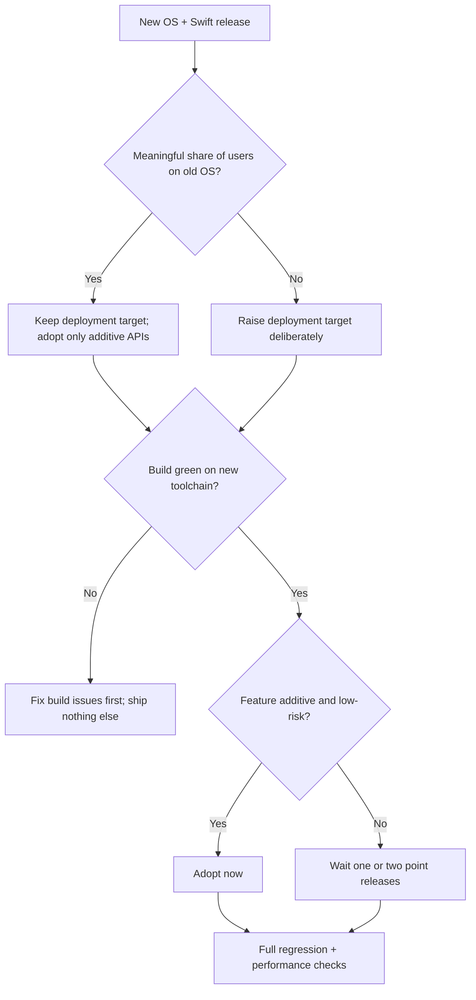

<!--EXCERPT-->
iOS 20 and Swift 8 are here. The headline features are fun; the migration work is boring and matters more. What I'm adopting now, and what I'm waiting on.

<!--BODY-->
# iOS 20 and Swift 8: What Mobile Developers Need to Know

Every June, Apple shows me a keynote full of things I want. Every fall, I remember that shipping software is about what I can support, not what I can demo. I've been through enough release cycles — iOS 7's redesign, Swift's arrival, the concurrency rewrites — to read release notes the way other people read contracts: looking for the clauses that will cost me.

So this is my honest, slightly skeptical read of iOS 20 and Swift 8: what's new, what I'd adopt on day one, what I'd wait on, and the boring work that actually decides whether this release helps or hurts you.

## What's actually new

The short version of iOS 20: a refreshed system design, a batch of new SwiftUI APIs, deeper App Intents integration, and the usual promise that everything is faster on newer hardware. The usual caveats apply — a design refresh is the kind of change that makes screenshots from three years ago look dated, which means asset and layout updates if you care about polish.

Swift 8 is the more interesting release for most of us, because it's mostly about finishing what Swift 6 started: stricter concurrency defaults, faster compile times, and a few quality-of-life additions. The headline items — a default isolation model for new projects, cleaner error-handling syntax, better macros — sound small, and they are. That's fine. The best Swift releases have been the boring ones.

The pattern is familiar if you've been around a few cycles: the OS release gets the demos, the language release gets the work. iOS 20 gives users something to notice; Swift 8 gives you something to build on. I treat them as one migration with two speeds, and I plan the work accordingly.

## The adoption decision, as a flow

Here's the decision tree I actually run when a major OS and toolchain land together:



The shape of it: toolchain first, features second, and "wait" is a legitimate decision, not a failure. Every branch of that tree ends in the same place — verify before you celebrate.

## What I adopt now

The boring stuff first, because it pays first.

- **The new toolchain.** I update Xcode within the first couple of weeks and keep the app building on it, even if I change nothing else. Every month you stay on an old toolchain, the eventual migration gets bigger. This is pure debt avoidance, and it's the highest-ROI move in the whole release.
- **Swift Testing for new test files.** The framework Apple shipped a couple of releases back has matured, and Swift 8's improvements make it my default for new tests. Test code is the one place I adopt new syntax immediately, because it's isolated from shipping risk — the worst case is a test that needs rewriting, not a customer that sees a regression.
- **Small additive APIs that delete code.** When a new SwiftUI API replaces fifty lines of custom layout work, I take it. The existing test suite decides: if tests pass unchanged, the swap is safe.

## What I wait on

- **The design language.** Anything that changes how the app looks across the board gets a waiting period. Visual refreshes always have rough edges in the first point releases, and your users don't care that you shipped the new look two weeks early. Let it settle, then port deliberately.
- **New concurrency defaults in existing codebases.** Swift 8's stricter isolation is great in new projects and a migration project in existing ones. I've already done one concurrency migration; I'm not volunteering my team for round two during a major OS release. New code gets the new rules. Old code gets migrated on its own schedule, with its own tests.
- **Anything that requires the newest hardware.** Features that only work on the latest devices segment your user base for marginal benefit. I wait until the install base justifies it, and I check the analytics instead of guessing.

## Three snippets that show the direction

The language changes are small and cumulative. Here's the shape of them:

```swift
// Swift 8: default isolation for new code keeps this safe by construction
@MainActor
struct CartViewModel {
    var items: [CartItem] = []

    func add(_ item: CartItem) {
        items.append(item)
    }
}
```

```swift
// Typed throws make error handling explicit instead of a guessing game
func loadCart() throws(CartError) -> Cart {
    let data = try fetch()
    return try decode(data)
}
```

```swift
// New tests use Swift Testing; the old XCTest files stay until they need touching
import Testing

@Test func cartTotalSumsAllItems() {
    #expect(Cart(items: [CartItem(price: 2), CartItem(price: 3)]).total == 5)
}
```

None of these will change your life. That's the point — Swift 8 is a release about removing friction, and the snippets above are what that looks like: less boilerplate, clearer failure modes, safer defaults. The value shows up as fewer crashes and shorter debugging sessions, which never makes a keynote but always shows up in your velocity numbers.

## What the release notes don't tell you

Three things about this release cycle that aren't in the marketing material, from someone who's done this before.

First, the migration cost is dominated by your own code, not the SDK. If you've been disciplined about dependencies and kept the build warnings near zero, this release is a weekend. If you're carrying three years of pinned workarounds for old SwiftUI bugs, it's a project. Start the cleanup before you need it, not during the migration.

Second, device fragmentation is the real schedule risk. iOS 20 drops support for some older devices, and if your user base includes them, you now have a support matrix decision to make — not a technical one. That decision belongs to product, informed by analytics, and it should be made weeks before the release, not on upgrade day.

Third, performance promises land unevenly. Some screens will get faster for free; a few will get slower because they relied on behavior that changed. That's why I run a small performance regression suite on the critical screens before and after the toolchain upgrade. Ten minutes of setup, and it turns "the keynote said faster" into "our numbers say faster."

Fourth, the rollout calendar still runs on your schedule, not Apple's. A new OS release is the worst time to ship a risky change, because your users are updating devices and your crash reports spike for reasons that have nothing to do with your code. I spend the first few weeks after release on maintenance: monitor adoption, watch the crash dashboard, fix what the new OS exposes, and hold feature work until the noise settles.

## The honest take

Here's what I actually believe after watching twenty years of Apple releases: the features you remember from the keynote rarely move the needle for a working app. The things that move the needle are the ones nobody demos — keeping the toolchain current, keeping the build fast, keeping the test suite green, and being deliberate about what you adopt.

The boring wins compound. Adopt the toolchain early. Adopt APIs that remove code. Wait on anything that changes behavior across the board. Run the full regression before and after every migration, and trust the numbers more than the keynote.

## My plan for this fall

Concretely: update the toolchain in the first two weeks, get the build green, run the full test suite. Raise the deployment target only if the user analytics say it's safe — and check them, don't guess. Adopt Swift Testing for new test files immediately. Port one or two screens to the new SwiftUI APIs if tests stay green. Watch the design refresh from the sidelines for a point release or two. If the analytics show a meaningful share of users still on the previous OS, the deployment target stays put for another cycle and nothing in this plan changes — which is exactly how I want it. That's the whole plan, and it's deliberately unexciting.

The teams that get hurt by major releases are the ones that chase the keynote. The teams that win are the ones that treat the release as infrastructure: update, verify, adopt selectively, measure. I'd rather be boring and shipping than excited and debugging.
