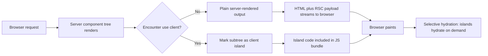

<!--EXCERPT-->
Server components move your React code to the server and shrink what ships to the browser. Here's the boundary, the patterns that hold up, and where I'd skip them.

<!--BODY-->
# React Server Components: Production Patterns for High-Performance Web Apps

When React Server Components landed, half the internet explained them as "server-side rendering with extra steps." That's wrong, and the misunderstanding produces bad architecture. SSR renders the same client component tree once on the server and then hydrates it fully in the browser. Server components change where the tree itself runs: components default to the server, their code never ships to the browser, and they can await data directly. That sounds subtle. The practical difference is anything but.

I'm a skeptic by default, so this post is the version of RSC I believe after running it in production: the mental model, the exact patterns I use, one diagram, and the honest verdicts about where it earns its keep and where it's overhead.

## The mental model that finally made it click

Think of the page as a tree where most nodes render on the server. When a request arrives, the server walks the tree. Server components run there, fetch their data, and produce output. When the walk hits a component marked "use client", the server marks that subtree as a client island and includes its code in the JavaScript bundle. What crosses the network is a serialized description of the rendered tree — strings, numbers, plain objects, React elements — not component code.

The browser receives HTML, plus the RSC payload, plus only the JavaScript needed for the client islands. That's the whole trick. On a typical content-heavy page, the interactive parts are a fraction of the page, so the shipped JavaScript drops by an order of magnitude. Fewer bytes, less parsing, faster first paint, and the server does the data fetching that used to run as a waterfall of client requests.

On the wire, it shows up as streaming. The browser gets the shell of the page almost immediately — headers, layout, the parts that don't depend on slow data — and the slower regions fill in as the server finishes them. On navigation, the framework prefetches the serialized RSC payload for linked routes, so clicking around a data-heavy app can feel instant without any client-side data fetching. That's the experience that converts skeptics, and it's the one plain SSR never quite delivers.



## Pattern 1: async server components for data fetching

The first pattern that changed how I write React: a component can just be an async function that awaits its data. No effect, no loading state, no client round trip. This is the whole page — it runs on the server, hits the database directly, and renders:

```jsx
// app/posts/page.jsx — runs on the server
import { getPosts } from "@/lib/db";

export default async function PostsPage() {
  const posts = await getPosts(); // direct DB call, zero client requests
  return (
    <main>
      <h1>Recent posts</h1>
      {posts.map((post) => (
        <article key={post.id}>
          <h2>{post.title}</h2>
          <p>{post.excerpt}</p>
        </article>
      ))}
    </main>
  );
}
```

No useState, no useEffect, no fetch-on-render. The data is there when the component renders, because the component doesn't render until the data is. This collapses what used to be a four-request waterfall into one server-side read.

## Pattern 2: client islands for what's actually interactive

Not everything can be a server component. Anything with state, event handlers, or browser APIs needs the client. The boundary is one directive, and it's a hard rule: the file and everything it imports becomes client code, so keep the islands small:

```jsx
"use client";

import { useState } from "react";

export function LikeButton({ postId, initialCount }) {
  const [count, setCount] = useState(initialCount);
  return (
    <button onClick={() => setCount(count + 1)}>
      {count} likes
    </button>
  );
}
```

The rule of thumb I enforce in code review: server components own the data and the structure; client components own the interaction and nothing else. The LikeButton receives its initial count as a prop from the server component above it — that's the composition pattern that keeps your bundle small and your logic testable.

## Pattern 3: revalidation instead of client refetch

The question everyone asks after pattern 1 is: how do I get fresh data? The answer in the App Router is incremental static regeneration — the same page stays cached, and the server revalidates it on a schedule or when data changes. For an API-backed server component:

```jsx
// app/posts/[slug]/page.jsx — cached, revalidated server-side
export default async function PostPage({ params }) {
  const post = await fetch(`https://api.example.com/posts/${params.slug}`, {
    next: { revalidate: 60 }, // refetch at most once a minute
  }).then((r) => r.json());

  return <Article post={post} />;
}
```

This is the pattern that makes RSC feel like a different architecture instead of a syntax change: the cache lives on the server, invalidation is explicit, and the client never sees a spinner. Your users get instant navigations backed by data that's at most sixty seconds stale.

## What crosses the boundary

The serialization boundary is where RSC projects go wrong, so know it cold. Props passed from a server component to a client component must be serializable: strings, numbers, booleans, plain objects and arrays, Dates, and React elements. Not serializable: functions, class instances, server-only modules, anything holding a closure over server state.

The rule I repeat in reviews: if you're passing a function to a client component, you've already lost. Either wrap it as a server action so the client can invoke it across the boundary, or restructure so the server does the work and passes results. Every serialization violation shows up as a confusing build error at the worst possible moment, so catch them early.

Hooks follow the same rule. A server component can't use useState, useEffect, or any hook that implies client state — it's a pure render function that happens to run on a machine with a database. Anything needing an event handler, browser APIs, or a context provider has to be a client component, and context providers in particular must live client-side, because context is a runtime concept that doesn't survive serialization. The server-only package exists to guard that boundary: importing a server module into client code fails at build time instead of shipping secrets to the browser.

## Where it pays off

Data-heavy, read-mostly pages are the sweet spot. Dashboards, content sites, e-commerce listing pages — pages where most of the weight is non-interactive — see the biggest wins, because the shipped JavaScript shrinks the most. I've watched a dashboard go from a megabyte of JavaScript to a couple hundred kilobytes with the interactive surface unchanged — the kind of win that shows up in Core Web Vitals without a single visual regression. Secure data access is a quieter win: with the database read on the server, credentials never touch the client bundle, and there's no public API endpoint exposing your data shape to anyone with DevTools open.

## Where it's a wash or a trap

App-shell-heavy products are the honest counterexample. If you're building a canvas editor or a chat surface where almost everything is client state, RSC adds framework machinery for little benefit — plain client rendering or classic SSR serves you fine.

The bigger trap is enthusiasm. Teams that make everything a server component pay a debugging tax: every boundary violation, every misuse of hooks, every leaked server-only import becomes a support case. And the most valuable RSC features — streaming, revalidation, server actions — are framework conveniences, so you're buying into Next.js conventions or similar ones either way. If your team is allergic to framework lock-in, the raw RSC implementation is harder to love.

Testing is the cost people under-budget. Server components need a runtime that can execute them, so unit tests either mock the data layer or lean on the framework's test utilities, and debugging a serialization failure in a deeply nested tree is slower than debugging the equivalent client code. It's manageable, but every developer who touches the boundary pays a little ergonomics tax.

## Honest verdict

RSC is a real improvement for a real slice of applications. For data-heavy pages, the reduction in shipped JavaScript and the collapse of client data-fetching waterfalls are measurable wins I'd take again. For app shells and interactive tools, it's overhead. My rule: adopt it for read-mostly, data-heavy pages; keep interactive editors on the client; and keep the server/client split boring and explicit. If a page's interactive surface is under a third of its content, server components are probably a good fit. Measure the bundle before and after, and let the numbers decide — that's the whole job.
