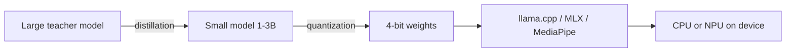

<!--EXCERPT-->
Small models aren't small brains — they're specialists that fit in your pocket. Here's the mental model that makes on-device AI decisions obvious.

<!--BODY-->
# Small Language Models: Running Efficient AI on Edge Devices and Mobile Phones

The phrase "small language model" used to make me roll my eyes. I've watched teams burn a quarter on "on-device AI" that turned out to be a 70B model in the cloud with extra steps and a VPN. So when someone says "let's run the model on the phone," my first questions are: which model, on which phone, and at what speed?

Most people can't answer. This post is the answer — the mental model I wish someone had handed me before I spent a month benchmarking quantized models on a drawer full of aging Android devices.

## A mental model that actually works

Here's the core fact, and it explains almost everything about edge inference: generating one token means streaming the entire model through memory. Not part of it. All of it.

Think about what that implies. A 7B model at 4-bit precision is about 3.5 GB. Phone RAM reads at tens of gigabytes per second. So on a phone CPU, that model tops out at a few tokens per second — a few words per second. On a phone NPU the picture is better, but the same math applies: the model streams through memory once per token, no matter how fast the compute is.

That's why small models exist. Not because big models are dumb, but because a 70B model needs to stream roughly 35 GB through memory per token. On-device, that's not slow. It's impossible.

The second part of the mental model: a small model isn't a small brain. It's a specialist. Big models know a little about everything. A small model knows a lot about a narrow slice — and you get to choose the slice. Summarize meeting notes, autocomplete code, classify support tickets. Pick one job, point a 1-3B model at it, and it does it well.

## How small models get small

Three techniques, roughly in the order you'll meet them.

### Distillation: the student learns from the teacher

Distillation trains a small model to imitate a big one. The teacher produces outputs — sometimes on real data, sometimes on synthetic data — and the student learns to reproduce them. The result is a model that carries much of the teacher's knowledge in a fraction of the weights. Microsoft's Phi series is the famous example: small models, trained partly on synthetic data, that punch far above their weight class.

### Quantization: JPEG for neural nets

Quantization shrinks the numbers. A model's weights are stored as floats; quantization maps them to fewer bits. Going from 16-bit to 4-bit cuts the model size by roughly 75%, at the cost of some precision. This is the trick that makes phone-sized models practical. The 4-bit formats you see in practice — Q4_K_M, Q4_0, and friends — trade a little quality for a lot of speed and memory.

Think of it as JPEG for neural nets. You keep the picture, lose some nuance, and cut the file. Most tasks never notice. Some tasks — heavy math, careful reasoning — do.

### Pruning and architecture

Small models are also just built smaller: fewer layers, fewer attention heads, shorter context windows. Architecture choices compound. A model designed to be small from the start beats a big model that was shrunk after the fact.

## The pipeline that gets a model onto a phone

Here's the whole journey from training run to pocket, and where each technique fits.

The runtime layer matters more than people expect. llama.cpp is the workhorse on CPUs — a C++ inference engine that runs quantized models almost anywhere. MLX is Apple's framework for Apple Silicon. MediaPipe's LLM Inference API is Google's path for Android and the web. All three load a quantized model file and run it locally, with no network in the loop.

## What happens at runtime, step by step

Load the model file. Map it into memory, grab the tokenizer, allocate the KV cache — the scratchpad that holds the conversation so far. The KV cache grows with context length, which is why long prompts are expensive on-device.

Process the prompt. The model reads the whole input at once, in parallel where the hardware allows. This is the fast part.

Generate tokens one at a time. Each token streams the whole model through memory again. This is the slow part, and it's why decode speed is the number that matters — not theoretical FLOPs.

On an NPU the same steps run, but the memory story differs. NPUs have fast local memory, and if the model fits in it, you get real speed. If it doesn't, weights bounce through DRAM and the advantage shrinks. Kernel quality matters more than the spec sheet.

The NPU path usually means a vendor SDK — Qualcomm's, Google's, Apple's — and each one wants the model in its own format. Budget time for that conversion. It's where projects stall.

## A concrete walkthrough: meeting-note summarizer on a phone

Let's say you want to summarize meeting notes on-device: private, offline, no cloud round-trip.

First decision: model size. For summarization, a 1.5B to 3B model is the sweet spot. Bigger is smoother but slower and hungrier. Smaller gets noticeably sloppier. Pick 3B, quantize to 4-bit. That's roughly 1.8 GB on disk — it fits in memory and leaves room for the KV cache and the rest of the app.

Second decision: runtime. On iOS, MLX. On Android, llama.cpp or MediaPipe, depending on whether you want an NPU path. On the CPU, expect a few tokens per second for the 3B — fine for a summarizer that runs in the background. The prompt processes in a blink; the summary streams out over a few seconds.

Third decision: context. Meeting notes run long. A 2048-token context fits comfortably; a full 32K context would eat the phone's memory budget. Chunk the notes, summarize per chunk, then summarize the summaries.

Then measure. Load time, first token, steady-state tokens per second, battery drain across ten runs. Those four numbers decide whether the feature ships. No desktop benchmark tells you what a 2022 mid-range phone does at minute five.

## Edge cases that will bite you

**Context is a memory tax.** The KV cache scales with tokens, not with model size. Long conversations and long documents are where on-device plans die. Chunk aggressively.

**Thermal throttling is real.** A phone that generates tokens fast for thirty seconds slows down after a few minutes of sustained work. The NPU heats up, the CPU backs off, and your tokens-per-second number quietly drops. Benchmark the tenth run, not the first.

**Small models hallucinate differently.** They know less, so they fill gaps with confidence. On narrow, well-scoped tasks they're fine. On open-ended questions they will confidently invent. Verify outputs, keep prompts narrow, and don't ask a 1.5B model to do your taxes.

**Quantization drift shows up in math.** 4-bit is fine for prose. Arithmetic and multi-step reasoning degrade. If the task is numeric, keep 8-bit or push the work to the cloud.

**Tokenizer quirks change costs.** Different models tokenize differently. "Hello world" is one token for one model, four for another. Test with your real prompts, not toy strings.

**The floor device decides.** Flagship NPUs are fast. The 2020 budget phone in your user base is the benchmark that matters. If it can't hold the context, the feature doesn't ship for that user.

**First token matters as much as throughput.** A chat feature feels responsive if the first word appears quickly, even at a modest steady speed. Measure both numbers, because they're driven by different parts of the pipeline — prompt processing for the first token, decode speed for everything after.

## Why the mental model matters more than the specs

Because the memory-bandwidth view tells you which knobs matter. Bit width matters — it sets the model size. Context length matters — it sets the KV cache tax. Model size matters — it sets tokens per second, before you even look at hardware.

And it tells you which knobs don't. Raw FLOPs don't. Vendor TOPS numbers don't. What matters is: how many bytes per token, and how fast does this device move bytes.

That's the reframe. A small model isn't a compromise you accept — it's a size you choose, the way you choose a wrench. Pick the job, pick the size that does it at the speed the device can sustain, and the cloud stays out of the loop. Privacy, latency, and cost all improve at once.

Next time someone says "let's run AI on the phone," you'll have the right questions ready. Which model, which phone, and at what speed. The mental model gives you the answers before you write a line of code.
