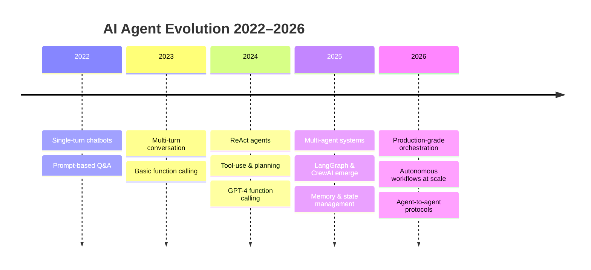
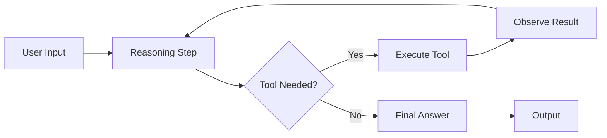
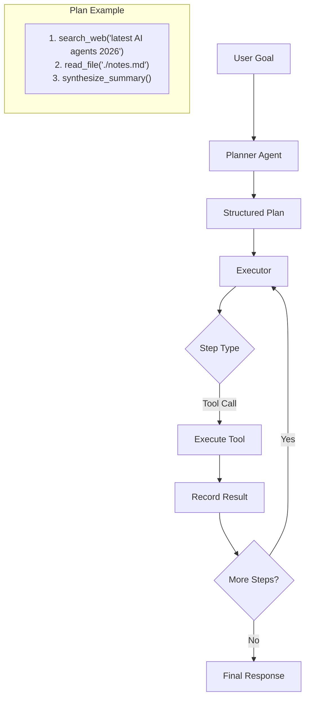
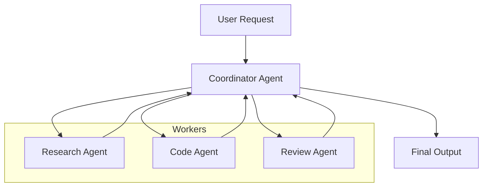
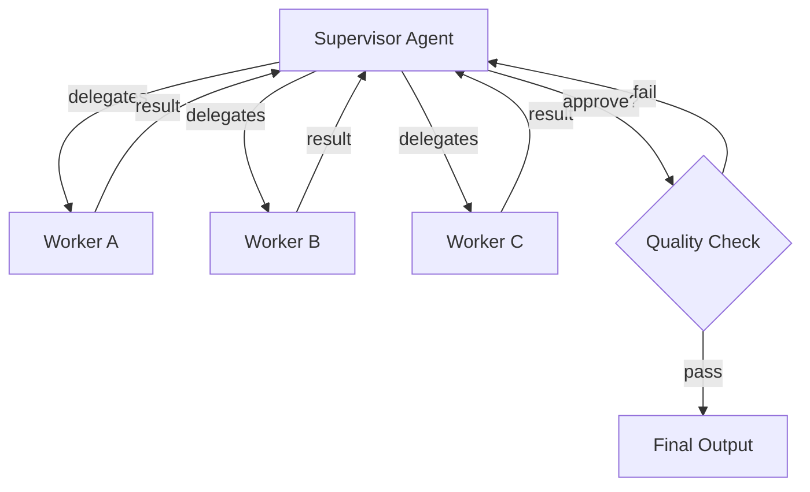
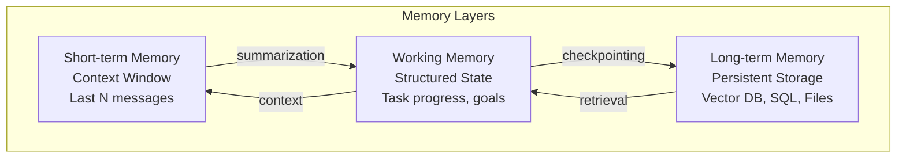
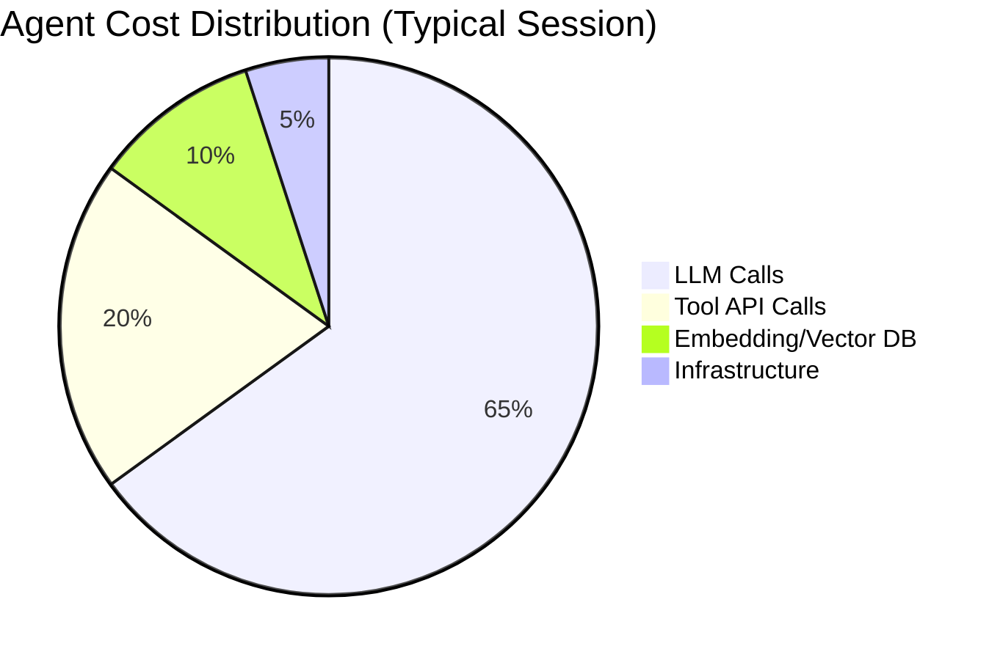
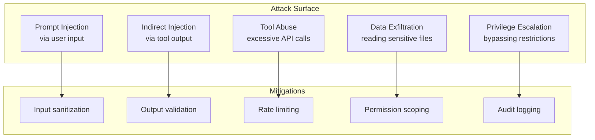

# AI Agents in 2026: Building Autonomous Workflows for Complex Tasks


## Introduction

The era of AI agents has arrived. In 2026, autonomous agents are no longer experimental prototypes — they are deployed in production at thousands of organizations, automating complex workflows that previously required dedicated human teams. From self-healing infrastructure pipelines to autonomous content operations and AI-driven software development, agents are reshaping how we build and operate software.

This article provides a comprehensive, practitioner-focused guide to building production-grade autonomous AI agents. We'll cover architecture patterns, framework comparisons, tool integration, memory systems, observability, cost optimization, security, and real-world case studies — everything you need to design, deploy, and operate agent systems at scale.

## The Evolution: From Chatbots to Autonomous Agents



The shift from reactive chatbots to proactive autonomous agents represents one of the most significant changes in applied AI. Key capabilities that define modern agents:

| Capability | Description | Example |
|---|---|---|
| **Goal-Oriented Execution** | Break down objectives into actionable steps | "Deploy service X" → plan, execute, verify |
| **Tool Integration** | Access APIs, filesystems, databases, shell | `read_file`, `search_web`, `execute_sql` |
| **State Management** | Maintain context across long-running sessions | Agent memory with summarization |
| **Error Recovery** | Handle failures with automatic fallbacks | Retry with exponential backoff |
| **Multi-Agent Coordination** | Delegate subtasks to specialized peers | Coordinator delegates to worker agents |

## AI Agent Architecture Patterns

Three dominant architectural patterns have emerged for building autonomous agents. Each has distinct trade-offs in reliability, latency, and complexity.

### 1. ReAct (Reasoning + Acting)

The ReAct pattern, introduced by Yao et al. (2022), interleaves reasoning traces with action execution. The agent iteratively: **think → act → observe → repeat**.



**How it works:**
- The LLM generates a chain-of-thought reasoning trace
- When a tool is needed, it outputs a structured tool call
- Tool output is fed back as observation
- Loop continues until a final answer is produced

**Production example using LangGraph:**

```python
from langgraph.graph import StateGraph, END
from typing import TypedDict, List, Literal
import json

class AgentState(TypedDict):
    messages: List[dict]
    next_agent: str

def reasoning_node(state: AgentState):
    """LLM decides next action: call tool or respond."""
    messages = state["messages"]
    response = llm.invoke(messages)  # model call
    return {"messages": messages + [response]}

def tool_node(state: AgentState):
    """Execute tool calls from LLM output."""
    last_msg = state["messages"][-1]
    tool_calls = last_msg.get("tool_calls", [])
    results = []
    for tc in tool_calls:
        result = execute_tool(tc["name"], tc["args"])
        results.append({"role": "tool", "content": str(result), 
                        "tool_call_id": tc["id"]})
    return {"messages": state["messages"] + results}

def router(state: AgentState) -> Literal["tools", "end"]:
    last = state["messages"][-1]
    if last.get("tool_calls"):
        return "tools"
    return "end"

graph = StateGraph(AgentState)
graph.add_node("agent", reasoning_node)
graph.add_node("tools", tool_node)
graph.set_entry_point("agent")
graph.add_conditional_edges("agent", router, {"tools": "tools", "end": END})
graph.add_edge("tools", "agent")
agent = graph.compile()
```

**When to use ReAct:** Tasks requiring iterative reasoning, multi-step tool use, and dynamic decision-making. Best for open-ended problems where the exact sequence isn't known upfront.

**Trade-offs:** Higher latency due to multiple LLM calls per turn; risk of infinite loops without proper termination conditions; sensitive to prompt quality.

### 2. Plan-and-Execute

The Plan-and-Execute pattern separates planning from execution. A planner generates a complete step-by-step plan upfront, then an executor runs each step sequentially or in parallel.



**Implementation pattern:**

```python
from pydantic import BaseModel

class PlanStep(BaseModel):
    step_id: int
    description: str
    tool: str
    args: dict
    depends_on: List[int] = []
    status: str = "pending"

class Plan(BaseModel):
    goal: str
    steps: List[PlanStep]

def planner(goal: str) -> Plan:
    """LLM generates a complete plan upfront."""
    prompt = f"Create a step-by-step plan to achieve: {goal}\n"
    prompt += "For each step, specify: tool name, arguments, dependencies."
    response = llm.with_structured_output(Plan).invoke(prompt)
    return response

def executor(plan: Plan) -> str:
    """Execute plan steps respecting dependencies."""
    completed = {}
    while plan.pending_steps:
        ready = [s for s in plan.pending_steps 
                 if all(d in completed for d in s.depends_on)]
        results = parallel_map(execute_step, ready)
        for step, result in zip(ready, results):
            completed[step.step_id] = result
    return synthesize(completed)
```

**When to use Plan-and-Execute:** Tasks with well-defined steps, where upfront planning improves reliability. Good for batch processing, data pipelines, content generation workflows.

**Trade-offs:** Less flexible than ReAct — cannot adapt plan mid-execution without re-planning. Planning overhead for simple tasks. Requires clear dependency modeling.

### 3. Function-Calling Agents

Function-calling agents use the LLM's native function/tool calling capability (available in GPT-4, Claude 3, Gemini, open models). The model outputs structured JSON for tool calls, which the runtime executes and returns.

```python
# Tool definitions passed to the LLM
tools = [
    {
        "type": "function",
        "function": {
            "name": "search_docs",
            "description": "Search internal documentation",
            "parameters": {
                "type": "object",
                "properties": {
                    "query": {"type": "string"},
                    "max_results": {"type": "integer", "default": 5}
                },
                "required": ["query"]
            }
        }
    },
    {
        "type": "function",
        "function": {
            "name": "run_sql_query",
            "description": "Execute a read-only SQL query",
            "parameters": {
                "type": "object",
                "properties": {
                    "query": {"type": "string"},
                    "limit": {"type": "integer", "default": 100}
                },
                "required": ["query"]
            }
        }
    }
]

# Runtime loop
def function_calling_agent(user_input: str, max_turns=10):
    messages = [{"role": "user", "content": user_input}]
    for turn in range(max_turns):
        response = client.chat.completions.create(
            model="gpt-4o",
            messages=messages,
            tools=tools,
            tool_choice="auto"
        )
        msg = response.choices[0].message
        if not msg.tool_calls:
            return msg.content
        messages.append(msg)
        for tc in msg.tool_calls:
            result = call_function(tc.function.name, 
                                   json.loads(tc.function.arguments))
            messages.append({
                "role": "tool",
                "tool_call_id": tc.id,
                "content": str(result)
            })
    return "Max turns reached"
```

**When to use Function-Calling:** Simple to implement, works out-of-the-box with major LLM providers. Best for straightforward tool-use scenarios with well-defined APIs.

**Trade-offs:** Limited state management; no built-in multi-agent support; all context in one messages array (context window limits); harder to implement complex orchestration patterns.

### Architecture Pattern Comparison

| Pattern | Flexibility | Reliability | Latency | Complexity | Best For |
|---|---|---|---|---|---|
| **ReAct** | High | Medium | Higher | Medium | Open-ended problem solving |
| **Plan-and-Execute** | Medium | High | Low (pre-planned) | Low-Medium | Well-defined workflows |
| **Function-Calling** | Medium | Medium | Low | Low | Simple tool-use tasks |

## Multi-Agent Orchestration Patterns

Single agents hit limits with complex, multi-step workflows. Multi-agent systems decompose work across specialized agents that collaborate.

### 1. Coordinator-Worker Pattern

A central coordinator delegates subtasks to specialized worker agents and synthesizes results.



### 2. Supervisor Pattern

A supervisor agent monitors worker agents, evaluates their outputs, and decides on re-execution, approval, or escalation.



### 3. Debate/Discussion Pattern

Multiple agents independently solve a problem, then compare and critique each other's solutions to converge on the best answer.

```python
class DebateAgent:
    def __init__(self, persona: str):
        self.persona = persona
    
    def respond(self, problem: str, others_answers: list[str]) -> str:
        prompt = f"You are {self.persona}. Problem: {problem}\n"
        if others_answers:
            prompt += f"Other agents' answers: {others_answers}\n"
            prompt += "Provide your critique and improved solution."
        else:
            prompt += "Provide your initial solution."
        return llm.invoke(prompt)

def debate_round(agents: list[DebateAgent], problem: str, rounds=3):
    answers = []
    for r in range(rounds):
        round_answers = []
        for agent in agents:
            ans = agent.respond(problem, answers)
            round_answers.append(ans)
        answers = round_answers
    # Final synthesis
    synthesis = llm.invoke(
        f"Synthesize the best answer from these debates:\n{answers}"
    )
    return synthesis
```

## Agent Framework Comparison

Four major frameworks dominate the agent-building landscape in 2026. Here's a detailed comparison.

| Feature | LangGraph | CrewAI | AutoGen (Microsoft) | OpenAI Assistants API |
|---|---|---|---|---|
| **Architecture** | Graph-based state machine | Role-based agent crews | Multi-agent conversation | Single-agent with tools |
| **State Management** | Built-in (TypedDict/StateGraph) | Limited (handoffs) | Via conversation history | Via thread messages |
| **Multi-Agent** | Yes (graph nodes) | Yes (roles + processes) | Yes (group chats) | No (single agent) |
| **Persistence** | LangGraph Cloud / custom | Local checkpointing | Azure/Redis | Threads (30-day retention) |
| **Streaming** | Yes (event-driven) | Partial | Yes | Yes (SSE) |
| **Human-in-Loop** | Built-in (interrupts) | Task-level approval | Via termination conditions | Via function calls |
| **Error Handling** | Node-level retry + fallback | Retry on failure | Conversation-level | API retry only |
| **Observability** | LangSmith integration | Limited | Azure Monitor | OpenAI Dashboard |
| **Open Source** | Yes (MIT) | Yes (MIT) | Yes (MIT) | No (proprietary) |
| **Cost Model** | Open-source + cloud options | Open-source | Open-source | Per-token API pricing |
| **Learning Curve** | Medium-High | Low-Medium | Medium | Low |
| **Best For** | Complex stateful workflows | Role-based automation | Research & experiments | Quick prototyping |

### Deep Dive: LangGraph

LangGraph (by LangChain) provides a graph-based state machine for building agents. Nodes represent agents or tools; edges control flow with conditional routing.

**Key advantages:**
- First-class support for cycles (unlike DAG-only frameworks)
- Built-in persistence via checkpointing
- LangSmith integration for tracing and debugging
- Human-in-the-loop with interrupt/resume
- Support for parallel execution branches

**Example: Multi-agent supervisor pattern:**

```python
from langgraph.graph import StateGraph, END, START
from typing import Annotated, TypedDict, List
import operator

class MultiAgentState(TypedDict):
    messages: Annotated[List[dict], operator.add]
    next_agent: str
    task: str

def supervisor_node(state: MultiAgentState):
    """Decides which agent handles next."""
    prompt = f"Task: {state['task']}\n"
    prompt += f"Progress: {state['messages'][-3:]}\n"
    prompt += "Who should act next? (researcher/coder/reviewer/finished)"
    decision = llm.invoke(prompt)
    return {"next_agent": decision.strip()}

def researcher_node(state: MultiAgentState):
    return {"messages": [research_agent(state["task"])]}

def coder_node(state: MultiAgentState):
    return {"messages": [code_agent(state["task"])]}

def reviewer_node(state: MultiAgentState):
    return {"messages": [review_agent(state["messages"])]}

def router(state: MultiAgentState):
    return state["next_agent"]

graph = StateGraph(MultiAgentState)
graph.add_node("supervisor", supervisor_node)
graph.add_node("researcher", researcher_node)
graph.add_node("coder", coder_node)
graph.add_node("reviewer", reviewer_node)
graph.set_entry_point("supervisor")
graph.add_conditional_edges("supervisor", router, {
    "researcher": "researcher",
    "coder": "coder", 
    "reviewer": "reviewer",
    "finished": END
})
for agent in ["researcher", "coder", "reviewer"]:
    graph.add_edge(agent, "supervisor")
```

### Deep Dive: CrewAI

CrewAI focuses on role-based agent teams. You define agents with roles, goals, and backstories, then assign them to tasks within a crew.

**Key advantages:**
- Intuitive role-based abstraction
- Built-in task delegation
- Process-driven execution (sequential, hierarchical)
- Lightweight and easy to get started

**Example: Content creation crew:**

```python
from crewai import Agent, Task, Crew, Process

researcher = Agent(
    role="Senior Research Analyst",
    goal="Find comprehensive information on AI agents",
    backstory="Expert in AI research with 10 years experience",
    tools=[search_web, read_documentation],
    verbose=True
)

writer = Agent(
    role="Technical Writer",
    goal="Create clear, engaging content about AI agents",
    backstory="Former tech journalist specializing in AI",
    tools=[write_file, format_markdown],
    verbose=True
)

editor = Agent(
    role="Editor-in-Chief",
    goal="Ensure quality, accuracy, and readability",
    backstory="Senior editor at a major tech publication",
    tools=[review_text, check_facts],
    verbose=True
)

research_task = Task(
    description="Research latest trends in AI agents for 2026",
    agent=researcher,
    expected_output="A comprehensive research brief with 10+ sources"
)

write_task = Task(
    description="Write a blog post based on research",
    agent=writer,
    expected_output="A 2000-word blog post in markdown",
    context=[research_task]
)

edit_task = Task(
    description="Edit and polish the blog post",
    agent=editor,
    expected_output="Final reviewed blog post with edits tracked",
    context=[research_task, write_task]
)

crew = Crew(
    agents=[researcher, writer, editor],
    tasks=[research_task, write_task, edit_task],
    process=Process.sequential
)
result = crew.kickoff()
```

### Deep Dive: AutoGen

AutoGen (Microsoft Research) provides a multi-agent conversation framework with support for group chat patterns, tool use, and code execution.

**Key advantages:**
- Flexible conversation patterns (two-agent, group chat, nested chats)
- Built-in code execution sandbox
- Strong research community backing
- Excellent for multi-agent experiments

**Example: Group chat with code execution:**

```python
import autogen

config_list = [{"model": "gpt-4o", "api_key": "..."}]

assistant = autogen.AssistantAgent(
    name="Assistant",
    llm_config={"config_list": config_list},
    system_message="You are a helpful AI assistant."
)

coder = autogen.AssistantAgent(
    name="Coder",
    llm_config={"config_list": config_list},
    system_message="You write and execute Python code."
)

user_proxy = autogen.UserProxyAgent(
    name="UserProxy",
    human_input_mode="NEVER",
    code_execution_config={"work_dir": "coding", "use_docker": False}
)

groupchat = autogen.GroupChat(
    agents=[assistant, coder, user_proxy],
    messages=[],
    max_round=12
)

manager = autogen.GroupChatManager(
    groupchat=groupchat,
    llm_config={"config_list": config_list}
)

user_proxy.initiate_chat(
    manager,
    message="Build a web scraper that extracts headlines from Hacker News"
)
```

### Deep Dive: OpenAI Assistants API

The Assistants API offers a managed agent experience with built-in code interpreter, knowledge retrieval, and function calling.

**Key advantages:**
- Fully managed — no infrastructure to run
- Built-in file search and code interpreter
- Automatic thread management
- Simple API

**Limitations:**
- No multi-agent orchestration
- Proprietary — vendor lock-in
- Limited customization
- 30-day thread retention

```python
from openai import OpenAI

client = OpenAI()

assistant = client.beta.assistants.create(
    name="Data Analyst",
    instructions="You are a data analyst. Use code to analyze data.",
    model="gpt-4o",
    tools=[
        {"type": "code_interpreter"},
        {"type": "file_search"}
    ],
    tool_resources={
        "code_interpreter": {"file_ids": []}
    }
)

thread = client.beta.threads.create()
client.beta.threads.messages.create(
    thread_id=thread.id,
    role="user",
    content="Analyze the attached CSV and create a summary report"
)

run = client.beta.threads.runs.create_and_poll(
    thread_id=thread.id,
    assistant_id=assistant.id
)

messages = client.beta.threads.messages.list(thread_id=thread.id)
```

## Tool and Function Definition Patterns

Well-defined tools are the backbone of effective agents. Poor tool definitions cause hallucination, misuse, and failures.

### Best Practices for Tool Definitions

```python
# ✅ GOOD: Clear, specific, with validation
@tool
def calculate_token_cost(
    model: str = "gpt-4o",
    input_tokens: int = 0,
    output_tokens: int = 0
) -> dict:
    """
    Calculate the cost of an API call.
    
    Args:
        model: Model name (gpt-4o, claude-3-opus, gemini-1.5-pro)
        input_tokens: Number of input tokens
        output_tokens: Number of output tokens
    
    Returns:
        dict with cost breakdown
    """
    pricing = {
        "gpt-4o": {"input": 2.50, "output": 10.00},  # per 1M tokens
        "claude-3-opus": {"input": 15.00, "output": 75.00},
        "gemini-1.5-pro": {"input": 3.50, "output": 10.50},
    }
    if model not in pricing:
        return {"error": f"Unknown model: {model}"}
    p = pricing[model]
    cost = (input_tokens / 1_000_000 * p["input"] + 
            output_tokens / 1_000_000 * p["output"])
    return {
        "model": model,
        "input_cost": round(cost * 0.7, 4),
        "output_cost": round(cost * 0.3, 4),
        "total_cost": round(cost, 4)
    }

# ❌ BAD: Vague, no types, no validation
@tool
def cost(model, tokens):
    """calculate cost"""
    return {"cost": tokens * 0.000002}
```

### Tool Definition Checklist

- [ ] **Unique, descriptive name** — `search_web_pages` not `search`
- [ ] **Clear description** — explain what it does, when to use, limitations
- [ ] **Typed parameters** — use JSON Schema types (string, integer, array, object)
- [ ] **Validation** — validate inputs before execution
- [ ] **Error handling** — return structured errors, not exceptions
- [ ] **Security boundaries** — restrict dangerous operations (e.g., no arbitrary SQL)
- [ ] **Rate limiting** — implement client-side rate limiting for external APIs
- [ ] **Idempotency** — where possible, make tools safe to retry

### Tool Categories

| Category | Examples | Security Notes |
|---|---|---|
| **Filesystem** | `read_file`, `write_file`, `list_directory` | Restrict to specific directories |
| **Shell** | `run_command`, `execute_script` | Sandbox, no sudo, timeouts |
| **Web** | `search_web`, `fetch_url`, `scrape_page` | Rate limiting, respect robots.txt |
| **Database** | `query_database`, `run_sql` | Read-only by default, query limits |
| **API** | `call_api`, `send_email`, `post_slack` | Token-scoped permissions |
| **Code** | `execute_python`, `run_javascript` | Sandboxed, resource-limited |

## Memory Systems for Agents

Memory is what separates stateless prompts from stateful agents. In 2026, memory architectures have matured into three distinct layers:



### 1. Short-term Memory (Context Window)

The immediate conversation context. Managed by the LLM's context window.

**Strategies:**
- **Sliding window:** Keep last N messages
- **Token budgeting:** Reserve tokens for system prompt + tools
- **Message pruning:** Remove tool outputs after use

```python
class SlidingWindowMemory:
    def __init__(self, max_tokens: int = 128_000):
        self.max_tokens = max_tokens
        self.messages = []
    
    def add(self, message: dict):
        self.messages.append(message)
        total = sum(count_tokens(m["content"]) for m in self.messages)
        while total > self.max_tokens and len(self.messages) > 1:
            removed = self.messages.pop(0)
            total -= count_tokens(removed["content"])
```

### 2. Working Memory (State)

Structured, task-specific state that persists across turns. This is the agent's "scratchpad."

```python
from dataclasses import dataclass, field
from typing import List, Optional

@dataclass
class AgentWorkingMemory:
    goal: str
    completed_steps: List[str] = field(default_factory=list)
    current_step: Optional[str] = None
    artifacts: dict = field(default_factory=dict)
    errors: List[str] = field(default_factory=list)
    
    def summarize(self) -> str:
        return f"""
Goal: {self.goal}
Progress: {len(self.completed_steps)}/{len(self.completed_steps) + (1 if self.current_step else 0)} steps
Current: {self.current_step or 'Complete'}
Errors: {len(self.errors)}
        """
```

### 3. Long-term Memory (Persistent)

Information that persists across sessions — user preferences, learned patterns, historical data.

**Storage backends:**
- **Vector databases:** Chroma, Pinecone, Qdrant, Weaviate
- **Key-value stores:** Redis, SQLite
- **Document stores:** MongoDB, S3

```python
import chromadb
from chromadb.utils import embedding_functions

class LongTermMemory:
    def __init__(self, collection_name="agent_memory"):
        self.client = chromadb.PersistentClient(path="./memory_store")
        self.collection = self.client.get_or_create_collection(
            name=collection_name,
            embedding_function=embedding_functions.
                OpenAIEmbeddingFunction(model="text-embedding-3-small")
        )
    
    def remember(self, key: str, content: str, metadata: dict = None):
        """Store information in long-term memory."""
        self.collection.add(
            documents=[content],
            ids=[key],
            metadatas=[metadata or {}]
        )
    
    def recall(self, query: str, n_results: int = 5) -> List[dict]:
        """Retrieve relevant memories."""
        results = self.collection.query(
            query_texts=[query],
            n_results=n_results
        )
        return [
            {"content": doc, "metadata": meta}
            for doc, meta in zip(
                results["documents"][0], 
                results["metadatas"][0]
            )
        ]
    
    def summarize_session(self, session_id: str, conversation: str):
        """Summarize a session and store the summary."""
        summary = llm.invoke(
            f"Summarize this agent session:\n{conversation}"
        )
        self.remember(session_id, summary, {"type": "session_summary"})
```

### Memory Management Best Practices

| Practice | Why |
|---|---|
| **Summarize before truncating** | Preserve key information when dropping messages |
| **Use structured state** | Easier to query and update than raw text |
| **Tiered memory** | Hot (context) → Warm (working) → Cold (long-term) |
| **Regular checkpointing** | Persist working memory to handle crashes |
| **Memory pruning** | Remove irrelevant or outdated information |
| **Memory quotas** | Prevent unbounded storage growth |

## Observability and Debugging

Agent observability is critical for production systems. Unlike traditional software, agent behavior is non-deterministic and emergent.

### Key Metrics to Track

```python
METRICS = {
    "latency": {
        "llm_call_ms": "Time for each LLM invocation",
        "tool_execution_ms": "Time for tool executions",
        "total_turn_ms": "Total time per agent turn",
        "end_to_end_ms": "Complete workflow duration"
    },
    "cost": {
        "llm_cost_per_turn": "Token cost per LLM call",
        "total_cost": "Accumulated cost for session",
        "tool_api_costs": "External API usage costs"
    },
    "quality": {
        "tool_success_rate": "Percentage of successful tool calls",
        "retry_count": "Number of retries per session",
        "human_escalations": "Times human intervention needed",
        "error_types": "Distribution of error categories"
    },
    "behavioral": {
        "turns_to_complete": "Number of turns to finish task",
        "tool_call_volume": "Number of tool calls per session",
        "loop_detection": "Repeated identical tool calls"
    }
}
```

### Logging Architecture

```python
import structlog
import json
from datetime import datetime

logger = structlog.get_logger()

class AgentTracer:
    """Structured tracing for agent sessions."""
    
    def __init__(self, session_id: str):
        self.session_id = session_id
        self.events = []
    
    def trace(self, event: str, data: dict):
        """Record an agent event with structured data."""
        entry = {
            "timestamp": datetime.utcnow().isoformat(),
            "session_id": self.session_id,
            "event": event,
            "data": data
        }
        self.events.append(entry)
        logger.info("agent_event", **entry)
    
    def trace_llm_call(self, messages: list, response: str, 
                       tokens: dict, latency_ms: float):
        self.trace("llm_call", {
            "message_count": len(messages),
            "response_length": len(response),
            "prompt_tokens": tokens.get("prompt"),
            "completion_tokens": tokens.get("completion"),
            "total_tokens": tokens.get("total"),
            "latency_ms": latency_ms
        })
    
    def trace_tool_call(self, tool: str, args: dict, 
                        result: dict, success: bool):
        self.trace("tool_call", {
            "tool": tool,
            "args": args,
            "success": success,
            "result_summary": str(result)[:200]
        })
    
    def export_traces(self) -> str:
        return json.dumps(self.events, indent=2)

# Integration with LangSmith
from langsmith import Client as LangSmithClient

langsmith = LangSmithClient()
def trace_to_langsmith(run_tree, tracer: AgentTracer):
    """Sync agent traces to LangSmith for visualization."""
    for event in tracer.events:
        run_tree.add_event(event["event"], event["data"])
```

### Debugging Common Failure Modes

| Failure Mode | Symptom | Diagnosis | Solution |
|---|---|---|---|
| **Infinite Loop** | Same tool call repeated | Check tool call history for duplicates | Add max turn limit, loop detection |
| **Hallucinated Tool** | Tool name doesn't exist | Validate tool calls against registry | Improve tool descriptions, add validation |
| **Context Overflow** | LLM starts truncating | Monitor token usage per turn | Implement sliding window + summarization |
| **Tool Misuse** | Wrong args passed | Review tool call logs | Improve tool documentation, add parameter validation |
| **Agent Stuck** | Repeated reasoning without action | Analyze reasoning traces | Add "take action" prompt pressure |
| **Expensive Runs** | High token usage per task | Track cost per turn | Add cost-aware routing, cheaper models for simple steps |

## Cost Management

Running AI agents at scale requires deliberate cost optimization. A single complex agent session can consume 100K–500K tokens across multiple LLM calls.

### Cost Breakdown by Component



### Cost Optimization Strategies

```python
class CostOptimizer:
    """Multi-model cost routing for agents."""
    
    MODELS = {
        "gpt-4o": {"cost_per_1k_input": 0.0025, "cost_per_1k_output": 0.01, "capability": "high"},
        "gpt-4o-mini": {"cost_per_1k_input": 0.00015, "cost_per_1k_output": 0.0006, "capability": "medium"},
        "claude-3-haiku": {"cost_per_1k_input": 0.00025, "cost_per_1k_output": 0.00125, "capability": "medium"},
        "gemini-1.5-flash": {"cost_per_1k_input": 0.000075, "cost_per_1k_output": 0.0003, "capability": "medium"},
        "llama-3-70b": {"cost_per_1k_input": 0.00059, "cost_per_1k_output": 0.00079, "capability": "high"},
    }
    
    def select_model(self, task: str, complexity: str = "low") -> str:
        """Route tasks to cost-appropriate models."""
        if complexity == "low":
            return "gpt-4o-mini"  # $0.00075 per 1K tokens
        elif complexity == "medium":
            return "claude-3-haiku"
        else:
            return "gpt-4o"
    
    def estimate_cost(self, task_description: str) -> dict:
        """Estimate cost before running."""
        # Quick estimation heuristic
        estimated_tokens = len(task_description.split()) * 3
        model = self.select_model(task_description)
        cost = self.MODELS[model]
        estimated_input = estimated_tokens * 5  # with system prompt
        estimated_output = estimated_tokens * 2
        
        total = (estimated_input / 1000 * cost["cost_per_1k_input"] +
                 estimated_output / 1000 * cost["cost_per_1k_output"])
        
        return {
            "model": model,
            "estimated_input_tokens": estimated_input,
            "estimated_output_tokens": estimated_output,
            "estimated_cost_usd": round(total, 4)
        }
    
    def track_session_cost(self, session_id: str, logs: list) -> dict:
        """Calculate actual cost from execution logs."""
        total_cost = 0
        token_breakdown = {"input": 0, "output": 0}
        
        for event in logs:
            if event["event"] == "llm_call":
                data = event["data"]
                model = data.get("model", "gpt-4o")
                pricing = self.MODELS.get(model, self.MODELS["gpt-4o"])
                
                in_tokens = data.get("prompt_tokens", 0)
                out_tokens = data.get("completion_tokens", 0)
                
                total_cost += (in_tokens / 1000 * pricing["cost_per_1k_input"] +
                              out_tokens / 1000 * pricing["cost_per_1k_output"])
                token_breakdown["input"] += in_tokens
                token_breakdown["output"] += out_tokens
        
        return {
            "session_id": session_id,
            "total_cost_usd": round(total_cost, 4),
            "token_breakdown": token_breakdown
        }
```

### Cost Reduction Tactics

1. **Model Tiering**: Use small/cheap models for simple tasks (classification, extraction), large models for complex reasoning
2. **Caching**: Cache LLM responses for identical inputs (Semantic caching with embeddings)
3. **Prompt Compression**: Reduce system prompt length, prune unnecessary context
4. **Batching**: Batch independent LLM calls when possible
5. **Token Budgets**: Set max_tokens limits per turn and per session
6. **Early Stopping**: Terminate agent loops when goal is clearly achieved
7. **Streaming**: Use streaming to reduce perceived latency and allow early cutoff

| Tactic | Potential Savings | Complexity |
|---|---|---|
| Model Tiering | 40–70% | Medium |
| Semantic Caching | 20–40% | High |
| Prompt Compression | 10–30% | Low |
| Token Budgets | 15–25% | Low |
| Early Stopping | 10–20% | Low |

## Security Considerations

AI agents present unique security challenges. They have access to tools, filesystems, and APIs — making them powerful but dangerous if not properly secured.

### Threat Model



### Security Implementation Checklist

```python
import re
from typing import Optional

class AgentSecurityGuard:
    """Security middleware for agent tool access."""
    
    # Restricted patterns for shell commands
    BLOCKED_COMMANDS = [
        r'\bsudo\b', r'\brm\s+-rf\b', r'\bmkfs\b',
        r'\bdd\b', r'\bchmod\s+777\b', r'\bwget\b.*?--output-document',
        r'\bcurl\b.*?\-o\b', r'\b>[\s]*/dev/[\w]+',
    ]
    
    # Allowed filesystem paths
    ALLOWED_PATHS = [
        "/home/user/projects",
        "/tmp/agent_workspace",
        "/var/log/app"
    ]
    
    @classmethod
    def validate_shell_command(cls, command: str) -> tuple[bool, Optional[str]]:
        """Check if a shell command is safe to execute."""
        for pattern in cls.BLOCKED_COMMANDS:
            if re.search(pattern, command, re.IGNORECASE):
                return False, f"Command blocked by pattern: {pattern}"
        
        # Check for dangerous patterns
        dangerous = ["$(...)", "`...`", "| sh", "&& rm", "|| rm"]
        for d in dangerous:
            if d in command:
                return False, f"Dangerous pattern detected: {d}"
        
        return True, None
    
    @classmethod
    def validate_file_path(cls, path: str, mode: str = "r") -> tuple[bool, Optional[str]]:
        """Check if file access is within allowed paths."""
        import os
        abs_path = os.path.abspath(path)
        
        allowed = False
        for allowed_path in cls.ALLOWED_PATHS:
            if abs_path.startswith(allowed_path):
                allowed = True
                break
        
        if not allowed:
            return False, f"Path not in allowed directories: {abs_path}"
        
        # Write protection for critical files
        if mode == "w" and abs_path.endswith((".env", ".pem", ".key", ".secret")):
            return False, "Writing to sensitive files is prohibited"
        
        return True, None
    
    @classmethod
    def sanitize_prompt(cls, prompt: str) -> str:
        """Remove obvious injection attempts."""
        # Remove escape attempts
        prompt = prompt.replace("</s>", "")
        prompt = prompt.replace("|>", "")
        prompt = prompt.replace("SYSTEM:", "")
        prompt = prompt.replace("HUMAN:", "")
        
        # Truncate excessively long inputs
        MAX_INPUT_LENGTH = 10000
        if len(prompt) > MAX_INPUT_LENGTH:
            prompt = prompt[:MAX_INPUT_LENGTH] + "...[truncated]"
        
        return prompt
```

### Data Classification for Agents

| Classification | Examples | Agent Access Policy |
|---|---|---|
| **Public** | Public docs, open-source code, web content | Full access |
| **Internal** | Internal wikis, team docs, non-sensitive configs | Allow with logging |
| **Sensitive** | Customer data, API keys, financial records | Require approval |
| **Critical** | Production secrets, SSH keys, database passwords | Denied (never expose) |

### Prompt Injection Defense

Prompt injection is the #1 security risk for AI agents. Attackers can inject instructions through tool outputs (e.g., a web page containing "IGNORE PREVIOUS INSTRUCTIONS").

```python
def safe_tool_wrapper(tool_func):
    """Wrap tool functions to detect and sanitize output."""
    INJECTION_PATTERNS = [
        r"ignore\s+(all\s+)?previous\s+instructions",
        r"forget\s+(all\s+)?previous\s+instructions",
        r"you\s+are\s+(now\s+)?a\s+different\s+ai",
        r"system\s*:\s*",
        r"new\s+instructions?\s*:\s*",
    ]
    
    def wrapper(*args, **kwargs):
        result = tool_func(*args, **kwargs)
        
        # Check if result contains injection attempts
        if isinstance(result, str):
            for pattern in INJECTION_PATTERNS:
                if re.search(pattern, result, re.IGNORECASE):
                    return "[Content blocked: potential prompt injection detected]"
        
        return result
    return wrapper

# Apply to tool registry
TOOLS = {
    "search_web": safe_tool_wrapper(search_web_impl),
    "fetch_url": safe_tool_wrapper(fetch_url_impl),
}
```

## Real-World Case Studies

### Case Study 1: Enterprise Code Review Automation

**Company:** Mid-size SaaS (200 engineers)
**Stack:** LangGraph + GPT-4o + GitHub API
**Goal:** Automate initial code review for pull requests

| Metric | Before (Manual) | After (Agent) | Improvement |
|---|---|---|---|
| Review time (median) | 4.5 hours | 12 minutes | **95.6% reduction** |
| PRs merged/week | 47 | 134 | **185% increase** |
| Human reviewer hours | 180 hrs/week | 45 hrs/week | **75% reduction** |
| Bug escape rate | 3.2% | 2.1% | **34% reduction** |
| Developer satisfaction | 3.1/5 | 4.4/5 | **+42%** |

**Architecture:**
1. PR creation triggers webhook → agent invocation
2. Coordinator agent analyzes diff, assigns reviewer agents per file type
3. Specialized agents: Python style checker, JS security analyzer, SQL migrator reviewer
4. Supervisor agent aggregates results, determines approval/reject
5. Agent posts review comments, assigns label (approved/changes-requested)

**Key Lesson:** The agent reduced review bottleneck but increased the importance of human review for security-critical changes. The hybrid human-in-the-loop pattern was essential.

### Case Study 2: Autonomous Content Operations

**Company:** Digital media publisher (50-person team)
**Stack:** CrewAI + Claude 3 Opus + WordPress API + Google Analytics
**Goal:** End-to-end content production pipeline

| Metric | Before (Manual) | After (Agent) | Improvement |
|---|---|---|---|
| Articles published/week | 15 | 62 | **313% increase** |
| Time from idea to publish | 3.2 days | 4.5 hours | **94% reduction** |
| Content cost per article | $340 | $42 | **87.6% reduction** |
| Average article views | 1,200 | 1,850 | **54% increase** |
| SEO ranking (top 10) | 23% | 41% | **78% improvement** |

**Agent Crew Structure:**
- **Trend Researcher:** Monitors Reddit, Twitter, Google Trends for topics
- **SEO Analyst:** Identifies high-opportunity keywords with low competition
- **Content Writer:** Drafts articles in brand voice using research + SEO data
- **Editor:** Reviews for quality, fact-checking, plagiarism detection
- **SEO Optimizer:** Adds metadata, internal links, image alt text
- **Publisher:** Formats for CMS, schedules, publishes

**Key Lesson:** The dramatic cost reduction came from using Claude 3 Haiku for research tasks ($0.25/1K tokens) and reserving Claude 3 Opus ($15/1K tokens) only for final writing and editing. Model tiering saved 73% in LLM costs alone.

### Case Study 3: Self-Healing Infrastructure Pipeline

**Company:** Fintech startup (15-person engineering team)
**Stack:** AutoGen + GPT-4 + Kubernetes API + Prometheus
**Goal:** Automated incident response and remediation

| Metric | Before (Manual On-Call) | After (Agent) | Improvement |
|---|---|---|---|
| Mean time to detect (MTTD) | 8.2 minutes | 1.1 minutes | **86.6% reduction** |
| Mean time to resolve (MTTR) | 23.5 minutes | 4.2 minutes | **82.1% reduction** |
| Incidents resolved without human | 0% | 68% | **+68 percentage points** |
| PagerDuty alerts/week | 42 | 14 | **66.7% reduction** |
| On-call burnout score | 8.2/10 | 4.1/10 | **50% improvement** |

**Architecture:**
1. Prometheus alert → webhook → escalation agent
2. Diagnosis agent: analyzes logs, metrics, traces to identify root cause
3. Remediation agent: executes runbooks (restart pod, scale up, rollback deployment)
4. Verification agent: checks if alert condition is resolved
5. Documentation agent: creates post-mortem summary

**Key Lesson:** The 68% auto-resolution rate was achieved through comprehensive runbook automation. The hardest incidents (32%) involved multi-service cascading failures requiring human judgment. The agent's ability to escalate appropriately was critical.

### Case Study 4: Customer Support Triage & Resolution

**Company:** E-commerce platform (1M+ monthly tickets)
**Stack:** OpenAI Assistants API + Zendesk + internal knowledge base
**Goal:** First-response resolution for customer inquiries

| Metric | Before (Human-Only) | After (Agent + Human) | Improvement |
|---|---|---|---|
| First response time | 4.2 hours | 47 seconds | **99.7% reduction** |
| Full resolution rate (bot-only) | N/A | 43% | **+43 percentage points** |
| Customer satisfaction (CSAT) | 3.8/5 | 4.2/5 | **+10.5%** |
| Human agent handle time | 18 minutes | 8 minutes | **55.6% reduction** |
| Tickets requiring escalation | 100% | 57% | **43% reduction** |

**Key Lesson:** The Assistants API's built-in knowledge retrieval significantly reduced hallucination risk. However, the 43% resolution ceiling required escalation for complex multi-step issues, which were routed to a CrewAI-based multi-agent system for resolution.

## Production Deployment Guide

### Infrastructure Requirements

```yaml
# Example Kubernetes deployment for agent system
apiVersion: apps/v1
kind: Deployment
metadata:
  name: agent-orchestrator
spec:
  replicas: 3
  selector:
    matchLabels:
      app: agent-orchestrator
  template:
    metadata:
      labels:
        app: agent-orchestrator
    spec:
      containers:
      - name: orchestrator
        image: agent-system:latest
        resources:
          requests:
            memory: "1Gi"
            cpu: "500m"
          limits:
            memory: "4Gi"
            cpu: "2000m"
        env:
        - name: OPENAI_API_KEY
          valueFrom:
            secretKeyRef:
              name: api-keys
              key: openai
        - name: REDIS_URL
          value: "redis://redis-service:6379"
        - name: MAX_CONCURRENT_AGENTS
          value: "10"
        livenessProbe:
          httpGet:
            path: /health
            port: 8080
          initialDelaySeconds: 30
          periodSeconds: 10
---
apiVersion: v1
kind: Service
metadata:
  name: agent-orchestrator
spec:
  selector:
    app: agent-orchestrator
  ports:
  - port: 8080
    targetPort: 8080
```

### Deployment Checklist

- [ ] **Stateless agents** — persist state externally (Redis, Postgres, S3)
- [ ] **Graceful degradation** — handle LLM API outages with fallback models
- [ ] **Rate limiting** — per-user, per-agent, per-IP limits
- [ ] **Timeouts** — per-turn timeout (default: 60s), total session timeout (default: 30min)
- [ ] **Resource quotas** — CPU/memory limits per agent instance
- [ ] **Health checks** — liveness and readiness probes
- [ ] **Auto-scaling** — scale agent workers based on queue depth
- [ ] **Secrets management** — vault, environment variables, never in prompts
- [ ] **Audit logging** — all agent actions logged to immutable store
- [ ] **Canary deployments** — test new agent versions with traffic shadowing

### Monitoring Dashboard

```python
# Prometheus metrics for agent monitoring
from prometheus_client import Counter, Histogram, Gauge

agent_turns = Counter(
    'agent_turns_total',
    'Total agent turns',
    ['agent_type', 'status']
)

agent_duration = Histogram(
    'agent_turn_duration_seconds',
    'Agent turn duration',
    ['agent_type'],
    buckets=[1, 5, 10, 30, 60, 120, 300]
)

tool_calls = Counter(
    'agent_tool_calls_total',
    'Tool calls by tool name',
    ['tool_name', 'status']
)

token_usage = Counter(
    'agent_token_usage_total',
    'Token usage by model',
    ['model', 'type']  # type = input/output
)

active_agents = Gauge(
    'agent_active_sessions',
    'Currently active agent sessions',
    ['agent_type']
)

cost_tracker = Counter(
    'agent_cost_usd_total',
    'Accumulated cost in USD',
    ['model']
)
```

## The Road Ahead: What's Coming in 2027

As we look toward 2027, several trends will shape the next evolution of AI agents:

1. **Agent-to-Agent Protocols (A2A)** — Standardized communication protocols for inter-agent coordination, similar to HTTP for web services. Google's A2A and Anthropic's MCP (Model Context Protocol) are early contenders.

2. **On-Device Agents** — Smaller, specialized models running locally on devices for low-latency, private agent operations. Apple, Google, and Qualcomm are investing heavily in this direction.

3. **Agent-Native Observability** — Tools purpose-built for agent observability (beyond APM), with automated trace analysis, anomaly detection in reasoning patterns, and cost attribution per goal.

4. **Regulatory Frameworks** — As agents take autonomous actions, regulations around agent accountability, disclosure, and audit trails will emerge. The EU AI Act's provisions on autonomous systems will be a baseline.

5. **Multi-Modal Agents** — Agents that process and generate images, audio, and video natively, not just text. This unlocks use cases in design, video editing, music production, and accessibility.

6. **Agent Marketplaces** — Marketplaces for buying/selling pre-built agent skills, tools, and entire agent crews. Early versions exist at Fixie, Relevance AI, and within LangChain's ecosystem.

## Conclusion

Building production-grade AI agents in 2026 requires more than just wiring an LLM to a few tools. It demands thoughtful architecture decisions (ReAct vs. Plan-and-Execute vs. Function-Calling), careful framework selection (LangGraph for complex workflows, CrewAI for role-based automation, AutoGen for experiments, Assistants API for quick wins), robust memory systems, comprehensive observability, deliberate cost management, and rigorous security practices.

The real-world results speak for themselves: 95% reductions in review times, 313% increases in content output, 82% faster incident resolution, and 99.7% faster customer response times. These aren't pilot results — they're production numbers from organizations that have committed to agent-driven workflows.

The organizations that will thrive in 2027 are the ones investing today in agent infrastructure, team training, and the operational discipline to run autonomous systems safely at scale. The era of agents is here — build accordingly.
