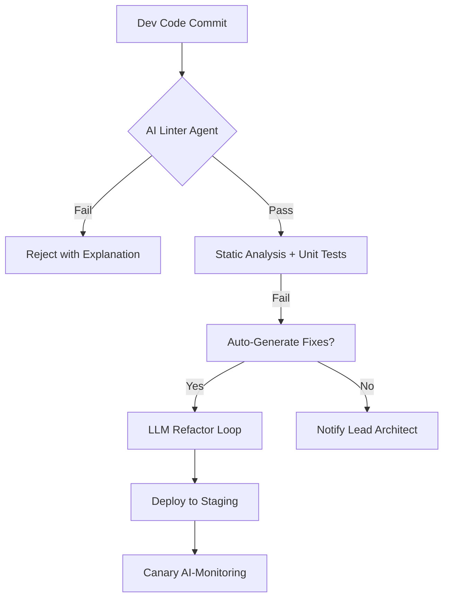

# AI-Augmented Development Workflows: Architecting the Future of Software Engineering


The pace of software delivery has accelerated beyond the capacity of traditional toolchains alone. Developers are no longer just writing code; they are orchestrating complexity within a cloud-native ecosystem where latency matters and budgets are tight. Recent advancements in Large Language Models (LLMs) have shifted AI from a passive chatbot to an active architectural partner. However, simply prompting "write this function" is not enough for senior engineers. We are witnessing a paradigm shift where AI-Augmented Development Workflows must be rigorously integrated into the SDLC to ensure quality, security, and scalability. In 2026, the competitive advantage lies not in who has access to tokens, but in how effectively your architecture embeds intelligence into every stage of development. This post explores moving beyond automation toward intelligent orchestration.

## From Copilot to Co-Architect: The Shift in Coding Dynamics

The initial excitement around AI code generation focused on syntax completion. Today, the value lies in architectural reasoning and pattern recognition. As a lead architect, my role has evolved from designing static system diagrams to curating dynamic learning loops within our CI/CD pipelines. We are moving away from simple text prediction toward agentic workflows where the system proposes, tests, and iterates logic autonomously under guardrails.

Consider the traditional loop: Write Code -> Compile -> Deploy. In an AI-Augmented workflow, it becomes: Analyze Context -> Synthesize Logic -> Generate Tests -> Validate Security -> Deploy. This requires integrating LLM calls directly into IDE plugins or build scripts. Here is a Python example of how we might orchestrate a refactoring task using a local model with guardrails to ensure business logic remains untouched during automated generation:

```python
import os
from langchain_community.llms import HuggingFaceHub
from langchain.agents import AgentType, initialize_agent, Tool

def refactor_function_safely(file_path, function_name):
    llm = HuggingFaceHub(repo_id="HuggingFaceH4/zephyr-7b-beta")
    
    # Define a tool for safe refactoring with strict constraints
    tools = [
        {
            "type": "function", 
            "function": {
                "name": "safe_refactor",
                "description": "Refactors code but strictly preserves existing imports and core logic.",
                "parameters": {"type": "object", ...} 
            }
        }
    ]

    agent = initialize_agent(
        tools, 
        llm, 
        agent=AgentType.ZERO_SHOT_REACT_DESCRIPTION,
        verbose=True
    )
    
    # Execute with context awareness
    response = agent.run(
        f"Refactor the function '{function_name}' in {file_path} to improve O(n^2) loops."
    )
    return response
```

This example demonstrates that raw generation is insufficient. We define `tools` and constraints within the orchestrator to prevent "hallucinated imports." The architecture must enforce that the LLM understands the domain ontology, not just syntactic sugar.

## Integrating AI into Mobile and Cloud Pipelines

For mobile-first teams building with Flutter or Kotlin, AI integration isn't just about generating boilerplate; it's about optimizing asset pipelines and cloud connectivity. We treat the model layer as a microservice within our Kubernetes clusters. Imagine an architecture where your CI/CD pipeline includes an "AI Quality Gate" before deployment occurs.



In this conceptual model, the `AI Quality Gate` (Node B) does not just check syntax; it analyzes code against semantic best practices learned from historical production logs. For a Flutter team, this agent can proactively suggest state management patterns that align with your cloud backend's event-driven architecture before the developer even runs a test build.

In Kotlin, we can embed these checks into Gradle tasks:

```kotlin
tasks.register("aiReview") {
    doLast {
        // Invoke model to review code complexity and security
        val analysis = openAiClient.analyze(artifacts.get()) 
        if (analysis.hasCriticalVulnerabilities) {
            throw BuildException("AI Review Failed: High Security Risk Detected")
        }
    }
}
```

By embedding this into `build.gradle`, we shift left the intelligence, catching issues like unsafe API endpoints in Flutter services before they reach production. The cloud-native architecture scales the LLM inference across containers, ensuring that analysis costs are amortized effectively across hundreds of commits per day.

## Managing Risk: Hallucinations, Security, and Human-in-the-Loop

Adopting AI-Augmented workflows introduces significant architectural risk if handled carelessly. The "black box" nature of generative models conflicts with the deterministic requirements of banking-grade applications or medical software. Therefore, every workflow must include a Human-in-the-Loop (HITL) pattern. You cannot automate decision-making without an audit trail.

The architecture must be Observability-first. We implement structured logging that captures:
1.  **The Prompt:** What context was fed to the model?
2.  **The Generation:** What code or text was produced?
3.  **The Decision:** Did the developer accept or reject the change?

This data feeds back into a Retrieval-Augmented Generation (RAG) system, allowing the AI to learn from rejected changes within your organization's specific tech stack. Security-wise, we treat generated code as untrusted input by default. We must sanitize any AI-generated payloads that interact with user data. Furthermore, cost management is crucial; unbounded token usage in cloud pipelines can bankrupt a dev budget quickly. Implementing strict token limits and using smaller models for syntax tasks while reserving larger context-aware models for architectural reviews is essential.

The future belongs to hybrid intelligence—where the AI handles the drudgery of boilerplate and regex parsing, while the architect focuses on system design and ethical governance. By treating AI as a distinct component in your microservices architecture, you gain control rather than letting it consume you. The goal is not replacement, but augmentation that allows senior engineers to focus on solving business problems rather than fighting the compiler.