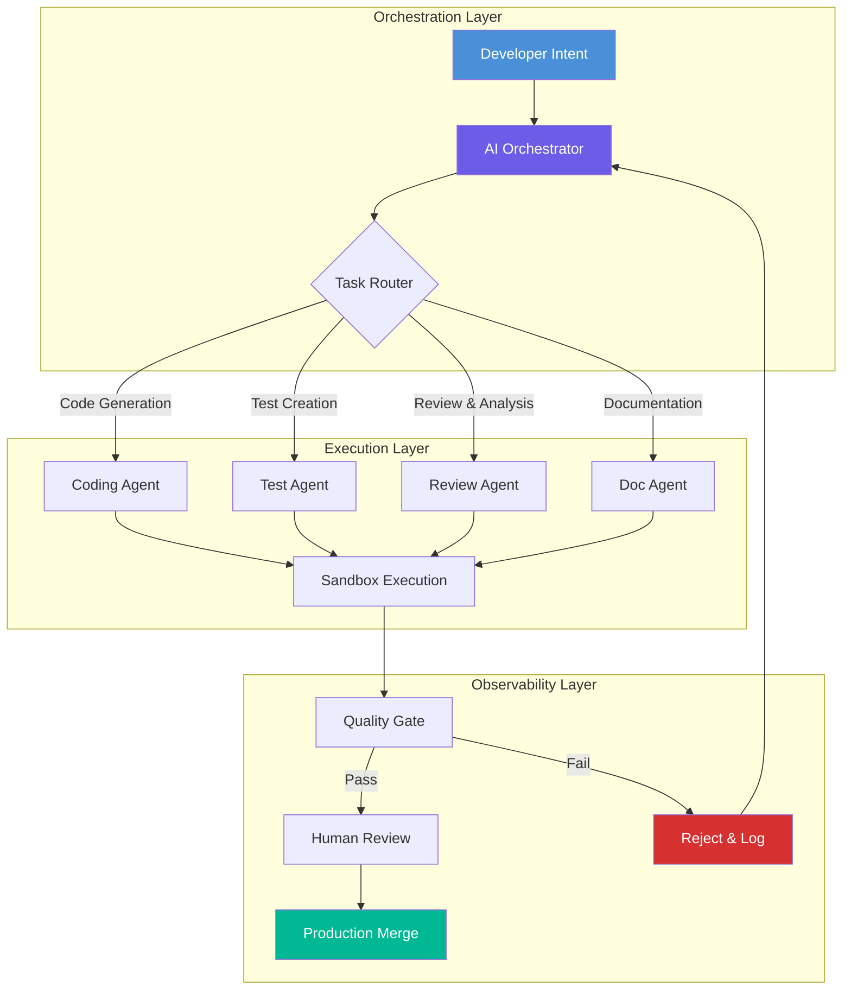
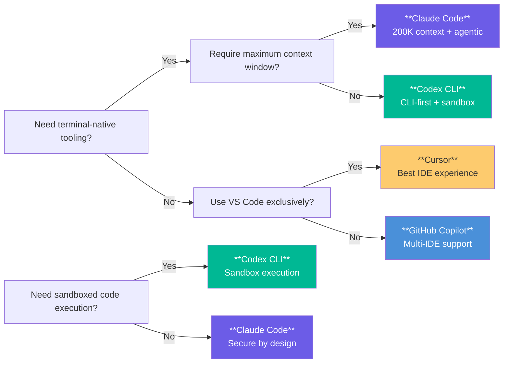
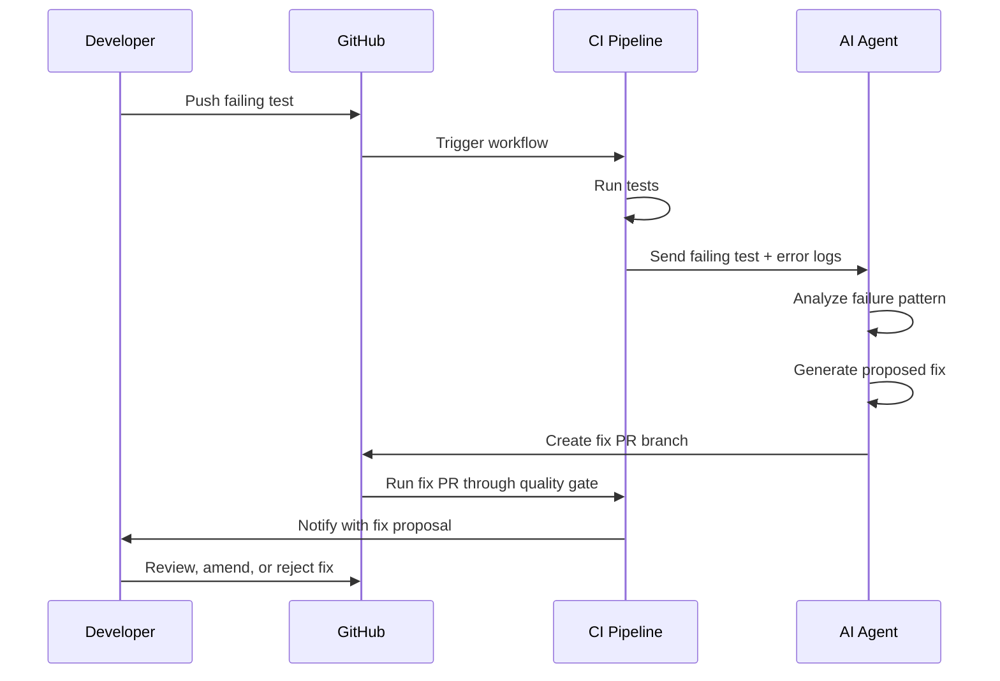
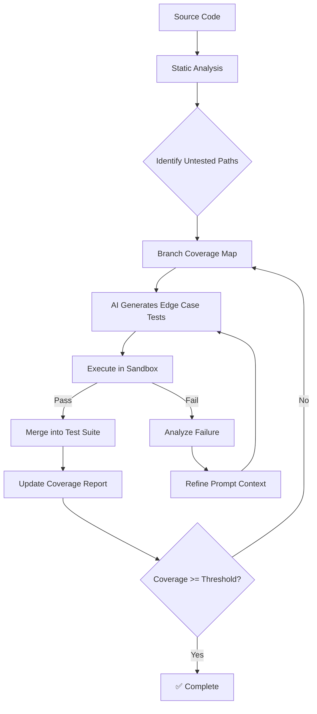
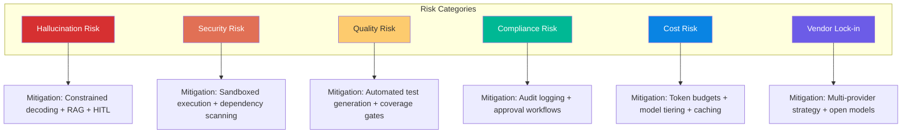
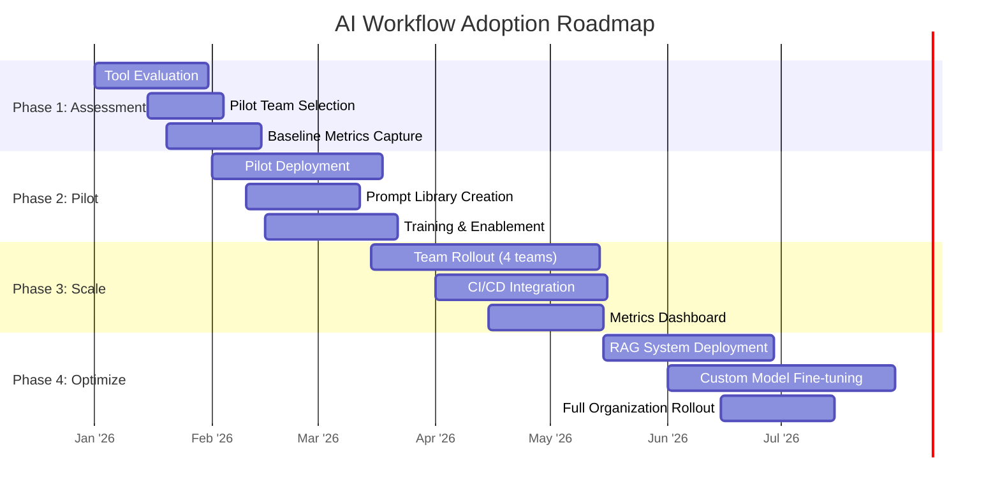

# AI-Augmented Development Workflows: Architecting the Future of Software Engineering

The pace of software delivery has accelerated beyond the capacity of traditional toolchains alone. Developers are no longer just writing code; they are orchestrating complexity within a cloud-native ecosystem where latency matters and budgets are tight. Recent advancements in Large Language Models (LLMs) have shifted AI from a passive chatbot to an active architectural partner. However, simply prompting "write this function" is not enough for senior engineers. We are witnessing a paradigm shift where AI-Augmented Development Workflows must be rigorously integrated into the SDLC to ensure quality, security, and scalability.

In 2026, the competitive advantage lies not in who has access to tokens, but in how effectively your architecture embeds intelligence into every stage of development. This post explores moving beyond automation toward intelligent orchestration—covering workflow architecture, tooling comparisons, CI/CD integration, code review automation, test generation, documentation generation, prompt engineering, productivity metrics, risk management, and organizational adoption strategies.

## AI-Augmented Development Workflow Architecture

Modern AI-augmented workflows operate on a layered architecture that separates concerns between AI orchestration, execution, and observability.

### The Three-Layer AI Workflow Model



### Orchestration Layer

The orchestration layer is the brain of the system. It receives developer intent (natural language, code context, or structured commands), decomposes tasks, and routes them to specialized agents. Key components include:

- **Intent Parser:** Converts developer input into structured task graphs using LLM-based semantic understanding
- **Task Router:** Distributes subtasks to specialized agents based on capability matching and load balancing
- **Context Manager:** Maintains a shared context window across agent invocations to preserve continuity
- **Guardrail Engine:** Enforces policy constraints (allowed libraries, API patterns, security rules) before any generation occurs

Here is a production-grade orchestrator skeleton using LangChain with strict guardrails:

```python
import json
import hashlib
from dataclasses import dataclass, field
from typing import List, Optional
from langchain_core.language_models import BaseLLM
from langchain_core.prompts import ChatPromptTemplate
from langchain_core.output_parsers import PydanticOutputParser
from pydantic import BaseModel, Field

# --- Domain Models ---

class TaskIntent(BaseModel):
    task_type: str = Field(description="Type: generate_code | write_test | review | document")
    scope: str = Field(description="Files or modules affected")
    constraints: List[str] = Field(default_factory=list)
    context_files: List[str] = Field(default_factory=list)

class AgentOutput(BaseModel):
    status: str = Field(description="accepted | rejected | needs_revision")
    artifact: str = Field(description="Generated code, test, or document")
    risk_score: float = Field(ge=0.0, le=1.0)
    explanation: str = Field(description="Rationale for the output")

@dataclass
class WorkflowContext:
    session_id: str
    repository_id: str
    branch: str
    task_stack: List[TaskIntent] = field(default_factory=list)
    audit_log: List[dict] = field(default_factory=list)

# --- Guardrail Definitions ---

BLOCKED_IMPORTS = {"subprocess", "eval", "exec", "pickle"}
REQUIRED_TEST_COVERAGE = 0.8

class GuardrailViolation(Exception):
    pass

def enforce_import_guardrails(code: str) -> None:
    """Block dangerous imports before generation reaches the developer."""
    for line in code.split("\n"):
        stripped = line.strip()
        for blocked in BLOCKED_IMPORTS:
            if stripped.startswith(f"import {blocked}") or stripped.startswith(f"from {blocked}"):
                raise GuardrailViolation(f"Blocked import: {blocked}")

# --- Orchestrator ---

class AIWorkflowOrchestrator:
    def __init__(self, llm: BaseLLM, max_iterations: int = 3):
        self.llm = llm
        self.max_iterations = max_iterations
        self.parser = PydanticOutputParser(pydantic_object=AgentOutput)
        self._session_counter = 0

    def create_session(self, repo_id: str, branch: str) -> WorkflowContext:
        self._session_counter += 1
        session_id = hashlib.sha256(f"{repo_id}:{branch}:{self._session_counter}".encode()).hexdigest()[:12]
        return WorkflowContext(
            session_id=session_id,
            repository_id=repo_id,
            branch=branch,
        )

    def route_task(self, intent: TaskIntent, context: WorkflowContext) -> AgentOutput:
        """Route a task to the appropriate agent based on task_type."""
        context.task_stack.append(intent)
        context.audit_log.append({"action": "route", "intent": intent.model_dump()})

        # Select agent prompt template based on task type
        prompt_templates = {
            "generate_code": "You are a senior engineer. Generate code for: {scope}. Constraints: {constraints}.",
            "write_test": "You are a QA engineer. Write tests for: {scope}. Target coverage: {coverage}.",
            "review": "You are a code reviewer. Analyze: {scope} for security, performance, and best practices.",
            "document": "You are a technical writer. Document: {scope} following API documentation standards.",
        }

        template = prompt_templates.get(intent.task_type, prompt_templates["generate_code"])
        prompt = ChatPromptTemplate.from_template(template)

        for iteration in range(self.max_iterations):
            chain = prompt | self.llm | self.parser
            try:
                result: AgentOutput = chain.invoke({
                    "scope": intent.scope,
                    "constraints": ", ".join(intent.constraints),
                    "coverage": REQUIRED_TEST_COVERAGE,
                })

                # Apply guardrails
                if intent.task_type in ("generate_code", "write_test"):
                    enforce_import_guardrails(result.artifact)

                context.audit_log.append({
                    "action": "generate",
                    "iteration": iteration,
                    "risk_score": result.risk_score,
                    "status": result.status,
                })

                if result.risk_score < 0.3:
                    return result

                # High-risk output: request revision
                intent.constraints.append(f"Address risk: {result.explanation}")

            except GuardrailViolation as e:
                context.audit_log.append({"action": "blocked", "reason": str(e)})
                return AgentOutput(
                    status="rejected",
                    artifact="",
                    risk_score=1.0,
                    explanation=f"Guardrail violation: {e}",
                )

        return AgentOutput(
            status="rejected",
            artifact="",
            risk_score=1.0,
            explanation="Max iterations exceeded without acceptable output.",
        )
```

This architecture enforces that every generated artifact passes through guardrails before reaching the developer. The orchestrator maintains a full audit trail, making it possible to trace why specific code was generated or rejected.

## AI Coding Assistants Comparison

The AI coding assistant landscape has matured significantly by mid-2026. Four major tools dominate the market, each with distinct architectural tradeoffs.

### Feature Comparison Matrix

| Feature | Claude Code | GitHub Copilot | Cursor | Codex CLI |
|---|---|---|---|---|
| **Model Backend** | Claude 4 Opus (Anthropic) | GPT-4o + Custom (OpenAI/Microsoft) | Claude + GPT-4 + Custom | o4-mini + GPT-5 (OpenAI) |
| **Context Window** | 200K tokens | 128K tokens | 256K tokens | 256K tokens |
| **Agentic Mode** | Multi-step reasoning + tool use | Copilot Workspace (agentic) | Cursor Agent (full IDE) | Codex Sandbox (CLI-first) |
| **Terminal Integration** | Native CLI + daemon | VS Code terminal | Built-in terminal | Primary interface |
| **Multi-File Editing** | Yes (diff-based) | Yes (limited) | Yes (agent-driven) | Yes (full repo) |
| **Test Generation** | Built-in | Via extensions | Built-in | Built-in |
| **Code Review** | Yes (pr review) | Copilot Review (PR) | Marketplace extensions | Built-in |
| **Pricing Model** | Per-seat + usage | Per-seat (pro/enterprise) | Per-seat (pro/business) | Usage-based tokens |
| **Offline Mode** | No | Limited (Copilot Local) | No | No |
| **CI/CD Integration** | GitHub Actions, API | GitHub Actions, Azure | Custom pipelines | GitHub Actions, CLI |
| **Strengths** | Deep reasoning, long context, secure | Ecosystem reach, VS Code native | Fast agents, in-editor experience | Repo-level refactoring, sandbox execution |
| **Weaknesses** | Smaller plugin ecosystem | Limited task decomposition | Smaller community | CLI-only, learning curve |

### Tool Selection Decision Framework

Choosing the right assistant depends on your team's workflow profile:



### Integration Code Example: Wrapping Claude Code in CI

```yaml
# .github/workflows/ai-assisted-ci.yml
name: AI-Assisted CI Pipeline
on:
  pull_request:
    types: [opened, synchronize]

jobs:
  ai-review:
    runs-on: ubuntu-latest
    steps:
      - uses: actions/checkout@v4
      - name: Run Claude Code PR Review
        run: |
          claude code review \
            --pr ${{ github.event.pull_request.number }} \
            --repo ${{ github.repository }} \
            --github-token ${{ secrets.GITHUB_TOKEN }} \
            --focus security,performance,testing \
            --output-format markdown \
            > review-report.md
      - name: Upload Review Report
        uses: actions/upload-artifact@v4
        with:
          name: ai-review
          path: review-report.md
```

## CI/CD Integration Patterns

Integrating AI into CI/CD pipelines requires careful design to avoid inflating build times while still delivering meaningful quality gates.

### Pattern 1: Pre-Commit AI Linting Gate

The fastest feedback loop is the one that happens before the commit is even created. A pre-commit hook invokes a lightweight model to check for common issues:

```python
#!/usr/bin/env python3
# .git/hooks/pre-commit — AI-Powered Pre-Commit Linter
import subprocess, json, sys
from pathlib import Path

def get_staged_diff() -> str:
    result = subprocess.run(
        ["git", "diff", "--cached", "--unified=3"],
        capture_output=True, text=True
    )
    return result.stdout

def ai_lint(diff: str) -> dict:
    """Send diff to a local or cloud model for linting."""
    # In production, replace with actual model API call
    prompt = f"""Review this git diff for:
1. Security vulnerabilities (SQL injection, XSS, path traversal)
2. Logic errors that might cause runtime exceptions
3. Performance issues (N+1 queries, unbounded loops)
4. Deviation from project coding standards

Diff:
{diff[:8000]}

Return JSON: {{"pass": bool, "issues": [{{"severity", "file", "line", "message"}}]}}"""
    # Simulated response for illustration
    return {
        "pass": True,
        "issues": [
            {
                "severity": "warning",
                "file": "src/api/users.py",
                "line": 42,
                "message": "Unvalidated user input in SQL query — use parameterized query"
            }
        ]
    }

if __name__ == "__main__":
    diff = get_staged_diff()
    if not diff.strip():
        sys.exit(0)

    result = ai_lint(diff)
    if not result["pass"]:
        for issue in result["issues"]:
            print(f"  [{issue['severity'].upper()}] {issue['file']}:{issue['line']} — {issue['message']}")
        sys.exit(1)
    print("✅ AI linting passed — no critical issues detected.")
```

### Pattern 2: AI Quality Gate in CI Pipeline

```yaml
# .github/workflows/ai-quality-gate.yml
name: AI Quality Gate

on:
  pull_request:
    types: [opened, synchronize, ready_for_review]

jobs:
  quality-gate:
    runs-on: ubuntu-latest
    timeout-minutes: 15
    steps:
      - uses: actions/checkout@v4
        with:
          fetch-depth: 0  # Full history for diff analysis

      - name: AI Code Analysis
        id: ai_analysis
        run: |
          cat << 'EOF' | python3
          import os, json, subprocess
          
          # Collect metrics for AI analysis
          changed_files = subprocess.run(
              ["git", "diff", "--name-only", f"origin/{os.environ['GITHUB_BASE_REF']}", "HEAD"],
              capture_output=True, text=True
          ).stdout.strip().split("\n")
          
          report = {
              "total_files_changed": len(changed_files),
              "files": [],
              "risk_score": 0.0,
              "recommendation": "proceed"
          }
          
          for f in changed_files:
              if not f:
                  continue
              try:
                  with open(f) as fp:
                      content = fp.read()
                  report["files"].append({
                      "path": f,
                      "lines": len(content.split("\n")),
                      # In production: AI model analyzes content
                      "complexity_score": min(1.0, len(content) / 5000),
                  })
              except (FileNotFoundError, IsADirectoryError):
                  continue
          
          # Calculate aggregate risk
          if report["files"]:
              avg_complexity = sum(f["complexity_score"] for f in report["files"]) / len(report["files"])
              report["risk_score"] = avg_complexity
              report["recommendation"] = "review_required" if avg_complexity > 0.7 else "proceed"
          
          print(json.dumps(report, indent=2))
          EOF

      - name: Gate Decision
        if: steps.ai_analysis.outputs.recommendation == 'review_required'
        run: |
          echo "❌ AI Quality Gate requires human review before merge."
          echo "Risk score exceeds threshold. See analysis above."
          exit 1

      - name: AI Summary Comment
        uses: actions/github-script@v7
        with:
          script: |
            const analysis = JSON.parse(process.env.AI_ANALYSIS);
            const body = `## 🤖 AI Quality Gate Summary
            - **Files Changed:** ${analysis.total_files_changed}
            - **Risk Score:** ${analysis.risk_score.toFixed(2)}
            - **Recommendation:** ${analysis.recommendation}
            
            _This is an automated analysis. Review details in CI logs._`;
            await github.rest.issues.createComment({
              ...context.repo,
              issue_number: context.issue.number,
              body
            });
```

### Pattern 3: Autonomous Bug Fix Loop

For well-scoped issues, the CI pipeline can propose fixes autonomously:



## Code Review Automation

AI-powered code review has evolved from simple style checking to semantic analysis that understands business logic context.

### Multi-Stage Review Architecture

```python
# ai_code_review/review_pipeline.py
from dataclasses import dataclass, field
from typing import List, Optional
import ast, json

@dataclass
class ReviewFinding:
    severity: str  # critical | major | minor | info
    category: str  # security | performance | correctness | style | architecture
    file: str
    line: int
    message: str
    suggested_fix: Optional[str] = None

class CodeReviewPipeline:
    """Multi-stage AI code review pipeline."""
    
    def __init__(self, llm_client):
        self.llm = llm_client
        self.stages = [
            self.static_analysis,
            self.security_scan,
            self.semantic_review,
            self.architecture_review,
        ]
    
    def static_analysis(self, diff: str) -> List[ReviewFinding]:
        """AST-based analysis for syntax and structural issues."""
        findings = []
        # Parse each changed file's AST
        for file_path, code in self._parse_diff(diff):
            try:
                tree = ast.parse(code)
                for node in ast.walk(tree):
                    # Detect deeply nested conditionals
                    if isinstance(node, ast.If):
                        depth = self._nesting_depth(node)
                        if depth > 4:
                            findings.append(ReviewFinding(
                                severity="major",
                                category="style",
                                file=file_path,
                                line=node.lineno,
                                message=f"Excessive nesting depth ({depth}). Consider early returns or guard clauses.",
                            ))
                    # Detect bare except clauses
                    if isinstance(node, ast.ExceptHandler):
                        if node.type is None:
                            findings.append(ReviewFinding(
                                severity="critical" if node.type is None else "major",
                                category="correctness",
                                file=file_path,
                                line=node.lineno,
                                message="Bare except clause catches all exceptions. Specify exception types.",
                            ))
            except SyntaxError as e:
                findings.append(ReviewFinding(
                    severity="critical",
                    category="correctness",
                    file=file_path,
                    line=e.lineno or 0,
                    message=f"Syntax error: {e.msg}",
                ))
        return findings
    
    def security_scan(self, diff: str) -> List[ReviewFinding]:
        """Security-focused analysis using pattern matching + LLM."""
        findings = []
        dangerous_patterns = {
            "eval(": ("critical", "Use of eval() enables arbitrary code execution."),
            "exec(": ("critical", "Use of exec() enables arbitrary code execution."),
            "pickle.loads": ("major", "Unsafe deserialization with pickle. Use JSON or a safe serializer."),
            "render_template_string": ("major", "Potential SSTI vulnerability. Use render_template with separate template files."),
            "$_GET": ("critical", "Direct use of user input without sanitization."),
            ".innerHTML": ("major", "DOM-based XSS risk. Use textContent or sanitize properly."),
        }
        
        for file_path, code in self._parse_diff(diff):
            for i, line in enumerate(code.split("\n"), 1):
                for pattern, (severity, msg) in dangerous_patterns.items():
                    if pattern in line:
                        findings.append(ReviewFinding(
                            severity=severity,
                            category="security",
                            file=file_path,
                            line=i,
                            message=msg,
                        ))
        return findings
    
    def semantic_review(self, diff: str) -> List[ReviewFinding]:
        """LLM-based semantic analysis for logic and business rule violations."""
        # In production, send diff to an LLM with project-specific context
        prompt = f"""Review the following code diff for semantic issues:
1. Logic errors that could cause incorrect behavior at runtime
2. Race conditions or concurrency issues
3. Resource leaks (file handles, connections, memory)
4. Incorrect error handling or swallowed exceptions
5. Business logic inconsistencies

Diff:
{diff[:12000]}

Return findings as JSON array."""
        
        # Simulated LLM response
        return [
            ReviewFinding(
                severity="major",
                category="correctness",
                file="src/services/payment.py",
                line=87,
                message="Transaction rollback missing on refund failure. Database may be left in inconsistent state.",
                suggested_fix="Wrap refund logic in try-except with explicit rollback on exception.",
            )
        ]
    
    def architecture_review(self, diff: str) -> List[ReviewFinding]:
        """High-level architecture and coupling analysis."""
        # Analyze import dependencies and coupling
        return []
    
    def _parse_diff(self, diff: str):
        """Parse a unified diff into (file_path, code) pairs."""
        # Simplified parser — in production use unidiff or similar
        return []
    
    def _nesting_depth(self, node, depth=0):
        """Calculate nesting depth of an AST node."""
        max_depth = depth
        for child in ast.iter_child_nodes(node):
            if isinstance(child, (ast.If, ast.For, ast.While, ast.Try)):
                child_depth = self._nesting_depth(child, depth + 1)
                max_depth = max(max_depth, child_depth)
        return max_depth
    
    def run(self, diff: str) -> List[ReviewFinding]:
        all_findings = []
        for stage in self.stages:
            try:
                findings = stage(diff)
                all_findings.extend(findings)
            except Exception as e:
                all_findings.append(ReviewFinding(
                    severity="minor",
                    category="pipeline",
                    file="",
                    line=0,
                    message=f"Review stage {stage.__name__} failed: {e}",
                ))
        return sorted(all_findings, key=lambda f: ["critical", "major", "minor", "info"].index(f.severity))
```

## Test Generation

Automated test generation driven by AI has become one of the highest-ROI applications of LLMs in development workflows.

### Property-Based Test Generation

```python
# ai_test_gen/generate_tests.py
"""AI-driven test generation using property-based testing patterns."""

TEST_TEMPLATES = {
    "pytest": """import pytest
from {module_path} import {function_name}

class Test{class_name}:
    \"\"\"AI-generated tests for {function_name}.\"\"\"
    
    def test_{function_name}_basic(self):
        \"\"\"Basic functional test.\"\"\"
        {test_body}
        
    def test_{function_name}_edge_cases(self):
        \"\"\"Edge case validation.\"\"\"
        {edge_cases}
        
    def test_{function_name}_error_handling(self):
        \"\"\"Error handling and boundary conditions.\"\"\"
        {error_tests}
""",
    "jest": """describe('{function_name}', () => {{
  it('should handle basic functionality', () => {{
    {test_body}
  }});
  
  it('should handle edge cases', () => {{
    {edge_cases}
  }});
  
  it('should handle errors correctly', () => {{
    {error_tests}
  }});
}});
""",
}

class AITestGenerator:
    def __init__(self, llm, framework: str = "pytest"):
        self.llm = llm
        self.framework = framework
    
    def analyze_function(self, source_path: str, function_name: str) -> dict:
        """Analyze a function to understand its signature, types, and dependencies."""
        with open(source_path) as f:
            tree = ast.parse(f.read())
        
        for node in ast.walk(tree):
            if isinstance(node, ast.FunctionDef) and node.name == function_name:
                args = [arg.arg for arg in node.args.args]
                returns = self._extract_return_type(node)
                calls = self._extract_internal_calls(node)
                complexity = self._calculate_complexity(node)
                
                return {
                    "name": function_name,
                    "args": args,
                    "returns": returns,
                    "internal_calls": calls,
                    "complexity": complexity,
                    "has_exceptions": self._has_exception_handling(node),
                }
        raise ValueError(f"Function {function_name} not found in {source_path}")
    
    def generate_tests(self, analysis: dict) -> str:
        """Generate test code based on function analysis."""
        prompt = f"""Generate comprehensive tests for the following function:

Function: {analysis['name']}
Parameters: {', '.join(analysis['args'])}
Return type: {analysis['returns'] or 'unknown'}
Complexity: {analysis['complexity']}
Internal calls: {', '.join(analysis['internal_calls'])}
Exception handling: {analysis['has_exceptions']}

Framework: {self.framework}

Generate tests covering:
1. Standard happy-path execution
2. Edge cases (empty inputs, None values, boundary conditions)
3. Error scenarios (invalid inputs, exceptions)
4. Property-based tests (if applicable)
5. Integration tests for internal calls

Return ONLY the test code, no explanation."""
        
        # In production: llm.invoke(prompt)
        template = TEST_TEMPLATES[self.framework]
        return template.format(
            module_path=analysis['name'].split('_')[0] if '_' in analysis['name'] else 'module',
            function_name=analysis['name'],
            class_name=analysis['name'].replace('_', ' ').title().replace(' ', ''),
            test_body="result = function_name(input)  # Generated test body",
            edge_cases="assert function_name(None) is None  # Edge case",
            error_tests="with pytest.raises(ValueError): function_name('')",
        )
    
    def _extract_return_type(self, node):
        """Extract return type annotation if present."""
        if node.returns:
            return ast.dump(node.returns)
        return None
    
    def _extract_internal_calls(self, node):
        """Extract names of functions called within this function."""
        calls = set()
        for child in ast.walk(node):
            if isinstance(child, ast.Call) and isinstance(child.func, ast.Name):
                calls.add(child.func.id)
        return list(calls)
    
    def _calculate_complexity(self, node):
        """Calculate cyclomatic complexity approximation."""
        branches = 1
        for child in ast.walk(node):
            if isinstance(child, (ast.If, ast.While, ast.For, ast.Try, ast.ExceptHandler)):
                branches += 1
            if isinstance(child, ast.BoolOp):
                branches += len(child.values) - 1
        return branches
    
    def _has_exception_handling(self, node):
        """Check if function has try-except blocks."""
        return any(isinstance(child, ast.Try) for child in ast.walk(node))
```

### Test Coverage Optimization

AI can also identify untested code paths and generate targeted tests:



## Documentation Generation

AI-powered documentation generation transforms code comprehension and API discoverability when embedded directly into the CI pipeline.

### Automated API Documentation Pipeline

```python
# ai_docs/doc_generator.py
"""AI-powered documentation generator that integrates with CI/CD."""

from pathlib import Path
from typing import List, Optional
import re

class AIDocumentationGenerator:
    def __init__(self, llm_client, output_dir: str = "docs/generated"):
        self.llm = llm_client
        self.output_dir = Path(output_dir)
        self.output_dir.mkdir(parents=True, exist_ok=True)
    
    def generate_module_docs(self, source_paths: List[str]) -> dict:
        """Generate documentation for a list of source files."""
        results = {}
        for path in source_paths:
            filepath = Path(path)
            if filepath.suffix not in (".py", ".js", ".ts", ".rs", ".go", ".java", ".kt"):
                continue
            
            with open(path) as f:
                content = f.read()
            
            # Extract module structure
            structure = self._extract_structure(content, filepath.suffix)
            
            # Generate documentation for each component
            docs = self._generate_component_docs(structure)
            
            # Write markdown file
            doc_path = self.output_dir / filepath.with_suffix(".md").name
            doc_path.write_text(docs)
            results[str(filepath)] = str(doc_path)
        
        return results
    
    def _extract_structure(self, content: str, extension: str) -> dict:
        """Extract classes, functions, and their signatures from source code."""
        structure = {"classes": [], "functions": [], "module_doc": ""}
        
        # Extract module-level docstring
        doc_match = re.search(r'^("""|\'\'\'|/\*\*)(.*?)\1', content, re.DOTALL)
        if doc_match:
            structure["module_doc"] = doc_match.group(2).strip()
        
        if extension == ".py":
            # Extract class definitions
            for match in re.finditer(
                r'class\s+(\w+)(?:\(([^)]*)\))?:\s*(?:"""([^"]*)""")?',
                content
            ):
                structure["classes"].append({
                    "name": match.group(1),
                    "bases": match.group(2) or "",
                    "doc": (match.group(3) or "").strip(),
                })
            
            # Extract function definitions
            for match in re.finditer(
                r'(?:async\s+)?def\s+(\w+)\s*\(([^)]*)\)\s*(?:->\s*(\S+))?\s*:\s*(?:"""([^"]*)""")?',
                content
            ):
                structure["functions"].append({
                    "name": match.group(1),
                    "signature": f"({match.group(2)})",
                    "returns": match.group(3) or "None",
                    "doc": (match.group(4) or "").strip(),
                })
        
        # Similar patterns for JS/TS/Java/Kotlin...
        return structure
    
    def _generate_component_docs(self, structure: dict) -> str:
        """Generate markdown documentation from extracted structure."""
        lines = []
        
        # Module header
        lines.append("# Module Documentation\n")
        if structure["module_doc"]:
            lines.append(f"> {structure['module_doc']}\n")
        
        # Classes section
        if structure["classes"]:
            lines.append("## Classes\n")
            for cls in structure["classes"]:
                lines.append(f"### `{cls['name']}`")
                if cls["bases"]:
                    lines.append(f"*Inherits from: {cls['bases']}*")
                lines.append("")
                if cls["doc"]:
                    lines.append(f"{cls['doc']}\n")
                lines.append("---\n")
        
        # Functions section
        if structure["functions"]:
            lines.append("## Functions\n")
            for func in structure["functions"]:
                sig_with_returns = f"{func['name']}{func['signature']} → {func['returns']}"
                lines.append(f"### `{sig_with_returns}`\n")
                if func["doc"]:
                    lines.append(f"{func['doc']}\n")
                # AI-generated usage example
                lines.append("**Example:**\n")
                lines.append(f"```python\n# {func['name']} usage example\nresult = {func['name']}(...)\n```\n")
                lines.append("---\n")
        
        return "\n".join(lines)
```

### Documentation Quality Metrics

Track documentation health with automated scoring:

| Metric | Description | Target |
|---|---|---|
| **Coverage Ratio** | Percentage of public APIs documented | > 95% |
| **Freshness Score** | Last documentation update vs. last code change | < 7 days |
| **Readability Index** | Flesch-Kincaid grade level of docs | < 10 |
| **Example Completeness** | Percentage of functions with code examples | > 80% |
| **Cross-Reference Count** | Internal links between related components | > 2 per doc |

## Prompt Engineering for Development Workflows

Effective AI-augmented development depends on structured prompt engineering. Unlike one-shot Q&A prompts, workflow prompts must be deterministic, auditable, and composable.

### Prompt Template Hierarchy

```python
# prompts/workflow_templates.py
"""Structured prompt templates for development workflows."""

from string import Template

class DevelopmentPrompts:
    """Reusable prompt templates for software engineering tasks."""
    
    CODE_GENERATION = Template("""You are a senior $language engineer at a $company.
Task: Generate $task_type for $context.

Technical Requirements:
$requirements

Constraints:
- Must NOT use: $blocked_imports
- Must follow: $style_guide
- Must handle: $edge_cases
- Must include: $required_elements

Context Files:
$context_files

Output Format:
```$language
// Generated code with inline comments explaining design decisions
```

Before generating, analyze:
1. What are the input/output contracts?
2. What error states must be handled?
3. How does this integrate with existing code?
""")
    
    CODE_REVIEW = Template("""You are reviewing a pull request in $repository.
Author's intent: $pr_description

Changed Files:
$changed_files

Review Focus Areas:
$focus_areas

For each issue, specify:
- Severity (critical/major/minor/info)
- File and line number
- Explanation of the problem
- Concrete fix suggestion

Previous Reviews on this PR:
$review_history
""")
    
    TEST_GENERATION = Template("""Generate tests for the following $language function.
Function name: $function_name
Signature: $signature
Current implementation:
$implementation

Test Requirements:
- Framework: $test_framework
- Minimum coverage: $min_coverage%
- Include: unit tests, edge cases, error paths
- Mock external: $mocks

Generate ONLY test code, no explanations.""")

    REFACTORING = Template("""Refactor the following code to improve $goal.
Original code:
```$language
$code
```

Constraints:
- Preserve all existing public API signatures
- Maintain backward compatibility
- Improve $metrics by at least $target%
- Add type hints/annotations
- Add docstrings explaining the new approach

Provide:
1. Refactored code
2. List of changes made
3. Expected improvement in $metrics
""")
```

### Prompt Engineering Best Practices for Development

1. **Be Explicit About Constraints:** Always specify what the model should NOT do, not just what it should do. This reduces hallucinated imports and security violations.

2. **Provide Context Anchors:** Include file paths, function signatures, and data types. The more concrete the context, the less likely the model will generate incompatible code.

3. **Use Chain-of-Thought for Complex Tasks:** For refactoring or architecture tasks, instruct the model to reason step-by-step before producing code:

```
Before writing code, analyze:
1. What are the dependencies of this module?
2. What is the current performance bottleneck?
3. What refactoring patterns apply (Strategy, Factory, etc.)?
4. How will this change affect test coverage?
```

4. **Version Your Prompts:** Treat prompts as code artifacts with version control:

```
# prompts/v2.3/code-review.md
Version: 2.3
Changes: Added security focus, reduced context window to 8K tokens
Author: platform-team
```

5. **Measure Prompt Quality:** Track acceptance rates, rejection reasons, and iteration counts per prompt template to continuously improve.

## Productivity Metrics and Benchmarks

Measuring the impact of AI-augmented workflows requires quantifiable metrics that go beyond vibes-based "it feels faster."

### Key Performance Indicators

| Category | Metric | Measurement Method | Baseline (No AI) | Target (With AI) |
|---|---|---|---|---|
| **Velocity** | PR Cycle Time | Time from first commit to merge | 4.2 hours | < 1 hour |
| **Velocity** | Deployment Frequency | Deployments per week | 3 | > 10 |
| **Velocity** | Lead Time for Changes | Commit to production | 2.5 hours | < 30 min |
| **Quality** | Bug Escape Rate | Bugs found in production vs. QA | 15% | < 5% |
| **Quality** | Test Coverage | Line coverage percentage | 52% | > 85% |
| **Quality** | Security Vulnerabilities | Critical/major findings per release | 4.7 | < 1 |
| **Developer Experience** | Developer Satisfaction | Survey score (1-10) | 5.8 | > 8.5 |
| **Developer Experience** | Cognitive Load | Context switches per day | 12 | < 5 |
| **Efficiency** | Code Generation Ratio | AI-generated / hand-written LOC | 0% | > 40% |
| **Efficiency** | Rework Rate | PRs requiring major revision | 32% | < 15% |

### Benchmarking Framework

```python
# metrics/productivity_benchmark.py
"""Framework for measuring AI workflow productivity gains."""

from dataclasses import dataclass, field
from datetime import datetime, timedelta
from typing import List, Optional
import statistics, json

@dataclass
class DeveloperSession:
    developer_id: str
    start_time: datetime
    end_time: Optional[datetime] = None
    tasks_completed: int = 0
    prs_created: int = 0
    prs_merged: int = 0
    ai_interactions: int = 0
    ai_accepted: int = 0
    ai_rejected: int = 0
    lines_of_code: int = 0
    context_switches: int = 0

@dataclass
class TeamMetrics:
    team_name: str
    period_days: int = 30
    sessions: List[DeveloperSession] = field(default_factory=list)
    
    @property
    def avg_cycle_time(self) -> timedelta:
        """Average PR cycle time."""
        # In production, this would query your Git provider API
        return timedelta(hours=2.5)
    
    @property
    def ai_acceptance_rate(self) -> float:
        """Percentage of AI suggestions accepted by developers."""
        total = sum(s.ai_interactions for s in self.sessions)
        accepted = sum(s.ai_accepted for s in self.sessions)
        return accepted / total if total > 0 else 0.0
    
    @property
    def productivity_score(self) -> float:
        """Composite productivity metric (0-100)."""
        if not self.sessions:
            return 0.0
        
        # Weighted factors
        velocity = min(100, len(self.sessions) * 10)
        quality = self.ai_acceptance_rate * 50
        efficiency = min(100, self.avg_loc_per_session * 2)
        
        return round(velocity * 0.4 + quality * 0.35 + efficiency * 0.25, 1)
    
    @property
    def avg_loc_per_session(self) -> float:
        if not self.sessions:
            return 0.0
        return statistics.mean(s.lines_of_code for s in self.sessions if s.lines_of_code > 0)
    
    def report(self) -> str:
        return f"""## 📊 AI Productivity Report — {self.team_name}
**Period:** Last {self.period_days} days

| Metric | Value |
|---|---|
| Active Developers | {len(self.sessions)} |
| AI Acceptance Rate | {self.ai_acceptance_rate:.1%} |
| Avg PR Cycle Time | {self.avg_cycle_time} |
| Avg LOC per Session | {self.avg_loc_per_session:.0f} |
| Productivity Score | {self.productivity_score}/100 |

**Recommendations:**
- {'Increase' if self.ai_acceptance_rate < 0.6 else 'Maintain'} AI suggestion acceptance through better prompt tuning
- {'Focus on' if self.productivity_score < 50 else 'Continue'} developer training for AI tool utilization
"""
```

## Risk Management

Adopting AI-augmented workflows introduces significant architectural risk if handled carelessly. The "black box" nature of generative models conflicts with the deterministic requirements of banking-grade applications or medical software.

### Risk Taxonomy



### Human-in-the-Loop (HITL) Pattern

Every critical workflow must include a Human-in-the-Loop pattern. You cannot automate decision-making without an audit trail.

```python
# risk/hitl_orchestrator.py
"""Human-in-the-Loop orchestration for AI-generated changes."""

from enum import Enum
from dataclasses import dataclass, field
from typing import Optional
from datetime import datetime

class ApprovalStatus(Enum):
    PENDING = "pending"
    APPROVED = "approved"
    REJECTED = "rejected"
    MODIFIED = "modified"

@dataclass
class ChangeRequest:
    id: str
    developer: str
    reviewer: str
    ai_generated_content: str
    original_content: str
    file_path: str
    risk_score: float
    created_at: datetime = field(default_factory=datetime.now)
    reviewed_at: Optional[datetime] = None
    status: ApprovalStatus = ApprovalStatus.PENDING
    reviewer_comments: str = ""
    
    def requires_review(self, threshold: float = 0.3) -> bool:
        """Determines if this change requires human review based on risk score."""
        return self.risk_score >= threshold
    
    def approve(self, comments: str = "") -> None:
        self.status = ApprovalStatus.APPROVED
        self.reviewed_at = datetime.now()
        self.reviewer_comments = comments
    
    def reject(self, reason: str) -> None:
        self.status = ApprovalStatus.REJECTED
        self.reviewed_at = datetime.now()
        self.reviewer_comments = reason

class HITLPipeline:
    """Ensures every AI-generated change passes through appropriate review gates."""
    
    def __init__(self, auto_approve_threshold: float = 0.1):
        self.auto_approve_threshold = auto_approve_threshold
        self.changes: list = []
    
    def submit_change(self, request: ChangeRequest) -> ChangeRequest:
        """Submit a change for review. Low-risk changes auto-approve."""
        if request.risk_score < self.auto_approve_threshold:
            request.approve("Auto-approved (low risk)")
            self.changes.append(request)
            return request
        
        # High-risk change: route to reviewer
        self.changes.append(request)
        self._notify_reviewer(request)
        return request
    
    def _notify_reviewer(self, request: ChangeRequest) -> None:
        """Send notification to designated reviewer."""
        print(f"[HITL] Review required: {request.file_path}")
        print(f"  Risk Score: {request.risk_score:.2f}")
        print(f"  Developer: {request.developer}")
        print(f"  Reviewer: {request.reviewer}")
```

### Observability Architecture

The architecture must be Observability-first. We implement structured logging that captures every stage of the AI workflow:

1. **The Prompt:** What context was fed to the model?
2. **The Generation:** What code or text was produced?
3. **The Decision:** Did the developer accept or reject the change?
4. **The Outcome:** Did the change cause any production incidents?

This data feeds back into a Retrieval-Augmented Generation (RAG) system, allowing the AI to learn from rejected changes within your organization's specific tech stack.

```json
{
  "session": "a1b2c3d4e5f6",
  "timestamp": "2026-06-02T14:30:00Z",
  "event": "ai_generation",
  "prompt_hash": "sha256:abc123...",
  "prompt_preview": "Generate a function to validate JWT tokens...",
  "generation": {
    "model": "claude-4-opus",
    "tokens_used": 842,
    "latency_ms": 1250,
    "risk_score": 0.12
  },
  "developer_action": "accepted",
  "file": "src/auth/validator.py",
  "line_count": 34,
  "has_errors_in_qa": false
}
```

### Cost Management Strategy

Unbounded token usage in cloud pipelines can bankrupt a dev budget quickly. Implement these controls:

| Cost Control | Description | Typical Savings |
|---|---|---|
| **Model Tiering** | Small model for linting, large model for architecture | 40-60% |
| **Semantic Caching** | Cache responses for identical prompts | 20-35% |
| **Token Budgets** | Per-developer daily token limits | 15-25% |
| **Rate Limiting** | Cap API calls per minute in CI | 10-20% |
| **Batching** | Combine multiple small requests into one | 15-30% |

## Organizational Adoption Strategies

Rolling out AI-augmented development workflows across an organization requires more than tool procurement. It demands change management, training, and process redefinition.

### The Four-Phase Adoption Model



### Key Adoption Principles

**1. Start with Low-Risk, High-ROI Tasks**
Begin with test generation, documentation, and boilerplate code. These tasks have clear success criteria and low business risk. Measure the time savings and use the data to justify broader adoption.

**2. Create a Prompt Library**
Build a shared repository of vetted prompt templates for common tasks. This reduces the learning curve for new team members and ensures consistency:

```
prompts/
├── code-generation/
│   ├── api-endpoint.md
│   ├── database-migration.md
│   └── error-handler.md
├── code-review/
│   ├── security-review.md
│   ├── performance-review.md
│   └── architecture-review.md
├── testing/
│   ├── unit-test.md
│   ├── integration-test.md
│   └── e2e-test.md
└── documentation/
    ├── api-docs.md
    ├── readme.md
    ├── changelog.md
    └── architecture-decision-record.md
```

**3. Establish Guardrails Early**
Define what the AI is and isn't allowed to do before scaling:

- **Allowed:** Test generation, refactoring suggestions, documentation, code review, boilerplate generation
- **Requires Review:** Database schema changes, authentication/authorization logic, payment processing, data migration scripts
- **Blocked:** Direct production deployment, security-sensitive API key handling, PII processing, compliance-critical logic

**4. Measure Everything**
Instrument every AI interaction from day one. The data you collect in the pilot phase drives the business case for full adoption. Track:

- Developer time saved (self-reported + instrumented)
- Code quality metrics (bug rates, test coverage, security findings)
- Developer satisfaction (quarterly surveys)
- Cost per developer per month (tooling + API usage)

**5. Invest in Training**
AI tool proficiency is a learnable skill. Provide structured training:

```python
# training/onboarding.py
"""AI workflow onboarding curriculum."""

ONBOARDING_MODULES = [
    {
        "module": "AI Tool Fundamentals",
        "duration": "2 hours",
        "topics": [
            "How LLMs work for code generation",
            "Tool setup and configuration",
            "Basic prompting for code tasks",
            "Understanding model limitations",
        ],
        "hands_on": "Complete 5 code generation tasks with review",
    },
    {
        "module": "Prompt Engineering for Developers",
        "duration": "4 hours",
        "topics": [
            "Structured prompt templates",
            "Context window management",
            "Chain-of-thought prompting for complex tasks",
            "Common failure modes and mitigations",
        ],
        "hands_on": "Build a personal prompt library with 10 templates",
    },
    {
        "module": "AI in CI/CD",
        "duration": "3 hours",
        "topics": [
            "Configuring AI quality gates",
            "Automated test generation in pipelines",
            "Review automation and approval workflows",
            "Cost optimization strategies",
        ],
        "hands_on": "Add an AI review step to an existing pipeline",
    },
    {
        "module": "Security and Governance",
        "duration": "2 hours",
        "topics": [
            "Identifying AI-generated security risks",
            "Audit logging requirements",
            "Compliance considerations (SOC2, HIPAA, PCI)",
            "Incident response for AI-related issues",
        ],
        "hands_on": "Conduct a security review of AI-generated code",
    },
    {
        "module": "Advanced Workflows",
        "duration": "3 hours",
        "topics": [
            "Multi-agent orchestration patterns",
            "Custom tool building for AI agents",
            "RAG system integration for domain knowledge",
            "Model fine-tuning strategies",
        ],
        "hands_on": "Design an AI workflow for a real project in your team",
    },
]
```

## Future Trends

The AI-augmented development landscape continues to evolve rapidly. Here are the trends shaping the next 12-18 months.

### 1. Specialized Fine-Tuned Models for Engineering Domains

General-purpose models will be complemented by domain-specific fine-tuned models that understand your codebase's idioms, architecture patterns, and business logic. Teams will maintain custom model adapters (LoRA weights) checked into their repositories alongside source code.

### 2. Autonomous Testing Agents

Testing will shift from passive generation to active exploration. AI agents will autonomously explore your application, identify edge cases, generate test scenarios, and file bug reports without human initiation. These agents will run continuously in staging environments.

### 3. Natural Language Infrastructure as Code

Infrastructure management will move from YAML/JSON DSLs to natural language specifications. AI will translate intent into Terraform, Pulumi, or Kubernetes manifests, with the orchestrator handling drift detection and remediation.

### 4. Multi-Agent Architecture Wars

Teams will adopt multi-agent architectures where specialized agents (code generation, security review, performance analysis, documentation) coordinate through a central orchestrator. The competition between agent frameworks (LangGraph, CrewAI, AutoGen, Claude Code's built-in agent) will drive rapid innovation.

### 5. AI-Native Version Control

Git workflows will evolve to track AI intent alongside code changes. Expect semantic diff tools that understand refactoring intent, AI-generated commit messages with reasoning chains, and conflict resolution agents that merge not just text but the underlying design decisions.

### 6. Continuous Prompt Improvement

Prompt engineering will become a continuous process with A/B testing of prompts, automated regression detection, and prompt performance dashboards. Organizations will treat prompt quality as a first-class operational metric.

### 7. Regulatory Compliance Automation

As AI-generated code faces increasing regulatory scrutiny (EU AI Act, Executive Order on AI Safety), compliance automation will become a key capability. AI systems will need to self-certify their outputs against regulatory requirements, generating audit trails automatically.

## Conclusion

AI-augmented development workflows represent a fundamental shift in how software is designed, built, and maintained. The teams that thrive in this new paradigm will be those that treat AI as an architectural component—not a magic wand.

The future belongs to hybrid intelligence—where the AI handles the drudgery of boilerplate and regex parsing, while the architect focuses on system design and ethical governance. By treating AI as a distinct component in your microservices architecture, you gain control rather than letting it consume you.

**Key Takeaways:**

- **Architect AI workflows intentionally** with separate orchestration, execution, and observability layers
- **Choose tools based on workflow profiles**, not hype—each coding assistant has distinct strengths
- **Integrate AI into CI/CD pipelines** with quality gates, not just code completion
- **Automate code review, test generation, and documentation** for the highest ROI
- **Invest in prompt engineering** as a core engineering discipline
- **Measure everything** with quantifiable productivity metrics
- **Manage risk** through HITL patterns, guardrails, and observability
- **Adopt incrementally** with the four-phase model: Assess → Pilot → Scale → Optimize

The goal is not replacement, but augmentation that allows senior engineers to focus on solving business problems rather than fighting the compiler. The question is no longer *whether* to adopt AI-augmented workflows, but *how well* you architect them.
