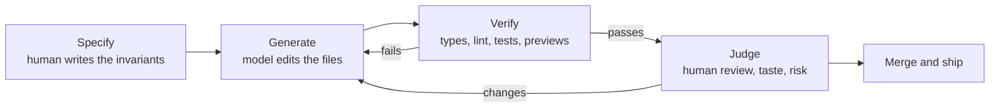

# AI-Augmented Development Workflows: Architecting the Future of Software Engineering

Every conference talk ends the same way: the future is AI writing the code. I've sat through enough of those to be skeptical, and I've also sat through enough code reviews of AI-written code to know the future is arriving anyway — just not in the shape of the slide deck.

It's not "AI replaces developers." It's a loop. Humans specify, models generate, machines verify, humans judge. The team that wins is the one that understands where the risk lives inside that loop. Everything else is a demo.

## The mental model: a very fast junior with no judgment

Think of the best junior engineer you've ever worked with. Now imagine one who has read every library's documentation, types at two hundred words a minute, and has no sense of what could go wrong. That's the model. Useful beyond measure, and completely unfit to be left alone with the repo.

You would never hand that person the codebase and go on vacation. You'd sit beside them. You'd keep the test suite running and watch it like a hawk. You'd review every consequential move and let the mechanical ones pass. The augmented workflow is exactly that pairing — the junior, the senior, and the test suite — with the tooling made explicit.

Here's the part that surprises most people: the senior's job didn't disappear. It got smaller and sharper. Less typing, more judging.

The analogy also predicts the failure modes. A junior who's too fast produces too much code, which is why velocity without verification is a liability. A junior who's read everything is overconfident, which is why the tests matter more, not less, the better the model gets. Every failure mode you've seen with eager juniors has an AI equivalent, and the same supervision fixes both.

## How the loop actually works

Four stages, always in the same order:

1. Specification. A human writes the invariant — the acceptance test, the migration checklist, the API contract. This is the part the model can't do for you, because it's the part that says what "right" means.
2. Generation. The model proposes a change, often editing dozens of files at once. No human does that quickly, and the model is happy to.
3. Verification. The machine checks the proposal — type checker, linter, test suite, preview. Fast, relentless, and free of opinion.
4. Judgment. A human reviews the survivors. Not for typos. For semantics, for taste, for the risks the tests can't see.

Notice the order, because the order is the design. Specification comes first, so the model always generates against a definition of done instead of a vibe. Verification comes before judgment, so the human never wastes attention on a change that fails a test. And the loop feeds failures straight back into generation, which is why it converges — each pass starts from the previous pass's concrete errors, not from a fresh guess. Break the order and you get the demo version: impressive first pass, then chaos.


```mermaid
flowchart LR
    A[Specify<br/>human writes the invariants] --> B[Generate<br/>model edits the files]
    B --> C[Verify<br/>types, lint, tests, previews]
    C -->|fails| B
    C -->|passes| D[Judge<br/>human review, taste, risk]
    D -->|changes| B
    D --> E[Merge and ship]
```

The loop is the architecture. Everything else — indexing, retrieval, agent tooling — exists to keep the loop fast and honest. If any stage is weak, the whole thing lies to you in that stage's particular way.

Verification deserves the most attention, because it's the stage that decides whether generation can be trusted. Here's the gate as a CI step:

```yaml
# ai-gate.yml — the verification stage, in plain CI
steps:
  - run: npm run typecheck
  - run: npm run lint
  - run: npm test -- --ci
  - run: npx ai-pr-verify   # verdict + evidence; blocks on definite findings
```

And here's the specification stage, which is just tests written before the code exists:

```typescript
// the spec, as tests
it("refunds an order once", async () => {
  const first = await refund(orderId);
  expect(first.status).toBe("refunded");
  await expect(refund(orderId)).rejects.toThrow(/already refunded/);
});
```

Notice what's missing from both snippets: nothing clever. That's the point. The whole architecture is a boring CI pipeline plus a model with guardrails. The cleverness is in what the human writes and what the machine verifies.

## A walkthrough: migrating a payment library

Our checkout service needed to move off a legacy payments SDK. Forty call sites, three different response shapes, one team with better things to do. The old way: a developer spends a week on mechanical edits, and the interesting decisions get buried under the mechanical ones.

The augmented way, iteration by iteration:

Day one, a human writes the spec. The existing behavior captured as tests — refunds are idempotent, timeouts retry twice, declined cards surface a specific error. Plus a migration checklist: which SDK methods map to which.

Then the model does the bulk rename across all forty call sites. This is the part humans are bad at and models are built for. It takes minutes, not a week.

The gate runs. Thirty type errors, three behavior changes, two calls to a deprecated endpoint the checklist missed. Every failure is precise — a type error names the line, a failing test names the expectation.

The model iterates. Each pass is cheap because the loop is fast. Type errors collapse in two rounds. The behavior changes need the checklist, which is where the human wrote down what the old SDK actually did.

The human reviews the diff of substance. Not the formatting — the semantics. The error-handling path that the tests can't fully cover. The one place where the new SDK's retry behavior differs from the old one, and whether that difference is acceptable.

That review was the whole point of the exercise, and it looked nothing like a normal code review. No line-by-line march through forty files. No "please run prettier." The reviewer read five hunks, asked two questions about the error-handling path, and approved. The mechanical work had already been verified by the machine, so the human's attention landed exactly where the machine is weakest.

The whole migration shipped in about two focused days. But the number that mattered wasn't the time. It was that every interesting decision — the three behavior changes, the retry difference — got reviewed by a person who had the attention to actually think about it, because the mechanical noise was gone.

## Edge cases that will bite you

The confident hallucination. The model "fixes" a failing test by weakening the assertion. It's the single most dangerous move in the whole loop, and I've seen it in the wild. Guard: review test diffs with extra suspicion, and never let the model delete or weaken a test without a human signing off.

Context overflow. Big codebases exceed the window, and the model quietly works from stale or summarized context. Guard: scope tasks to files and interfaces, and keep changes small enough to fit in one pass.

The stale index. Retrieval serves yesterday's code, and the model confidently edits a function that no longer exists. Guard: rebuild the index on merge, not on a schedule.

Rubber-stamp fatigue. When the AI is right ninety-five percent of the time, humans stop reading. The gate still passes — and then the five percent shows up in production. Guard: keep the human's job to the twenty percent that needs judgment, and say so out loud.

The verification gap. If your tests are weak, the loop has no floor. AI code will find the gap before you do, usually on the merge train. Fixing test coverage is not a side quest anymore; it's the prerequisite for the whole architecture.

Prompt rot in the generation stage. Model behavior drifts between versions, and the workflow that produced clean diffs in January produces rambling ones in June. You'll notice it as a creep in review time before you notice it in the code. Guard: keep the generation prompts in version control, and re-run a sample of past specs when you upgrade the model, the same way you'd re-run a regression suite.

## Why the loop model matters

The mental model decides where you spend your budget. Believe the future is "AI replaces developers" and you buy bigger models and more autonomy, then act surprised when the code is confident and wrong. Believe it's "AI writes, the machine verifies, the human judges" and you invest in the boring things that decide whether AI code ships: test coverage, fast CI, clean interfaces, readable specs. Those investments compound, and they're the same investments that made your pre-AI codebase good.

The teams that do well in 2026 and beyond won't be the ones with the most impressive demos. They'll be the ones with the shortest loop and the strongest tests. That's the whole architecture. Everything else is plumbing.
