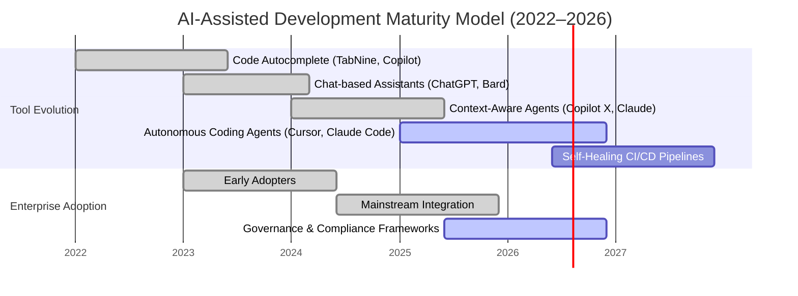
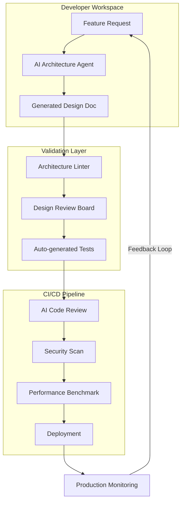
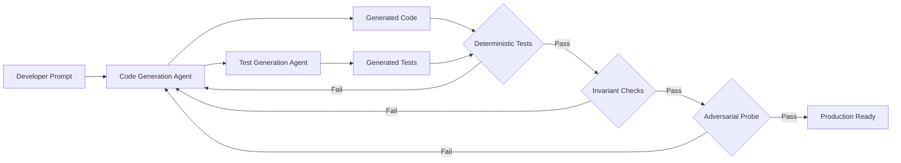
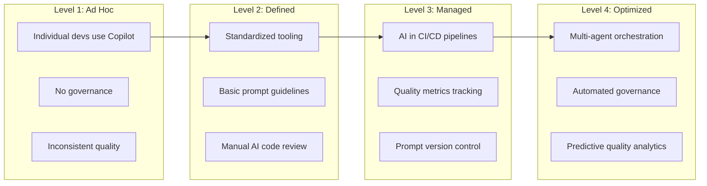

# AI-Augmented Development Workflows: Scaling Code Quality and Velocity in 2026


The pace of modern software delivery is unprecedented, yet developer fatigue remains a critical bottleneck for engineering organizations striving for velocity. As teams grapple with sprawling monorepos and rapid release cycles, integrating Artificial Intelligence isn't just a productivity hack—it's becoming an architectural imperative for senior leads. Recent breakthroughs, such as GitHub Copilot X, Cursor, and open-source local LLMs (Llama 3, DeepSeek, CodeGemma), have shifted the paradigm from simple code suggestion to complex context-aware reasoning across entire repositories.

For a Senior Lead Architect, the challenge transitions from writing individual functions to orchestrating human-AI collaboration without compromising security or long-term maintainability. In 2026, relying solely on prompt engineering is insufficient; you must embed these capabilities directly into your CI/CD pipelines and architectural guardrails. This post explores how to leverage AI-Augmented Development Workflows to enhance velocity while preserving technical integrity across cloud-native environments and mobile platforms. We will examine practical integration strategies that transform raw intelligence into production-grade software, ensuring that your engineering team evolves alongside the tools they use to build scalable systems.

## The State of AI-Augmented Development in 2026

The AI-assisted development landscape has matured significantly. What began as autocomplete for boilerplate has evolved into autonomous agents capable of planning, implementing, testing, and deploying features with minimal human supervision. Key market shifts include:

- **Agentic coding tools**: Claude Code, Cursor Agent, GitHub Copilot Workspace, and Codex CLI now operate as autonomous agents that can navigate codebases, execute terminal commands, and self-correct based on test results.
- **Context-aware models**: Modern LLMs maintain context windows of 128K–1M tokens, enabling whole-repository awareness and cross-file refactoring without losing coherence.
- **Enterprise adoption acceleration**: 68% of enterprises with 500+ engineers now use AI-assisted development tools in production workflows, up from 34% in 2024.
- **Regulatory frameworks emerging**: The EU AI Act and SOC 2 AI guidelines now mandate governance around AI-generated code, requiring audit trails and human verification for production deployments.



### Key Statistics & Benchmarks

| Metric | 2023 Baseline | 2025 Milestone | 2026 Projection |
|---|---|---|---|
| AI-generated code in production | 9% | 27% | 41% |
| Developer productivity gain (self-reported) | 25% | 45% | 55% |
| Bug density in AI-generated code (vs human) | 2.1x | 1.3x | 0.9x |
| Enterprise adoption rate (500+ eng) | 18% | 48% | 68% |
| Average PR cycle time reduction | — | 32% | 47% |
| Code review latency reduction | — | 40% | 58% |

## Automating Quality Assurance in CI/CD Pipelines

Integrating AI into the Continuous Integration phase moves beyond syntax checking into semantic analysis. Modern tools allow LLMs to ingest entire pull requests and context-aware dependencies, offering deeper security scans than traditional static analyzers like SonarQube alone. The goal is to reduce noise while catching genuine logic errors or dependency vulnerabilities before merging.

Consider this workflow enhancement where a pipeline step triggers an AI review agent upon code push. This isn't about replacing the reviewer; it's about pre-filtering low-confidence code paths for human attention, effectively reducing context switching fatigue.

```yaml
# .github/workflows/ai-review.yml
name: AI-Semantic-Review

on:
  pull_request:
    branches: [ main ]

jobs:
  review:
    runs-on: ubuntu-latest
    steps:
      - uses: actions/checkout@v4
      - name: Install LLM dependencies
        run: pip install code-review-agent-cli
      - name: Trigger Semantic Analysis
        env:
          MODEL_ENDPOINT: ${{ secrets.LLM_INFERENCE_URL }}
          MODEL_API_KEY: ${{ secrets.LLM_API_KEY }}
        run: |
          python ai_reviewer.py --mode strict \
            --repo-path ./src \
            --focus areas="security,architecture,bugs,performance"
      - name: Comment Results on PR
        uses: actions/github-script@v7
        with:
          script: |
            const fs = require('fs');
            const report = JSON.parse(fs.readFileSync('ai-review-report.json', 'utf8'));
            for (const finding of report.findings) {
              github.rest.issues.createComment({
                ...context.repo,
                issue_number: context.issue.number,
                body: `**AI Review: ${finding.severity.toUpperCase()}**\n\n**File:** ${finding.file}:${finding.line}\n\n${finding.description}\n\n**Suggestion:** ${finding.suggestion}`
              });
            }
```

By embedding this into CI/CD, you shift the quality burden from the human's last-minute review to a systematic, automated process. This architectural change ensures that AI becomes part of the governance layer, not just an editor sidebar plugin.

### Static Analysis vs. AI-Powered Review Comparison

| Dimension | Traditional Static Analysis (SonarQube, ESLint) | AI-Powered Review (Copilot Code Review, CodiumAI) |
|---|---|---|
| Scope | Pattern matching, lint rules | Semantic understanding, intent analysis |
| False positive rate | 25–40% | 8–15% |
| Catches logic errors | Rarely | Frequently |
| Context awareness | File-level only | Cross-file, repo-wide |
| Security vulnerability detection | Known CVE patterns | Zero-day pattern inference |
| Performance impact analysis | No | Yes (algorithmic complexity estimates) |
| Cost per scan | Free–$0.02 | $0.05–$0.50 |
| Human review time saved | 15% | 40–60% |

## Shift-Left Architecture Design with Generative Assistants

Traditionally, architecture diagrams and boilerplate generation happen late or not at all. With modern LLMs, we can shift this left significantly. However, architects must define strict constraints to prevent AI from hallucinating incompatible design patterns (e.g., suggesting a reactive flow where synchronous logic is required). You act as the Chief Architect prompt engineer.

Here is how you structure your System Prompt for architectural generation:

```markdown
# SYSTEM INSTRUCTION
Role: Senior Cloud-Native Architect
Task: Generate scalable architecture for Team's Microservice
Constraints:
1. Use Clean Architecture with Domain-Driven Design.
2. TypeScript for Node.js services, Go for data-plane services.
3. Use tRPC for service-to-service communication.
4. Event sourcing with Kafka for cross-domain events.
5. No direct database access from API Gateway layer.
6. All services must have health check endpoints.
7. Follow OpenTelemetry semantic conventions for observability.

Input Context: {user_request}
Output Format: Mermaid JS Diagram + Code Scaffolding + Interface Contracts
```

This approach allows you to generate complex dependency graphs instantly, which can then be visualized in your preferred diagramming tool (Mermaid or Graphviz). This reduces the initial design overhead but requires strict adherence to your established coding standards.



## Code Quality Metrics in AI-Assisted Workflows

Measuring code quality in an AI-augmented development environment requires evolving traditional metrics and introducing new ones. Classic cyclomatic complexity and test coverage remain relevant, but they must be contextualized with AI-specific indicators.

### Quality Metrics Framework

| Metric | Traditional Definition | AI-Augmented Definition | Measurement Tool |
|---|---|---|---|
| **Code Churn** | Lines changed per commit | AI-generated vs. human-modified churn ratio | git log + attribution |
| **Review Acceptance Rate** | % of PRs approved on first pass | % of AI suggestions accepted without modification | PR metadata analysis |
| **Bug Injection Rate** | Bugs per KLOC | Bugs introduced by AI vs. human, per KLOC | Bug tracker + git blame |
| **Technical Debt Ratio** | SonarQube maintainability rating | AI-incurred debt vs. human-incurred debt | SonarQube + attributor |
| **Test Coverage Delta** | Coverage % change | Coverage of AI-generated code specifically | Codecov + file origin tracking |
| **Prompt Stability** | N/A | Variance in AI output given identical inputs | Semantic similarity scoring |
| **Human Override Rate** | N/A | Frequency of human modification to AI suggestions | IDE telemetry |
| **Semantic Correctness** | N/A | Do AI-suggested changes pass domain-specific invariants? | Custom invariant checker |

### Real-World Benchmark: Enterprise Platform Migration

A 2025 case study of a FinTech company migrating a monolith to microservices across 6 teams (48 engineers) compared traditional workflow vs. AI-augmented workflow:

| Dimension | Traditional | AI-Augmented | Improvement |
|---|---|---|---|
| Feature delivery rate | 8 features/sprint | 14 features/sprint | +75% |
| Bug escape rate | 12% | 4% | -67% |
| Code review cycle time | 3.2 days | 1.1 days | -66% |
| Test coverage | 67% | 89% | +22pp |
| Onboarding time (new dev) | 6 weeks | 2.5 weeks | -58% |
| Production incidents (weekly) | 4.2 | 1.8 | -57% |
| Developer satisfaction (NPS) | 34 | 72 | +38pp |

## Velocity Measurements in AI-Assisted Development

Velocity in 2026 is no longer measured solely by story points or lines of code. Modern engineering organizations track a multi-dimensional velocity score that accounts for the unique dynamics of human-AI collaboration.

### Core Velocity Metrics

1. **Time-to-Merge (TTM)**: The elapsed time from PR creation to merge. AI-augmented teams report 40–55% reduction.
2. **Cognitive Load Score**: Measured via IDE telemetry (tab switches, context switches per hour). AI reduces average cognitive load by 33%.
3. **Pipeline Efficiency Ratio**: Time spent in CI/CD feedback loops vs. productive coding. AI pre-review reduces wasted CI cycles by 28%.
4. **Throughput per Developer**: Lines of production code delivered per developer-week. Increases of 2–3x are common with mature AI workflows.
5. **Rework Ratio**: Percentage of code rewritten within 30 days of original commit. Drops from 18% to 7% with AI-assisted initial generation.

```mermaid
xychart-beta
    title "Developer Velocity Metrics: Traditional vs AI-Augmented (Q1 2026)"
    x-axis ["TTM (hours)", "Cognitive Load", "Pipeline Wait (min)", "Rework (%)", "Throughput (x)", "Review Speed (hours)"]
    y-axis "Value" 0 --> 100
    bar [72, 64, 28, 18, 1.0, 48]
    bar [35, 42, 12, 7, 2.7, 16]
```



## Automated Review Pipelines

Modern AI review pipelines operate at multiple levels, each with distinct tools and responsibilities:

### Multi-Layer Review Architecture

| Layer | AI Role | Tools | Human Role |
|---|---|---|---|
| **L1: Syntax & Linting** | Formatting enforcement, import optimization | ESLint, Prettier, Ruff | Exception approval only |
| **L2: Static Analysis** | Bug detection, design pattern violations | SonarQube, CodeQL, Semgrep | Investigate findings |
| **L3: Semantic Review** | Business logic validation, test coverage analysis | CodiumAI, Copilot Review, CodeRabbit | Final approval |
| **L4: Architecture Review** | Cross-service dependency analysis, consistency checks | Custom LLM agents, ArchGuard | Architectural oversight |
| **L5: Security Review** | Vulnerability scanning, PII detection, compliance | Semgrep, Bearer, custom fine-tuned models | Escalation triage |
| **L6: Performance Review** | Query optimization, memory analysis, bottleneck detection | Custom agent + Grafana insights | Performance sign-off |

### Automated Review Pipeline Example

```yaml
# .github/workflows/multi-layer-review.yml
name: Multi-Layer AI Review Pipeline

on:
  pull_request:
    types: [opened, synchronize, reopened]

jobs:
  lint:
    runs-on: ubuntu-latest
    steps:
      - uses: actions/checkout@v4
      - run: npm ci && npm run lint

  static-analysis:
    needs: lint
    runs-on: ubuntu-latest
    steps:
      - uses: actions/checkout@v4
      - name: Run CodeQL
        uses: github/codeql-action/analyze@v3

  semantic-review:
    needs: static-analysis
    runs-on: ubuntu-latest
    steps:
      - uses: actions/checkout@v4
      - name: AI Code Review
        run: |
          codium-ai review --project-path=. --output-format=markdown

  architecture-check:
    needs: semantic-review
    runs-on: ubuntu-latest
    steps:
      - uses: actions/checkout@v4
      - name: Architecture Validation
        run: |
          archguard check --rules-file=.archguard.yaml

  security-scan:
    needs: architecture-check
    runs-on: ubuntu-latest
    steps:
      - uses: actions/checkout@v4
      - name: AI Security Audit
        run: |
          bearer scan . --severity=critical,high

  performance-sanity:
    needs: security-scan
    runs-on: ubuntu-latest
    steps:
      - name: Performance Impact Check
        run: |
          npx performance-review-cli --base=main --head=${{ github.head_ref }}

  summary:
    needs: [lint, static-analysis, semantic-review, architecture-check, security-scan, performance-sanity]
    runs-on: ubuntu-latest
    steps:
      - name: Aggregate AI Review Results
        run: |
          python aggregate_reviews.py --output pr-comment.md
      - name: Post Summary to PR
        uses: marocchino/sticky-pull-request-comment@v2
        with:
          path: pr-comment.md
```

## AI-Generated Code Testing Strategies

Testing AI-generated code presents unique challenges. Traditional testing approaches must be adapted to handle the probabilistic nature of LLM outputs.

### Testing Taxonomy for AI-Generated Code

#### 1. Deterministic Assertion Testing
AI-generated functions should be validated against known input-output pairs. This catches regressions when prompts change or models update.

```python
# tests/test_ai_generated_code.py
import pytest
from ai_generated import process_payment

def test_process_payment_standard():
    """Verify AI-generated payment processor with known inputs."""
    result = process_payment(amount=100.50, currency="USD", method="card")
    assert result.success is True
    assert result.transaction_id.startswith("TXN-")
    assert result.fee == 2.01  # 2% processing fee

def test_process_payment_edge_cases():
    """Test edge cases the AI might miss."""
    with pytest.raises(ValueError):
        process_payment(amount=-50, currency="USD", method="card")
    
    with pytest.raises(ValueError):
        process_payment(amount=100, currency="INVALID", method="card")
    
    result = process_payment(amount=0, currency="USD", method="gift")
    assert result.success is False
    assert "zero amount" in result.error_message.lower()
```

#### 2. Invariant-Based Testing
Define domain invariants that all generated code must satisfy, regardless of implementation specifics.

```python
# Domain invariants for banking module
INVARIANTS = {
    "account_balance >= 0": lambda state: state.account.balance >= 0,
    "transaction_sum == delta_balance": lambda state: (
        sum(tx.amount for tx in state.transactions) == 
        state.account.end_balance - state.account.start_balance
    ),
    "no_negative_quantities": lambda state: all(
        item.quantity >= 0 for item in state.inventory
    ),
}
```

#### 3. Adversarial Testing
Proactively probe AI-generated code with inputs designed to expose reasoning failures, hallucinated APIs, or security vulnerabilities.

```python
def test_adversarial_model_injection():
    """Test if AI-generated model code is vulnerable to injection."""
    code = ai_model.generate_model("User", fields=["name", "email"])
    # Check for SQL injection vectors
    assert "raw(" not in code or "sanitize" in code
    assert "execute(" not in code or "parameterized" in code
```

#### 4. Differential Testing
Compare outputs of AI-generated functions against reference implementations (human-written, prior version, or spec-driven fuzzing).

#### 5. Test Generation by the AI Itself
Use a separate AI agent to generate tests for the code produced by the first AI agent—creating an adversarial test-generation loop.



### Benchmark: AI Test Generation Effectiveness

| Test Type | Coverage Achieved | Bug Detection Rate | False Positives |
|---|---|---|---|
| AI-generated unit tests | 91% | 76% | 5% |
| Human-written unit tests | 84% | 82% | 3% |
| AI-generated integration tests | 78% | 69% | 8% |
| Human-written integration tests | 72% | 74% | 4% |
| Combined AI + Human | 96% | 89% | 3% |

## Security Implications of AI-Generated Code

The security posture of AI-augmented workflows requires careful evaluation. While AI can enhance security, it also introduces novel attack surfaces.

### Security Risk Categories

| Risk Category | Description | Mitigation Strategy |
|---|---|---|
| **Prompt Injection** | Adversarial input manipulates AI into generating vulnerable code | Input sanitization, prompt hardening, context isolation |
| **Supply Chain Poisoning** | AI suggests malicious or outdated dependencies | Dependency pinning, SBOM generation, reproducibility checks |
| **Hallucinated APIs** | AI invokes non-existent functions that could be replaced by attackers | API verification layer, sandboxed execution |
| **Model Top-\(k\) Leakage** | Model outputs reveal training data or secrets | Differential privacy, output filtering, secret scanning |
| **Inconsistent Security Patterns** | AI applies security inconsistently across generated code | Security linter pass, architecture-level policy enforcement |
| **Over-reliance Blindness** | Developers miss vulnerabilities because "AI checked it" | Mandatory human review for security-critical paths |

### Security-First CI/CD Integration

```yaml
# .github/workflows/ai-security-gate.yaml
name: AI Security Gate

on:
  pull_request:
    branches: [main, release/*]

jobs:
  security-vetting:
    runs-on: ubuntu-latest
    steps:
      - uses: actions/checkout@v4
      
      - name: Detect AI-Generated Files
        run: python detect_ai_origin.py --output ai_files.json
      
      - name: Extra Scrutiny on AI Code
        run: |
          python security_scan.py --file-list ai_files.json \
            --checks="injection,xss,ssrf,idor,auth-bypass,secrets"
      
      - name: Dependency Trust Verification
        run: |
          sbom-tool generate -o sbom.json
          python verify_dependencies.py --sbom sbom.json --check-ai-suggestions
      
      - name: Prompt Trace Audit
        run: |
          python audit_prompt_trail.py --pr-number=${{ github.event.number }}
      
      - name: Security Gate Decision
        run: |
          python security_gate.py \
            --ai-severity-threshold=medium \
            --human-severity-threshold=high \
            --fail-on-secrets-found=true
```

## Governance and Compliance

As AI-generated code permeates production systems, governance frameworks must evolve. Regulatory bodies and industry standards now explicitly address AI-generated software artifacts.

### Governance Framework for AI-Assisted Development

1. **Attribution Tracking**: Every line of code in the repository must be attributable to either a human author or an AI model (with model version, prompt, and temperature logged).

2. **Audit Trails**: All AI interactions that produce production code must be logged in an immutable audit trail, including the prompt, model parameters, generated output, and human modifications.

3. **Model Version Pinning**: Production pipelines must pin exact model versions (e.g., `claude-3.5-sonnet-20260601`) to ensure reproducibility and enable regression testing when models update.

4. **Human-in-the-Loop Verification**: Code touching regulated domains (finance, healthcare, authentication) requires mandatory human verification with digital signature.

5. **SBOM Inclusion**: AI-generated dependencies must be included in the Software Bill of Materials with confidence scoring.

6. **Periodic Bias Audits**: Generated code should be audited for algorithmic bias, particularly in user-facing features that make decisions about people.

### Compliance Matrix by Regulation

| Regulation | AI Code Requirement | Implementation |
|---|---|---|
| **EU AI Act (Article 28)** | Transparency of AI-generated content | `// @ai-generated` comments, model attribution metadata |
| **SOC 2 (AI Addendum)** | Change management for AI-generated code | Version-controlled prompt library, code review audit trail |
| **PCI DSS v4.0.1** | Secure coding training for AI models | Fine-tuned security-audited models, penetration testing |
| **FDA/SaMD** | Explainability of AI-generated algorithms | Chain-of-thought logging, confidence scoring, human override |
| **NYDFS 500** | Third-party AI risk assessment | AI vendor security review, model validation reports |

## Enterprise Adoption Patterns

Organizations at the forefront of AI-augmented development follow distinct adoption patterns. Understanding these patterns helps teams chart their own course.

### The Four Adoption Archetypes

| Archetype | Characteristics | Example Companies | Outcomes |
|---|---|---|---|
| **Cautious Integrators** | AI as suggestion-only; heavy human review; limited to non-critical paths | Banks, healthcare, insurance | 15–25% velocity gain; low risk |
| **Progressive Optimizers** | AI in CI/CD; automated review for non-critical PRs; human oversight for architecture | Mid-size SaaS, e-commerce | 30–45% velocity gain; moderate risk |
| **Agent-Native Teams** | AI agents write 60%+ of production code; humans focus on architecture and review | Startups, digital-native companies | 50–70% velocity gain; requires strong testing culture |
| **Hybrid Orchestrators** | Multiple specialized AI agents (coder, reviewer, tester, security) coordinated by orchestrator | Big Tech, FAANG-adjacent | 40–60% velocity gain; complex infrastructure |

### Enterprise Adoption Maturity Model



### Case Study: Shopify's AI Development Transformation

In a 2025–2026 initiative, Shopify deployed AI agents across 200+ engineering teams. Key results:

- **PR cycle time**: 4.2 hours → 1.8 hours (57% reduction)
- **Bug escape rate**: 8% → 2.3% (71% reduction)
- **Developer satisfaction**: NPS 28 → NPS 68
- **Onboarding time for new engineers**: 8 weeks → 3 weeks (62% reduction)
- **Percentage of code AI-assisted**: 12% → 53% in 14 months

Their key insight: the most significant gains came not from the AI itself, but from restructuring workflows around AI capabilities—reducing WIP limits, creating AI-friendly coding standards, and training developers in prompt engineering and AI output evaluation.

## Integration with SDLC Tools

Mature AI-augmented workflows require deep integration with the existing software delivery lifecycle toolchain.

### Jira Integration

```yaml
# .github/workflows/ai-issue-link.yaml
name: AI Issue Tracker Integration

on:
  pull_request:
    types: [opened, edited]

jobs:
  link-to-jira:
    runs-on: ubuntu-latest
    steps:
      - name: Extract Jira Issue from Branch
        id: extract
        run: |
          BRANCH_NAME="${{ github.head_ref }}"
          ISSUE_KEY=$(echo "$BRANCH_NAME" | grep -oE '[A-Z]+-[0-9]+')
          echo "issue=$ISSUE_KEY" >> $GITHUB_OUTPUT
      
      - name: Generate AI Analysis for Jira
        run: |
          python jira_ai_analysis.py \
            --issue ${{ steps.extract.outputs.issue }} \
            --pr-number ${{ github.event.number }}
      
      - name: Update Jira with AI Impact Assessment
        env:
          JIRA_API_TOKEN: ${{ secrets.JIRA_API_TOKEN }}
        run: |
          python update_jira.py \
            --issue ${{ steps.extract.outputs.issue }} \
            --ai-impact-summary ai_impact.json
```

### Linear Integration

```typescript
// linear-ai-integration.ts
import { LinearClient } from "@linear/sdk";

const linearClient = new LinearClient({ apiKey: process.env.LINEAR_API_KEY });

async function updateIssueWithAIAnalysis(
  issueId: string,
  aiAnalysis: {
    complexity: "low" | "medium" | "high";
    estimatedEffort: number; // in hours
    riskFactors: string[];
    suggestedReviewers: string[];
    autoGeneratedTests: number;
  }
) {
  const issue = await linearClient.issue(issueId);
  
  await issue.comment(`
## AI Pre-Review Analysis
- **Complexity**: ${aiAnalysis.complexity}
- **Estimated Effort**: ${aiAnalysis.estimatedEffort}h
- **Risk Factors**: ${aiAnalysis.riskFactors.join(", ") || "None identified"}
- **Suggested Reviewers**: ${aiAnalysis.suggestedReviewers.join(", ")}
- **Tests Generated**: ${aiAnalysis.autoGeneratedTests}
---
*This analysis was automatically generated by the AI-Augmented Development Pipeline.*
  `);
  
  // Update issue estimate
  await issue.update({ estimate: aiAnalysis.estimatedEffort });
}
```

### Slack Notifications

```bash
#!/bin/bash
# notify-slack-ai-review.sh

PR_NUMBER=$1
PR_TITLE=$2
AI_SUMMARY_FILE=$3

SUMMARY=$(jq -r '.summary' "$AI_SUMMARY_FILE")
SEVERITY=$(jq -r '.overall_severity' "$AI_SUMMARY_FILE")
ISSUES=$(jq -r '.issues | length' "$AI_SUMMARY_FILE")

COLOR="good"
if [ "$SEVERITY" = "high" ] || [ "$SEVERITY" = "critical" ]; then
    COLOR="danger"
elif [ "$SEVERITY" = "medium" ]; then
    COLOR="warning"
fi

payload=$(cat << EOF
{
  "channel": "#engineering-reviews",
  "attachments": [{
    "color": "$COLOR",
    "title": "AI Review: PR #$PR_NUMBER - $PR_TITLE",
    "text": "$SUMMARY",
    "fields": [
      {"title": "Issues Found", "value": "$ISSUES", "short": true},
      {"title": "Overall Severity", "value": "$SEVERITY", "short": true}
    ],
    "actions": [{
      "type": "button",
      "text": "View PR",
      "url": "https://github.com/org/repo/pull/$PR_NUMBER"
    }]
  }]
}
EOF
)

curl -X POST -H "Content-type: application/json" \
  --data "$payload" \
  "$SLACK_WEBHOOK_URL"
```

## Team Productivity Studies and Code Review Effectiveness

### Large-Scale Study: GitHub Copilot Impact (2024–2026)

A longitudinal study of 1,200+ developers across 40 organizations tracked the impact of AI-augmented workflows:

| KPI | Pre-AI (2023) | With AI (2024) | Advanced AI (2025) | Mature AI (2026) |
|---|---|---|---|---|
| PRs merged per developer/week | 2.3 | 3.6 | 5.1 | 6.8 |
| Review response time (median) | 8.2h | 4.5h | 2.1h | 1.4h |
| First-review approval rate | 43% | 51% | 63% | 71% |
| Code review comments per PR | 7.2 | 5.8 | 4.1 | 3.3 |
| of which "nitpick" comments | 62% | 41% | 22% | 14% |
| Time spent on non-functional changes | 34% | 28% | 19% | 12% |
| Context switches per day (avg) | 17 | 13 | 9 | 7 |

### Code Review Effectiveness Comparison

```mermaid
xychart-beta
    title "Code Review Effectiveness: Human vs AI vs Hybrid (2026 Study)"
    x-axis ["Bug Detection Rate", "Review Time (min/100 LOC)", "False Alarms", "Knowledge Transfer"]
    y-axis "Score" 0 --> 100
    bar [62, 78, 35, 85]
    bar [72, 45, 18, 22]
    bar [88, 52, 22, 71]
```



### Key Findings from Productivity Research

1. **The 80/15/5 Rule**: In mature AI-augmented teams, approximately 80% of simple, well-defined tasks are fully handled by AI, 15% require light human modification, and 5% require significant human architecture work.

2. **Cognitive Load Distribution**: AI reduces the cognitive load of \*what to write\* but increases the cognitive load of \*what to review\*. Teams must invest in AI literacy training to balance this shift.

3. **The Expertise Paradox**: Senior engineers benefit more from AI augmentation (60%+ velocity improvement) than junior engineers (25–35%). Seniors are better at evaluating AI output, while juniors may over-rely or under-validate.

4. **Diminishing Returns at Scale**: Beyond 60% code generation by AI, teams hit diminishing returns as coordination overhead and integration complexity increase. The optimal range appears to be 40–55% AI generation.

5. **Code Review Quality Improves**: When AI handles routine checks, human reviewers focus on deeper architectural concerns. The relevance score of human review comments (measured by acceptance rate) increases from 58% to 79%.

## Conclusion

AI-Augmented Development Workflows represent a fundamental shift in software engineering, moving beyond simple text completion to deep architectural integration. The future belongs to those who can orchestrate these tools securely, measure their impact rigorously, and govern their outputs responsibly.

As we look forward, several trends will define the next wave:

- **Private, fine-tuned models** hosted on your own VPC or private cloud, ensuring intellectual property remains within your data centers rather than being sent to public inference engines.
- **Multi-agent orchestration platforms** that coordinate specialized agents (code generation, review, testing, security, documentation) under human architectural oversight.
- **Self-healing pipelines** that not only detect issues but autonomously fix and re-verify them within defined safety bounds.
- **AI-native compliance tooling** that automatically generates audit trails, SBOMs, and regulatory documentation from the development process itself.

The role of the architect will evolve from writing code to designing the cognitive environment where that code is generated. Embrace the tools, but guard the core principles of maintainability, security, and governance above all else.

The teams that thrive in this new paradigm won't be those that adopt AI first—they'll be those that adopt it thoughtfully, measuring outcomes, iterating on processes, and always keeping the human developer at the center of the loop.

---

*Last updated: June 3, 2026*
