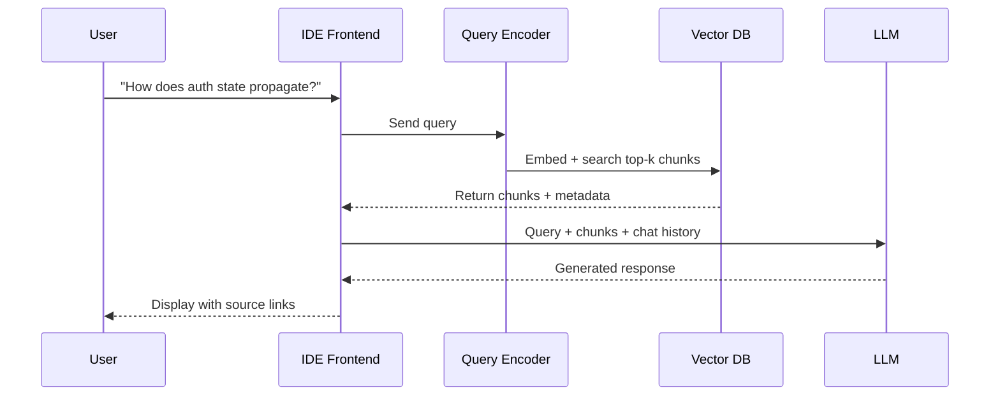

# AI-Native IDEs for Mobile Development: Flutter AI Features, Android Studio Integration

## The context problem nobody talks about

Most devs assume AI coding tools just "see your code." But when I started using AI-native IDEs for Flutter projects, I noticed something odd: the same prompt gave wildly different quality answers depending on how the project was indexed. The AI wasn't reading my files in real time. It was working from a pre-built representation, and that representation had gaps.

Here's what's actually happening under the hood.

## The mental model: a librarian, not a reader

Think of the AI in your IDE like a librarian who read your entire codebase once, took notes, and then answers questions from those notes alone. The AI doesn't re-read your source files when you ask it something. It queries an index.

For mobile projects, this matters more than you'd expect. Flutter projects have a specific structure: widget trees, pubspec dependencies, platform channels, generated files. Android projects have Gradle configs, manifest entries, resource directories. A generic code index treats all of this as flat text. AI-native IDEs for mobile build structure-aware indexes.

## How the index gets built

When you open a Flutter or Android project in an AI-native IDE, the indexing pipeline does three things:

1. **Parses the project graph** - resolves pubspec.yaml or build.gradle to understand dependencies and module boundaries
2. **Chunks source files** - splits code into overlapping segments, typically 200-500 tokens each, preserving function and class boundaries
3. **Embeds each chunk** - converts text into a vector using a model like text-embedding-3-small, storing vectors in a local database

```python
# Simplified view of chunking a Flutter widget
def chunk_file(source_code, max_tokens=300, overlap=50):
    tokens = tokenize(source_code)
    chunks = []
    for i in range(0, len(tokens), max_tokens - overlap):
        chunk = tokens[i:i + max_tokens]
        chunks.append({
            "text": detokenize(chunk),
            "file": "lib/home_screen.dart",
            "start_line": line_number(i),
            "end_line": line_number(i + max_tokens)
        })
    return chunks
```

The chunk carries metadata: file path, line range, and sometimes the symbol name. This metadata is what lets the IDE surface "where in the file" when the AI references code.

## What happens at runtime

You type: "How does auth state propagate from LoginScreen to HomeScreen?"

Here's the flow:



The query gets embedded using the same model that embedded the chunks. The vector database returns the top-k nearest chunks by cosine similarity. Those chunks get stuffed into the LLM's context window alongside your query and recent chat history.

The kicker: the LLM never sees your full file. It sees whatever fit in the retrieval window. If your auth logic spans 800 lines across three files, the index might only surface the most relevant 600 tokens.

## Where mobile-specific indexing breaks

I ran into three specific problems with Flutter