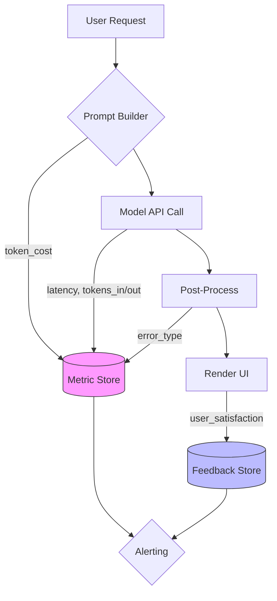

We shipped a chat interface to production. Users reported "the bot sometimes gives wrong answers." The error rate wasn't in the code — it was in the model's probabilistic nature. That's when we learned the hard way that LLM apps need observability, not just logging.

This explainer walks through the mechanics of monitoring and tracing LLM applications: what to measure, how to instrument, where failures hide, and why this matters for reliability.

## The mental model: treat tokens like transactions

Traditional apps fail when requests error or latency spikes. LLM apps "fail" differently — a request completes, but the output is hallucinated, verbose, or irrelevant. You can't just check HTTP status codes.

Think of an LLM call like a database transaction with extra steps:
1. **Prompt construction** — gather context, user input, system prompts
2. **Model invocation** — send to API (or local endpoint)
3. **Post-processing** — format output, call tools, render UI
4. **User experience** — stream tokens, display results

Each step has observable characteristics: token counts, latency, cost, error types, and output quality signals. You need to measure all of them.

Here's a high-level trace showing where metrics diverge from expectations:



The diagram shows three data stores: metrics (latency, cost, tokens), feedback (user satisfaction), and alerts. You need both automated signals and human-in-the-loop quality checks.

## What to measure

Start with these core metrics for every LLM endpoint:

**Latency breakdown** — split the call into segments:
- Prompt preparation time
- Network latency to API
- Model inference time (from API response headers if available)
- Output parsing/rendering time

```python
# LangChain instrumentation example
from langchain_core.callbacks import BaseCallbackHandler
from datetime import datetime
import time

class LLMTracer(BaseCallbackHandler):
    def on_llm_start(self, serialized, prompts, **kwargs):
        self.start_time = time.time()
        
    def on_llm_end(self, response, **kwargs):
        latency_ms = (time.time() - self.start_time) * 1000
        tokens_in = sum(len(p) for p in prompts) if prompts else 0
        tokens_out = len(response.generations[0][0].text) if hasattr(response, 'generations') else 0
        
        # Send to your metrics store (Prometheus, Datadog, etc.)
        metrics.put("llm.latency_ms", latency_ms)
        metrics.put("llm.tokens_in", tokens_in)
        metrics.put("llm.tokens_out", tokens_out)
```

**Cost tracking** — multiply tokens by model pricing:
- Input token cost = `tokens_in × price_per_input_token`
- Output token cost = `tokens_out × price_per_output_token`
- Total = input + output

Track costs per user, per endpoint, and aggregate daily to spot budget overruns.

**Error taxonomy** — LLM errors don't always fail fast:
- **Timeouts** — model didn't respond in SLA window
- **Rate limits** — API rejected due to quota
- **Context overflow** — prompt exceeded token limit
- **Quality failures** — output doesn't match expectations (hallucinations, verbosity)

Use semantic tagging on responses. If the output mentions things that shouldn't be there (wrong company names, fabricated data), flag it as a quality error, not a system error.

**Output quality signals** — measure these proactively:
- **Repetition rate** — percentage of tokens repeated in sliding window
- **Top-p sampling** — values near 1 indicate model was too confident or unconfident
- **Tool call correctness** — if using function calling, check arguments match schema

```python
# Quality scoring example
def calculate_quality_score(response_text):
    # Simple repetition detection
    tokens = response_text.split()
    ngrams = [tuple(tokens[i:i+3]) for i in range(len(tokens)-2)]
    seen = set()
    repeats = sum(1 for ngram in ngrams if ngram in seen or seen.add(ngram))
    
    # Penalize repetition heavily
    quality = 100 - (repeats / max(len(tokens), 1) * 100)
    return max(0, min(100, quality))
```

## Instrumentation patterns

You need to trace calls end-to-end. LangChain's built-in callbacks help, but you also need custom hooks around your business logic.

**Wrap your orchestrators** — if you have a chain or agent orchestration layer, add tracing there:

```python
from opentelemetry import trace

tracer = trace.get_tracer("llm-app")

@tracer.start_as_current_span("chain.execute", attributes={"step": "orchestrate"})
def execute_chain(user_input):
    # Build prompt
    prompt = build_prompt(user_input)
    
    # Instrument model call
    with tracer.start_as_current_span("model.invoke"):
        response = llm.invoke(prompt)
    
    # Post-process
    result = post_process(response)
    return result

# Log errors with full context
def chain_on_chain_error(error, **kwargs):
    print(f"Chain error: {error}")
    # Enrich error with step name from parent span
```

**Custom event logging** — log events that happen between calls:
- Tool selection (which tool was chosen for the task)
- Context window size used (how many documents were retrieved)
- Retry attempts (which caused latency spikes)

```python
# Event logging middleware
def log_event(event_type, payload):
    logger.info(f"{event_type}", extra={
        "step": get_current_step(),  # From tracer span
        "cost_estimate": estimate_cost(payload),
        "latency_so_far": get_elapsed_time()
    })

# Usage in chain
log_event("tool.selected", {"name": "search_db", "query": user_input})
```

**Token usage tracing** — capture token counts at every hop:
- Input prompt length
- Retrieved context size (from RAG)
- Output length
- Cumulative total for billing

## Where failures hide

LLM apps have three failure modes you must catch:

### Silent degradation

The model runs, returns JSON, but the values are wrong. Example: your app fetches user profile data and stores it in a variable, then uses that variable to personalize the response. If the API returns `null`, your code might skip the personalization step without logging anything. The result is a generic answer instead of a personalized one — which users interpret as "broken" but logs show no errors.

**Fix:** Add validation steps between API calls and data usage:
- Check for null/empty responses before using them
- Log when you skip optional features
- Track fallback rates

```python
def fetch_user_profile(user_id):
    try:
        profile = api.get_profile(user_id)
        if not profile.get("preferences"):
            logger.warn(f"User {user_id} has no preferences; using defaults")
            return default_profile()
        return profile
    except APIError as e:
        # Log with context for observability
        logger.error(f"Failed to fetch profile for {user_id}", extra={
            "error": str(e),
            "fallback_triggered": True
        })
        return default_profile()
```

### Context collapse

Your RAG pipeline retrieved 5 documents, but the model only read the first one because context is too large. The user asks a question about accounting, and the model answers with marketing copy from a different document. No error occurred — just wrong information.

**Fix:** Implement context monitoring:
- Track total tokens in prompt vs. token limit
- Flag when you're over 80% of max context
- Log which documents were actually used (if metadata is available)

```python
def monitor_context(prompt_tokens, context_docs):
    max_tokens = model_max_tokens()
    usage_pct = prompt_tokens / max_tokens
    
    if usage_pct > 0.8:
        logger.warn(f"Context at {usage_pct*100:.1f}% of limit")
        # Suggest truncation or summarization
        return True, "truncate recommended"
    
    return False, None
```

### Tool calling drift

Your model learned to call a function that no longer exists. The API rejects the call with a 404, but you didn't instrument tool schemas properly, so you just caught an HTTP error instead of logging which tool failed. Users see blank screens or timeout messages instead of "we couldn't complete this action."

**Fix:** Validate tool schemas before model invocation:
- Maintain a registry of available tools
- Check that function names and signatures haven't changed
- Log when the model tries to call deprecated functions

```python
AVAILABLE_TOOLS = {
    "search_products": {"version": "2.0"},
    "get_user_profile": {"version": "1.5"},
}

def validate_tool_call(tool_name, tool_args):
    if tool_name not in AVAILABLE_TOOLS:
        return False, f"Unknown tool: {tool_name}"
    
    # Check version compatibility
    actual_version = AVAILABLE_TOOLS[tool_name]["version"]
    expected_version = get_expected_version(tool_name)
    
    if actual_version != expected_version:
        logger.error(f"Tool version mismatch for {tool_name}")
        return False, f"Expected {expected_version}, got {actual_version}"
    
    return True, None
```

## Why this matters

Without observability, you're flying blind. You ship features that degrade silently. Users report problems, but your logs only show "HTTP 200" responses because the model API never errored — it just produced bad output.

With observability:
1. **You catch regressions early** — new prompts or tools trigger quality drops you can detect before users do
2. **You optimize costs** — find endpoints that burn tokens without adding value
3. **You build trust** — transparent error messages like "our model is still learning; here's what we think you meant" instead of blank screens
4. **You iterate safely** — A/B test prompts, measure quality deltas, ship with confidence

## Pitfalls to avoid

**Don't just log raw responses** — a 2000-token response in every log line floods storage and misses the point. Log metadata (token counts, latency) and sample full responses only for errors or quality issues.

**Don't ignore cost metrics** — if your model call takes 5 seconds but you don't track it, you'll overspend during peak traffic without noticing.

**Don't treat all timeouts the same** — a 10-second timeout on a simple chatbot is different from a 60-second timeout during complex tool chains. Set per-endpoint thresholds.

## Closing recap

- **Instrument every LLM call** — latency, tokens, cost, error type
- **Add quality signals** — repetition rate, null checks, tool validation
- **Trace end-to-end** — from user input to rendered output
- **Monitor context usage** — prevent silent truncation
- **Validate tools** — catch schema drift before users notice

LLM apps need observability. Treat them like transactional systems: every request has a budget (cost), a deadline (latency), and a quality requirement (output correctness). Build metrics that tell you when any of those break, and you'll ship reliably.

---

**Further reading:**
- LangSmith documentation for production-ready tracing
- Deepchecks for automated LLM eval pipelines  
- Arize Phoenix for visualization of model outputs
