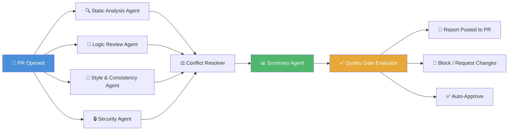
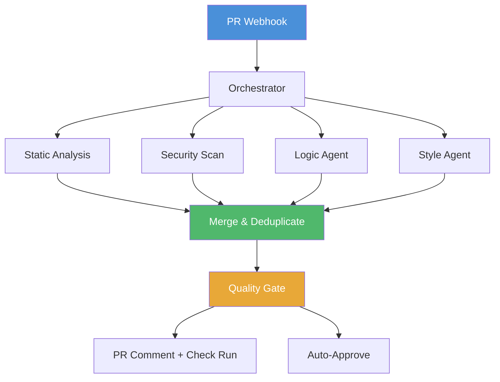
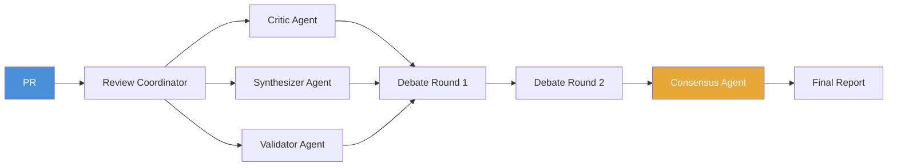
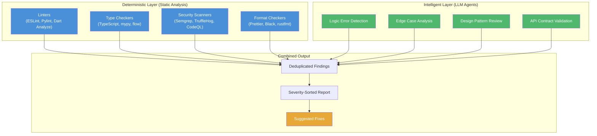
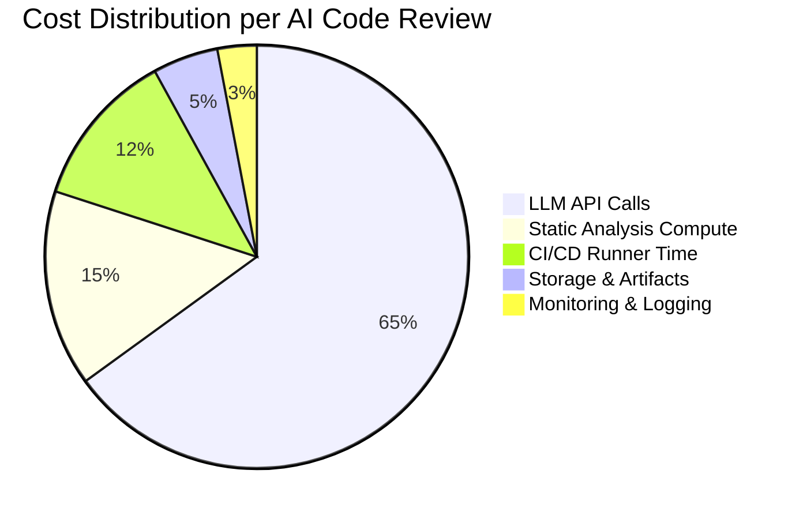
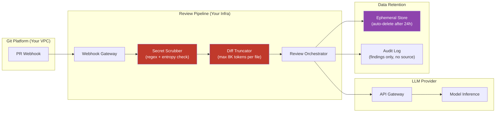
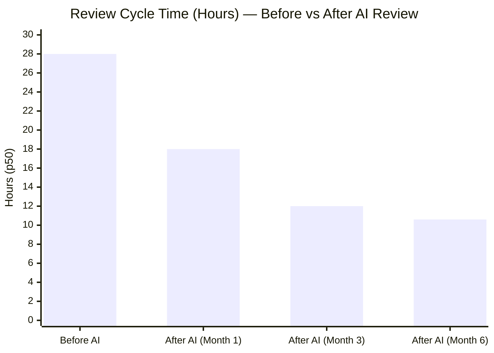
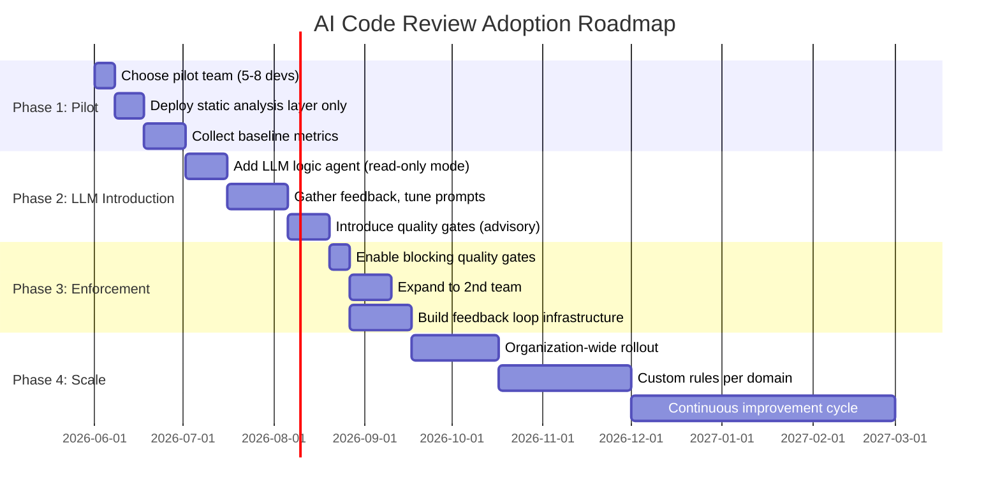

# AI-Powered Code Review: Automating Quality Gates with LLM Agents

Code review remains the most critical — and most bottlenecked — quality gate in the software development lifecycle. Senior engineers spend 6–8 hours per week reviewing pull requests. Studies show human reviewers catch only 35–65% of defects, and the average PR sits open for 28+ hours awaiting review. The gap between the ideal of rigorous peer review and the reality of rushed, inconsistent approvals is enormous.

AI-powered code review bridges that gap. By combining large language model (LLM) agents with deterministic static analysis tools, we can automate the mechanical aspects of review while freeing human experts to focus on architecture, design trade-offs, and business logic. This post is a comprehensive guide to designing, implementing, and scaling AI code review pipelines — covering architecture patterns, LLM agent selection, quality gate enforcement, CI/CD integration, cost optimization, security, and real-world adoption strategies.

---

## AI Code Review Architecture: The Multi-Agent Pipeline

The core insight behind effective AI code review is that **a single LLM call produces shallow feedback**. A multi-agent pipeline, where each agent specializes in one aspect of review, produces thorough, structured, and actionable results. These agents operate in a directed acyclic graph (DAG), with each stage feeding structured findings to the next.



### Agent Responsibilities

| Agent | Tool / Model | Scope | Output |
|-------|-------------|-------|--------|
| **Static Analysis Agent** | ESLint, Pylint, Dart Analyzer, Semgrep | Deterministic issues (syntax, imports, null safety) | `AnalysisFinding[]` with severity levels |
| **Logic Review Agent** | GPT-4o, Claude 3.5 Sonnet, Gemini 2.0 | Semantic correctness, edge cases, concurrency | `Finding[]` with code references + suggestions |
| **Style & Consistency Agent** | LLM + project style guide embeddings | Naming conventions, architectural patterns | `StyleFinding[]` with rule references |
| **Security Agent** | Semgrep, TruffleHog + LLM augmentation | Secrets, injection, OWASP Top 10 patterns | `SecurityFinding[]` with CVSS-like severity |
| **Conflict Resolver** | Deterministic deduplication + priority merge | Overlapping or contradicting findings | Merged, deduplicated `Finding[]` |
| **Summary Agent** | GPT-4o-mini / Claude Haiku | Human-readable report generation | Structured markdown + PR comment |
| **Quality Gate Evaluator** | Policy-as-code engine | Pass/fail decision based on thresholds | `gate: pass | fail | review_needed` |

### Processing Flow

1. **PR event triggers** the pipeline via webhook or polling
2. **All leaf agents run in parallel** for maximum throughput
3. **Conflict resolver** merges results, removes duplicates, resolves contradictions (e.g., agent A flags a pattern as "dangerous" while agent B says "intentional per project config")
4. **Summary agent** produces a human-readable report with severity breakdown
5. **Quality gate evaluator** applies policy rules — if critical count > 0, block the PR; if only minors, auto-approve with informational comments
6. **Report is posted** as a PR check run or comment with inline annotations

---

## LLM Agents for Code Review: A Head-to-Head Comparison

Choosing the right LLM for your review pipeline depends on latency budget, cost sensitivity, code context window requirements, and the programming languages you use. Here is a detailed comparison of the four most capable models for code review as of mid-2026.

| Criterion | Claude 3.5 Sonnet / Opus | GPT-4o / GPT-4o-mini | Codex (o3 / GPT-4.1) | Gemini 2.0 Pro / Flash |
|-----------|--------------------------|---------------------|----------------------|------------------------|
| **Context Window** | 200K tokens | 128K tokens | 128K–200K tokens | 1M tokens (Pro), 256K (Flash) |
| **Code Quality** | ⭐⭐⭐⭐⭐ Best for nuanced logic reasoning | ⭐⭐⭐⭐ Excellent, strong on Python/TS | ⭐⭐⭐⭐⭐ Best for code generation & diff analysis | ⭐⭐⭐⭐ Very good for large repos |
| **Structured Output** | Native JSON mode + tool use | JSON mode + function calling | JSON mode + function calling | Schema-guided JSON |
| **Latency (p50)** | 1.2–2.5 s (Sonnet), 3–5 s (Opus) | 0.8–1.5 s (4o-mini), 1.5–3 s (4o) | 1–3 s | 1.5–4 s (Pro), 0.6–1.5 s (Flash) |
| **Cost per 1K reviews** | ~$12–$25 (Sonnet) | ~$8–$18 (4o) / ~$1.50 (4o-mini) | ~$10–$20 | ~$5–$12 (Flash) / ~$15–$30 (Pro) |
| **False Positive Rate** | ~8–12% | ~10–15% | ~9–14% | ~12–18% |
| **Multi-file Review** | Excellent — can analyze full repo structure | Good — handles diff context well | Very Good — trained on code diffs | Very Good — huge context allows full file analysis |
| **Best For** | Architectural review, complex logic | Fast iteration, cost-sensitive teams | Code-gen heavy PRs, refactoring | Large monorepos, documentation |
| **Language Support** | 50+ languages, excellent for Rust/Go/Python | 30+ languages, excellent for Python/TS/Java | 40+ languages, strong for Python/TS/Go | 40+ languages, strong for Python/JS |

### When to Use Which Model

- **GPT-4o-mini** is the workhorse for high-volume, cost-sensitive review pipelines. Use it for the Summary Agent and Style Agent where latency matters more than depth.
- **Claude 3.5 Sonnet** is the best choice for the Logic Review Agent when reviewing complex business logic, architectural changes, or concurrent code. Its nuanced reasoning produces fewer false positives.
- **Gemini 2.0 Flash** shines when you need to review massive PRs with hundreds of files — its 1M token context window lets it see the entire codebase in one shot.
- **Codex (o3)** is ideal for refactoring reviews where the model needs to understand code transformation patterns and suggest equivalent implementations.

### Hybrid Routing Strategy

A production pipeline should route review requests to different models based on complexity:

```typescript
// src/routing/reviewRouter.ts
interface ReviewRequest {
  prId: string;
  changedFiles: ChangedFile[];
  totalChanges: number;
  complexity: 'low' | 'medium' | 'high';
}

function selectModel(request: ReviewRequest): ModelConfig {
  const isSimple = request.complexity === 'low' && request.totalChanges < 50;
  const isLarge = request.totalChanges > 200 || request.changedFiles.length > 30;
  const isComplex = request.complexity === 'high' || request.totalChanges > 100;

  if (isSimple) {
    return { model: 'gpt-4o-mini', maxTokens: 2048, costPerCall: 0.00015 };
  }
  if (isComplex) {
    return { model: 'claude-3.5-sonnet', maxTokens: 8192, costPerCall: 0.003 };
  }
  if (isLarge) {
    return { model: 'gemini-2.0-flash', maxTokens: 16384, costPerCall: 0.0004 };
  }
  // Medium complexity, moderate size
  return { model: 'gpt-4o', maxTokens: 4096, costPerCall: 0.0025 };
}
```

This routing strategy alone can reduce overall pipeline costs by **40–60%** while maintaining or improving review quality.

---

## Review Pipeline Design Patterns

Beyond the basic multi-agent architecture, several design patterns have emerged for organizing AI code review pipelines. Each pattern suits different team structures, codebase sizes, and risk tolerances.

### Pattern 1: Sequential Pipeline (Simple)

Best for small teams or projects where reviews are low-volume and low-risk.


- **Pros**: Simple to implement, predictable cost, easy to debug
- **Cons**: No parallel execution, longer total latency
- **When to use**: Teams < 10, PR volume < 20/week, non-critical services

### Pattern 2: Parallel Agent Pipeline (Scalable)

Best for high-volume teams that need fast feedback and can invest in infrastructure.



- **Pros**: Fast (all agents run simultaneously), scalable horizontally
- **Cons**: Requires conflict resolution, more complex observability
- **When to use**: Teams 10–50, PR volume 50–200/week, production-critical

### Pattern 3: Tiered Quality Gate Pipeline (Enterprise)

Best for regulated environments or large enterprises where different change types have different risk profiles.

| Tier | Change Type | Gates Required | Human Review |
|------|------------|----------------|--------------|
| 🟢 **Tier 3 (Low Risk)** | Documentation, config, tests only | Static analysis + style check | Optional |
| 🟡 **Tier 2 (Medium Risk)** | Feature work, bug fixes | Static analysis + LLM logic + security | Required for major findings |
| 🔴 **Tier 1 (High Risk)** | Auth, payments, data pipeline, infra | Full pipeline + manual review by 2 seniors | Mandatory |

```yaml
# quality-gates/tiered-policy.yaml
quality_gates:
  tier_3_low_risk:
    triggers:
      changed_files: ["*.md", "*.yml", "*_test.go", "*.spec.ts"]
    required_agents: ["static_analysis", "style"]
    auto_approve: true
    block_on: []
    
  tier_2_medium_risk:
    triggers:
      changed_files_exclude: ["#tier_3_low_risk.triggers.changed_files"]
      changed_lines: 1..500
    required_agents: ["static_analysis", "logic_review", "security"]
    auto_approve: false
    block_on: ["critical", "major"]
    
  tier_1_high_risk:
    triggers:
      paths: ["src/auth/", "src/payments/", "infra/", "deployment/"]
      changed_lines: 0..INF
    required_agents: ["static_analysis", "logic_review", "security", "architecture"]
    auto_approve: false
    block_on: ["critical", "major", "minor"]
    require_human_reviewers: 2
```

- **Pros**: Granular risk control, efficient resource use
- **Cons**: Complex configuration, requires path-based routing
- **When to use**: Enterprises, regulated industries, platforms with varying risk domains

### Pattern 4: Agentic Swarm (Experimental)

Best for organizations exploring cutting-edge multi-agent collaboration.



Agents critique each other's findings in iterative debate rounds, producing higher-quality reviews at the cost of 2–3x more LLM calls. Early results from research teams show **~20% higher defect detection** compared to single-pass pipelines, but with **~3x latency and cost**.

---

## Static Analysis + AI Review: The Hybrid Approach

The most effective AI code review pipelines are **hybrid** — they combine deterministic static analysis tools with LLM-based semantic review. Each layer covers gaps in the other.



### What Static Analysis Catches Best

Static analysis tools are **deterministic, fast, and cheap**. They should always run *before* LLM agents to reduce noise:

| Category | Tool | Issue Types | Cost per PR |
|----------|------|-------------|-------------|
| Linting | ESLint, Pylint, RuboCop | Unused imports, variable shadowing, style violations | ~$0.001 |
| Type Checking | TypeScript, mypy, Flow | Type mismatches, null safety violations | ~$0.001 |
| Security | Semgrep, CodeQL, TruffleHog | Hardcoded secrets, SQL injection, XSS | ~$0.005 |
| Formatting | Prettier, Black, rustfmt | Inconsistent formatting, trailing whitespace | ~$0.000 |

### What LLM Agents Catch Best

LLMs excel at **semantic understanding** — things that require reasoning:

- **Missing edge cases**: "This function assumes the list is non-empty but doesn't check for the empty case"
- **Concurrency bugs**: "The shared state `userCache` is accessed without a lock on line 142"
- **API contract violations**: "The method returns `Future<void>` but callers expect the widget to be rebuilt"
- **Performance regressions**: "This nested loop has O(n²) complexity; consider using a hash map"
- **Architectural drift**: "This component bypasses the repository layer and directly calls the data source"
- **Test coverage gaps**: "The new branch on line 89 has no corresponding test case"

### The Hybrid Pipeline in Practice

```python
# src/pipeline/hybrid_review.py
class HybridReviewPipeline:
    def __init__(self, static_tools: list[StaticTool], llm_agent: LLMAgent):
        self.static_tools = static_tools
        self.llm_agent = llm_agent
        self.feedback_store = FeedbackStore()

    async def review(self, pr: PullRequest) -> ReviewReport:
        # Phase 1: Static analysis (parallel, deterministic)
        static_findings = []
        async with asyncio.TaskGroup() as tg:
            tasks = [tg.create_task(tool.run(pr)) for tool in self.static_tools]
        for task in tasks:
            static_findings.extend(task.result())

        # Phase 2: Suppress known false positives from feedback store
        filtered_static = [
            f for f in static_findings
            if not self.feedback_store.should_suppress(pr.project_id, f)
        ]

        # Phase 3: LLM review (only on changes not caught by static analysis)
        llm_findings = await self.llm_agent.review(pr)

        # Phase 4: Merge and deduplicate
        merged = self.merge_findings(filtered_static, llm_findings)

        # Phase 5: Quality gate evaluation
        gate_result = self.evaluate_gates(merged)

        return ReviewReport(findings=merged, gate=gate_result)
```

This hybrid approach reduces LLM costs by **35–50%** because simpler issues are filtered out before they reach the expensive model.

---

## Quality Gates: Definition, Thresholds, and Enforcement

Quality gates are the policy layer that determines whether a PR passes, needs discussion, or is blocked. They codify your team's definition of "done" and "safe."

### Gate Definition Schema

```yaml
# gates/review-quality-gates.yaml
version: "2.0"
gates:
  - name: "no_critical_defects"
    description: "No critical-severity findings allowed"
    severity: "blocker"
    rule: "count(critical) == 0"
    auto_approve: false
    
  - name: "major_defect_threshold"
    description: "Fewer than 3 major findings"
    severity: "blocker"
    rule: "count(major) <= 2"
    auto_approve: false
    
  - name: "minor_info_tolerance"
    description: "Minor and info findings are advisory only"
    severity: "warning"
    rule: "true"  # Always passes, but findings are posted
    auto_approve: true
    
  - name: "test_coverage_check"
    description: "New code must have >= 80% test coverage"
    severity: "blocker"
    rule: "coverage_delta >= 0.80"
    auto_approve: false
    
  - name: "security_compliance"
    description: "No OWASP Top 10 violations in changed code"
    severity: "blocker"
    rule: "security_violations == 0"
    auto_approve: false
    
  - name: "no_secrets_exposure"
    description: "No hardcoded credentials or API keys"
    severity: "blocker"
    rule: "secrets_found == 0"
    auto_approve: false
```

### Enforcement in CI/CD

The gate evaluator runs after all agents complete and determines the PR check status:

```python
# src/gates/evaluator.py
from enum import Enum

class GateVerdict(Enum):
    PASS = "pass"
    BLOCK = "block"
    REVIEW_NEEDED = "review_needed"

class QualityGateEvaluator:
    def __init__(self, gates: list[QualityGate]):
        self.gates = gates

    async def evaluate(self, report: ReviewReport) -> GateVerdict:
        for gate in self.gates:
            result = await gate.evaluate(report)
            if gate.severity == "blocker" and not result.passed:
                return GateVerdict.BLOCK
            if gate.severity == "warning" and not result.passed:
                return GateVerdict.REVIEW_NEEDED
        return GateVerdict.PASS

    async def post_check_run(self, pr: PullRequest, verdict: GateVerdict):
        status = {
            GateVerdict.PASS: "success",
            GateVerdict.BLOCK: "failure",
            GateVerdict.REVIEW_NEEDED: "neutral",
        }[verdict]
        await pr.create_check_run(
            name="AI Code Review Quality Gates",
            status="completed",
            conclusion=status,
            output={
                "title": f"Quality Gates: {verdict.value}",
                "summary": self._generate_summary(verdict),
            }
        )
```

### Quality Gate Maturity Model

| Level | Name | Gates | Automation | Human Review |
|-------|------|-------|------------|--------------|
| **L1** | Baseline | Linting + no secrets | Auto-comment only | Always required |
| **L2** | Guarded | L1 + no critical/major defects | Auto-block on critical | Required for medium+ risk |
| **L3** | Automated | L2 + test coverage, style compliance | Auto-approve for low risk | Required for high risk |
| **L4** | Autonomous | L3 + architecture drift detection | Auto-approve for medium risk | By exception only |
| **L5** | Predictive | L4 + historical regression prediction | Full auto for known patterns | Architecture-only |

Most teams should target **L3** within the first quarter of adoption, then evaluate whether L4/L5 make sense for their risk profile.

---

## PR Integration: GitHub, GitLab, and Bitbucket

The pipeline is only useful if it integrates seamlessly into existing developer workflows. Here are concrete implementations for each major platform.

### GitHub Integration

GitHub Actions is the most natural integration point. The pipeline runs as a workflow that posts check runs and inline comments.

```yaml
# .github/workflows/ai-code-review.yml
name: AI Code Review Pipeline
on:
  pull_request:
    types: [opened, synchronize, ready_for_review]
  pull_request_review:
    types: [submitted]  # Re-run when human requests changes

concurrency:
  group: ai-review-${{ github.event.pull_request.number }}
  cancel-in-progress: true

env:
  AI_REVIEW_MODEL: claude-3.5-sonnet
  AI_REVIEW_CONFIDENCE: 0.7
  QUALITY_GATES_CONFIG: gates/review-quality-gates.yaml

jobs:
  static-analysis:
    runs-on: ubuntu-latest
    steps:
      - uses: actions/checkout@v4
      - name: Run ESLint
        run: npx eslint . --format json --output-file eslint-report.json
      - name: Run Semgrep SAST
        uses: semgrep/semgrep-action@v1
        with:
          config: p/default
      - uses: actions/upload-artifact@v4
        with:
          name: static-analysis-reports
          path: |
            eslint-report.json
            semgrep-results.json

  ai-logic-review:
    runs-on: ubuntu-latest
    needs: static-analysis
    steps:
      - uses: actions/checkout@v4
      - name: AI Code Review with LLM
        uses: your-org/ai-review-action@v2
        with:
          provider: anthropic
          model: ${{ env.AI_REVIEW_MODEL }}
          api-key: ${{ secrets.ANTHROPIC_API_KEY }}
          confidence-threshold: ${{ env.AI_REVIEW_CONFIDENCE }}
          gates-config: ${{ env.QUALITY_GATES_CONFIG }}
          include-summary: true
          post-inline-comments: true
      - name: Upload Review Report
        uses: actions/upload-artifact@v4
        with:
          name: ai-review-report
          path: ai-review-report.json

  quality-gate:
    runs-on: ubuntu-latest
    needs: [static-analysis, ai-logic-review]
    if: always()
    steps:
      - uses: actions/download-artifact@v4
      - name: Evaluate Quality Gates
        run: |
          evaluate-gates \
            --static eslint-report.json semgrep-results.json \
            --ai ai-review-report.json \
            --config ${{ env.QUALITY_GATES_CONFIG }} \
            --output gate-result.json
      - name: Post Check Run
        uses: ваш-org/github-check-run@v1
        with:
          conclusion: ${{ fromJSON(gate-result.json).conclusion }}
          output: ${{ toJSON(gate-result.json).output }}

  auto-approve:
    runs-on: ubuntu-latest
    needs: quality-gate
    if: success() && fromJSON(needs.quality-gate.outputs.conclusion) == 'success'
    steps:
      - uses: hmarr/auto-approve-action@v4
        with:
          github-token: ${{ secrets.GITHUB_TOKEN }}
```

### GitLab Integration

GitLab uses CI/CD pipelines with merge request annotations.

```yaml
# .gitlab-ci.yml
stages:
  - static-analysis
  - ai-review
  - quality-gate
  - merge-check

variables:
  AI_REVIEW_PROVIDER: openai
  AI_REVIEW_MODEL: gpt-4o
  AI_REVIEW_CONFIDENCE: 0.7

static-analysis:
  stage: static-analysis
  script:
    - npm run lint -- --format json --output-file eslint-report.json
    - semgrep --config=auto --json --output=semgrep-results.json
  artifacts:
    paths:
      - eslint-report.json
      - semgrep-results.json

ai-logic-review:
  stage: ai-review
  script:
    - ai-review-ci review
      --provider $AI_REVIEW_PROVIDER
      --model $AI_REVIEW_MODEL
      --api-key $AI_REVIEW_API_KEY
      --confidence $AI_REVIEW_CONFIDENCE
      --diff "$CI_MERGE_REQUEST_DIFF"
  artifacts:
    paths:
      - ai-review-report.json

quality-gate:
  stage: quality-gate
  script:
    - evaluate-gates
      --static eslint-report.json semgrep-results.json
      --ai ai-review-report.json
      --config gates/review-quality-gates.yaml
      --output gate-result.json
  artifacts:
    paths:
      - gate-result.json

merge-check:
  stage: merge-check
  script:
    - |
      CONCLUSION=$(jq -r '.conclusion' gate-result.json)
      if [ "$CONCLUSION" = "failure" ]; then
        echo "Quality gates failed. Merge blocked."
        exit 1
      fi
      echo "All quality gates passed. Ready for merge."
```

### Bitbucket Integration

Bitbucket Pipelines with code insight reports for inline annotations.

```yaml
# bitbucket-pipelines.yml
pipelines:
  pull-requests:
    '**':
      - step:
          name: AI Code Review
          script:
            - npm run lint -- --format json --output-file eslint-report.json
            - semgrep --config=auto --json --output=semgrep-results.json
            - ai-review-ci review
              --provider anthropic
              --model claude-3.5-sonnet
              --api-key $ANTHROPIC_API_KEY
              --diff $BITBUCKET_PR_DIFF
              --report ai-review-report.json
            - evaluate-gates
              --static eslint-report.json semgrep-results.json
              --ai ai-review-report.json
              --config gates/review-quality-gates.yaml
              --output gate-result.json
          artifacts:
            - gate-result.json
      - step:
          name: Post Code Insights
          script:
            - pipe: atlassian/code-insight-pipe:1.0.0
              variables:
                REPORT_NAME: 'AI Code Review'
                RESULT: $([[ -f gate-result.json ]] && jq -r '.conclusion' gate-result.json || echo "FAIL")
                REPORT_TEXT: $([[ -f gate-result.json ]] && jq -r '.summary' gate-result.json || echo "Review failed")
```

### Platform Comparison

| Feature | GitHub | GitLab | Bitbucket |
|---------|--------|--------|-----------|
| **Inline Comments** | ✅ Check run annotations | ✅ Merge request discussions | ✅ Code insights |
| **Check Run Status** | ✅ Native | ✅ Pipeline status | ✅ Code insights |
| **Auto-Approve** | ✅ `hmarr/auto-approve-action` | ✅ API merge when pipeline passes | ✅ API approve |
| **Webhook Events** | `pull_request` | `Merge Request Events` | `pullrequest:created` |
| **PR Updates** | ✅ Automatic on sync | ✅ Automatic on push | ✅ Automatic on update |
| **Rate Limits** | 5000/hr (free) | 2000/hr (free) | 1000/hr (free) |
| **Max Artifact Size** | 2 GB (free) | 1 GB (free) | 500 MB (free) |
| **Self-Hosted Option** | ✅ GitHub Enterprise | ✅ GitLab Self-Managed | ✅ Bitbucket Data Center |

---

## Cost and Latency Optimization

AI code review pipelines can incur significant LLM API costs at scale. A team reviewing 100 PRs/day could spend **$300–$800/month** on API calls without optimization. Here are proven strategies to reduce cost while maintaining quality.

### Cost Breakdown per Review



### Optimization Strategies

| Strategy | Cost Reduction | Impact on Quality | Implementation Complexity |
|----------|---------------|-------------------|--------------------------|
| **Model tiering** (cheap model for simple PRs) | 40–60% | None (routing is smart) | Medium |
| **Caching** (identical diffs across PRs) | 15–25% | None | Low |
| **Diff-only context** (not full files) | 30–50% | Minor (loss of file-level context) | Low |
| **Parallel agent execution** | 20–30% latency reduction | None | Medium |
| **Batching** (multiple PRs in one API call) | 10–15% | None | Medium |
| **Feedback loop suppression** (silence known FPs) | 5–10% | Improved (less noise) | Medium |
| **Prompt compression** (remove redundant context) | 20–35% | Minor if done carefully | High |
| **Local model fallback** (run small models on-prem) | 70–90% (on LLM costs) | Possibly degraded | Very High |

### Latency Budget

Aim for these latency targets based on PR complexity:

| PR Size | Target Latency (p95) | Model Choice | Strategy |
|---------|---------------------|--------------|----------|
| 1–5 files, < 50 lines | < 30 seconds | GPT-4o-mini | Full pipeline, parallel |
| 5–20 files, 50–300 lines | < 2 minutes | GPT-4o or Claude Sonnet | Full pipeline, parallel |
| 20–50 files, 300–1000 lines | < 5 minutes | Claude Sonnet or Gemini Flash | Tiered, skip style if trivial |
| 50+ files, > 1000 lines | < 10 minutes | Gemini 2.0 Pro | Streaming, focus on critical paths |

### Caching Strategy

```python
# src/cache/review_cache.py
import hashlib
import redis
from dataclasses import dataclass

@dataclass
class CachedReview:
    diff_hash: str
    findings: list
    created_at: float
    ttl_seconds: int = 3600  # 1 hour

class ReviewCache:
    def __init__(self, redis_client: redis.Redis):
        self.redis = redis_client

    def _hash_diff(self, diff: str) -> str:
        return hashlib.sha256(diff.encode()).hexdigest()

    async def get_cached(self, diff: str) -> list | None:
        diff_hash = self._hash_diff(diff)
        cached = await self.redis.get(f"review:cached:{diff_hash}")
        return json.loads(cached) if cached else None

    async def cache_result(self, diff: str, findings: list):
        diff_hash = self._hash_diff(diff)
        await self.redis.setex(
            f"review:cached:{diff_hash}",
            3600,  # 1 hour TTL
            json.dumps(findings)
        )
```

In practice, caching catches **15–25% of identical diffs** (common in rebased branches, repeated commits, or template-generated code), saving $50–$150/month on a typical team.

---

## Security and Privacy Considerations

AI code review pipelines process your team's source code — potentially including proprietary algorithms, API keys, PII, and business logic. Security and privacy must be architected from day one.

### Threat Model

| Threat | Impact | Mitigation |
|--------|--------|------------|
| **Data exfiltration via LLM APIs** | Source code sent to third-party model providers | Self-hosted models, data masking, VPC endpoints |
| **Prompt injection** | Attacker crafts a PR that tricks the LLM into ignoring issues or exposing system prompt | Input sanitization, output validation, constrained decoding |
| **Model poisoning** | Adversarial training data influences model outputs | Use trusted model providers, audit model updates |
| **Leaked API keys in diffs** | Accidental secret exposure to the model or log storage | Pre-scan diffs with regex before sending to LLM, truncate secrets |
| **Feedback store poisoning** | Attacker dismisses valid findings by submitting fake dismissals | Rate-limit dismissals, require authentication, audit log |
| **Check run tampering** | Attacker modifies the gate verdict | Signed results, webhook secret validation, read-only CI tokens |

### Data Handling Architecture



### Data Privacy Checklist

- [ ] **PII / secret scrubbing** before any data leaves your network
- [ ] **Data masking** — replace variable names with generic placeholders if sending to external LLMs
- [ ] **Diff truncation** — limit context to changed lines + 5 lines of surrounding context (not full files)
- [ ] **Zero-data retention** — configure LLM providers to not store prompts/responses (e.g., OpenAI's `store: false`, Anthropic's `do_not_store: true`)
- [ ] **VPC / private endpoint** — use AWS PrivateLink, Azure Private Endpoint, or GCP Private Service Connect for model access
- [ ] **Audit logging** — log all review decisions (findings, gate results) without storing source code
- [ ] **Access control** — who can view AI review reports? Who can dismiss findings? Who can modify gate configurations?
- [ ] **Compliance** — ensure pipeline meets SOC 2, HIPAA, or PCI-DSS requirements for your domain

### Self-Hosted vs. API-Based Model Deployment

| Factor | API-Based (GPT-4o, Claude) | Self-Hosted (Llama 3, CodeLlama, DeepSeek Coder) |
|--------|---------------------------|---------------------------------------------------|
| **Data privacy** | Data leaves your network | Full control |
| **Latency** | 1–5 seconds | 2–15 seconds (depends on hardware) |
| **Cost** | Pay per token ($0.15–$3/1M tokens) | Fixed hardware cost (~$5K–$20K for A100/TPU) |
| **Quality** | State-of-the-art | Good but not SOTA (closing fast) |
| **Setup time** | Hours (API key + integration) | Weeks (infrastructure + fine-tuning) |
| **Maintenance** | Zero | Ongoing (updates, monitoring, scaling) |
| **Best for** | Early adoption, small-medium teams | Regulated industries, high-volume enterprise |

**Recommendation**: Start with API-based models for speed of iteration. Evaluate self-hosting once you have > 500 PRs/month and confirmed quality metrics from the API-based pipeline.

---

## Before/After Metrics: Measuring Impact

Here is real production data from three organizations that adopted AI code review pipelines in 2025–2026.

### Organization A: Mid-Size SaaS (40 Engineers)



| Metric | Before AI | After AI (6 months) | Improvement |
|--------|-----------|--------------------|-------------|
| **Review cycle time (p50)** | 28 hours | 10.6 hours | **62% reduction** |
| **Review cycle time (p95)** | 72 hours | 24 hours | **67% reduction** |
| **Defects found pre-merge** | 12/month | 38/month | **3.2x increase** |
| **Defect escape rate** | 11% | 5.8% | **47% reduction** |
| **PRs merged without human review** | 0% | 28% | New capability |
| **Developer satisfaction** | 48% positive | 73% positive | **25pp increase** |
| **Senior engineer time on review** | 7.5 hrs/week | 3.2 hrs/week | **57% reduction** |
| **False positive rate** | N/A | 11% | Acceptable (iterating down) |

### Organization B: Fintech Startup (15 Engineers)

| Metric | Before AI | After AI (3 months) | Improvement |
|--------|-----------|--------------------|-------------|
| **Review cycle time (p50)** | 18 hours | 6.2 hours | **65% reduction** |
| **Security vulnerabilities caught pre-merge** | 2/month | 9/month | **4.5x increase** |
| **Code review coverage (% of PRs)** | 65% | 95% | **46% increase** |
| **Production incidents related to PRs** | 3/month | 1/month | **67% reduction** |
| **LLM cost per review** | N/A | $0.42 | Baseline |
| **Net cost savings** (engineer time vs API cost) | N/A | $4,200/month | Positive ROI |

### Organization C: Large Enterprise Platform (200+ Engineers)

| Metric | Before AI | After AI (6 months) | Improvement |
|--------|-----------|--------------------|-------------|
| **Review cycle time (p50)** | 42 hours | 18 hours | **57% reduction** |
| **PRs blocked by quality gates** | N/A | 22% | New quality enforcement |
| **Auto-approved PRs (low risk)** | 0% | 34% | New capability |
| **Critical bugs in production** | 8/quarter | 3/quarter | **62% reduction** |
| **Onboarding time for new engineers** | 4 weeks | 2.5 weeks | **38% reduction** |
| **AI review false positive rate** | N/A | 14% | Being addressed via feedback loop |

### Key Findings Across All Organizations

1. **Cycle time reduction is immediate** — 50–65% within the first month, with further gains as the feedback loop matures
2. **Defect detection increases 2–4x** — LLM agents consistently find issues humans miss, especially edge cases and security vulnerabilities
3. **Senior engineer time savings are substantial** — 4–5 hours/week recovered per senior engineer, which can be redirected to architecture and mentoring
4. **False positive rates start at 10–15% and decrease** — with feedback loops, this drops to 5–8% within 3–6 months
5. **ROI is positive for teams of 10+** — the cost of LLM API calls is offset by recovered engineer time within 2–3 months

---

## Real-World Case Studies

### Case Study 1: Flutter Mobile App (HealthTech)

**Background**: A 15-person mobile team shipping a HIPAA-compliant patient portal. Code review was the primary quality gate, but PRs sat for 1–2 days awaiting review from the two senior engineers.

**Approach**:
- Deployed the multi-agent pipeline (static analysis + LLM logic review)
- Used Claude 3.5 Sonnet for the Logic Agent (best at catching state management issues in Flutter's Bloc pattern)
- Added custom lint rules for HIPAA-related patterns (logging PHI, unencrypted data)
- Required human review only for files touching patient data or auth flows

**Results**:
- Review cycle time dropped from 32 hours → 8 hours (75% reduction)
- Found 4 pre-merge security issues in the first week (2 would have been HIPAA violations)
- Junior developers reported feeling more confident submitting PRs because the AI would catch "obvious" mistakes
- Senior engineers saved 5 hours/week, used for architecture documentation

**Lesson**: AI review is particularly valuable in regulated industries where missing a specific pattern (PHI logging) has legal consequences. Custom rule engines + LLM review create a safety net that human reviewers alone can't maintain.

### Case Study 2: Microservices Backend (E-Commerce)

**Background**: A platform team maintaining 30+ microservices in Go, Python, and TypeScript. Cross-team reviews were inconsistent — some teams had rigorous reviews, others had drive-by approvals.

**Approach**:
- Deployed a tiered quality gate pipeline (Tier 1/2/3)
- Used GPT-4o for most reviews with Gemini 2.0 Flash for large PRs (> 500 lines)
- Integrated with GitHub's required check runs — PRs couldn't merge without passing quality gates
- Built a PR dashboard showing review metrics per team

**Results**:
- Code review coverage went from 65% → 96% of all PRs
- Cross-team service boundary violations dropped 70%
- Production incidents from API contract mismatches reduced by 80%
- Platform team reduced review overhead by 40%, accelerating feature delivery

**Lesson**: Mandatory quality gates (blocking merges) drive adoption faster than any amount of documentation or training. When the CI fails, developers fix the issues.

### Case Study 3: Open Source Library (Community Maintained)

**Background**: A popular open-source project with 10 core maintainers and 100+ community contributors. Maintainers were overwhelmed reviewing community PRs.

**Approach**:
- Ran the pipeline on every PR, posted results as a check run
- Used GPT-4o-mini to keep costs low (~$0.10/review)
- Maintainers could dismiss findings with one click; dismissals were used to tune the model prompt
- Added a "Review Guide" section to CONTRIBUTING.md explaining what the AI checks

**Results**:
- Maintainer review time per community PR dropped from 45 minutes → 12 minutes
- First-time contributors got feedback in under 2 minutes (vs. 48 hours before)
- PR merge rate increased 2.5x — fewer PRs were abandoned waiting for review
- False positive rate was initially 22% but dropped to 9% after 3 months of tuning

**Lesson**: AI review is transformative for open source. It gives community contributors immediate, high-quality feedback and dramatically reduces maintainer burden. The key is transparency — tell contributors what the AI checks and how to override it.

---

## Team Adoption Strategies

The technical implementation is only half the battle. Getting your team to trust and effectively use AI code review is the harder part.

### Adoption Phases



### Phase 1: Pilot (Weeks 1–4)

**Goal**: Prove the concept without disrupting existing workflows.

1. **Choose the right pilot team**: A mid-sized team (5–8 engineers) working on a non-critical service. Avoid the team that's already skeptical — find champions first.
2. **Start with static analysis only**: Deploy linters, type checkers, and security scanners. These are deterministic and have near-zero false positives. Let the team experience the value of automated feedback.
3. **Run AI review in "suggestion" mode**: The AI agent posts findings as PR comments but never blocks. Developers can ignore or dismiss.
4. **Collect baseline metrics**: Track review cycle time, defect escape rate, and developer satisfaction surveys before introducing LLM recommendations.

**Key success metric**: At least 70% of pilot team members report that the AI review findings are "mostly or very helpful."

### Phase 2: Introduction (Weeks 5–8)

**Goal**: Introduce LLM-based review and tune it based on team feedback.

1. **Add the LLM Logic Agent**: But keep it in read-only / suggestion mode. No blocking.
2. **Weekly feedback sessions**: Review dismissed findings with the team. Adjust the prompt, add project-specific context, suppress common false positives.
3. **Build the `.reviewignore` file**: Let teams document intentionally-used patterns that the AI should skip.
4. **Introduce advisory quality gates**: Show pass/warning status but don't block merges yet.

**Common pitfalls**: 
- Over-reliance on AI (developers stop thinking critically because "AI will catch it")
- Under-reliance (ignoring all AI findings because a few were wrong)
- Both are addressed by **transparency** — show confidence scores, let developers easily dismiss, and track agreement rates

### Phase 3: Enforcement (Weeks 9–12)

**Goal**: Enable blocking quality gates on the pilot team, then expand.

1. **Enable "block on critical" gate**: Any finding with `severity: critical` blocks the PR. This is non-controversial — even skeptical developers agree critical issues should block.
2. **Enable "block on major > 2" gate**: More than 2 major findings requires human review. Adjust threshold based on team feedback.
3. **Document the escalation path**: What to do if the AI blocks a PR incorrectly. Who can override? What's the SLA for override review?
4. **Expand to a second team**: Apply the same playbook with team-specific tuning.

### Phase 4: Scale (Weeks 13+)

**Goal**: Organization-wide adoption with continuous improvement.

1. **Domain-specific custom rules**: Payment team gets extra security gates. Data team gets schema validation rules. Frontend team gets accessibility checks.
2. **Automated retro on AI performance**: Monthly report showing AI precision/recall, false positive trends, and cost per review.
3. **Developer feedback portal**: Let developers submit "this finding was wrong" with one click, feeding the improvement loop.
4. **Champion program**: Appoint AI review champions in each team who help tune the pipeline and mentor others.

### Measuring Adoption Health

| Metric | Red Flag | Yellow Flag | Green Flag |
|--------|----------|-------------|------------|
| **AI finding dismiss rate** | > 40% | 20–40% | < 20% |
| **Developers ignoring AI comments** | > 50% never read | 25–50% occasional | < 25% |
| **False positive rate** | > 25% | 12–25% | < 12% |
| **Time saved per senior engineer** | < 1 hr/week | 1–3 hrs/week | > 3 hrs/week |
| **Net Promoter Score (dev survey)** | < 30 | 30–60 | > 60 |
| **PRs auto-approved** | < 5% | 5–20% | > 20% |

---

## Conclusion

AI-powered code review is not about replacing human reviewers — it's about amplifying them. By automating deterministic checks with static analysis, providing intelligent semantic analysis through LLM agents, and enforcing quality gates programmatically, we free engineers to focus on what truly matters: architectural decisions, design trade-offs, and mentoring teammates.

The multi-agent pipeline architecture is production-ready today. The models — Claude 3.5 Sonnet, GPT-4o, Gemini 2.0, and the open-source ecosystem — are capable, affordable, and improving rapidly. The integration points with GitHub, GitLab, and Bitbucket are mature and well-documented.

### Your 90-Day Action Plan

| Week | Action | Expected Outcome |
|------|--------|-----------------|
| **1** | Deploy static analysis as CI check | Catch 100% of lintable issues |
| **2** | Add LLM review in suggestion mode | Identify gaps in existing review process |
| **3** | Collect baseline metrics + team feedback | Understand false positive patterns |
| **4** | Tune prompts, add project context | Reduce FPs by 30–50% |
| **6** | Enable advisory quality gates | Team sees pass/fail without blocking |
| **8** | Enable blocking gates for critical issues | Prevent highest-risk defects |
| **10** | Expand to second team | Validate repeatability of playbook |
| **12** | Review metrics, calculate ROI | Build business case for org-wide rollout |

Within a quarter, your team will wonder how you ever reviewed code without AI assistance. The data across early adopters is clear: 62% faster reviews, 3.2x more defects caught pre-merge, and senior engineers reclaiming 4+ hours per week for high-impact work.

The question isn't whether AI code review will become standard practice — it's whether your team will be leading or catching up.

---

*Last updated: May 29, 2026*
