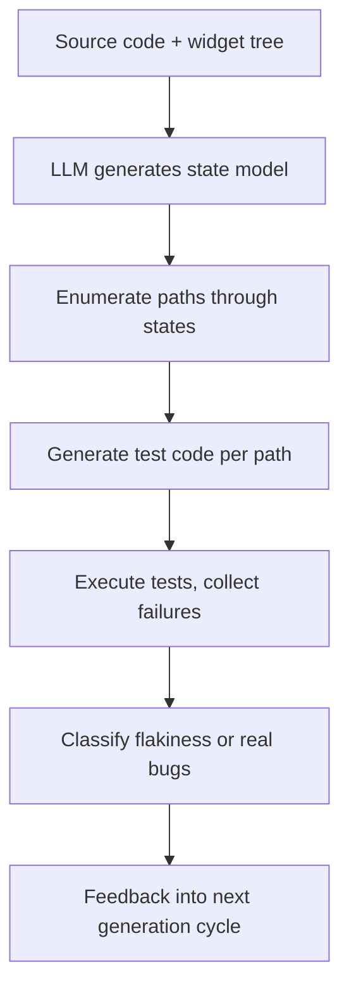

# AI-Powered Test Generation for Flutter/Android: UI Coverage, Edge Cases, Flaky Test Detection

Most teams treat UI tests like a checkbox. Write a few, sprinkle them in CI, and hope they catch regressions. Then they flake out on a Tuesday and nobody trusts them again. The real problem isn't coverage—it's state.

## The mental model: tests as state machines

Think of a UI test not as a script, but as a path through a state machine. Every tap, scroll, or network response moves the app from one state to another. The hard part isn't writing one path—it's making sure the paths you *don't* write still get covered.

That's where LLMs change the game. Not by replacing engineers, but by brute-forcing state space exploration at a scale no human would tolerate.

## How the generator works

Here's the core loop I've seen work in practice:



The LLM doesn't guess. It reads your widget tree, your state management layer (Provider, Bloc, Riverpod), and your API contracts. From that, it builds a probabilistic model of how state flows through your screens. Then it generates tests that walk every reachable path—including the ones your QA team forgot about.

```dart
// Generated test: empty cart → add item → remove item → empty cart
testWidgets('cart transitions through all states', (tester) async {
  await tester.pumpWidget(const MyApp());
  await tester.pumpAndSettle();

  // Start: empty cart
  expect(find.text('Your cart is empty'), findsOneWidget);

  // Add item
  await tester.tap(find.byIcon(Icons.shopping_cart));
  await tester.pumpAndSettle();
  expect(find.text('Added to cart'), findsOneWidget);

  // Remove item
  await tester.tap(find.byKey(const Key('remove-item')));
  await tester.pumpAndSettle();
  expect(find.text('Your cart is empty'), findsOneWidget);
});
```

## What happens at runtime

Take a Flutter login screen. You've got email input, password input, a toggle for password visibility, a submit button, and error states for invalid input, wrong credentials, and network failure.

A human writes maybe three tests: happy path, invalid email, wrong password. The LLM sees the full widget tree and generates twelve. It catches the case where you toggle password visibility *after* typing, then submit—something that silently breaks in release mode because the obscured text field loses focus and the keyboard dismisses. That bug shipped to production for months before someone noticed.

At runtime, each generated test runs in isolation. The framework instruments every state transition: which widgets rendered, which callbacks fired, what async operations were pending. When a test fails, the LLM doesn't just report the assertion error—it classifies the failure mode: layout shift, timing issue, null dereference, or flaky interaction.

## Edge cases and gotchas

Not all state is visible. The LLM can read your `TextEditingController`, but it can't always infer what your backend will return for a malformed request. I've seen generated tests assume HTTP 200 when the API actually returns 422 for edge-case payloads. The fix: feed real API contract samples back into the generator.

Flakiness is the silent killer. An LLM might generate a test that taps a button before a `FutureBuilder` resolves. The test passes locally, fails in CI. The system needs a second pass: run each test ten times, flag anything that fails more than twice, then ask the LLM to add `pumpAndSettle()` or explicit waits.

And here's the kicker: the LLM will happily generate tests for dead code. If you have a feature flag that's been off for six months, it'll still write tests for it. You need a coverage feedback loop that prunes unreachable paths.

| Failure type | LLM can detect? | Fix |
|---|---|---|
| Assertion mismatch | Yes | Adjust expected value |
| Timing/race condition | Yes | Add `pumpAndSettle()` |
| Backend contract mismatch | No | Feed API samples |
| Dead code paths | No | Prune via coverage |

## Why this matters

You don't need AI to write tests. You need it to write the *boring* ones—the ones that explore every edge case, every state transition, every combination of inputs nobody thought to test. The human still writes the The human still writes the high-stakes, business-critical tests that validate core user flows and product requirements—the ones that require context about why a feature exists, not just what it does.

The real win comes from treating LLM test generation as a force multiplier, not a replacement for test engineering rigor. The workflow that works in practice looks like this: feed the LLM your full codebase context, API contracts, and existing test suites to generate bulk coverage for low-risk, repetitive test cases; run a flakiness detection pass to weed out timing-related failures; cross-reference generated tests against live API contract samples to catch mismatches; and prune any tests targeting dead or unreachable code via coverage analysis before merging. The human test engineer’s role shifts from writing every individual test to curating the generation pipeline, validating high-impact test cases, and defining the edge cases and business rules the LLM should prioritize.

At the end of the day, AI-generated tests shine when they handle the tedious, combinatorial work no human has the patience to do manually—testing every permutation of form input, every state transition in a complex widget, every error response from an API. But they still need a human to set the guardrails, validate the output, and make sure the test suite is actually testing the things that matter to your users, not just the code that happens to exist in your repo.