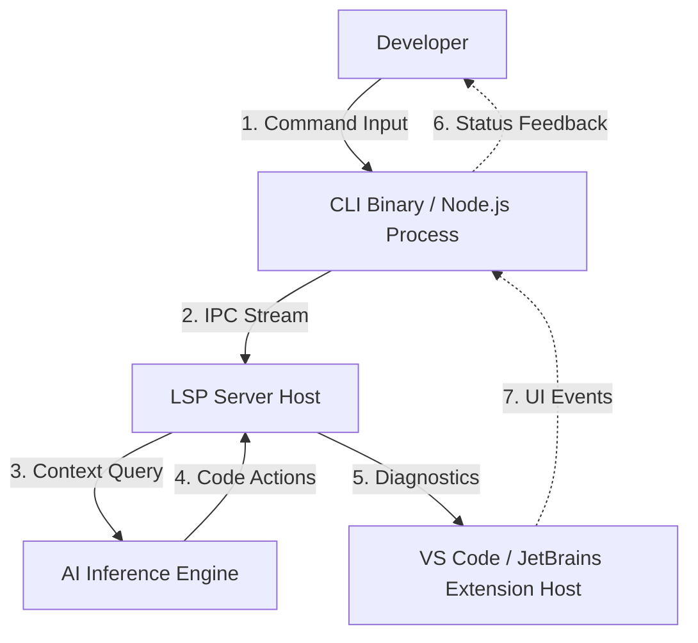

# Building Developer Tools in 2026: From CLI Design to AI-Assisted Extensions

The landscape of developer tooling has fundamentally shifted over the last decade, moving from isolated command-line utilities to integrated ecosystems. By 2026, this evolution has accelerated into a hybrid model where traditional Command-Line Interfaces (CLIs) and Interactive Development Environments (IDEs) are no longer silos but interconnected nodes in a single cognitive workflow. Building tools today requires understanding not just the API surface, but the underlying communication protocols that enable seamless intelligence across platforms.

## The 2026 Landscape: Context-Aware Tooling

In 2026, standalone CLIs remain relevant for automation and scripting, but they are increasingly expected to possess "context awareness." A developer running `npm run build` in a terminal expects the tool to understand the repository state, recent commit history, and open issues without explicit flags. This expectation has driven the convergence of CLI design patterns with Language Server Protocol (LSP) capabilities.

Why does this matter? The primary friction point in modern development is context switching between different environments. If a tool operates in isolation, it forces the developer to manually bridge gaps. By 2026, the standard for high-quality tools involves an architecture that supports both local execution and remote intelligence. This necessitates a robust IPC (Inter-Process Communication) layer that can handle streaming data, authentication tokens, and large context windows efficiently.

Developers are no longer satisfied with static prompts; they expect dynamic assistance. A tool must be able to ingest output logs, parse error stacks, and generate remediation steps without human intervention. This shift demands a departure from monolithic binary distributions toward modular, plugin-based architectures that can be extended by AI agents. The implication for architects is clear: you are not just building a utility; you are building a node in the developer's cognitive graph.

## Architectural Patterns and Protocol Evolution

Designing a tool for this environment requires a clear understanding of how data flows between the editor, the CLI binary, and the intelligence backend. The traditional LSP protocol has evolved to support bidirectional streaming, allowing AI agents to push diagnostics directly into the terminal or editor buffer.

To visualize the interaction layers in a modern developer tool ecosystem, consider the following architecture:



This diagram illustrates the critical separation of concerns. The **CLI Binary** handles execution and orchestration, while the **LSP Server** manages language-specific analysis and AI integration. The **AI Inference Engine** acts as the cognitive layer, potentially running locally or via a secure API gateway. Note that the feedback loop (steps 5-7) ensures that the developer sees updates in real-time without restarting processes.

Implementing this requires careful management of process lifecycles. Unlike older tools where the binary might terminate after execution, modern AI-assisted extensions maintain long-lived connections to keep context alive. This implies a need for heartbeat mechanisms and graceful degradation if the network connection to the AI backend is lost. The LSP server must be able to handle `$/progress` notifications to prevent UI blocking while waiting for heavy model inference tasks to complete.

## Implementation Strategies and Comparative Analysis

When architecting these systems, you face distinct choices regarding where logic resides: inside the CLI binary, within the extension host, or delegated to an external AI service. The following implementation patterns illustrate how to bootstrap a tool that bridges both worlds.

### Pattern 1: Hybrid Binary Initialization
The most robust pattern involves initializing the LSP server from within the CLI entry point. This allows the tool to be invoked via terminal commands while simultaneously registering with the editor host when present.

```typescript
// cli-bootstrap.ts
import { createLspServer, registerCommand } from 'lsp-adapter';
import { Command } from 'commander';

const program = new Command();

program
  .name('devtool')
  .description('2026 Hybrid Development Tool')
  .option('--ai-token <token>', 'AI backend authentication token')
  .action(async (options) => {
    const lspServer = createLspServer({
      capabilities: ['diagnostics', 'semanticTokens'],
      aiContextWindow: options.aiToken ? 128000 : 4096,
    });

    // Register with VS Code if available via IPC
    try {
      await lspServer.connectToExtensionHost();
    } catch (e) {
      console.log('Running as standalone CLI');
    }
    
    await lspServer.start();
  });

program.parse();
```

When choosing an approach, consider the latency and feature richness required. The table below compares three common architectural approaches for building developer tools in 2026.

| Feature | CLI-Only Approach | Extension + LSP | Hybrid Agent Integration |
| :--- | :--- | :--- | :--- |
| **Latency** | High (local processing) | Low (editor host handles UI) | Variable (network dependent) |
| **Context Window** | Limited by memory | Unlimited (streaming) | Limited by LLM Token Cost |
| **Security Model** | Local Binary Only | Hosted API Keys Required | Ephemeral Tokens Recommended |
| **Deployment** | Single Binary | Marketplace + npm | Containerized Microservice |

### Pattern 2: AI Context Management
Handling context windows is the most significant technical challenge in 2026. You cannot simply pass all files to an LLM. Instead, you must implement a summarization layer that maintains a sliding window of relevant code blocks. This requires a second implementation pattern focused on streaming token management.

```typescript
//