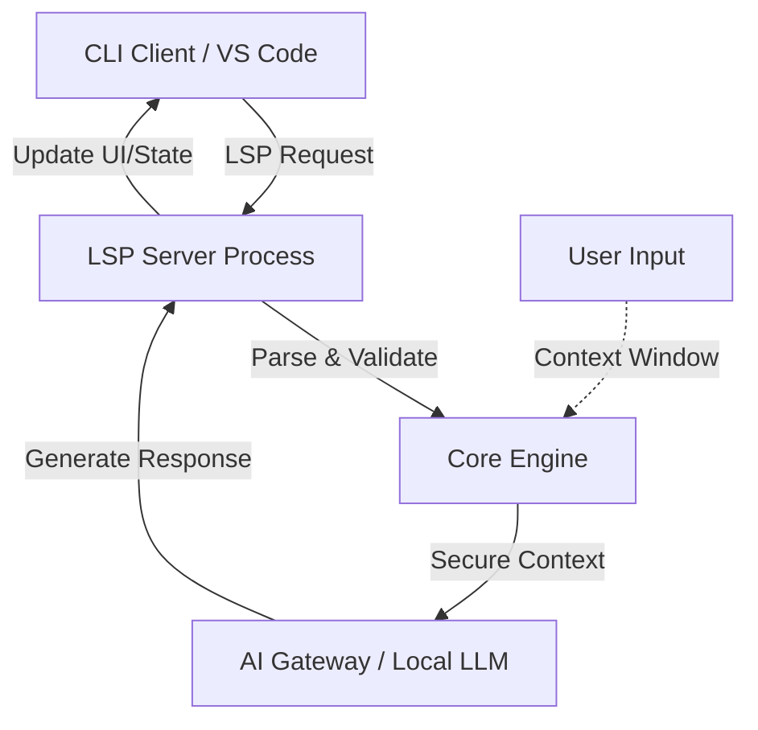

# Building Developer Tools in 2026: From CLI Design to AI-Assisted Extensions

The landscape of developer tooling in 2026 has fundamentally shifted from ephemeral command-line interactions to persistent, context-aware intelligence. In the past, a CLI tool was a discrete utility that performed a specific task and exited. Today, we are witnessing the emergence of "Command Interfaces" that maintain stateful connections with local LLMs and cloud AI agents. For senior engineers building these systems, the challenge is no longer just about parsing arguments; it is about designing robust protocols that bridge the gap between deterministic execution and probabilistic intelligence without sacrificing performance or security.

## The 2026 Developer Tool Landscape

The modern developer environment in 2026 demands tools that are both lightweight enough to run locally but smart enough to understand complex codebases. The traditional "install and forget" model of CLI tools is being replaced by hybrid architectures where a core binary handles security-critical operations while an AI-assisted layer manages context-heavy tasks like refactoring or debugging. This matters because latency in AI responses can break developer flow states if not managed correctly.

Why does this matter for architecture? Because the boundary between the terminal and the IDE is blurring. A well-designed tool must respect the LSP (Language Server Protocol) standards while injecting AI capabilities that do not require a full VS Code extension installation to function. This decoupling allows developers to use their preferred editor while still benefiting from advanced agent logic. The primary goal of 2026 tooling is seamless integration: the AI should feel like an invisible assistant rather than a heavy overlay that slows down compilation or linting.

## Architectural Patterns and LSP Integration

To build tools that scale in this environment, we must architect around the Language Server Protocol (LSP). In 2026, LSP is not just for diagnostics; it is the transport layer for AI suggestions. The architecture requires a clear separation between the "Core Engine" (responsible for file I/O and security) and the "Intelligence Layer" (responsible for prompting models).

The following diagram illustrates the data flow between the CLI client, the LSP server, and the AI Gateway. This structure ensures that sensitive user code never leaves the local environment unless explicitly authorized for cloud processing.

In this architecture, the LSP server acts as a proxy. It receives requests from the IDE but must validate the request before forwarding it to an AI model. For example, if a user asks for code generation, the server must ensure the context window does not exceed token limits and that no secrets are inadvertently included in the prompt. This pattern prevents "prompt injection" attacks where the UI might try to manipulate the backend logic directly.

## Implementation Strategies and Best Practices

Implementing this hybrid model requires