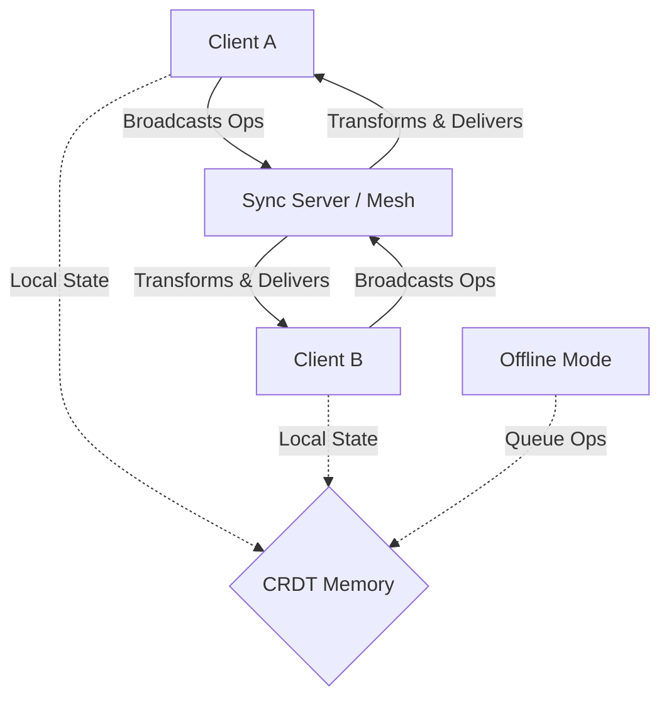

# Building Real-Time Collaborative Apps with CRDTs and Operational Transformation

The era of simple WebSockets and optimistic locking is ending. As we move deeper into 2026, the demand for robust, offline-first collaborative applications has shifted from a luxury feature to a fundamental requirement. Whether supporting AI agents working in parallel or distributed teams operating across disconnected networks, the architecture of collaboration software must guarantee consistency without sacrificing availability. This post explores the architectural decisions required to build systems that reconcile concurrent edits seamlessly using Conflict-Free Replicated Data Types (CRDTs) and Operational Transformation (OT).

## The 2026 Collaboration Landscape

In 2026, the definition of "real-time" has expanded beyond low-latency polling. It now encompasses asynchronous resilience where state must persist and merge regardless of network topology. Traditional approaches often relied on centralized servers to serialize writes using Last-Write-Wins (LWW) or optimistic locking. While simple, these methods introduce single points of failure and create a poor user experience when network partitions occur.

The landscape has shifted toward distributed consensus models that treat every node as an equal replica. This is critical for modern applications where AI agents might be editing documents simultaneously, or where mobile users frequently toggle between online and offline states. The core challenge remains: how do we ensure eventual consistency across a graph of nodes without locking? CRDTs and OT provide the mathematical guarantees needed to solve this. CRDTs operate under the assumption that operations commute (order doesn't matter), while OT transforms incoming operations based on the history of outgoing ones. Both paradigms eliminate the need for a central authority, making them essential for the decentralized infrastructure trends defining the current decade.

## CRDTs vs. Operational Transformation: A Technical Deep-Dive

Understanding the distinction between CRDTs and OT is vital for architectural planning. CRDTs are data structures that allow multiple replicas to evolve independently without coordination. They achieve consistency by ensuring that operations are commutative, associative, and idempotent. For example, a text insertion at a specific index in a vector CRDT can be reordered by the network without changing the final document state.

OT, conversely, is an algorithmic strategy for transforming operations. If User A inserts "Hello" and User B inserts "World" at the same time, OT transforms User B's operation to account for User A's insertion before applying it. While OT requires a server to maintain history for transformation, CRDTs can be fully peer-to-peer.

For implementation guidance, consider how you model an operation. In an OT context, operations must carry metadata regarding their position and timestamp to allow for safe transformation. Here is a TypeScript pattern defining an operation structure suitable for transformation:

```typescript
interface Operation {
  id: string; // Unique identifier for the op
  type: 'insert' | 'delete';
  content: string;
  targetIndex: number; // Position in document before transform
  timestamp: number;   // Used for ordering in conflict resolution
}

class OTStore {
  private operations: Map<string, Operation> = new Map();
  
  apply(op: Operation) {
    this.operations.set(op.id, op);
    // Logic to broadcast transformed ops back to sender if needed
  }
}
```

However, CRDTs often abstract this away into types like `Y.Text` or `Automerge`. If you choose a CRDT approach, your code focuses on the state rather than the operation stream. The trade-off is that OT offers finer-grained control over conflict resolution logic, whereas CRDTs provide a "batteries-included" consistency model that reduces implementation complexity but limits custom conflict policies.

## Architecture, Tooling, and Best Practices

Designing the infrastructure layer requires careful consideration of data synchronization strategies. Below is an architecture diagram illustrating how clients interact with the sync engine in a distributed environment:



This architecture supports a hybrid sync model where local changes are queued in memory and flushed to the network when connectivity returns. A critical decision point is selecting the right library. The following table compares leading tools available for modern web applications:

| Feature | Y.js (CRDT) | Automerge (CRDT) | OT4 (OT) |
| :--- | :--- | :--- | :--- |
| **Consistency Model** | Commutative Ops | Commutative Ops | Transformation Matrix |
| **Latency** | Low (P2P capable) | Low (P2P capable) | Medium (Server required) |
| **Complexity** | Low (Drop-in) | Medium (Requires sync logic) | High (History management) |
| **Best For** | Text/Blocks | Graphs/Objects | Legacy Systems |

When implementing this architecture, avoid the pitfall of attempting to write your own OT algorithm unless you have specific domain requirements. The complexity of maintaining a transformation history often outweighs the benefits. Instead, adopt established libraries and focus on the sync protocol.

Here is a pattern for handling synchronization deltas efficiently using WebSockets:

```javascript
async function handleSyncDelta(delta) {
  const payload = JSON.parse(delta);
  
  // Apply state change locally first to ensure responsiveness
  await store.applyChange(payload.stateSnapshot);
  
  // Acknowledge receipt to the network
  socket.send(JSON.stringify({ type: 'ACK