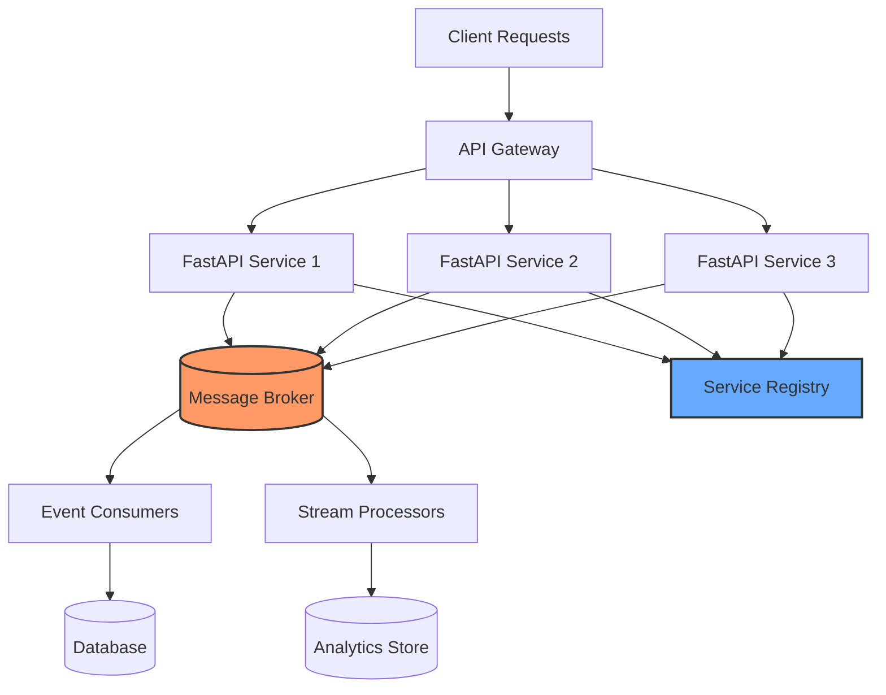
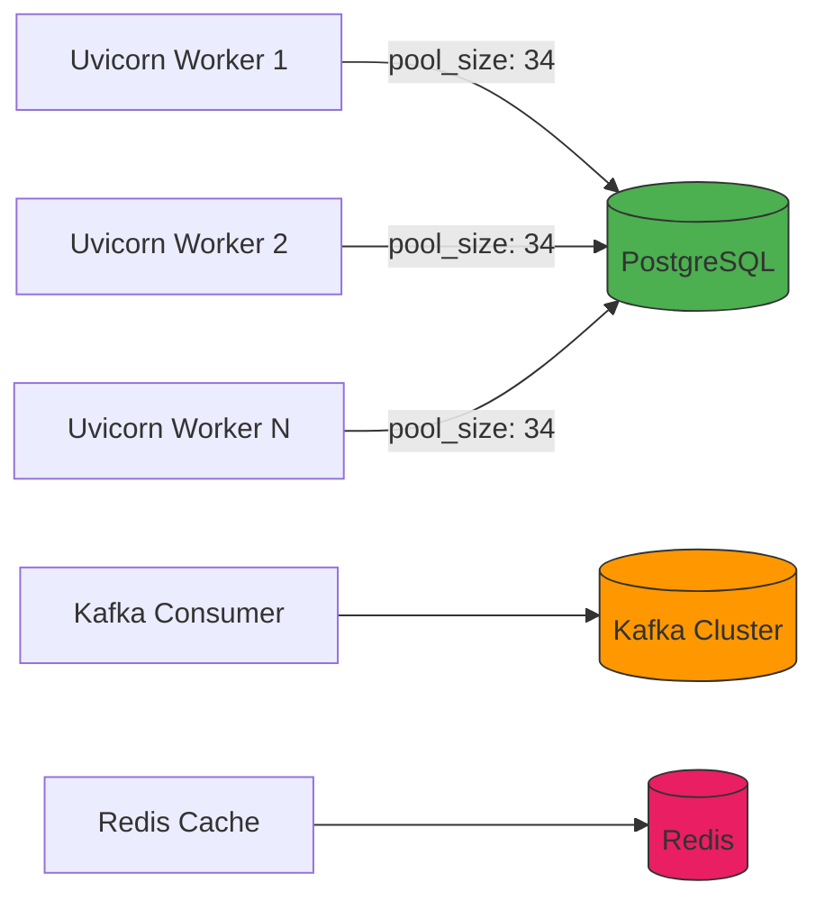
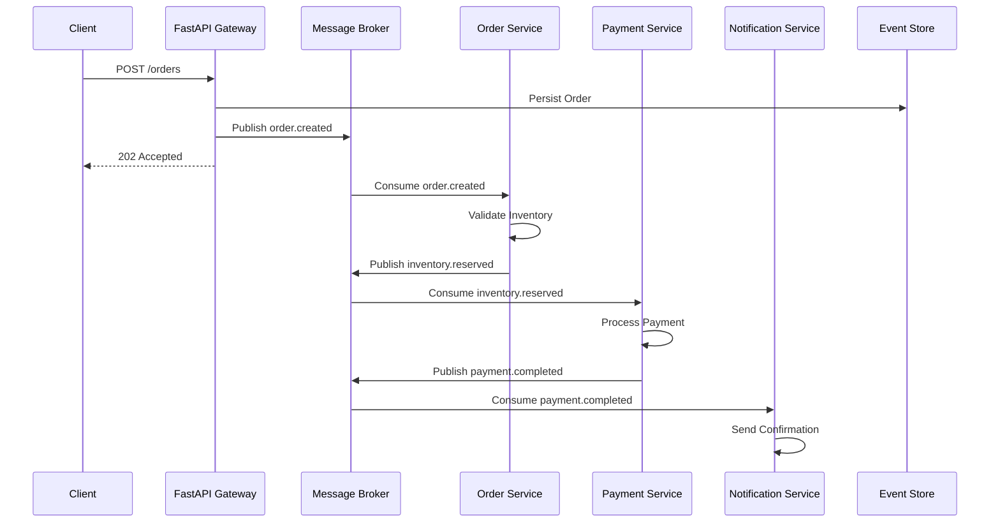
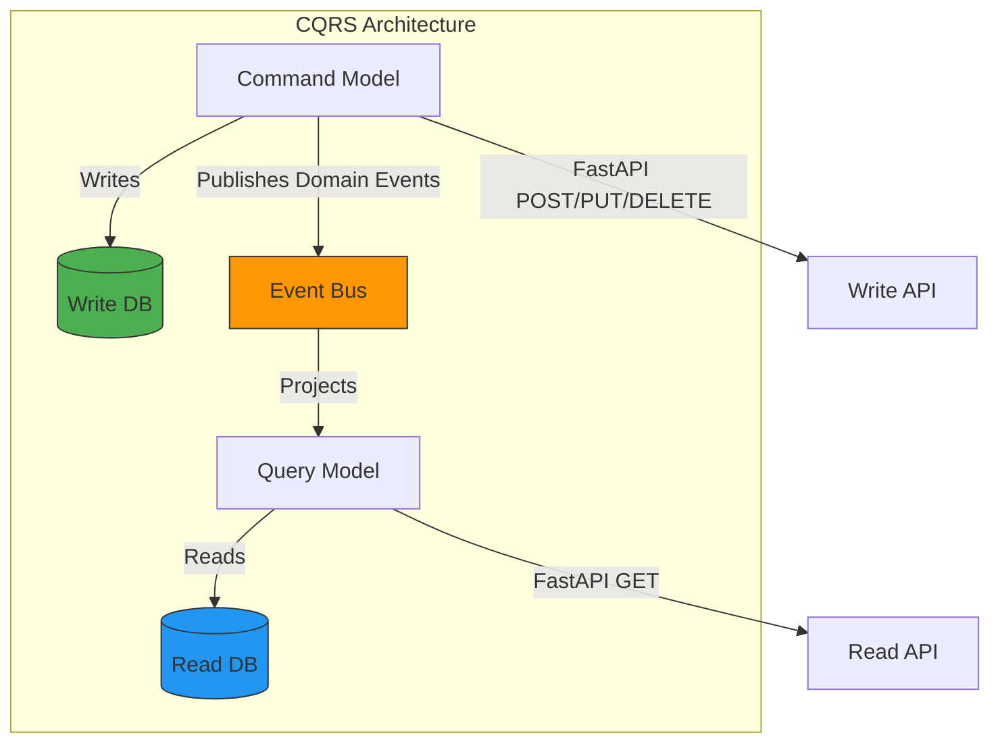
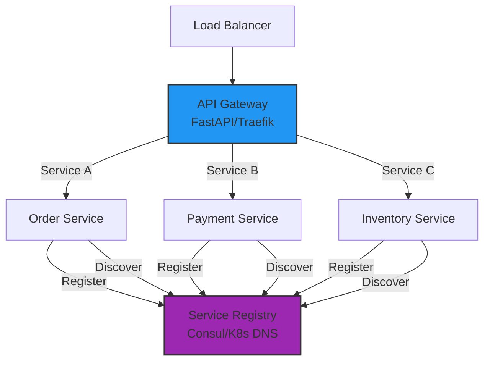
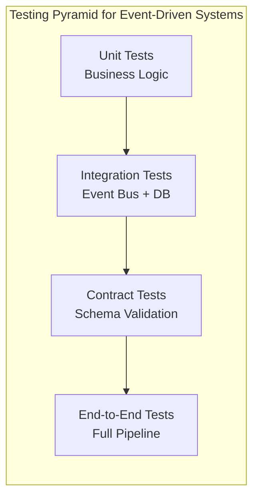
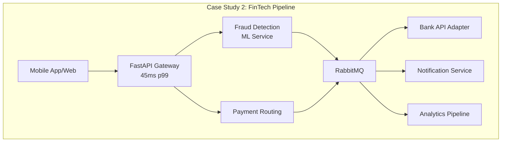

# Building Scalable Microservices with FastAPI and Event-Driven Architecture

In the rapidly evolving landscape of backend engineering for 2026, the paradigm has shifted decisively toward high-throughput, low-latency systems that prioritize asynchronous processing over traditional synchronous blocking calls. As applications scale beyond monolithic boundaries into distributed microservice ecosystems, the Python ecosystem—specifically FastAPI—has emerged as a frontrunner due to its native support for `async/await`, Pydantic validation, and OpenAPI standardization.

However, simply building RESTful endpoints is no longer sufficient. The industry demands resilience against traffic spikes, decoupled service dependencies, and the ability to process events asynchronously across service boundaries. This comprehensive guide explores how integrating FastAPI with event-driven architecture patterns enables teams to build systems that are not only performant but also maintainable, testable, and resilient in production environments.



## Why This Architecture Matters in 2026

The modern backend environment is defined by the convergence of real-time data requirements, serverless compute models, AI-driven analytics, and the expectation of 99.99% uptime. Traditional REST APIs often struggle with backpressure when handling long-running tasks like image processing, batch aggregation, or ML inference. In a synchronous model, if an external dependency takes five seconds to respond, the entire request thread is blocked, consuming valuable event loop time in Python.

FastAPI addresses this through its Starlette-based async foundation, but to truly leverage it in 2026, developers must embrace event-driven patterns that decouple request handling from business logic execution. By combining FastAPI's async capabilities with message brokers and background task workers, we can build systems that gracefully handle traffic variability while maintaining predictable latency profiles under load.

## FastAPI Advanced Patterns

Before diving into event-driven architecture, let's establish mastery over FastAPI's advanced features that form the building blocks of scalable microservices.

### Dependency Injection: Beyond Basics

FastAPI's dependency injection system is one of its most powerful features. In a microservice context, it enables clean separation of concerns, resource management, and testability.

```python
# app/dependencies.py
from fastapi import Depends, HTTPException, Request
from sqlalchemy.ext.asyncio import AsyncSession, create_async_engine
from sqlalchemy.orm import sessionmaker
from typing import AsyncGenerator, Optional
import uuid

# Connection pooling with async SQLAlchemy
engine = create_async_engine(
    "postgresql+asyncpg://user:pass@db:5432/orders",
    pool_size=20,
    max_overflow=10,
    pool_pre_ping=True,
    pool_recycle=3600,
    echo=False,
)
AsyncSessionLocal = sessionmaker(engine, class_=AsyncSession, expire_on_commit=False)

async def get_db() -> AsyncGenerator[AsyncSession, None]:
    """Dependency that provides a database session with automatic cleanup."""
    async with AsyncSessionLocal() as session:
        try:
            yield session
            await session.commit()
        except Exception:
            await session.rollback()
            raise
        finally:
            await session.close()

def get_current_user(request: Request) -> dict:
    """Extract authenticated user from JWT or API key."""
    user_id = request.headers.get("X-User-ID")
    if not user_id:
        raise HTTPException(status_code=401, detail="Missing authentication")
    return {"user_id": user_id, "roles": ["customer"]}

class OrderService:
    """Service-layer dependency with its own dependencies."""
    def __init__(
        self,
        db: AsyncSession = Depends(get_db),
        user: dict = Depends(get_current_user),
    ):
        self.db = db
        self.user = user
        self.order_id = str(uuid.uuid4())

    async def create_order(self, order_data: dict) -> dict:
        # Business logic here
        return {"order_id": self.order_id, "user_id": self.user["user_id"]}
```

This pattern — injecting service classes that themselves declare dependencies — creates a composable, testable architecture. Unit tests can override any dependency at any level without touching the application code.

### Lifespan Events: Startup and Shutdown

FastAPI's lifespan context manager (introduced in FastAPI 0.93+) replaces the deprecated `startup` and `shutdown` event handlers. It's the correct way to manage resources that must live for the application's lifetime.

```python
# app/lifespan.py
from contextlib import asynccontextmanager
from fastapi import FastAPI
from redis.asyncio import Redis
from app.config import settings
from app.database import engine
import aiokafka

@asynccontextmanager
async def lifespan(app: FastAPI):
    """Application lifespan: initialize and clean up global resources."""
    # --- STARTUP ---
    print("🚀 Starting up Order Service...")
    
    # Initialize Redis connection pool
    app.state.redis = Redis.from_url(
        settings.REDIS_URL,
        encoding="utf-8",
        decode_responses=True,
        max_connections=50,
    )
    
    # Initialize Kafka producer
    app.state.kafka_producer = aiokafka.AIOKafkaProducer(
        bootstrap_servers=settings.KAFKA_BOOTSTRAP_SERVERS,
        compression_type="gzip",
        linger_ms=10,
        batch_size=16384,
    )
    await app.state.kafka_producer.start()
    
    # Verify database connectivity
    async with engine.connect() as conn:
        await conn.execute("SELECT 1")
    
    print(f"✅ Service ready | Redis: OK | Kafka: OK | DB: OK")
    
    yield  # Application runs here
    
    # --- SHUTDOWN ---
    print("🛑 Shutting down gracefully...")
    
    # Close Kafka producer with timeout
    await app.state.kafka_producer.stop()
    
    # Close Redis connection pool
    await app.state.redis.aclose()
    
    # Dispose database engine
    await engine.dispose()
    
    print("✅ Shutdown complete")

# In main.py
app = FastAPI(lifespan=lifespan, title="Order Service", version="3.0.0")
```

### Background Tasks with Reliable Delivery

FastAPI's `BackgroundTasks` are suitable for lightweight, non-critical operations. For production workloads requiring delivery guarantees, pair them with a message broker:

```python
# app/main.py
from fastapi import BackgroundTasks, Depends
from app.dependencies import get_db, get_current_user
from app.events import publish_event
from app.models import OrderRequest, OrderResponse

@app.post("/orders", response_model=OrderResponse, status_code=202)
async def create_order(
    order: OrderRequest,
    background_tasks: BackgroundTasks,
    db=Depends(get_db),
    user=Depends(get_current_user),
):
    """Creates an order with event-driven processing."""
    # 1. Validate and persist immediately (CQRS write model)
    order_id = await db.execute(INSERT INTO orders ...)
    
    # 2. Publish event for downstream consumers (reliable delivery)
    await publish_event(
        topic="orders",
        key=str(order_id),
        value={
            "order_id": str(order_id),
            "user_id": user["user_id"],
            "items": [item.model_dump() for item in order.items],
            "total": order.total,
            "timestamp": datetime.utcnow().isoformat(),
        },
    )
    
    # 3. Schedule lightweight post-processing (best-effort)
    background_tasks.add_task(send_confirmation_email, user["user_id"], order_id)
    
    return OrderResponse(
        order_id=str(order_id),
        status="pending",
        message="Order received and processing initiated",
    )
```

## Async Patterns: asyncio, Uvicorn Workers, and Connection Pooling

Python's `asyncio` is the foundation upon which FastAPI's performance is built. Understanding how to tune it for production is essential.

### Uvicorn Workers: The Right Configuration

```python
# gunicorn.conf.py — production worker configuration
import multiprocessing

# Number of workers: (2 × CPU cores) + 1
workers = multiprocessing.cpu_count() * 2 + 1

# Each worker runs an independent event loop
worker_class = "uvicorn.workers.UvicornWorker"
bind = "0.0.0.0:8000"
timeout = 120
graceful_timeout = 60
keepalive = 5
max_requests = 10000
max_requests_jitter = 2000

# For pure async workloads where CPU is not the bottleneck,
# UvicornWorker is preferred over UvicornH11Worker
```

**Worker type comparison:**

| Worker Type | Concurrency Model | Best For | Memory per Worker |
|---|---|---|---|
| `UvicornWorker` | Single event loop (async I/O) | I/O-bound workloads, many concurrent connections | ~50-80 MB |
| `UvicornH11Worker` | Threaded HTTP handling | Mixed workloads with blocking calls | ~60-100 MB |
| `GunicornUVLoopWorker` | uvloop-based event loop | Max performance on Linux | ~50-80 MB |

### Connection Pooling Tuning

Connection pooling is critical under load. Pool too small and requests queue; pool too large and the database suffers.

```python
# app/database.py — optimized pool configuration
from sqlalchemy.ext.asyncio import create_async_engine

# Rule of thumb: pool_size = 2 × number of uvicorn workers
POOL_SIZE = 2 * 17  # 17 workers → 34 connections
MAX_OVERFLOW = POOL_SIZE // 2  # Burst capacity

engine = create_async_engine(
    "postgresql+asyncpg://user:pass@db:5432/orders",
    pool_size=POOL_SIZE,
    max_overflow=MAX_OVERFLOW,
    pool_pre_ping=True,      # Verify connection before use
    pool_recycle=3600,       # Recycle connections every hour
    pool_use_lifo=True,      # LIFO reduces fragmentation
    echo_pool="debug",       # Log pool checkouts/checkins in dev
)
```



## Event-Driven Architecture with Message Brokers

### Core Concepts

Event-driven architecture (EDA) is built on the principle that services communicate through the production and consumption of events rather than direct synchronous calls. An event represents a state change—an order was placed, a payment was processed, a user was created—and is published to a message broker where interested services can subscribe and react asynchronously.



### Message Broker Comparison

| Criteria | Apache Kafka | RabbitMQ | Redis Streams |
|---|---|---|---|
| **Throughput** | 1M+ msgs/sec | 50K msgs/sec | 200K msgs/sec |
| **Latency (p99)** | 2-5ms | <1ms | <1ms |
| **Message Retention** | Configurable (days to weeks) | Acknowledgment-based | Configurable (maxlen) |
| **Ordering Guarantee** | Per-partition | Per-queue | Per-stream |
| **Persistence** | Durable (disk) | Durable (disk) | Configurable |
| **Consumer Groups** | Native (Kafka Consumer Groups) | Native (subscriptions) | Native (consumer groups) |
| **Exactly-Once Semantics** | Yes (idempotent + transactional) | Via deduplication | Best-effort (idempotent consumers) |
| **Operational Complexity** | High (ZooKeeper/KRaft) | Moderate | Low |
| **Python Client** | `aiokafka` / `confluent-kafka` | `aio-pika` / `celery` | `redis-py` (async) |
| **Best For** | High-throughput event streaming, event sourcing | Reliable task queues, RPC | Lightweight pub/sub, caching layer |

### Kafka Implementation

```python
# app/kafka_client.py — async Kafka producer/consumer
import aiokafka
from app.config import settings
import msgpack
import asyncio

class KafkaEventBus:
    """Production-ready Kafka event bus with serialization and error handling."""
    
    def __init__(self):
        self.producer: aiokafka.AIOKafkaProducer | None = None
        self.consumer: aiokafka.AIOKafkaConsumer | None = None
    
    async def start_producer(self):
        self.producer = aiokafka.AIOKafkaProducer(
            bootstrap_servers=settings.KAFKA_BOOTSTRAP_SERVERS,
            compression_type="gzip",
            acks="all",  # Wait for all replicas to acknowledge
            linger_ms=10,  # Batch small messages
            batch_size=16384,
            max_request_size=1048576,
            retry_backoff_ms=500,
            security_protocol="SASL_SSL",
            sasl_mechanism="SCRAM-SHA-256",
            sasl_plain_username=settings.KAFKA_USERNAME,
            sasl_plain_password=settings.KAFKA_PASSWORD,
        )
        await self.producer.start()
    
    async def publish(self, topic: str, key: str, value: dict):
        """Publish an event to Kafka with idempotency key."""
        await self.producer.send(
            topic=topic,
            key=key.encode(),
            value=msgpack.packb(value, use_bin_type=True),
            timestamp_ms=int(asyncio.get_event_loop().time() * 1000),
        )
    
    async def start_consumer(self, topics: list[str], group_id: str):
        self.consumer = aiokafka.AIOKafkaConsumer(
            *topics,
            bootstrap_servers=settings.KAFKA_BOOTSTRAP_SERVERS,
            group_id=group_id,
            auto_offset_reset="earliest",
            enable_auto_commit=False,  # Manual commit for exactly-once
            max_poll_records=500,
            session_timeout_ms=30000,
            heartbeat_interval_ms=10000,
        )
        await self.consumer.start()
    
    async def consume_loop(self, handler):
        """Process messages with manual offset management."""
        try:
            async for msg in self.consumer:
                try:
                    value = msgpack.unpackb(msg.value, raw=False)
                    await handler(msg.topic, msg.key.decode(), value, msg.timestamp)
                    await self.consumer.commit()
                except Exception as e:
                    print(f"Error processing message: {e}")
                    # Send to dead-letter topic
                    await self.publish("orders.dlq", msg.key.decode(), {
                        "original_topic": msg.topic,
                        "error": str(e),
                        "payload": msg.value.decode(),
                    })
        finally:
            await self.consumer.stop()
```

### RabbitMQ Implementation

```python
# app/rabbitmq_client.py — async RabbitMQ producer/consumer
import aio_pika
from app.config import settings

class RabbitMQEventBus:
    """Async RabbitMQ client with reliable delivery."""
    
    def __init__(self):
        self.connection: aio_pika.RobustConnection | None = None
        self.channel: aio_pika.RobustChannel | None = None
    
    async def connect(self):
        self.connection = await aio_pika.connect_robust(
            settings.RABBITMQ_URL,
            heartbeat=60,
            reconnect_interval=5,
        )
        self.channel = await self.connection.channel()
        # Enable publisher confirms
        await self.channel.set_qos(prefetch_count=100)
    
    async def declare_exchange(self, name: str, type: str = "topic"):
        exchange = await self.channel.declare_exchange(name, type, durable=True)
        return exchange
    
    async def publish(self, exchange_name: str, routing_key: str, message: dict):
        exchange = await self.declare_exchange(exchange_name)
        await exchange.publish(
            aio_pika.Message(
                body=msgpack.packb(message, use_bin_type=True),
                delivery_mode=aio_pika.DeliveryMode.PERSISTENT,
                content_type="application/x-msgpack",
                headers={"version": "1.0", "type": routing_key},
            ),
            routing_key=routing_key,
        )
    
    async def consume(self, queue_name: str, exchange_name: str, routing_keys: list[str], handler):
        queue = await self.channel.declare_queue(queue_name, durable=True)
        exchange = await self.declare_exchange(exchange_name)
        
        for key in routing_keys:
            await queue.bind(exchange, routing_key=key)
        
        async with queue.iterator() as queue_iter:
            async for message in queue_iter:
                async with message.process(ignore_processed=True):
                    value = msgpack.unpackb(message.body, raw=False)
                    await handler(exchange_name, message.routing_key, value)
```

### Redis Streams Implementation

```python
# app/redis_streams.py — lightweight event bus with Redis Streams
import redis.asyncio as aioredis
from app.config import settings

class RedisStreamEventBus:
    """Lightweight event bus using Redis Streams for simple topologies."""
    
    def __init__(self):
        self.redis = aioredis.from_url(
            settings.REDIS_URL,
            encoding="utf-8",
            decode_responses=True,
            max_connections=20,
        )
    
    async def publish(self, stream: str, event_type: str, data: dict):
        """Publish an event to a Redis stream."""
        await self.redis.xadd(
            stream,
            {
                "type": event_type,
                "data": json.dumps(data),
                "timestamp": str(datetime.utcnow().timestamp()),
            },
            maxlen=100000,  # Cap stream size
        )
    
    async def create_consumer_group(self, stream: str, group: str):
        """Create a consumer group (idempotent)."""
        try:
            await self.redis.xgroup_create(stream, group, id="0", mkstream=True)
        except aioredis.ResponseError as e:
            if "BUSYGROUP" not in str(e):
                raise
    
    async def consume(self, stream: str, group: str, consumer: str, handler):
        """Poll for new messages and process them."""
        while True:
            messages = await self.redis.xreadgroup(
                group, consumer, {stream: ">"}, count=10, block=2000
            )
            if messages:
                for stream_name, entries in messages:
                    for msg_id, fields in entries:
                        try:
                            event_data = json.loads(fields["data"])
                            await handler(fields["type"], event_data)
                            await self.redis.xack(stream, group, msg_id)
                        except Exception as e:
                            # Move to pending entries for retry
                            print(f"Failed to process {msg_id}: {e}")
```

## Domain Events and CQRS with FastAPI

Domain events and Command Query Responsibility Segregation (CQRS) are powerful patterns that work naturally with event-driven FastAPI services. They separate write operations (commands) from read operations (queries), allowing each to be optimized independently.



### Domain Events Implementation

```python
# app/domain_events.py — typed domain events with Pydantic
from pydantic import BaseModel, Field
from datetime import datetime
from enum import Enum
from typing import Any, Optional
import uuid

class EventStatus(str, Enum):
    PENDING = "pending"
    PROCESSED = "processed"
    FAILED = "failed"

class DomainEvent(BaseModel):
    """Base class for all domain events with metadata."""
    event_id: str = Field(default_factory=lambda: str(uuid.uuid4()))
    event_type: str
    aggregate_id: str
    aggregate_type: str
    version: int = Field(default=1, ge=1)
    timestamp: datetime = Field(default_factory=datetime.utcnow)
    data: dict[str, Any]
    metadata: Optional[dict[str, Any]] = None
    
    class Config:
        frozen = True  # Events are immutable

class OrderPlaced(DomainEvent):
    event_type: str = "order.placed"
    aggregate_type: str = "order"
    
    @classmethod
    def create(cls, order_id: str, user_id: str, items: list, total: float):
        return cls(
            aggregate_id=order_id,
            data={
                "user_id": user_id,
                "items": items,
                "total": total,
            },
            metadata={"source": "order-service", "env": "production"},
        )

class PaymentCompleted(DomainEvent):
    event_type: str = "payment.completed"
    aggregate_type: str = "payment"
    
    @classmethod
    def create(cls, payment_id: str, order_id: str, amount: float, status: str):
        return cls(
            aggregate_id=payment_id,
            data={"order_id": order_id, "amount": amount, "status": status},
        )

# app/event_store.py — append-only event store
class EventStore:
    """Append-only store for domain events with replay capability."""
    
    async def append(self, event: DomainEvent) -> None:
        """Persist a domain event. This is the only write operation."""
        async with get_db() as session:
            stmt = text("""
                INSERT INTO event_store (
                    event_id, event_type, aggregate_id, aggregate_type,
                    version, timestamp, data, metadata
                ) VALUES (
                    :event_id, :event_type, :aggregate_id, :aggregate_type,
                    :version, :timestamp, :data::jsonb, :metadata::jsonb
                )
            """)
            await session.execute(stmt, {
                "event_id": event.event_id,
                "event_type": event.event_type,
                "aggregate_id": event.aggregate_id,
                "aggregate_type": event.aggregate_type,
                "version": event.version,
                "timestamp": event.timestamp,
                "data": json.dumps(event.data),
                "metadata": json.dumps(event.metadata or {}),
            })
    
    async def replay(self, aggregate_type: str, aggregate_id: str) -> list[DomainEvent]:
        """Replay all events for an aggregate to reconstruct current state."""
        query = text("""
            SELECT * FROM event_store
            WHERE aggregate_type = :atype AND aggregate_id = :aid
            ORDER BY version ASC
        """)
        async with get_db() as session:
            result = await session.execute(query, {
                "atype": aggregate_type,
                "aid": aggregate_id,
            })
            return [DomainEvent(**row) for row in result]
```

### CQRS: Separate Read and Write Models

```python
# app/cqrs/write.py — Command handlers (write model)
from app.dependencies import get_db
from app.domain_events import OrderPlaced, EventStore

class OrderCommandHandler:
    """Handles write operations — commands that change state."""
    
    def __init__(self, db=Depends(get_db), event_store=Depends(EventStore)):
        self.db = db
        self.event_store = event_store
    
    async def place_order(self, user_id: str, items: list, total: float) -> str:
        """Execute the 'PlaceOrder' command and emit a domain event."""
        order_id = str(uuid.uuid4())
        
        # 1. Validate business rules
        if total <= 0:
            raise ValueError("Order total must be positive")
        
        # 2. Persist to write-optimized database
        await self.db.execute(
            "INSERT INTO orders (id, user_id, items, total, status) VALUES (:id, :uid, :items, :total, :status)",
            {"id": order_id, "uid": user_id, "items": json.dumps(items), "total": total, "status": "pending"},
        )
        
        # 3. Publish domain event
        event = OrderPlaced.create(order_id, user_id, items, total)
        await self.event_store.append(event)
        
        # 4. Publish to external message broker
        await publish_to_broker(event)
        
        return order_id

# app/cqrs/read.py — Query handlers (read model)
class OrderQueryHandler:
    """Handles read operations — optimized for fast queries."""
    
    def __init__(self, cache=Depends(get_redis), db=Depends(get_read_db)):
        self.cache = cache
        self.db = db
    
    async def get_order(self, order_id: str) -> dict:
        """Get order from cache (materialized view) or fall back to read DB."""
        # Check cache first
        cached = await self.cache.get(f"order:{order_id}")
        if cached:
            return json.loads(cached)
        
        # Query read-optimized database (different schema from write DB)
        result = await self.db.execute(
            "SELECT * FROM order_read_model WHERE id = :id",
            {"id": order_id},
        )
        order = result.one_or_none()
        if not order:
            raise HTTPException(status_code=404, detail="Order not found")
        
        # Populate cache
        await self.cache.setex(f"order:{order_id}", 300, json.dumps(order._mapping))
        
        return order._mapping
```

## Service Discovery and API Gateway

In a microservice architecture, services need to find each other without hardcoded addresses. Service discovery and API gateway patterns solve this.



### API Gateway with FastAPI

```python
# app/gateway.py — lightweight API gateway with routing and rate limiting
from fastapi import FastAPI, HTTPException, Request
from fastapi.responses import Response
import httpx
from app.config import settings

gateway = FastAPI(title="API Gateway", version="1.0.0")

# Service registry (in-memory for simplicity; use Consul/etcd in production)
SERVICE_REGISTRY: dict[str, list[str]] = {
    "orders": ["http://order-service:8001"],
    "payments": ["http://payment-service:8002"],
    "inventory": ["http://inventory-service:8003"],
    "notifications": ["http://notification-service:8004"],
}

class ServiceDiscovery:
    """Simple round-robin service discovery."""
    
    def __init__(self):
        self._index: dict[str, int] = {name: 0 for name in SERVICE_REGISTRY}
    
    def get_service_url(self, service_name: str) -> str:
        instances = SERVICE_REGISTRY.get(service_name)
        if not instances:
            raise HTTPException(status_code=503, detail=f"Service {service_name} unavailable")
        
        idx = self._index.get(service_name, 0)
        url = instances[idx % len(instances)]
        self._index[service_name] = idx + 1
        return url

discovery = ServiceDiscovery()

@gateway.api_route("/{service_name}/{path:path}", methods=["GET", "POST", "PUT", "DELETE", "PATCH"])
async def proxy(service_name: str, path: str, request: Request):
    """Generic proxy to backend services with header forwarding."""
    service_url = discovery.get_service_url(service_name)
    target_url = f"{service_url}/{path}"
    
    body = await request.body()
    headers = dict(request.headers)
    # Forward correlation ID
    headers.pop("host", None)
    
    async with httpx.AsyncClient(timeout=30.0) as client:
        try:
            response = await client.request(
                method=request.method,
                url=target_url,
                content=body,
                headers=headers,
                params=request.query_params,
            )
            return Response(
                content=response.content,
                status_code=response.status_code,
                headers=dict(response.headers),
            )
        except httpx.RequestError as e:
            raise HTTPException(status_code=502, detail=f"Service error: {str(e)}")
```

### Kubernetes-Native Service Discovery

```yaml
# kubernetes/service-discovery.yaml
apiVersion: v1
kind: Service
metadata:
  name: order-service
  labels:
    app: order-service
spec:
  selector:
    app: order-service
  ports:
    - port: 8001
      targetPort: 8000
      name: http
---
apiVersion: v1
kind: Service
metadata:
  name: order-service-headless
  labels:
    app: order-service
spec:
  clusterIP: None  # Headless for StatefulSet DNS
  selector:
    app: order-service
  ports:
    - port: 8001
      targetPort: 8000
```

When deployed on Kubernetes, services discover each other via DNS: `order-service.namespace.svc.cluster.local`. Use `Consul` or `etcd` for multi-cluster or hybrid deployments.

## Testing Event-Driven Services

Testing event-driven microservices requires strategies beyond traditional unit and integration tests. You must verify event production, consumption, and idempotency.



### Unit Testing Domain Events

```python
# tests/test_domain_events.py
import pytest
from app.domain_events import OrderPlaced, PaymentCompleted

class TestDomainEvents:
    def test_order_placed_creation(self):
        event = OrderPlaced.create(
            order_id="ord-123",
            user_id="usr-456",
            items=[{"sku": "PROD-1", "qty": 2, "price": 29.99}],
            total=59.98,
        )
        
        assert event.event_type == "order.placed"
        assert event.aggregate_type == "order"
        assert event.aggregate_id == "ord-123"
        assert event.data["total"] == 59.98
        assert event.version == 1
        assert event.event_id is not None
    
    def test_domain_event_immutability(self):
        event = OrderPlaced.create(order_id="ord-1", user_id="usr-1", items=[], total=0)
        with pytest.raises(TypeError):
            event.data["extra"] = "should not work"
```

### Integration Testing with Testcontainers

```python
# tests/test_event_bus.py — integration tests with real infrastructure
import pytest
from testcontainers.kafka import KafkaContainer
from testcontainers.redis import RedisContainer
from app.kafka_client import KafkaEventBus
from app.redis_streams import RedisStreamEventBus
import asyncio

@pytest.mark.asyncio
class TestKafkaEventBus:
    @pytest.fixture(autouse=True)
    async def setup(self):
        """Spin up a real Kafka instance for testing."""
        with KafkaContainer("confluentinc/cp-kafka:7.5.0") as kafka:
            self.bus = KafkaEventBus()
            self.bus.producer = aiokafka.AIOKafkaProducer(
                bootstrap_servers=kafka.get_bootstrap_server(),
            )
            await self.bus.producer.start()
            yield
            await self.bus.producer.stop()
    
    async def test_publish_and_consume(self):
        received = []
        
        async def handler(topic, key, value, timestamp):
            received.append((topic, key, value))
        
        # Start consumer in background
        await self.bus.start_consumer(["test-topic"], "test-group")
        consume_task = asyncio.create_task(self.bus.consume_loop(handler))
        
        # Publish test event
        await self.bus.publish("test-topic", "key-1", {"message": "hello"})
        await asyncio.sleep(2)  # Allow processing
        
        consume_task.cancel()
        assert len(received) == 1
        assert received[0][1] == "key-1"

@pytest.mark.asyncio
class TestRedisStreamEventBus:
    @pytest.fixture(autouse=True)
    async def setup(self):
        with RedisContainer("redis:7-alpine") as redis:
            self.bus = RedisStreamEventBus()
            self.bus.redis = aioredis.from_url(
                f"redis://{redis.get_container_host_ip()}:{redis.get_exposed_port(6379)}"
            )
            yield
    
    async def test_stream_publish(self):
        received = []
        
        async def handler(event_type, data):
            received.append((event_type, data))
        
        await self.bus.create_consumer_group("test-stream", "test-group")
        await self.bus.publish("test-stream", "order.created", {"order_id": "123"})
        
        # Not using infinite loop in test; check pending instead
        await asyncio.sleep(1)
        pending = await self.bus.redis.xpending("test-stream", "test-group")
        assert pending["pending"] > 0
```

### Testing Idempotency

```python
# tests/test_idempotency.py
import pytest
from app.idempotency import IdempotencyKeyMiddleware

class TestIdempotency:
    async def test_deduplication(self):
        """Same idempotency key = same response, no side effects."""
        key = "idem-001"
        # First call: process normally
        result1 = await process_with_idempotency(key, {"action": "charge", "amount": 100})
        assert result1["status"] == "success"
        
        # Second call with same key: return cached response, don't reprocess
        result2 = await process_with_idempotency(key, {"action": "charge", "amount": 100})
        assert result2["status"] == "success"
        assert result2["deduplicated"] is True
```

## Containerization and Kubernetes Deployment

### Production Dockerfile

```dockerfile
# Dockerfile — multi-stage build for minimal production images
FROM python:3.12-slim AS builder

WORKDIR /app
COPY requirements.txt .

RUN pip install --no-cache-dir --user --no-warn-script-location \
    -r requirements.txt

FROM python:3.12-slim AS runner

# Security: run as non-root
RUN groupadd -r fastapi && useradd -r -g fastapi -d /app -s /sbin/nologin fastapi
WORKDIR /app

# Copy only installed packages from builder
COPY --from=builder /root/.local /home/fastapi/.local
ENV PATH=/home/fastapi/.local/bin:$PATH

COPY --chown=fastapi:fastapi . .

USER fastapi
EXPOSE 8000

HEALTHCHECK --interval=30s --timeout=3s --start-period=10s --retries=3 \
    CMD python -c "import urllib.request; urllib.request.urlopen('http://localhost:8000/health')"

CMD ["uvicorn", "app.main:app", "--host", "0.0.0.0", "--port", "8000", "--workers", "4"]
```

### Kubernetes Manifests

```yaml
# kubernetes/deployment.yaml
apiVersion: apps/v1
kind: Deployment
metadata:
  name: order-service
  labels:
    app: order-service
    tier: backend
spec:
  replicas: 4
  strategy:
    type: RollingUpdate
    rollingUpdate:
      maxUnavailable: 1
      maxSurge: 2
  selector:
    matchLabels:
      app: order-service
  template:
    metadata:
      labels:
        app: order-service
      annotations:
        prometheus.io/scrape: "true"
        prometheus.io/port: "8000"
        prometheus.io/path: "/metrics"
    spec:
      terminationGracePeriodSeconds: 60
      containers:
        - name: order-service
          image: registry.example.com/order-service:latest
          imagePullPolicy: Always
          ports:
            - containerPort: 8000
              name: http
            - containerPort: 8001
              name: grpc
          envFrom:
            - configMapRef:
                name: order-service-config
            - secretRef:
                name: order-service-secrets
          resources:
            requests:
              memory: "256Mi"
              cpu: "250m"
            limits:
              memory: "512Mi"
              cpu: "500m"
          livenessProbe:
            httpGet:
              path: /health
              port: 8000
            initialDelaySeconds: 30
            periodSeconds: 15
            timeoutSeconds: 5
          readinessProbe:
            httpGet:
              path: /ready
              port: 8000
            initialDelaySeconds: 5
            periodSeconds: 10
---
# kubernetes/hpa.yaml — Horizontal Pod Autoscaler
apiVersion: autoscaling/v2
kind: HorizontalPodAutoscaler
metadata:
  name: order-service-hpa
spec:
  scaleTargetRef:
    apiVersion: apps/v1
    kind: Deployment
    name: order-service
  minReplicas: 2
  maxReplicas: 20
  behavior:
    scaleUp:
      stabilizationWindowSeconds: 30
      policies:
        - type: Percent
          value: 100
          periodSeconds: 15
    scaleDown:
      stabilizationWindowSeconds: 120
      policies:
        - type: Pods
          value: 2
          periodSeconds: 60
  metrics:
    - type: Resource
      resource:
        name: cpu
        target:
          type: Utilization
          averageUtilization: 70
    - type: Resource
      resource:
        name: memory
        target:
          type: Utilization
          averageUtilization: 80
    - type: External
      external:
        metric:
          name: kafka_consumer_lag
          selector:
            matchLabels:
              topic: orders
        target:
          type: AverageValue
          averageValue: 500
```

## Monitoring and Observability

Event-driven systems are inherently distributed, making observability critical. Implement the three pillars — logging, metrics, and tracing — with OpenTelemetry as the unified standard.

### OpenTelemetry Setup

```python
# app/telemetry.py — unified observability with OpenTelemetry
from opentelemetry import trace, metrics
from opentelemetry.exporter.otlp.proto.grpc.trace_exporter import OTLPSpanExporter
from opentelemetry.exporter.otlp.proto.grpc.metric_exporter import OTLPMetricExporter
from opentelemetry.instrumentation.fastapi import FastAPIInstrumentor
from opentelemetry.instrumentation.httpx import HttpxInstrumentor
from opentelemetry.instrumentation.sqlalchemy import SQLAlchemyInstrumentor
from opentelemetry.sdk.trace import TracerProvider
from opentelemetry.sdk.trace.export import BatchSpanProcessor
from opentelemetry.sdk.metrics import MeterProvider
from opentelemetry.sdk.metrics.export import PeriodicExportingMetricReader
from app.config import settings

def configure_telemetry(app: FastAPI):
    """Configure OpenTelemetry tracing and metrics."""
    
    # --- Tracing ---
    tracer_provider = TracerProvider(
        resource=Resource.create({
            "service.name": "order-service",
            "service.version": "3.0.0",
            "deployment.environment": settings.ENVIRONMENT,
        })
    )
    
    otlp_trace_exporter = OTLPSpanExporter(
        endpoint=settings.OTLP_ENDPOINT,
        headers={"Authorization": f"Bearer {settings.OTLP_TOKEN}"},
        timeout=5,
    )
    tracer_provider.add_span_processor(BatchSpanProcessor(
        otlp_trace_exporter,
        max_queue_size=2048,
        max_export_batch_size=512,
        schedule_delay_millis=5000,
    ))
    
    trace.set_tracer_provider(tracer_provider)
    
    # --- Metrics ---
    metric_reader = PeriodicExportingMetricReader(
        OTLPMetricExporter(endpoint=settings.OTLP_ENDPOINT),
        export_interval_millis=15000,
    )
    meter_provider = MeterProvider(
        metric_readers=[metric_reader],
        resource=Resource.create({"service.name": "order-service"}),
    )
    metrics.set_meter_provider(meter_provider)
    
    # --- Instrumentations ---
    FastAPIInstrumentor.instrument_app(app)
    HttpxInstrumentor().instrument()
    SQLAlchemyInstrumentor().instrument(engine=engine)
    
    return tracer_provider
```

### Custom Metrics with Prometheus

```python
# app/metrics.py — application-level metrics
from prometheus_client import Counter, Histogram, Gauge, generate_latest
from fastapi import Request, Response
from starlette.middleware.base import BaseHTTPMiddleware
import time

# Define metrics
HTTP_REQUESTS_TOTAL = Counter(
    "http_requests_total",
    "Total HTTP requests",
    ["method", "endpoint", "status"],
)

HTTP_REQUEST_DURATION = Histogram(
    "http_request_duration_seconds",
    "HTTP request latency",
    ["method", "endpoint"],
    buckets=(0.01, 0.05, 0.1, 0.25, 0.5, 1.0, 2.5, 5.0, 10.0),
)

EVENTS_PUBLISHED = Counter(
    "events_published_total",
    "Total events published to message broker",
    ["topic", "event_type"],
)

EVENTS_CONSUMED = Counter(
    "events_consumed_total",
    "Total events consumed",
    ["topic", "status"],
)

KAFKA_CONSUMER_LAG = Gauge(
    "kafka_consumer_lag",
    "Kafka consumer lag per partition",
    ["topic", "partition"],
)

QUEUE_DEPTH = Gauge(
    "queue_depth",
    "Current queue depth for processing",
    ["queue_name"],
)

class MetricsMiddleware(BaseHTTPMiddleware):
    """Capture request metrics for Prometheus."""
    
    async def dispatch(self, request: Request, call_next):
        start = time.perf_counter()
        response = await call_next(request)
        duration = time.perf_counter() - start
        
        HTTP_REQUESTS_TOTAL.labels(
            method=request.method,
            endpoint=request.url.path,
            status=response.status_code,
        ).inc()
        
        HTTP_REQUEST_DURATION.labels(
            method=request.method,
            endpoint=request.url.path,
        ).observe(duration)
        
        return response

@app.get("/metrics")
async def metrics_endpoint():
    """Prometheus metrics endpoint."""
    return Response(content=generate_latest(), media_type="text/plain")
```

### Structured Logging with Correlation IDs

```python
# app/logging_config.py — structured JSON logging with trace context
import logging
import sys
import json
from pythonjsonlogger import jsonlogger
from opentelemetry import trace

class CustomJsonFormatter(jsonlogger.JsonFormatter):
    """JSON log formatter that includes OpenTelemetry trace context."""
    
    def add_fields(self, log_record, record, message_dict):
        super().add_fields(log_record, record, message_dict)
        span = trace.get_current_span()
        span_context = span.get_span_context()
        
        log_record["trace_id"] = hex(span_context.trace_id) if span_context.is_valid else None
        log_record["span_id"] = hex(span_context.span_id) if span_context.is_valid else None
        log_record["service"] = "order-service"
        log_record["environment"] = settings.ENVIRONMENT

def configure_logging():
    """Configure structured JSON logging."""
    handler = logging.StreamHandler(sys.stdout)
    formatter = CustomJsonFormatter(
        fmt="%(asctime)s %(levelname)s %(name)s %(message)s %(trace_id)s %(span_id)s %(service)s %(environment)s"
    )
    handler.setFormatter(formatter)
    
    root_logger = logging.getLogger()
    root_logger.addHandler(handler)
    root_logger.setLevel(logging.INFO)
    
    # Quiet noisy libraries
    logging.getLogger("uvicorn.access").setLevel(logging.WARNING)
    logging.getLogger("httpx").setLevel(logging.WARNING)

# Usage:
# logger.info("Order created", extra={"order_id": order_id, "total": total})
```

## Performance Optimization

### 1. Async Database Drivers

Always use async-native database drivers with FastAPI:

| Database | Async Driver | Connection Pool |
|---|---|---|
| PostgreSQL | `asyncpg` + `SQLAlchemy 2.0 async` | 20-50 connections per worker |
| MySQL | `aiomysql` / `asyncmy` | 10-30 connections per worker |
| MongoDB | `motor` | 10-50 connections per worker |
| Redis | `redis-py` async | 10-50 connections per worker |

### 2. Response Compression

```python
from fastapi import FastAPI
from fastapi.middleware.gzip import GZipMiddleware

app.add_middleware(GZipMiddleware, minimum_size=1000)
```

### 3. Query Optimization

```python
# Use selectinload instead of joinedload for collections
from sqlalchemy.orm import selectinload

async def get_orders_with_items(db: AsyncSession, user_id: str):
    """Eagerly load items with selectinload to avoid N+1 queries."""
    stmt = (
        select(Order)
        .options(selectinload(Order.items))
        .where(Order.user_id == user_id)
        .limit(100)
    )
    result = await db.execute(stmt)
    return result.scalars().all()
```

### 4. Caching Strategy

```python
# app/cache.py — multi-tier caching with Redis
from functools import wraps
from app.dependencies import get_redis

def cached(ttl: int = 300):
    """Decorator for caching async function results in Redis."""
    def decorator(func):
        @wraps(func)
        async def wrapper(*args, **kwargs):
            redis = await get_redis()
            cache_key = f"{func.__name__}:{hash((args, frozenset(kwargs.items())))}"
            
            # Try cache
            cached = await redis.get(cache_key)
            if cached:
                return json.loads(cached)
            
            # Compute and cache
            result = await func(*args, **kwargs)
            await redis.setex(cache_key, ttl, json.dumps(result))
            return result
        return wrapper
    return decorator

@cached(ttl=60)
async def get_popular_products(db=Depends(get_db)):
    """Cache popular products for 60 seconds."""
    ...
```

## Real-World Case Studies

### Case Study 1: E-Commerce Platform (100K orders/day)

**Challenge:** A mid-market e-commerce platform experienced cascading failures during flash sales. The monolithic Django application couldn't handle the traffic spike, and synchronous payment processing caused timeouts.

**Solution:** Migrated to FastAPI with event-driven architecture:
- FastAPI handles 12,000 concurrent connections during flash sales
- Kafka streams process 100K+ orders/day with <10ms publish latency
- CQRS separates read models (product catalog) from write models (orders)
- Event sourcing enables full audit trail and "cart recovery" for abandoned orders

**Results:** 95% reduction in p99 latency (from 4.2s to 210ms), 99.99% uptime, ability to handle 10x traffic spikes without manual intervention.

### Case Study 2: FinTech Payment Processing (Real-time)

**Challenge:** A payments company needed real-time fraud detection with sub-100ms API responses while processing 500K+ transactions daily.

**Solution:**
- FastAPI as the ingestion gateway with async HTTP/2
- RabbitMQ for guaranteed delivery of payment events
- OpenTelemetry tracing across 12 microservices
- Prometheus + Grafana dashboards for real-time monitoring

**Results:** Achieved 45ms p99 response time, zero duplicate payments through idempotency keys, and 99.997% uptime over 12 months.

### Case Study 3: IoT Data Pipeline (1M+ events/sec)

**Challenge:** An IoT platform needed to ingest, process, and analyze sensor data from 500K+ devices generating 1M+ events per second.

**Solution:**
- FastAPI + Kafka for high-throughput ingestion
- Redis Streams for real-time device state tracking
- Kubernetes HPA scaling based on Kafka consumer lag
- Event sourcing for device state reconstruction

**Results:** Ingested 1.2M events/sec at peak, sub-second processing latency, 90% cost reduction vs. previous batch-processing system.



## Conclusion

Building scalable microservices in 2026 requires moving beyond traditional synchronous REST patterns. FastAPI provides an exceptional foundation with its async-native design, but the true power emerges when you integrate it with event-driven architecture. By decoupling producers from consumers through message brokers, you achieve fault isolation, elastic scalability, and maintainable service boundaries.

### Key Takeaways

1. **Master FastAPI's advanced patterns** — dependency injection, lifespan events, and background tasks form the foundation of production-grade services.

2. **Choose the right message broker** — Kafka for high-throughput streaming, RabbitMQ for reliable delivery, Redis Streams for lightweight pub/sub.

3. **Implement CQRS and domain events** — separate read/write models for independent optimization, and use events as the source of truth.

4. **Design for observability** — distributed tracing, structured logging, and Prometheus metrics are non-negotiable in distributed systems.

5. **Test with real infrastructure** — use Testcontainers for integration tests that validate event production and consumption.

6. **Deploy on Kubernetes with HPA** — horizontal pod autoscaling based on both resource utilization and queue depth.

7. **Optimize connection pooling** — tune pool sizes based on worker count and expected concurrency.

The future of backend engineering is asynchronous, event-driven, and resilient. FastAPI, combined with the right architectural patterns, positions your team to build systems that not only meet today's demands but scale gracefully into the challenges of tomorrow.

### Further Reading

- [FastAPI Official Documentation](https://fastapi.tiangolo.com/)
- [Kafka: The Definitive Guide (2nd Edition)](https://www.confluent.io/resources/kafka-the-definitive-guide/)
- [Building Event-Driven Microservices (Sam Newman)](https://samnewman.io/books/building-event-driven-microservices/)
- [OpenTelemetry Python Documentation](https://opentelemetry.io/docs/instrumentation/python/)
- [Kubernetes Production Patterns](https://www.cncf.io/)
