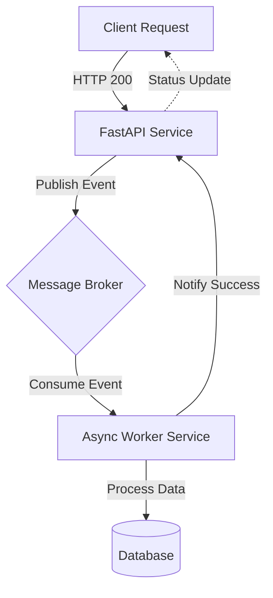

# Building Scalable Microservices with FastAPI and Event-Driven Architecture

As we navigate the backend landscape of 2026, the paradigm has shifted decisively away from monolithic RESTful services toward high-throughput, event-driven architectures. Python remains a dominant force in this ecosystem, but its traditional synchronous nature often conflicts with modern scalability requirements. Enter FastAPI: a framework designed specifically to leverage Python's async capabilities while maintaining type safety and performance. This post explores how to integrate FastAPI microservices into a resilient event-driven mesh, ensuring your system can handle the demanding workloads of 2026 without sacrificing developer velocity.

## The 2026 Backend Landscape

The current architectural landscape demands systems that are not just functional, but resilient and decoupled. In 2026, businesses require real-time data processing where latency is measured in milliseconds rather than seconds. Traditional synchronous request-response cycles often create bottlenecks when dealing with external dependencies like third-party APIs, databases, or AI inference engines.

FastAPI addresses this by providing native support for `async/await`, allowing the application to yield control during I/O operations. However, true scalability requires more than just an async framework; it demands an event-driven philosophy. By decoupling producers from consumers via a message broker, you introduce resilience against transient failures. If a downstream service is momentarily down, events queue up rather than causing request timeouts or cascading failures.

This shift matters because it allows for horizontal scaling of specific services independently. You can scale your data processing workers without scaling your API gateway. Furthermore, the integration of Large Language Models (LLMs) into backend workflows necessitates asynchronous pipelines where prompts are queued and completions processed in parallel. A synchronous architecture would serialize these expensive operations, leading to unacceptable latency spikes.

## Architecting the Event-Driven Backbone

Designing a scalable event-driven system requires a clear separation between the API layer (synchronous, request-response) and the processing layer (asynchronous, event-driven). The core of this architecture relies on a durable message broker that acts as the central nervous system for your microservices.

Below is a high-level topology illustrating how FastAPI services interact with a message broker to handle background tasks. Notice how the API service emits events after validation but before committing heavy processing, allowing immediate HTTP success responses to clients.



In this topology, the `FastAPI` service handles incoming HTTP requests. Upon validation, it publishes a message to the broker (e.g., Redis Streams, Kafka, or NATS) and returns immediately. The `Worker` service consumes these messages asynchronously to perform heavy lifting like file processing, data aggregation, or external API calls. This decoupling ensures that the API does not block on slow operations.

The choice of broker is critical for 2026 scalability. While Redis is excellent for low-latency tasks and local deployments, Apache Kafka provides the durability and throughput required for enterprise-grade event streams. The architecture above remains abstract enough to support either technology depending on your specific latency and consistency requirements.

## Implementation Patterns in FastAPI

Translating this architecture into code requires careful handling of Pydantic models and async contexts. Below are two critical components: an endpoint that emits an event after validation, and a worker pattern for consuming those events.

### 1. The API Endpoint (Event Emitter)

The endpoint must validate input quickly and emit the event without waiting for the processing to complete.

```python
from fastapi import FastAPI, BackgroundTasks
from pydantic import BaseModel
import asyncio

app = FastAPI()

class ProcessRequest(BaseModel):
    data: str
    priority: int = 1

@app.post("/process")
async def process_item(request: ProcessRequest):
    # Emit event to broker (simulated here with background task)
    # In production, this would be a direct publish to Kafka/Redis
    await asyncio.sleep(0.1) 
    
    return {
        "status": "accepted",
        "message": f"Task ID {request.data} queued for processing."
    }
```

In the implementation above, we use `FastAPI`'s background task capability to abstract the broker interaction. In a production environment, you would replace the sleep with a direct call to your broker client (e.g., `producer.send()`). The key here is that the endpoint returns an HTTP 200 immediately. This confirms receipt to the client while the heavy work happens off-thread and asynchronously.

### 2. The Worker Service (Event Consumer