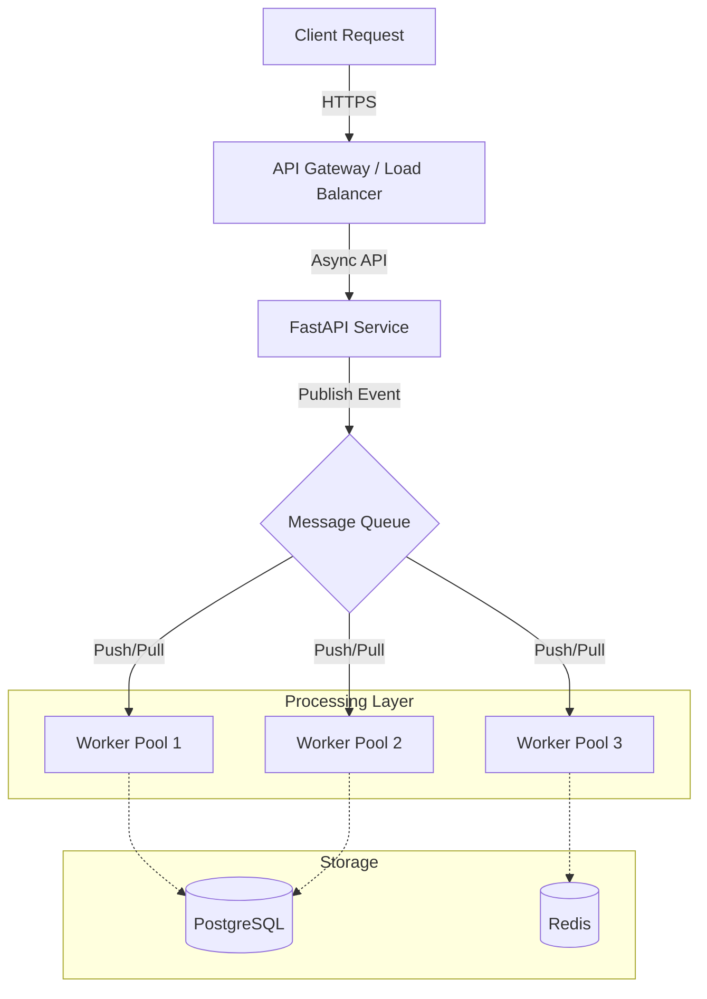

# Building Scalable Microservices with FastAPI and Event-Driven Architecture

The backend engineering landscape of 2026 demands a fundamental shift in how we handle concurrency, state management, and inter-service communication. While synchronous REST APIs remain relevant for direct user interactions, the backbone of high-throughput systems increasingly relies on asynchronous, event-driven patterns. FastAPI has emerged as the de facto standard for Python microservices due to its non-blocking I/O capabilities and Pydantic-based validation, but integrating it with a robust message broker is essential for true scalability. This post explores the architectural decisions required to build resilient, high-performance systems using FastAPI and event-driven architecture.

## The 2026 Async Landscape

In modern distributed systems, the synchronous request-response model creates bottlenecks when dealing with I/O-bound operations like database queries or external API calls. By 2026, Python’s `asyncio` runtime has matured significantly, allowing FastAPI to handle thousands of concurrent connections without spawning heavy threads for each request. This is critical for microservices where latency must be minimized.

However, pure async HTTP endpoints are not enough for decoupling services. A synchronous API blocks the thread pool if a downstream service fails or times out. An event-driven architecture solves this by allowing the API to emit an event and return immediately, while background workers handle the heavy lifting asynchronously. This pattern ensures that:
- **API Availability** remains high even during backend processing failures.
- **Scalability** increases because compute resources are pooled rather than held per request.
- **Resilience** improves as services can retry failed events independently of the original client session.

The core challenge lies in choosing the right message broker and managing the lifecycle of these events without introducing coupling that negates the benefits of microservices.

## Architectural Blueprint & Tooling

Designing the data flow requires a clear separation between the API layer (synchronous) and the processing layer (asynchronous). The following diagram illustrates a standard event-driven pattern where FastAPI services publish to a message queue, and worker processes consume those events for long-running tasks.



Selecting the message broker is a critical architectural decision that impacts throughput and complexity. The following table compares the most common options for Python-based microservices in 2026:

| Feature | RabbitMQ | Apache Kafka | Redis Streams | NATS |
| :--- | :--- | :--- | :--- | :--- |
| **Primary Use Case** | Task Queues, RPC | Event Streaming, Logs | High-speed Caching/Events | High-throughput Pub/Sub |
| **Throughput** | Moderate (50k msg/s) | Very High (1M+ msg/s) | High (100k+ msg/s) | Extreme (10M+ msg/s) |
| **Persistence** | Yes (Disk/In-Mem) | Yes (Log-based) | In-Mem (TTL based) | No (Transient usually) |
| **Complexity** | Medium | High | Low | Very Low |
| **Python Support** | Excellent (`pika`) | Good (`kafka-python`) | Excellent (`redis-py`) | Excellent (`nats-py`) |

For most general-purpose microservices requiring durability and reprocessing, RabbitMQ or Kafka is preferred. Redis Streams are ideal for high-frequency updates where persistence beyond a few minutes isn't needed.

## Implementation Patterns & Code

Implementing this architecture in FastAPI requires careful handling of the async event loop to avoid blocking operations. Below is an example of a FastAPI service that accepts a user action and emits a background task via a message queue (using `redis-py` for streams as a lightweight example).

```python
# app/events.py
import asyncio
from fastapi import FastAPI, BackgroundTasks
from redis import Redis
from pydantic import BaseModel

app = FastAPI()
redis_client = Redis(host='localhost', port=6379)

class UserAction(BaseModel):
    user_id: int
    action_type: str
    payload: dict

@app.post("/actions")
async def process_action(action: UserAction, background_tasks: BackgroundTasks):
    # 1. Validate and accept request immediately
    # 2. Emit event to Redis Stream for async processing
    redis_client.xadd(
        "user_actions_stream", 
        {"user_id": action.user_id, "action": action.action_type},
        maxlen=10000
    )
    
    # 3. Return success response without waiting for completion
    return {"status": "accepted", "event_id": redis_client.xinfo('user_actions_stream')}

# Background worker logic typically lives in a separate service
async def consume_events():
    stream = await redis_client.xread({"user_actions_stream": 0}, count=1, block=1)
    if stream:
        for _, message in stream[0]:
            # Process the event asynchronously
            process_message(message) 
```

The consumption side requires a dedicated worker service that runs continuously. This decouples the API from the business logic execution time. Key implementation details include:
- **Idempotency:** Consumers must handle duplicate messages to ensure data consistency, as message queues may redeliver failed tasks.
- **Backpressure Management:** If processing is slower than ingestion, the queue will grow. You must monitor queue depth and scale workers dynamically.
- **Error Handling:** Do not swallow exceptions in consumers. Log errors and potentially mark the message for dead-letter handling if retries are exhausted.

## Operational Resilience & Pitfalls

Scaling an event-driven FastAPI system introduces specific operational risks that must be managed proactively. The primary pitfall is coupling through shared state; ensure that your workers do not block on external calls that could starve the queue. Furthermore, you must implement observability standards immediately. Without distributed tracing, debugging event flow failures across multiple services becomes impossible.

To maintain system health, adhere to the following best practices:
- **Implement Dead Letter Queues (DLQ):** Route failed messages to a DLQ for manual inspection rather than crashing the worker loop.
- **Use Type Safety:** Leverage Pydantic models in your message payloads to ensure strict schema validation before processing logic runs.
- **Monitor Latency vs Throughput:** Use metrics like `queue_length`, `processing_time_p99`, and `error_rate` to trigger auto-scaling policies in Kubernetes or Docker Swarm environments.

Looking ahead, the integration of AI agents into these architectures is becoming standard. In 2026, you will likely see FastAPI services emitting events that trigger autonomous AI workflows for anomaly detection or predictive maintenance. The architecture must remain agnostic to the specific intelligence layer, allowing you to swap model providers without rewriting the core event pipeline.

## Conclusion

Building scalable microservices with FastAPI in an event-driven context is no longer optional for high-performance backend systems; it is a necessity for handling modern I/O loads. By leveraging Python's async capabilities and decoupling logic through message queues, you achieve a system that is resilient to failures and capable of horizontal scaling. The choice of tooling—whether RabbitMQ or Kafka—depends on your specific throughput needs and persistence requirements, but the core pattern remains consistent: accept fast, process slow. As we move forward, maintaining strict observability and managing operational complexity will define the success of these architectures in production environments.