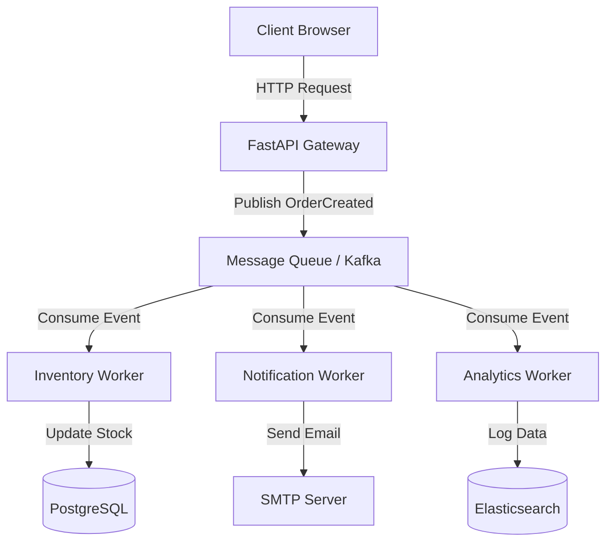

# Building Scalable Microservices with FastAPI and Event-Driven Architecture

## The 2026 Backend Landscape

As we navigate the software engineering landscape of 2026, the paradigm shift from synchronous REST-heavy architectures to event-driven systems has moved from a niche preference to an industry standard for high-performance applications. Legacy monoliths often struggle under the weight of coupled state and linear request-response cycles, leading to cascading failures during peak loads. FastAPI, with its native support for asynchronous operations and robust Pydantic validation, stands out as the optimal framework for orchestrating this transition.

The primary driver for this architectural evolution is latency reduction and throughput maximization. In a synchronous model, Service A must wait for Service B to complete before responding to the client. This creates a bottleneck known as "chaining." By contrast, an event-driven architecture decouples producers from consumers via a message broker like Apache Kafka, RabbitMQ, or NATS. FastAPI handles the request-response layer efficiently using `async/await`, while background tasks offload heavy processing to workers listening on the event bus.

This separation of concerns allows teams to scale horizontally at specific layers. You can spin up more API servers without impacting data processing queues, and you can add new worker services that react to events without modifying the core API logic. For senior developers designing systems in 2026, understanding how to bridge the gap between synchronous HTTP requests and asynchronous event streams is no longer optional; it is a requirement for building resilient, cloud-native infrastructure. The choice of technology stack now heavily favors tools that embrace concurrency primitives like `asyncio`, ensuring that the application does not block the main event loop during I/O operations.

## Architectural Design and Event Flow

Designing a scalable microservice system requires a clear mental model of how data moves between components. In this architecture, the FastAPI service acts as the API Gateway or Controller layer, accepting HTTP requests and immediately acknowledging them before performing heavy computation. Instead of blocking the thread to process business logic, it publishes an event to a message broker.

The following diagram illustrates the high-level flow of an order processing system. The User interacts with the FastAPI Gateway, which triggers an OrderCreated event. This event is ingested by the Message Queue. Separate worker services listen for specific events—Inventory Service handles stock deduction, Notification Service sends emails, and Analytics Service updates metrics.



This decoupling is critical for fault isolation. If the Inventory service fails to process an event, it does not crash the entire API gateway. The message broker ensures that the event is persisted until a consumer can successfully process it. This pattern allows you to implement retry logic and dead-letter queues naturally. When designing this architecture, ensure your FastAPI services are stateless regarding the message queue connection; manage the connection lifecycle via application startup and shutdown events to prevent resource leaks in containerized environments like Kubernetes.

## Implementation Patterns and Code

Implementing event-driven patterns with FastAPI requires careful handling of dependencies and background tasks. A common pitfall is using blocking calls inside async functions, which defeats the purpose of asynchronous processing. We will demonstrate two key components: an API endpoint that triggers an event, and a worker service that consumes it.

First, we define the FastAPI application. This endpoint accepts a payload, validates it using Pydantic models, and publishes a message to the queue asynchronously. Note the use of `publish_event` which should be a non-blocking function wrapping the underlying library like `aiokafka`.

```python
from fastapi import FastAPI, HTTPException
from pydantic import BaseModel
import asyncio

app = FastAPI()

# Mock publishing to a message broker (e.g., aiokafka)
async def publish_event(topic: str, payload: dict):
    # In production, use aio-pika or aiokafka here
    await asyncio.sleep(0.1) # Simulate network latency
    print(f"Published event to {topic}: {payload}")

class OrderCreateRequest(BaseModel):
    user_id: str
    product_id: str
    quantity: int

@app.post("/orders")
async def create_order(order: OrderCreateRequest):
    try:
        await publish_event("order.created", {
            "user_id": order.user_id,
            "product_id": order.product_id,
            "quantity": order.quantity
        })
        return {"status": "accepted", "event_id": "evt_12345"}
    except Exception as e:
        raise HTTPException(status_code=500, detail=str(e))
```

The second component is the worker application. This service does not handle HTTP requests but listens for messages from the queue. It should run indefinitely or be managed by a process manager like Supervisor or Docker Swarm. The consumer must ensure idempotency to handle duplicate messages that may occur during network retries.

```python
import asyncio
from fastapi import FastAPI
from aiokafka import AIOKafkaConsumer

app = FastAPI()

class InventoryProcessor:
    async def process_order(self, message):
        payload = message.value.decode('utf-8')
        print(f"Processing order from queue: {payload}")
        # Simulate inventory check logic
        await asyncio.sleep(1.0)
        return True

async def start_consumer():
    consumer = AIOKafkaConsumer(
        'order.created',
        bootstrap_servers=['localhost:9092'],
        group_id='inventory-group'
    )
    await consumer.start()
    async for message in consumer:
        try:
            processor = InventoryProcessor()
            await processor.process_order(message)
       