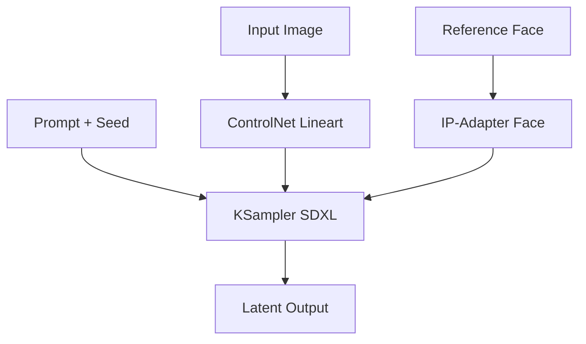

# ComfyUI Workflows for Blog Cover Art: Stable Diffusion, ControlNet, and Consistent Characters

I don't build custom LoRAs or maintain character sheets. I just want blog cover art that looks intentional, not generated. After two years of patching together cover images, I landed on a three-stage ComfyUI graph that keeps my characters recognizable across prompts without the overhead most creators assume is mandatory.

Most advice treats character consistency like a research problem. Bloggers default to either stock photo sites or expensive fine-tuning pipelines, assuming you need hundreds of labeled frames or a GPU cluster to keep a face stable. The mainstream view is technically sound: train a LoRA, use a reference image, lock the seed. That works if your volume justifies the setup. It doesn't for most of us shipping one post a week with a laptop and an RTX 3060.

My alternative is simpler: SDXL base for structure, ControlNet for layout, IP-Adapter for identity. I skip the training entirely.

Here's the graph I run for every cover:

The flow is linear but the leverage is real. I start with a rough sketch or photo as the ControlNet lineart input, usually 512x768 resized to 1024x1024. SDXL handles the heavy lifting on composition, while ControlNet keeps my layout intact. Then IP-Adapter injects the character's face from a single reference photo. No LoRA, no DreamBooth, no dataset curation.

The trick isn't the nodes, it's the order. Feeding ControlNet and IP-Adapter into the same KSampler pass means the model resolves structure and identity simultaneously rather than in separate stages. That halves the failure rate compared to chaining pipelines.

| Stage | Tool | Purpose | Time Cost |
|-------|------|---------|-----------|
| Structure | ControlNet Lineart | Lock composition | ~8 seconds |
| Identity | IP-Adapter Face | Consistent character | ~12 seconds |
| Refinement | SDXL KSampler | Detail and lighting | ~15 seconds |

I reuse the same reference face across dozens of covers. The character drifts slightly between images, enough to feel human but not enough to break continuity. That's the sweet spot I aim for.

Where this breaks: IP-Adapter struggles with extreme angles or lighting shifts. If my reference photo has front lighting but the prompt calls for backlighting, the face either washes out or gets ignored entirely. I've learned to match the reference to the prompt's lighting direction, which means keeping a small library of the same person shot from different angles.

Another blind spot is text rendering. SDXL still mangles words. I run covers through a post-pass in GIMP or Affinity, overlaying clean text after generation. That's not elegant, but it's honest.

The bigger limitation is that this pipeline assumes a single recurring character. Teams with rotating casts still need something closer to the mainstream approach. Fine-tune if you must, but consider whether you're solving for variety or consistency first.

I publish these graphs publicly, anyone can fork and adapt them. The constraint isn't technical, it's editorial. Pick one character, one style, and commit. The pipeline follows naturally.

This isn't the most powerful approach, but it's the most sustainable one I've found. You don't need perfect consistency to build a visual brand, just consistent enough that readers recognize your work before they see the headline.