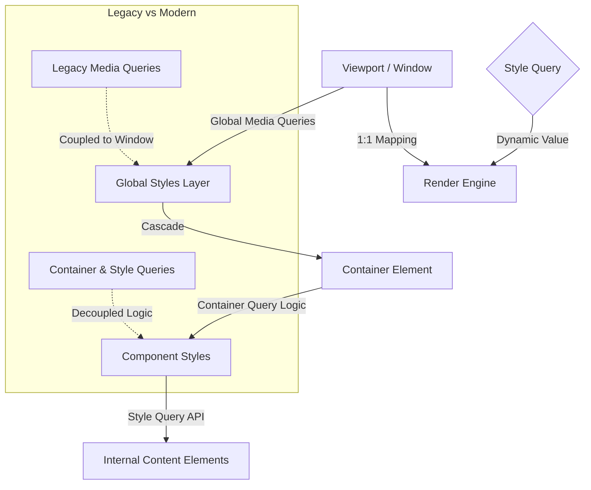

# CSS Container Queries and Style Queries: Responsive Design Beyond Media Queries

In the rapidly evolving landscape of web development in 2026, responsive design has transcended its early days of simple viewport breakpoints. The industry standard is shifting from device-centric layouts to content-centric architectures. This transition is driven by the widespread adoption of CSS Container Queries and the emerging Style Queries API. For senior engineers and architects, understanding this shift is no longer optional; it is a requirement for building scalable, maintainable component libraries that function seamlessly across varying device contexts without relying on global viewport hacks.

## The 2026 Landscape: Why Component Self-Containment Matters

The traditional model of responsive design relied heavily on `@media` queries targeting the viewport. While effective at a high level, this approach created tightly coupled layouts where components depended on the parent container's context or the global window size. This resulted in brittle codebases where a single component could break if wrapped in a grid with specific padding requirements.

In 2026, browser support for CSS Container Queries is universal across Chrome, Firefox, Safari, and Edge. The modern web demands that components be agnostic to their placement. A navigation bar should behave the same way whether it sits inside a sidebar, a header, or a floating modal. This decoupling allows teams to build atomic design systems where visual logic travels with the component, not just the viewport.

The significance of this shift extends beyond aesthetics. It fundamentally changes how we structure our CSS architecture. Instead of cascading styles based on global states (like `min-width: 768px`), we now query specific containers for their internal dimensions. This reduces specificity wars and allows for more predictable styling inheritance. Furthermore, the integration of Style Queries provides a granular way to inspect content properties directly, moving away from pixel-based constraints toward semantic understanding of the layout itself.

## Technical Deep-Dive: Implementing Container and Style Queries

Implementing these technologies requires a shift in mindset from "breaking points" to "adaptive logic." The core syntax for container queries utilizes the `@container` rule, which allows CSS selectors to target elements based on the size or aspect ratio of their direct parent. However, the newer Style Queries API offers a more robust mechanism for querying content properties directly within the style block, enabling dynamic adjustments without relying solely on DOM structure.

Consider a pricing card component that needs to switch layouts from stacked to side-by-side based on its own width, not the window size. The following example demonstrates a modern implementation using container queries:

```css
.pricing-card {
  /* Base styles */
  display: flex;
  gap: 1rem;
  padding: 1.5rem;
  border-radius: 8px;
  background: #f9fafb;
}

/* Container Query: Target the card itself */
@container (min-width: 400px) {
  .pricing-card {
    flex-direction: row;
    align-items: center;
  }
  
  /* Adjust internal spacing based on container size */
  @container (min-width: 600px) {
    .pricing-card::before {
      content: "Premium";
      font-weight: bold;
      display: block;
    }
  }
}
```

While `@container` handles layout shifts, Style Queries allow for more dynamic styling based on specific CSS custom properties or internal state. This is particularly useful when components need to react to their own computed values rather than arbitrary pixel thresholds. For instance, a modal component can use style queries to determine if its content overflows the viewport height without checking the body dimensions.

## Architectural Comparison and Tooling Landscape

To understand where these technologies fit into your stack, it is essential to compare them against legacy methods. The architectural diagram below illustrates how responsiveness signals flow from the viewport down to the component level in a modern 2026 architecture.



The diagram highlights the decoupling of global styles from component logic. In legacy systems, the Viewport directly dictates component behavior. In modern architectures using Container Queries, the Container becomes an intermediary that encapsulates its own rules. This is a critical architectural pivot for monorepos and design systems.

| Feature | Media Queries | Container Queries | Style Queries |
| :--- | :--- | :--- | :--- |
| **Scope** | Global Viewport | Direct Parent Container | Content Properties |
| **Dependency** | Window Size | Container Width/Height | Element State |
| **Coupling** | High (Global) | Low (Component) | None (Self-Contained) |
| **Browser Support** | Universal | Universal (2026) | Emerging (Chrome+) |
| **Best Use Case** | Page Layouts | Component Layouts | Dynamic Styling Logic |

The table above summarizes the distinct roles these technologies play. Media queries remain necessary for global page layouts, such as hiding navigation on mobile screens. However, Container Queries are superior for component logic, ensuring that a button group behaves correctly regardless of whether it is inside a header or a footer. Style Queries represent the frontier, allowing CSS to query computed values like `line-height` or specific custom properties within the style block itself, reducing the need for JavaScript observers.

## Best Practices, Pitfalls, and Future Outlook

Adopting these advanced CSS capabilities requires discipline. As a senior architect, you must guide the team on when to use which tool to prevent technical debt. Here are the critical best practices for implementation in 2026:

*   **Avoid Over-Querying:** While Style Queries are powerful, do not use them for every style change. Reserve them for cases where layout logic depends on content properties rather than just dimensions.
*   **Favor Container Queries for Layouts:** Use `@container` for grid and flexbox adjustments within components. This keeps the CSS isolated to the component file or module.
*   **Performance Budgeting:** Container queries add a calculation overhead per container. For high-frequency rendering applications, ensure you are not nesting containers unnecessarily deep.
*   **Fallback Strategies:** Always provide a default style that works when the container query engine is disabled or in older browser versions.

Common pitfalls include relying solely on container queries for global layout shifts (like switching from mobile to desktop viewports). This is incorrect; global viewport changes should still use media queries. Another common mistake is setting `container-type: inline-size` on every element, which can degrade performance if not managed by a build tool or CSS-in-JS bundler.

Looking toward the future, the convergence of Style Queries and Web Components will likely lead to even more granular control over rendering. In 2026, we anticipate that container queries will become part of the core layout engine, potentially reducing the need for JavaScript-based responsive utilities. This evolution promises a CSS ecosystem where logic is declarative, self-contained, and performant.

## Conclusion

The transition from media queries to container and style queries marks a fundamental maturity in web development. By 2026, relying solely on viewport breakpoints is no longer sufficient for building robust application interfaces. Container queries empower components to manage their own responsiveness, fostering a modular architecture that scales with complexity. Style Queries further extend this capability by allowing direct interaction with content properties.

For technical teams aiming for longevity in codebases, adopting these standards now ensures that future designs remain maintainable and decoupled from the vagaries of device dimensions. It is a shift from "fitting content to screens" to "adapting screens to content."