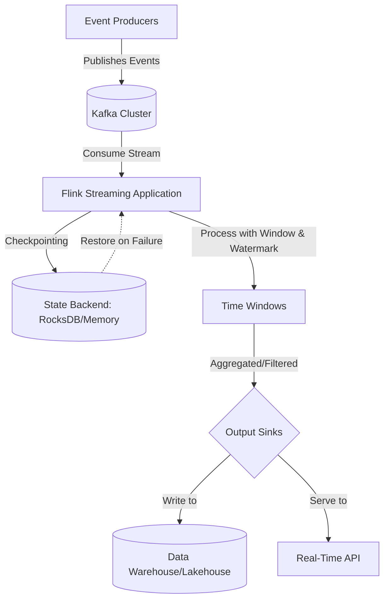

# Data Engineering at Scale: Building Real-Time Streaming Pipelines

In the data landscape of 2026, the distinction between batch and stream processing has effectively dissolved into a unified continuum known as continuous data integration. While legacy architectures often relied on Lambda patterns to separate speed layers from accuracy layers, modern engineering teams now prioritize Kappa-style architectures where real-time state is maintained across all layers. This shift is driven by the necessity for sub-second decision-making in fraud detection, dynamic pricing, and high-frequency trading environments. However, scaling these systems introduces complex challenges regarding fault tolerance, schema evolution, and exactly-once semantics that batch processing never faced to the same degree.

## The 2026 Landscape of Real-Time Data

The current architectural paradigm demands more than just throughput; it requires consistency guarantees in an environment where data arrives at high velocity. In 2026, the standard expectation for enterprise-grade pipelines is not merely "eventual consistency" but strong consistency within acceptable latency windows. This has elevated Apache Kafka from a simple message queue to the backbone of durable event storage, while Apache Flink has emerged as the preferred engine for stateful stream processing due to its native exactly-once guarantees and sophisticated windowing capabilities.

Why does this matter? Because data staleness is no longer a technical metric but a business risk. A streaming pipeline that processes millions of events per second without checkpointing fails silently during failures, leading to duplicate billing or missed alerts. The 2026 stack requires engineers to treat the stream as a source of truth rather than an append-only log. This necessitates rigorous handling of schema evolution (e.g., Avro IDL updates) and backpressure management, which are often overlooked in early-stage implementations.

## Architectural Foundations for Exactly-Once Semantics

Building a robust pipeline requires a deep understanding of the underlying mechanisms that ensure data integrity. The architecture typically consists of producers writing to Kafka topics, Flink consuming records, and sinks writing to storage or serving APIs. Crucially, exactly-once semantics are achieved through a combination of transactional writes in the source and sink systems, alongside Flink's checkpointing mechanism which uses barriers to determine state snapshots.

State management is the heart of this architecture. Without proper state backend configuration (such as RocksDB for larger state sizes), memory pressure can lead to OutOfMemory errors under load. Furthermore, watermarking must be implemented to handle late-arriving data. If a window calculation occurs before all data for that time range has arrived, the result will be inaccurate.



In the diagram above, the checkpointing loop is critical. When a failure occurs, Flink restores state from the last consistent snapshot rather than replaying all logs blindly. This minimizes recovery time objectives (RTO) significantly compared to restarts in older systems. Additionally, schema evolution must be handled via Schema Registry integration; otherwise, deserialization failures will cause backpressure that propagates upstream and disrupts producer throughput.

## Implementation Patterns and State Management

To implement these patterns effectively, engineers often utilize Flink SQL for declarative logic while reserving the DataStream API for complex stateful transformations that require custom state backends. Below are examples demonstrating how to define a windowed aggregation with key-by semantics and how to manage state in Java for more granular control.

First, consider a streaming SQL definition that handles schema evolution implicitly by utilizing `CREATE TABLE AS SELECT` with Kafka connectors configured to read from an Avro topic:

```sql
-- Flink SQL: Aggregating user session events with watermarking
CREATE TABLE user_sessions (
    user_id VARCHAR NOT NULL,
    event_type VARCHAR,
    timestamp BIGINT,
    amount DECIMAL(10, 2)
) WITH (
    'connector' = 'kafka',
    'topic' = 'user-events',
    'properties.bootstrap.servers' = 'kafka:9092',
    'format' = 'avro',
    'scan.startup.mode' = 'latest-offset'
);

CREATE TABLE session_windows (
    user_id VARCHAR,
    window_start BIGINT,
    window_end BIGINT,
    total_amount DECIMAL(10, 2),
    event_count INT
) WITH (
    'connector' = 'jdbc',
    'url' = 'jdbc:postgresql://postgres-db/session_store',
    'username' = 'analytics',
    'password' = 'secure_password',
    'table' = 'realtime_sessions'
);

INSERT INTO session_windows
SELECT 
    user_id,
    WATERMARK AS window_start,
    TIMESTAMP + INTERVAL '1' HOUR AS window_end,
    SUM(amount) AS total_amount,
    COUNT(*) AS event_count
FROM user_sessions
GROUP BY user_id, TUMBLE(event