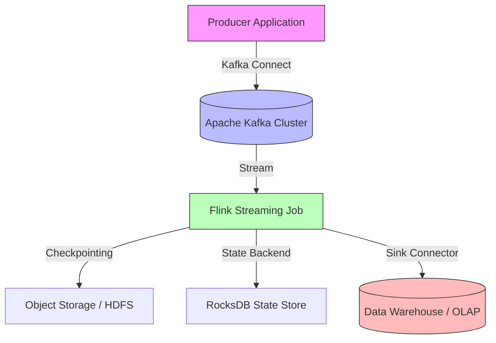

# Data Engineering at Scale: Building Real-Time Streaming Pipelines

The data engineering landscape in 2026 has shifted decisively from batch-centric Lambda architectures toward unified Kappa-style streaming pipelines. In high-frequency trading, fraud detection, and personalized recommendation engines, the distinction between "real-time" and "near real-time" is no longer academic; it is a business-critical metric. As data volumes explode with IoT sensors and digital transaction logs, traditional ETL processes cannot keep pace with latency requirements. This post explores the architectural patterns necessary to build robust, exactly-once streaming pipelines using Apache Kafka and Apache Flink, focusing on scalability and state management.

## The 2026 Real-Time Imperative

In modern distributed systems, the definition of "scale" has evolved. It is no longer just about throughput; it is about consistency guarantees under high load. The primary challenge today is managing stateful computation across fault-tolerant clusters without introducing unacceptable latency penalties.

The industry standard has matured significantly regarding streaming SQL capabilities. We are moving away from custom Java/Scala UDFs for simple aggregations toward declarative Streaming SQL, which offers better optimization and maintainability. However, the complexity lies in handling schema evolution—where data producers update their payloads without breaking downstream consumers—and maintaining exactly-once semantics across distributed transactions.

The cost of failure is higher than ever. A streaming pipeline that drops messages or duplicates events during a checkpoint failure can invalidate financial ledgers or skew fraud models. Therefore, the architectural decision to use stateful processing engines like Flink over stateless stream processors is driven by the need for precise fault recovery mechanisms. The 2026 landscape demands systems that are not only fast but also resilient to infrastructure churn without manual intervention.

## Architectural Blueprint for Scalability

To build a production-grade streaming pipeline, we must decouple ingestion from processing and ensure that state is managed externally or within the compute engine with high durability. The canonical architecture relies on Kafka as the durable log and Flink as the stateful processing engine. This separation allows producers to scale independently of consumers while maintaining a single source of truth for event ordering.

Below is the architectural data flow diagram illustrating how events move from ingestion sources through the Flink job to downstream data lakes or warehouses.



In this topology, the Kafka cluster acts as the immutable event log. Flink reads directly from Kafka offsets, ensuring that no data is lost during application restarts. The critical component here is the RocksDB state backend. Unlike simple in-memory state which can cause OOM errors under scale, RocksDB persists state to disk while keeping it accessible for fast lookups during window aggregations. This hybrid approach ensures that we maintain high throughput even as the state size grows into the terabytes range.

## Implementation Patterns: SQL & State

The core of any streaming application is how it handles transformation logic. While imperative Java/Scala APIs offer fine-grained control, Streaming SQL provides a declarative abstraction that allows the optimizer to choose the most efficient execution plan. A critical pattern in 2026 is combining Streaming SQL with dynamic schema handling.

Consider a scenario where we are aggregating transaction events by window and user ID. We must handle exactly-once semantics by leveraging Flink's built-in checkpointing mechanism alongside two-phase commit for sinks.

```sql
-- Flink SQL: Windowed Aggregation with Deduplication
CREATE TABLE transactions (
    id STRING,
    amount DECIMAL(10, 2),
    event_time TIMESTAMP(3),
    watermark AS TO_TIMESTAMP(MILLIS(FROM_UNIXTIME(event_time)))
) WITH (
    'connector' = 'kafka',
    'topic' = 'raw_transactions',
    'properties.bootstrap.servers' = 'kafka-broker:9092'
);

CREATE TABLE aggregated_metrics (
    user_id STRING,
    window_start TIMESTAMP(3),
    total_amount DECIMAL(10, 2)
) WITH (
    'connector' = 'jdbc',
    'url' = 'jdbc:postgresql://warehouse-db:5432/analytics',
    'table' = 'daily_metrics'
);

-- Exactly-once aggregation with deduplication
INSERT INTO aggregated_metrics
SELECT 
    user_id,
    TUMBLE_START(event_time, INTERVAL '1' HOUR) AS window_start,
    SUM(amount) AS total_amount
FROM transactions
GROUP BY user_id, TUMBLE(event_time, INTERVAL '1' HOUR);
```

However, schema evolution is a persistent operational hazard. If an upstream producer adds a `country_code` field to the event payload, downstream consumers must handle this gracefully without pipeline failure. Flink supports schema evolution through Avro or Protobuf registries. The following Java snippet demonstrates configuring the state backend for high-scale durability:

```java
// Configuring State Backend and Checkpointing for High Availability
StreamExecutionEnvironment env = StreamExecutionEnvironment.getExecutionEnvironment();
env.setStateBackend(new RocksDBStateBackend("hdfs://namenode:9000/flink-statebackend"));

env.enableCheckpointing(30000); // 30 second checkpoint interval
env.getCheckpointConfig().setCheckpointTimeout(60000);
env.getCheckpointConfig().enableExternalizedCheckpoints(true);

// Enable exactly-once semantics via two-phase commit for sinks
env.getConfig().setCheckpointingMode(CheckpointingMode.EXACTLY_ONCE);
```

This configuration ensures that state snapshots are written to HDFS, providing durability even if the cluster loses connectivity. The `RocksDBStateBackend` is essential for large-scale aggregations where keeping all state in memory would violate the RAM-to-CPU ratio constraints of commodity hardware.

## Operational Trade-offs & Tooling Comparison

Choosing the right stack involves balancing consistency guarantees against operational overhead. While Apache Spark Structured Streaming offers a unified batch-streaming interface, it often suffers from higher latency due to micro-batch processing intervals (e.g., 500ms to 1s). Kafka Streams is lightweight but lacks the rich state management capabilities of Flink for complex aggregations.

The