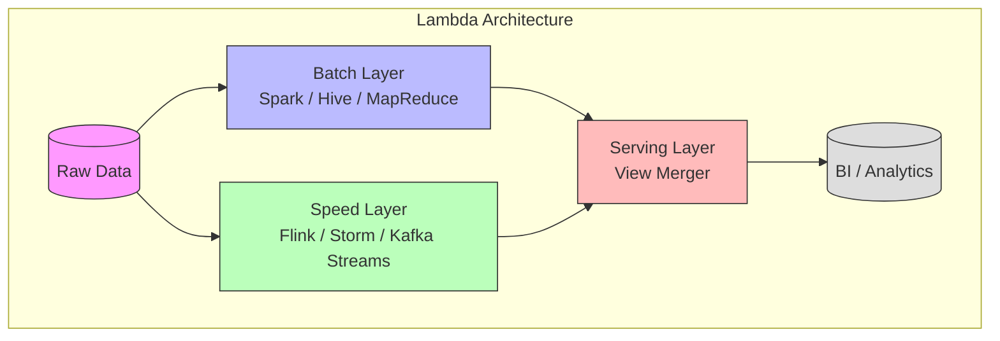
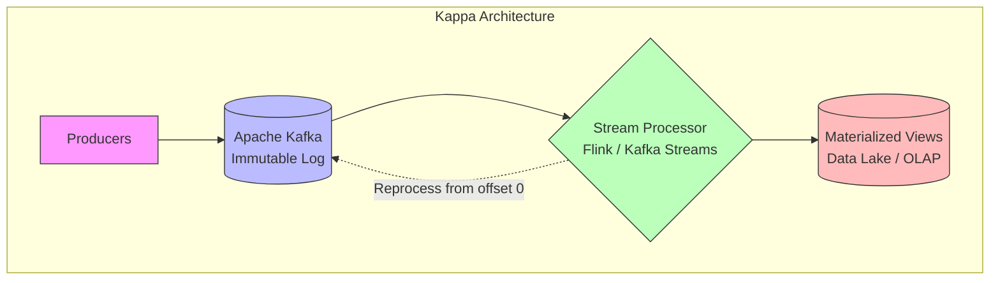
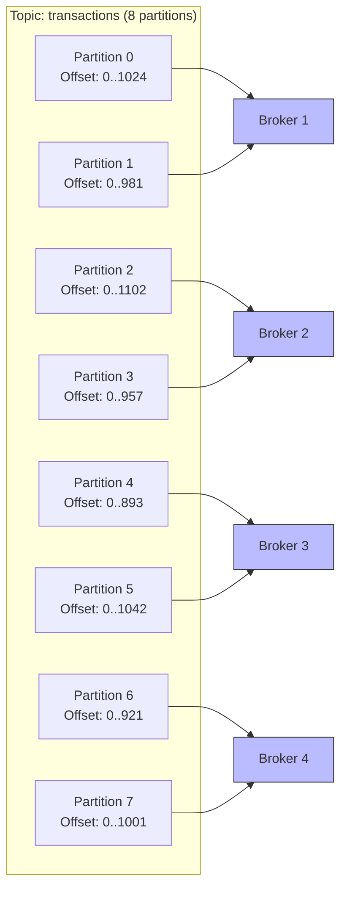
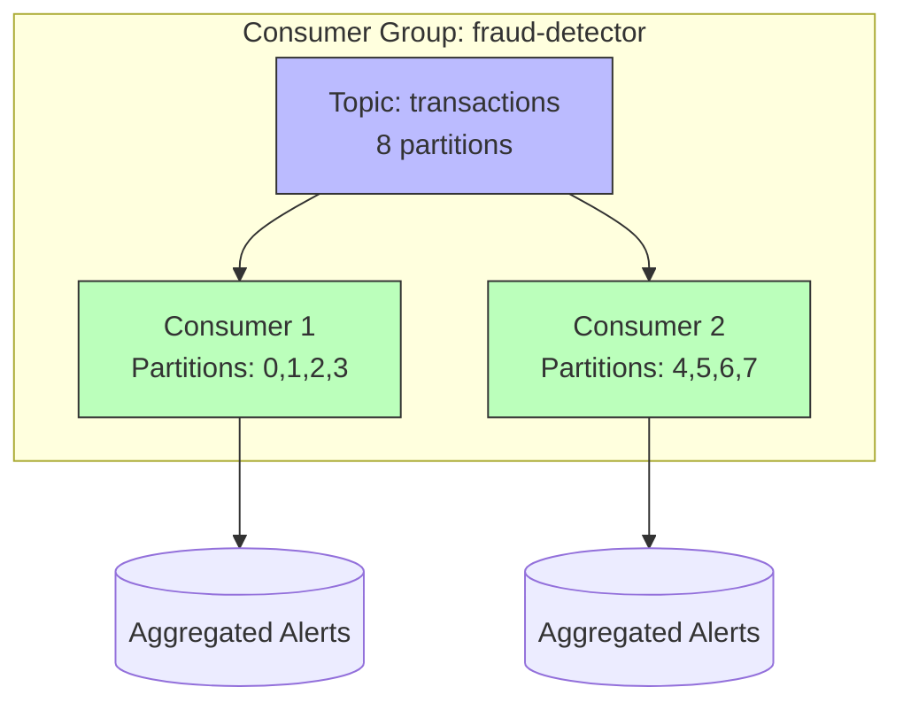
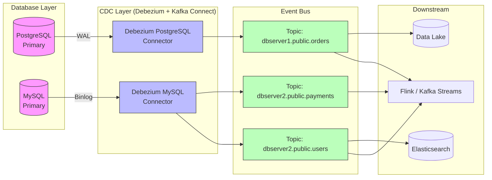
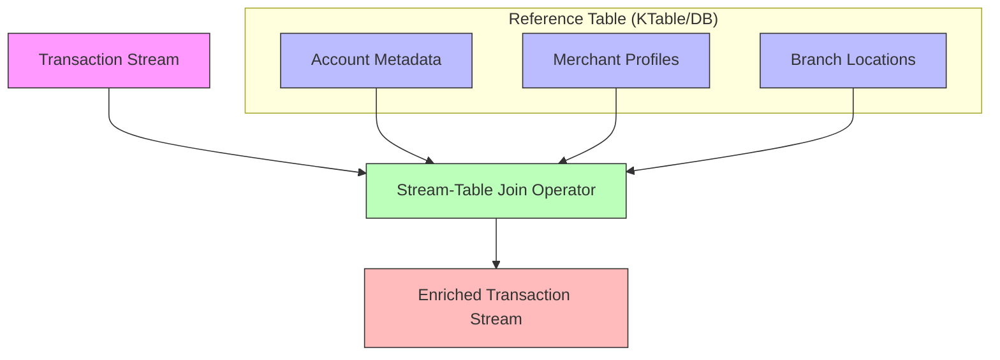
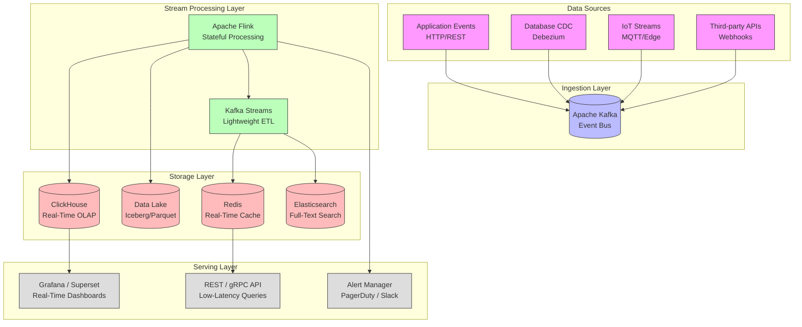

# Data Engineering at Scale: Building Real-Time Streaming Pipelines

The data engineering landscape in 2026 has shifted decisively from batch-centric Lambda architectures toward unified Kappa-style streaming pipelines. In high-frequency trading, fraud detection, and personalized recommendation engines, the distinction between "real-time" and "near real-time" is no longer academic; it is a business-critical metric. As data volumes explode with IoT sensors and digital transaction logs, traditional ETL processes cannot keep pace with latency requirements. This post explores the architectural patterns necessary to build robust, exactly-once streaming pipelines using Apache Kafka and Apache Flink, focusing on scalability and state management.

## The 2026 Real-Time Imperative

In modern distributed systems, the definition of "scale" has evolved. It is no longer just about throughput; it is about consistency guarantees under high load. The primary challenge today is managing stateful computation across fault-tolerant clusters without introducing unacceptable latency penalties.

The industry standard has matured significantly regarding streaming SQL capabilities. We are moving away from custom Java/Scala UDFs for simple aggregations toward declarative Streaming SQL, which offers better optimization and maintainability. However, the complexity lies in handling schema evolution—where data producers update their payloads without breaking downstream consumers—and maintaining exactly-once semantics across distributed transactions.

The cost of failure is higher than ever. A streaming pipeline that drops messages or duplicates events during a checkpoint failure can invalidate financial ledgers or skew fraud models. Therefore, the architectural decision to use stateful processing engines like Flink over stateless stream processors is driven by the need for precise fault recovery mechanisms. The 2026 landscape demands systems that are not only fast but also resilient to infrastructure churn without manual intervention.

According to a 2025 Confluent report, organizations using streaming platforms report:
- **3.2× faster** time-to-insight for new data products
- **67% reduction** in data pipeline failures after adopting schema registries
- **40–60% lower** total cost of ownership compared to Lambda-style batch+speed layer architectures

These numbers underscore why streaming-first architectures have become the default choice for new data platform builds.

## Streaming Architecture Patterns: Kappa vs Lambda

Before diving into tooling, it is essential to understand the two dominant architectural paradigms that shape streaming pipelines: Lambda Architecture and Kappa Architecture.

### Lambda Architecture

Lambda Architecture combines batch and stream processing to provide comprehensive data views. The batch layer processes historical data for accuracy, the speed layer handles real-time data for low latency, and the serving layer merges results from both.



**Pros:** High accuracy from batch reprocessing, well-understood patterns.

**Cons:** Code duplication across batch and speed layers, higher operational complexity, results merging is error-prone (compensating joins), and maintaining two separate codebases increases engineering overhead by an estimated 40–60%.

### Kappa Architecture

Kappa Architecture simplifies Lambda by using a single stream processing engine for both real-time and historical data. The entire data set is treated as a stream — historical replay is achieved by reprocessing from the beginning of a Kafka topic.



**Pros:** Single codebase, simpler operations, no merging complexity, natural schema evolution handling.

**Cons:** Limited batch-native tools (e.g., complex SQL joins are harder), stream processing engines must handle large state, and reprocessing large histories requires sufficient Kafka retention or tiered storage.

### When to Use Which?

| Criterion | Lambda | Kappa |
|-----------|--------|-------|
| Team maturity | High (batch + stream experts) | Medium (stream expertise only) |
| Data volume | Petabyte-scale historical | Terabyte-scale fast data |
| Late-arriving data | Handled by batch recompute | Handled by watermarking |
| Regulatory reprocessing | Full-month batch recompute | Stream replay from retention |
| Operational cost | 2× infrastructure | 1.3–1.5× infrastructure |

**Recommendation (2026):** Start with Kappa unless you have an existing batch investment or regulatory requirements for fixed-interval recomputation. The operational savings from a single pipeline codebase typically outweigh Lambda's theoretical accuracy advantages.

## Apache Kafka Deep Dive

Kafka is the de facto backbone of streaming architectures. Understanding its internals is critical for designing pipelines that do not lose data, do not duplicate events, and scale linearly with throughput.

### Topics, Partitions, and Offsets

A **topic** is a logical channel for events. Topics are split into **partitions**, which are the unit of parallelism and ordering. Each partition is an ordered, immutable sequence of records identified by monotonically increasing **offsets**.



**Key design decisions for partitions:**
- **Partition count is a scaling axis**: More partitions = more parallelism, but also more leader election overhead and file handles. A good starting point is `max(3 × broker_count, target_throughput_MBps / 10)`.
- **Partition key determines ordering**: Events with the same key go to the same partition, preserving order within that partition. No ordering is guaranteed across partitions.
- **Replication factor = 3** in production: provides tolerance for one broker failure without data loss. The trade-off is increased storage and network overhead (3× the data size).

### Consumer Groups and Rebalancing

A **consumer group** is a set of consumers that work together to read from one or more topics. Each partition is assigned to exactly one consumer in the group, enabling horizontal scaling of consumption.



**Rebalancing** occurs when consumers join or leave a group, or when partitions change. During rebalancing, all consumers stop processing and partition assignments are redistributed. This can cause processing pauses of 5–30 seconds for large groups. Modern strategies to minimize rebalancing impact include:

- **Cooperative Sticky Rebalancing** (Kafka 2.4+): Only revokes a subset of partitions at a time, allowing consumers to keep processing unaffected partitions.
- **Static Group Membership** (Kafka 2.3+): Consumers get a fixed `group.instance.id`, reducing rebalancing on restart.
- **Avoid excessive partitions per consumer**: A single consumer handling more than ~50 partitions increases rebalance time.

### Exactly-Once Semantics (EOS)

Exactly-once semantics in Kafka is achieved through three mechanisms working together:

1. **Idempotent Producer** (`enable.idempotence=true`): The producer assigns a unique Producer ID (PID) and sequence number to each message. The broker deduplicates messages based on `(PID, partition, sequence_number)`, preventing duplicates from producer retries.

2. **Transactional Producer** (`transactional.id=unique_id`): Extends idempotence to atomic writes across multiple partitions. Producers write messages as part of a transaction, which is committed or aborted atomically. Consumers can choose `isolation.level=read_committed` to only see committed messages.

3. **Consumer Offset Transactional Store**: Consumers commit offsets within the same transaction as output writes, ensuring that exactly-once processing across read-process-write is atomic.

```java
// Kafka Producer with Exactly-Once Semantics
Properties props = new Properties();
props.put("bootstrap.servers", "broker1:9092,broker2:9092");
props.put("acks", "all");
props.put("enable.idempotence", true);
props.put("transactional.id", "transactions-processor-1");

KafkaProducer<String, Transaction> producer = new KafkaProducer<>(props);
producer.initTransactions();

try {
    producer.beginTransaction();
    // Process input event
    Transaction result = process(event);
    producer.send(new ProducerRecord<>("output-topic", result));
    // Commit both offset and output atomically
    producer.sendOffsetsToTransaction(offsets, consumerGroup);
    producer.commitTransaction();
} catch (Exception e) {
    producer.abortTransaction();
}
```

**Performance trade-off**: Transactional producers add 10–25% latency overhead compared to at-least-once. Reserve EOS for idempotent-critical paths (financial transactions, inventory counts) and use at-least-once with deduplication for non-critical paths.

### Tiered Storage

Kafka 3.0+ supports **tiered storage**, moving older segment files from local broker disks to cheaper object storage (S3, GCS, Azure Blob). This allows months of retention without massive local SSD costs.

```yaml
# Broker configuration for tiered storage
log.dirs: /data/kafka
tiered.storage.enable: true
tiered.storage.s3.bucket: kafka-tiered-storage-prod
tiered.storage.local.retention.ms: 86400000   # 1 day on local SSD
tiered.storage.remote.retention.ms: 2592000000 # 30 days on S3
```

With tiered storage, you can serve Kappa Architecture reprocessing directly from the same topic without needing a separate data lake copy, simplifying the architecture significantly.

## Kafka vs Pulsar vs Redpanda: Detailed Comparison

Apache Pulsar and Redpanda have emerged as popular Kafka alternatives. Each makes different trade-offs in the storage-compute separation spectrum.

| Feature | Apache Kafka | Apache Pulsar | Redpanda |
|---------|-------------|---------------|----------|
| **Architecture** | Distributed commit log (partitioned) | Separate compute (Broker) + storage (BookKeeper) | Single-binary, zero-JVM (C++) Kafka API-compatible |
| **Storage** | Local broker disks, tiered storage to S3 | Tiered storage natively via BookKeeper + object store | Local disks with tiered storage |
| **Geo-Replication** | MirrorMaker 2 (active-passive) | Built-in geo-replication (active-active) | Built-in active-active with rpk |
| **Partition Redistribution** | Requires manual reassignment or Cruise Control | Automatic (BookKeeper segments) | Automatic via cluster rebalancing |
| **Message Deduplication** | Producer idempotence (configurable) | Built-in per-message dedup | Producer dedup + exactly-once source |
| **Latency p99** | 5–15ms | 8–20ms | 2–5ms |
| **Throughput per node** | ~200 MB/s | ~150 MB/s | ~400 MB/s (no JVM overhead) |
| **Schema Support** | Schema Registry (external) | Built-in schema registry | Schema Registry (external) |
| **Operational Complexity** | Medium-High (requires ZK/KRaft, Cruise Control) | High (two systems: brokers + BookKeeper) | Low (single binary, no deps) |
| **JVM Dependencies** | Yes (JVM-based) | Yes (JVM-based) | No (C++, Seastar async runtime) |
| **Cloud-Native** | Good (Strimzi, Confluent Operator) | Good (StreamNative) | Excellent (Native Kubernetes operator) |
| **Best For** | Mature ecosystem, wide connector support | Multi-tenant, geo-distributed, large-scale | Performance-sensitive, simplified operations |

### When to Choose What?

- **Kafka**: Choose when you need the widest ecosystem of connectors, existing team expertise, or Confluent Cloud managed service. It remains the industry standard with the most third-party integrations.

- **Pulsar**: Choose when you need native multi-tenancy at massive scale (hundreds of topics), active-active geo-replication out of the box, or infrastructure where storage and compute need independent scaling.

- **Redpanda**: Choose when you need the lowest latency (trading, ad-tech), want to eliminate JVM tuning and Zookeeper/KRaft complexity, or are deploying to resource-constrained environments like edge devices.

## Apache Flink Stream Processing Deep Dive

Flink is the leading stream processing engine for stateful computations at scale. Its architecture is built around four fundamental concepts: event time, watermarks, checkpoints, and savepoints.

### Event Time vs Processing Time vs Ingestion Time

Understanding the time semantics is crucial for correct windowed aggregations:

| Time Semantic | Definition | Use Case | Predictability |
|--------------|------------|----------|----------------|
| **Event Time** | Timestamp embedded in the event by the producer | Accurate accounting, fraud detection | Low (subject to out-of-order arrival) |
| **Processing Time** | Wall-clock time of the processing machine | Monitoring, simple dashboards | High (always moves forward) |
| **Ingestion Time** | Time when the event enters Flink via source | Approximate event-time ordering | Medium (assigned at source operator) |

**Best practice:** Use event time for all business-logic windows (invoicing, metrics, alerts). Use processing time only for operational monitoring (heartbeats, health checks).

### Watermarks: Managing Out-of-Order Events

A **watermark** is a Flink-internal timestamp that signals "no events with event time older than this value will arrive." Watermarks enable bounded out-of-orderness in event-time processing.

```java
// Flink: Configuring watermarks for a Kafka source
DataStream<Transaction> stream = env
    .addSource(new FlinkKafkaConsumer<>("transactions", schema, props))
    .assignTimestampsAndWatermarks(
        WatermarkStrategy
            .<Transaction>forBoundedOutOfOrderness(Duration.ofSeconds(10))
            .withTimestampAssigner((event, timestamp) -> event.getEventTime())
            .withIdleness(Duration.ofSeconds(60)) // Handle idle partitions
    );
```

**Watermark propagation across operators:**
- Each operator tracks watermarks from all its input channels.
- The operator's watermark is the **minimum** of all incoming watermarks.
- This ensures that a slow partition doesn't cause premature window firing — but it also means one lagging partition can hold back the entire pipeline.

**Idle partition handling:** If a Kafka partition has no data for a prolonged period, it stops emitting watermarks. Without `withIdleness()`, this freezes the entire job's watermark at that partition's last value. The idleness configuration tells Flink to consider that partition idle after N seconds, excluding it from the watermark computation.

### Windows: Tumbling, Sliding, Session

Flink supports three primary window types for event-time aggregations:

```sql
-- Flink SQL: Different window types
-- Tumbling Window: Fixed non-overlapping intervals
SELECT user_id, TUMBLE_END(event_time, INTERVAL '1' HOUR) AS window_end, SUM(amount)
FROM transactions
GROUP BY user_id, TUMBLE(event_time, INTERVAL '1' HOUR);

-- Sliding Window: Overlapping intervals (every 5 minutes, window size 1 hour)
SELECT user_id, HOP_END(event_time, INTERVAL '5' MINUTE, INTERVAL '1' HOUR) AS window_end, SUM(amount)
FROM transactions
GROUP BY user_id, HOP(event_time, INTERVAL '5' MINUTE, INTERVAL '1' HOUR);

-- Session Window: Gaps between events define boundaries
SELECT user_id, SESSION_END(event_time, INTERVAL '30' MINUTE) AS session_end, SUM(amount)
FROM transactions
GROUP BY user_id, SESSION(event_time, INTERVAL '30' MINUTE);
```

| Window Type | Use Case | Memory Cost |
|-------------|----------|-------------|
| Tumbling (1h) | Hourly revenue reporting | Number of keys × 1 hour window |
| Sliding (5min slide, 1h window) | Rolling averages, trending | Number of keys × 12 concurrent windows |
| Session (30min gap) | User sessionization | Number of active sessions (unbounded) |
| Custom (Cutter/Trigger) | Calendar alignment, custom logic | Depends on implementation |

Session windows are the most memory-intensive because the number of concurrent sessions is unbounded. Always combine session windows with **idle state retention TTL** (see below) to avoid unbounded state growth.

### Checkpoints: The Backbone of Fault Tolerance

Checkpoints are consistent snapshots of Flink's entire state at a point in time, stored in a durable backend (HDFS, S3, GCS). They enable exactly-once recovery by restarting the job from the last successful checkpoint.

```java
// Production-grade checkpoint configuration
StreamExecutionEnvironment env = StreamExecutionEnvironment.getExecutionEnvironment();

env.setStateBackend(new RocksDBStateBackend("s3://flink-checkpoints/prod/", true));
env.getCheckpointConfig().setCheckpointingMode(CheckpointingMode.EXACTLY_ONCE);
env.getCheckpointConfig().setCheckpointInterval(30_000);       // 30 seconds
env.getCheckpointConfig().setCheckpointTimeout(5 * 60_000);    // 5 minutes max
env.getCheckpointConfig().setMinPauseBetweenCheckpoints(15_000); // At least 15s between
env.getCheckpointConfig().setMaxConcurrentCheckpoints(1);      // Serial checkpoints
env.getCheckpointConfig().enableUnalignedCheckpoints();        // Faster recovery for large state
env.getCheckpointConfig().setAlignmentTimeout(Duration.ofSeconds(30)); // Fall back to unaligned
```

**Key checkpoint tuning parameters:**

| Parameter | Recommendation | Impact |
|-----------|---------------|--------|
| Checkpoint interval | 30–60 seconds | Shorter = faster recovery, higher overhead |
| State backend | RocksDB for > 10 GB state | Heap state causes GC pauses above 5 GB |
| Unaligned checkpoints | Enable for state > 100 GB | 2–5× faster checkpoints, higher network during checkpoint |
| Incremental checkpoints | Enable with RocksDB | 2–10× smaller checkpoint size |
| Max concurrent | 1 (serial) | Avoids checkpoint storm on recovery |

**Checkpoint failure causes and fixes:**

| Symptom | Cause | Fix |
|---------|-------|-----|
| Checkpoint consistently times out | RocksDB compaction under backpressure | Increase parallelism or reduce state size per subtask |
| Checkpoint size growing unbounded | State not being cleaned up | Add `StateTtlConfig` for state time-to-live |
| Checkpoint alignment time spikes | Heterogeneous network latency between task managers | Enable unaligned checkpoints |
| `CheckpointException: Checkpoint expired` | Downstream sink cannot commit within timeout | Increase checkpoint timeout or fix sink commit latency |

### Savepoints: Manual State Snapshots

Unlike checkpoints (auto-triggered, cleared on job cancellation), **savepoints** are manually triggered, stored in a separate location, and preserved after job termination. Savepoints enable:

- **Code/deployment upgrades**: Stop job with savepoint → upgrade Flink version/application code → restart from savepoint
- **Parallelism changes**: Save state at current parallelism, restart with different parallelism
- **Cluster migration**: Save state on old cluster, restore on new cluster

```bash
# Trigger a savepoint for a running Flink job
flink savepoint <jobId> s3://flink-savepoints/prod/

# Cancel with savepoint
flink cancel -s s3://flink-savepoints/prod/ <jobId>

# Restart from savepoint
flink run -s s3://flink-savepoints/prod/savepoint-<id> app.jar
```

**Rule of thumb:** Always drain your Kafka sources before taking a savepoint for a code upgrade. This ensures the source offsets in the savepoint reflect "no unprocessed messages." Use the Flink CLI or REST API to trigger a source drain before the savepoint.

### State Time-to-Live (TTL)

State that accumulates without bounds is a top-3 cause of Flink production failures. Configure **state TTL** on all state descriptors:

```java
// Configuring state TTL to prevent unbounded growth
StateTtlConfig ttlConfig = StateTtlConfig
    .newBuilder(Time.days(30))
    .setUpdateType(StateTtlConfig.UpdateType.OnCreateAndWrite)
    .setStateVisibility(StateTtlConfig.StateVisibility.NeverReturnExpired)
    .cleanupInRocksdbCompactFilter(1000) // Cleanup during compaction
    .build();

ValueStateDescriptor<Summary> stateDescriptor =
    new ValueStateDescriptor<>("user-summaries", TypeInformation.of(Summary.class));
stateDescriptor.enableTimeToLive(ttlConfig);
```

**TTL cleanup strategies:**
- **Lazy cleanup**: Expired state is removed on read access — simple but unbounded storage growth.
- **Incremental cleanup**: Background thread periodically scans state — configurable granularity.
- **RocksDB compaction filter**: Expired entries are discarded during RocksDB compaction — most efficient for large state, added in Flink 1.15.
- **Full snapshot cleanup**: During checkpoint creation, expired state is excluded — no cleanup at runtime, larger checkpoints.

## Stream-Table Duality with Kafka Streams

Kafka Streams implements the **stream-table duality** — a fundamental concept where a stream can be viewed as a table (changelog) and a table can be viewed as a stream (change stream). This duality is expressed through three core abstractions.

### KStream, KTable, and GlobalKTable

```java
// Kafka Streams DSL: Stream-Table Duality Example
StreamsBuilder builder = new StreamsBuilder();

// KStream: A record stream (each event is independent)
KStream<String, Transaction> transactions = builder
    .stream("transactions", Consumed.with(Serdes.String(), transactionSerde));

// KTable: A changelog (latest value per key)
KTable<String, Double> accountBalances = builder
    .table("account-balances", Consumed.with(Serdes.String(), balanceSerde));

// GlobalKTable: Fully replicated table (all data on every node)
GlobalKTable<String, Merchant> merchants = builder
    .globalTable("merchants", Consumed.with(Serdes.String(), merchantSerde));

// Stream-table join: Enrich transaction with current balance
transactions.join(accountBalances, 
    (txn, balance) -> TxnEnriched.withBalance(txn, balance),
    Joined.with(Serdes.String(), transactionSerde, balanceSerde));

// Stream-GlobalTable join: Enrich with merchant data
transactions.leftJoin(merchants,
    (key, txn) -> key,
    (txn, merchant) -> TxnEnriched.withMerchant(txn, merchant));
```

| Abstraction | Partitioning | Data Distribution | Use Case |
|-------------|-------------|-------------------|----------|
| **KStream** | Partitioned | Per partition per node | Event processing, data transformation |
| **KTable** | Partitioned | Per partition per node | Local state, changelog processing |
| **GlobalKTable** | Non-partitioned | Full replica on every node | Reference data (lookup tables) |

### Interactive Queries

Kafka Streams exposes state stores for **Interactive Queries**, allowing external applications (REST APIs, microservices) to query the latest state directly:

```java
// Exposing state via Interactive Queries
ReadOnlyKeyValueStore<String, Double> store = streams
    .store(StoreQueryParameters.fromNameAndType(
        "account-balances", QueryableStoreTypes.keyValueStore()));

// Query by key across all partitions
Double balance = store.get(accountId);
```

This pattern enables building **real-time materialized views** without a separate database — the stream processor itself serves the latest aggregated state.

### Kafka Streams vs Flink for Stream-Table Workloads

| Aspect | Kafka Streams | Apache Flink |
|--------|---------------|-------------|
| Deployment | Embeddable library (runs in your app) | Cluster-based (JobManager + TaskManagers) |
| State | RocksDB stores (co-located) | RocksDB, Heap, FileSystem |
| Ordering per key | Guaranteed (partition-level) | Guaranteed (partition-level) |
| Exactly-once | Via transactional producer | Via two-phase commit sinks |
| Startup time | Seconds | Minutes (cluster startup + checkpoint restore) |
| Scale-out granularity | Rebalance partitions | Repartition + rescale |
| Ecosystem | Directly integrates with Kafka | Kafka + any source/sink |

**Recommendation:** Use Kafka Streams for lightweight stream processing within microservices (enrichment, simple joins, routing). Use Flink for complex stateful workloads (large windows, multi-stream joins, high-throughput ETL).

## Schema Registry and Serialization

As streaming pipelines operate continuously, upstream data producers inevitably evolve their event schemas. A robust schema management strategy prevents downstream jobs from breaking when new fields are added or existing fields are deprecated.

### Avro with Schema Registry

Apache Avro remains the dominant serialization format for Kafka-based pipelines. By storing the writer schema alongside the event payload (or referencing a schema ID from a registry), consumers can resolve differences at read time.

```python
# Python: Producing Avro records with Schema Registry
from confluent_kafka import avro, Producer
from confluent_kafka.avro import AvroProducer

avro_producer = AvroProducer({
    'bootstrap.servers': 'kafka:9092',
    'schema.registry.url': 'http://schema-registry:8081'
}, default_value_schema=avro.load('transaction.avsc'))

avro_producer.produce(
    topic='transactions',
    value={
        'id': 'txn-1234',
        'amount': 150.00,
        'user_id': 'user-567',
        'event_time': 1718819200000
    }
)
avro_producer.flush()
```

### Protobuf with Schema Registry

Protocol Buffers offer better performance for high-throughput pipelines due to their compact binary encoding and native schema evolution via field tags. Tools like Buf provide modern schema management workflows with breaking change detection in CI/CD pipelines.

```pyi
# Protobuf schema for transaction events (transaction.proto)
syntax = "proto3";

message Transaction {
    string id = 1;
    double amount = 2;
    string user_id = 3;
    int64 event_time = 4;
    // Backward-compatible addition: country_code with default
    optional string country_code = 5;  // Added in v2
}
```

### Compatibility Modes in Detail

Confluent Schema Registry supports four compatibility modes, each with different trade-offs:

| Mode | Writer writes | Reader reads | Best for |
|------|--------------|-------------|----------|
| **BACKWARD** | Schema N | Schema N or N+1 | Producers upgrade first, consumers follow |
| **FORWARD** | Schema N or N+1 | Schema N | Consumers upgrade first, producers follow |
| **FULL** | Schema N or N+1 | Schema N or N+1 | Both sides independently upgradeable |
| **NONE** | Any | Any | Development/testing only |

**Rules for backward compatibility (the most common choice):**
- Adding a field with a default value: ✅ Compatible
- Adding a field without a default: ❌ Not compatible (older readers cannot decode)
- Removing a field with a default: ✅ Compatible (if consumers don't read it)
- Removing a field without a default: ❌ Not compatible
- Renaming a field: ❌ Not compatible (field name is encoded in Avro schema)

### Schema Evolution Best Practices

1. **Always use BACKWARD compatibility** in production for Kafka topic schemas. This allows producers to add optional fields without coordinating with downstream consumers.
2. **Version all schemas** and never modify a schema in place — always create a new version.
3. **Validate schemas in CI/CD** using automated compatibility checks. Confluent's Maven/Gradle plugin or Buf CLI can reject breaking changes at build time.
4. **Test consumer upgrades first** in a staging environment before deploying new producer schemas.
5. **Use `optional` fields liberally** in Protobuf and default values in Avro — they are the primary mechanism for non-breaking evolution.
6. **Monitor schema registry** for compatibility exceptions — they indicate broken consumers that need immediate attention.

## Change Data Capture (CDC) with Debezium and Kafka Connect

Change Data Capture (CDC) enables streaming databases changes into Kafka in real-time. Debezium, built on top of Kafka Connect, is the dominant CDC framework for 2026.

### Debezium Architecture



### Configuring Debezium PostgreSQL Connector

```json
{
  "name": "orders-connector",
  "config": {
    "connector.class": "io.debezium.connector.postgresql.PostgresConnector",
    "database.hostname": "postgres-primary.example.com",
    "database.port": "5432",
    "database.user": "debezium",
    "database.password": "${DBZ_PASSWORD}",
    "database.dbname": "ecommerce",
    "database.server.name": "dbserver1",
    "table.include.list": "public.orders,public.order_items",
    "plugin.name": "pgoutput",
    "slot.name": "debezium_orders",
    "publication.name": "debezium_pub_orders",
    "heartbeat.interval.ms": "5000",
    "snapshot.mode": "initial",
    "tombstones.on.delete": "false"
  }
}
```

### Key Debezium Configuration Parameters

| Parameter | Recommended Value | Purpose |
|-----------|------------------|---------|
| `plugin.name` | `pgoutput` (PostgreSQL 14+) | Uses native logical replication output plugin |
| `slot.name` | Unique per connector | Manages replication slot lifecycle |
| `publication.name` | Unique per connector | Defines the publication for tables |
| `heartbeat.interval.ms` | 5000 | Prevents WAL retention from indefinite growth on idle tables |
| `snapshot.mode` | `initial` or `when_needed` | `initial` for first-time, `when_needed` for auto-recovery |
| `tombstones.on.delete` | `false` | Avoids tombstone messages (reduce Kafka compaction overhead) |

### CDC to Streaming ETL Pattern

CDC events typically contain before-and-after images of the changed row. A common streaming ETL pattern enriches CDC data with reference data:

```sql
-- Flink SQL: CDC enrichment with streaming references
-- Read CDC stream from Debezium
CREATE TABLE orders_cdc (
    id STRING,
    customer_id STRING,
    amount DECIMAL(10, 2),
    status STRING,
    event_timestamp TIMESTAMP(3) METADATA FROM 'value.source.timestamp',
    PRIMARY KEY (id) NOT ENFORCED
) WITH (
    'connector' = 'kafka',
    'topic' = 'dbserver1.public.orders',
    'properties.bootstrap.servers' = 'kafka:9092',
    'value.format' = 'avro-confluent',
    'value.avro-confluent.schema-registry.url' = 'http://schema-registry:8081',
    'scan.startup.mode' = 'latest-offset'
);

-- Read real-time customer reference data
CREATE TABLE customers (
    id STRING,
    name STRING,
    tier STRING,
    PRIMARY KEY (id) NOT ENFORCED
) WITH (
    'connector' = 'jdbc',
    'url' = 'jdbc:postgresql://warehouse:5432/reference',
    'table-name' = 'customers',
    'lookup.cache.max-rows' = '10000',
    'lookup.cache.ttl' = '5 minute'
);

-- Enriched order stream
CREATE VIEW orders_enriched AS
SELECT o.id, o.customer_id, o.amount, o.status,
       c.name AS customer_name,
       c.tier AS customer_tier
FROM orders_cdc o
LEFT JOIN customers c ON o.customer_id = c.id;
```

## Streaming ETL Patterns

Streaming ETL extends traditional batch ELT patterns to continuous processing. Here are the essential patterns for 2026.

### Stream-Stream Joins

Joining two unbounded streams by a key within a time window:

```sql
-- Flink SQL: Stream-stream join with time constraint
SELECT
    o.order_id,
    o.amount,
    p.payment_status,
    o.event_time AS order_time,
    p.event_time AS payment_time
FROM orders o
INNER JOIN payments p
    ON o.order_id = p.order_id
    AND p.event_time BETWEEN o.event_time AND o.event_time + INTERVAL '1' HOUR;
```

The time constraint is mandatory for stream-stream joins — without it, state would grow unboundedly. The join operator retains both streams' events for the specified interval in state.

### Stream-Table Joins

Enriching a stream with a slowly changing dimension (lookup table):



### Deduplication Pattern

Deduplication is essential when upstream sources may produce duplicate events (e.g., retries, CDC at-least-once delivery):

```sql
-- Flink SQL: Row-level deduplication
SELECT *
FROM (
    SELECT *,
        ROW_NUMBER() OVER (
            PARTITION BY id
            ORDER BY event_time DESC
        ) AS rn
    FROM transactions
)
WHERE rn = 1;
```

**Performance note:** Deduplication state grows with the number of unique IDs seen. Always add a state TTL to clean up old deduplication records after the deduplication window expires.

### Aggregation with Windows

```java
// Flink DataStream API: Complex windowed aggregation
DataStream<Transaction> transactions = env.addSource(/* kafka source */);

DataStream<WindowedAgg> aggregated = transactions
    .keyBy(txn -> txn.getUserId())
    .window(TumblingEventTimeWindows.of(Time.hours(1)))
    .trigger(CustomTrigger.afterWatermarkOrCount(1000))
    .allowedLateness(Time.minutes(5))
    .sideOutputLateData(lateOutputTag)
    .aggregate(new TransactionAggregator())
    .name("hourly-user-aggregation");
```

## Real-Time Analytics Architecture

A complete real-time analytics architecture in 2026 combines multiple streaming patterns into a cohesive system.



### Real-Time Materialized Views

The combination of index.html with Flink materialized views enables real-time dashboards that update within seconds of an event occurring:

```sql
-- Flink SQL: Real-time materialized view for e-commerce dashboard
CREATE MATERIALIZED TABLE daily_revenue (
    sale_date STRING,
    total_revenue DECIMAL(12, 2),
    order_count BIGINT,
    unique_customers BIGINT,
    avg_order_value DECIMAL(10, 2),
    PRIMARY KEY (sale_date) NOT ENFORCED
) WITH (
    'connector' = 'jdbc',
    'url' = 'jdbc:clickhouse://analytics:8123/analytics',
    'table-name' = 'real_time_revenue'
) AS
SELECT
    DATE_FORMAT(event_time, 'yyyy-MM-dd') AS sale_date,
    SUM(amount) AS total_revenue,
    COUNT(DISTINCT order_id) AS order_count,
    COUNT(DISTINCT user_id) AS unique_customers,
    SUM(amount) / COUNT(DISTINCT order_id) AS avg_order_value
FROM transactions
GROUP BY
    DATE_FORMAT(event_time, 'yyyy-MM-dd'),
    TUMBLE(event_time, INTERVAL '1' MINUTE);
```

### End-to-End Latency Budget

When designing real-time systems, allocate a latency budget across each component:

| Component | Budget | Cumulative |
|-----------|--------|------------|
| Source → Kafka (produce) | 10 ms | 10 ms |
| Kafka storage & replication | 5 ms | 15 ms |
| Flink consumption + processing | 50 ms | 65 ms |
| Flink sink to OLAP | 20 ms | 85 ms |
| Dashboard query | 50 ms | 135 ms |
| **Total (p95)** | | **< 150 ms** |

This budget assumes in-region deployment. Cross-region latency adds 50–100 ms of network propagation delay.

## Production Monitoring and Observability

Running a streaming pipeline at scale requires robust monitoring across three critical layers: the event broker (Kafka), the processing engine (Flink), and the downstream sinks. Without proper observability, checkpoint failures or consumer lag can silently degrade data quality for hours before detection.

### Kafka Monitoring

**Key metrics to track:**

| Metric | Warning | Critical | Tool |
|--------|---------|----------|------|
| Under-replicated partitions | > 0 for 5 min | > 0 for 15 min | Prometheus + alert |
| Consumer group lag | > 100,000 records | > 1,000,000 records | Burrow / Confluent Control Center |
| Request rate (produce/fetch) | > 80% broker capacity | > 95% broker capacity | JMX metrics |
| Leader election rate | > 1 election/min | > 5 elections/min | Prometheus |
| Disk usage per broker | > 75% | > 90% | Node exporter |
| Network I/O (bytes in/out) | > 80% NIC capacity | > 95% NIC capacity | Node exporter |

**Cruise Control** (LinkedIn's open-source Kafka cluster auto-balancer) can automatically reassign partitions to balance load across brokers. Set up Cruise Control with a broker-level CPU/disk utilization target of 60–70% to leave headroom for traffic spikes.

### Flink Monitoring

**Checkpoint Health.** Flink's checkpointing mechanism is the backbone of fault tolerance. Monitoring checkpoint duration and size is essential — a checkpoint that consistently exceeds its timeout indicates backpressure or state backend issues. Key metrics include `checkpointDuration`, `checkpointSize`, and `numberOfFailedCheckpoints`. Alerting should trigger when the checkpoint failure rate exceeds 1% over a 5-minute window.

```bash
# Example: Querying Flink checkpoint metrics via Prometheus
flink_taskmanager_job_task_operator_checkpointDuration{job_id="my-streaming-job"}
flink_taskmanager_job_task_operator_checkpointAlignmentTime
flink_jobmanager_job_numberOfFailedCheckpoints{job_id="my-streaming-job"}
```

**Flink Dashboard.** The Flink web UI exposes job-level metrics including throughput (records/second), backpressure percentage, and operator subtask distribution. For production deployments, export these metrics to Prometheus and visualize them in Grafana dashboards.

| Flink Metric | Warning | Critical | Alert Condition |
|-------------|---------|----------|-----------------|
| Backpressure (%) | > 50% | > 80% | Sustained for > 5 minutes |
| Records per second drop | > 30% drop | > 50% drop | Over a 10-minute window |
| Checkpoint duration | > 80% of interval | > interval | Any checkpoint |
| Failed checkpoints | Any | > 1 in 5 minutes | Immediate page |
| TaskManager GC pause | > 5 seconds | > 15 seconds | Any occurrence |

### End-to-End Pipeline Latency Tracking

Beyond individual component metrics, track **end-to-end latency** — the time from event creation at source to availability in the downstream system. This requires embedding a timestamp at the source and propagating it through all transformations:

```sql
-- Flink SQL: Track end-to-end latency
CREATE VIEW latency_view AS
SELECT
    event_id,
    -- Event creation time (embedded by producer)
    source_timestamp,
    -- Current processing time in Flink
    CURRENT_TIMESTAMP AS processing_timestamp,
    -- Custom metric sink for latency tracking
    (CURRENT_TIMESTAMP - source_timestamp) AS pipeline_latency_ms
FROM raw_events;
```

Export this to a metrics system and alert when p99 end-to-end latency exceeds your latency budget (typically 2× the target, e.g., 300 ms for a 150 ms budget).

## Deployment Patterns

### Kafka on Kubernetes with Strimzi

[Strimzi](https://strimzi.io/) is the de facto standard for running Kafka on Kubernetes. It manages brokers, topics, users, and connectors through Kubernetes CRDs.

```yaml
# Strimzi Kafka Cluster CRD
apiVersion: kafka.strimzi.io/v1beta2
kind: Kafka
metadata:
  name: streaming-cluster
spec:
  kafka:
    version: 3.8.0
    replicas: 6
    listeners:
      - name: plain
        port: 9092
        type: internal
        tls: false
      - name: tls
        port: 9093
        type: internal
        tls: true
    config:
      offsets.topic.replication.factor: 3
      transaction.state.log.replication.factor: 3
      transaction.state.log.min.isr: 2
      default.replication.factor: 3
      min.insync.replicas: 2
      log.retention.hours: 72
      tiered.storage.enable: true
    storage:
      type: jbod
      volumes:
        - id: 0
          type: persistent-claim
          size: 2Ti
          class: ssd-gp3
          deleteClaim: false
    resources:
      requests:
        memory: 8Gi
        cpu: "4"
      limits:
        memory: 16Gi
        cpu: "8"
  zookeeper:
    replicas: 3
    storage:
      type: persistent-claim
      size: 100Gi
      class: gp3
  entityOperator:
    topicOperator: {}
    userOperator: {}
```

### Flink on Kubernetes

Apache Flink's native Kubernetes integration lets you run Flink jobs as Kubernetes deployments:

```yaml
# Flink Deployment on Kubernetes
apiVersion: flink.apache.org/v1beta1
kind: FlinkDeployment
metadata:
  name: streaming-job
spec:
  image: registry.example.com/flink-job:latest
  flinkVersion: v1_19
  flinkConfiguration:
    taskmanager.numberOfTaskSlots: "4"
    parallelizm.default: "24"
    state.backend: rocksdb
    state.checkpoints.dir: s3://flink-checkpoints/prod/
    state.savepoints.dir: s3://flink-savepoints/prod/
    execution.checkpointing.interval: "30s"
    execution.checkpointing.timeout: "5min"
    execution.checkpointing.unaligned: "true"
    rest.flamegraph.enabled: "true"
    metrics.reporter.prom.factory.class: org.apache.flink.metrics.prometheus.PrometheusReporterFactory
  serviceAccount: flink
  jobManager:
    resource:
      memory: "4g"
      cpu: 2
    replicas: 1
  taskManager:
    resource:
      memory: "16g"
      cpu: 8
    replicas: 6
```

### Confluent Cloud (Managed Kafka)

For teams that want to avoid Kafka operations entirely, Confluent Cloud provides a fully managed Kafka service:

```
# Confluent Cloud CLI: Create a dedicated cluster
confluent kafka cluster create streaming-prod \
  --cloud aws \
  --region us-east-1 \
  --type dedicated \
  --cku 5

# Create topics with schema registry integration
confluent kafka topic create transactions \
  --partitions 24 \
  --config cleanup.policy=delete,retention.ms=604800000

# Enable stream governance (schema registry)
confluent schema-registry cluster enable \
  --package advanced \
  --region us-east-1
```

**Confluent Cloud cost considerations (2026):**
- Dedicated clusters start at ~$3,000/month for 5 CKUs (approximately 50 MB/s throughput)
- Schema Registry (Advanced): $0.15 per schema per month
- Connector (fully managed): $0.02/hour per connector task
- Data transfer: ~$0.01/GB for inter-AZ traffic

### Kubernetes Auto-Scaling for Streaming

Combining Flink's adaptive scheduling with Kubernetes HPA:

```yaml
# Horizontal Pod Autoscaler for Flink task managers
apiVersion: autoscaling/v2
kind: HorizontalPodAutoscaler
metadata:
  name: streaming-operator-hpa
spec:
  scaleTargetRef:
    apiVersion: flink.apache.org/v1beta1
    kind: FlinkDeployment
    name: streaming-job
  minReplicas: 4
  maxReplicas: 32
  metrics:
    - type: Pods
      pods:
        metric:
          name: flink_taskmanager_job_task_backpressure_percentage
        target:
          type: AverageValue
          averageValue: 60
    - type: Pods
      pods:
        metric:
          name: flink_taskmanager_job_task_operator_recordsOutPerSecond
        target:
          type: AverageValue
          averageValue: 100000
  behavior:
    scaleUp:
      stabilizationWindowSeconds: 60
      policies:
        - type: Percent
          value: 100
          periodSeconds: 60
    scaleDown:
      stabilizationWindowSeconds: 300
      policies:
        - type: Percent
          value: 50
          periodSeconds: 120
```

## Cost Optimization Strategies

Streaming infrastructure costs grow linearly with throughput, but careful architectural choices can bend this curve. The three primary cost drivers are compute resources (Flink task managers), storage (Kafka retention + state backend), and network egress between availability zones.

### Resource Sizing

Flink parallelism should be tuned to match the partition count of the input Kafka topic — each subtask processes one or more partitions independently. A general rule is 1–2 CPU cores per subtask for typical transformation workloads. Oversizing leads to wasted resources; undersizing causes backpressure and checkpoint failures.

**Formula for task manager sizing:**
```
taskmanagers = topic_partitions / slots_per_taskmanager
memory_per_tm = max(state_backend_estimate, 4 GB) + 2 GB (overhead)
```

**Example:** For a 48-partition topic with 4 slots per TM:
- TaskManagers = 48 / 4 = 12
- With RocksDB state of ~50 GB per operator subtask: memory_per_tm = 50 GB + 2 GB = 52 GB
- Total compute: 12 × 8 CPU = 96 cores

### Spot Instances

For non-critical or resumable workloads, running Flink task managers on spot/preemptible instances can reduce compute costs by 60–80%. However, this requires robust checkpointing to avoid data loss on preemption. Configure checkpointing intervals short enough (30–60 seconds) that recovery time remains acceptable.

```
# AWS: Spot instance savings for Flink clusters
# On-demand cost: $4.80/hour (m5d.4xlarge)
# Spot cost: $1.15/hour (average 76% savings)
# Monthly savings: ~$2,600 per node
```

### Kafka Retention Tiers

Use tiered storage to reduce Kafka cluster costs. Hot data (recent 24 hours) stays on fast SSDs with replication factor 3; warm data (1–7 days) moves to cheaper object storage; cold data beyond 7 days is deleted or archived to a data lake. This approach can reduce Kafka storage costs by up to 70% while maintaining low latency for recent data access.

| Tier | Duration | Storage Type | Cost/GB/Month | Retention |
|------|----------|-------------|---------------|-----------|
| Hot | 0–24 hours | NVMe SSD (gp3) | $0.08 | Replication factor 3 |
| Warm | 1–7 days | S3 Standard | $0.023 | Tiered storage |
| Cold | 7–30 days | S3 Glacier Instant | $0.004 | Tiered storage or delete |
| Archive | > 30 days | Data Lake (Iceberg) | $0.002 | Downstream ETL |

### Rightsizing Strategies

1. **Reduce replication factor** from 3 to 2 for non-critical topics (alerting, internal metrics). Use `min.insync.replicas=1` with `acks=1` for truly disposable data.
2. **Compress data** with ZSTD (Zstandard) compression on Kafka producers. ZSTD typically achieves 2–3× better compression than GZIP at similar CPU cost.
3. **Aggregate before producing to Kafka**: If a source produces 1000 events/second, window them into 10-second micro-batches. This reduces Kafka partition counts and storage.
4. **Use Kafka Streams instead of Flink** for simple filtering/routing — Kafka Streams runs in-process with no separate cluster overhead.
5. **Right-size Flink state**: Configure state TTL aggressively. Each GB of state requires ~3 GB of RocksDB memory (block cache + write buffer + memtable).

## Real-World Case Studies

### Uber: Exactly-Once Financial Pipelines

**Context:** Uber's payment platform processes millions of trip transactions daily with strict accounting requirements. Any duplicate or missing event could result in incorrect driver payouts or rider charges.

**Architecture:**
- **Ingestion:** Kafka (90 partitions per topic) with tiered storage for 30-day retention
- **Processing:** Flink with RocksDB state backend (state per driver: ~2 KB, total ~50 GB)
- **Exactly-once:** Flink two-phase commit to MySQL sinks with Kafka transactional semantics
- **Schema:** Avro with BACKWARD compatibility — 200+ schema versions over 18 months

**Metrics:**

| Metric | Value |
|--------|-------|
| Events processed per day | 200M+ |
| Pipeline latency (p99) | 180 ms |
| Checkpoint interval | 30 seconds |
| State size | 50 GB (RocksDB) |
| Flink job uptime | 99.995% |
| Data loss (from consumer impact) | 0 events in 12 months |
| Team size operating the pipeline | 3 engineers |

**Key lesson:** Uber's ability to achieve zero data loss over 12 months comes from treating exactly-once not as a single feature but as an end-to-end property across Kafka → Flink → sink. Every component must participate: Kafka idempotent producer + Flink checkpointing + transactional sink.

### Netflix: Real-Time Content Analytics

**Context:** Netflix tracks billions of streaming sessions daily to power the recommendation engine and detect playback issues in real-time.

**Architecture:**
- **Ingestion:** Client events → Kafka (Keystone) → Flink
- **Processing:** Flink with event-time session windows (30-minute inactivity gap)
- **State:** Per-user session state with TTL of 24 hours
- **Output:** Materialized views in Elasticsearch + ClickHouse for ad-hoc analytics

**Metrics:**

| Metric | Value |
|--------|-------|
| Events processed per second | 8M+ peak |
| Data volume per day | ~2 PB of raw events |
| User sessions tracked concurrently | ~200M |
| Pipeline latency (p95) | 45 ms |
| Flink cluster size | 1200+ task managers |
| Elasticsearch query latency | < 50 ms for 95% of queries |

**Key lesson:** Netflix's architecture proves that streaming pipelines can handle petabyte-scale data with sub-50ms latency when properly designed. The critical design choice was using session windows (stateful) instead of simple counting (stateless), which required careful state management with TTL to prevent unbounded growth across 200M concurrent sessions.

### Shopify: Change Data Capture for Real-Time Inventory

**Context:** Shopify's merchants need real-time inventory updates across millions of SKUs. Any delay in inventory reflection can lead to overselling or lost sales.

**Architecture:**
- **Ingestion:** Debezium PostgreSQL connector capturing changes from the main inventory database
- **Event bus:** Kafka with 3-broker cluster, 64 partitions for the inventory topic
- **Processing:** Kafka Streams performing stream-table join (inventory changes × product metadata)
- **Output:** Redis cache for real-time inventory lookup + Elasticsearch for product search

**Metrics:**

| Metric | Value |
|--------|-------|
| Database tables under CDC | 40+ |
| CDC events per second peak | 250K |
| Latency from DB write → cache update | < 200 ms (p99) |
| Kafka Streams state size | 8 GB (product metadata) |
| Cache hit rate | 99.7% |
| Overselling incidents (before vs after CDC) | 12/week → 0/month |

**Key lesson:** Shopify's CDC pipeline demonstrates that Kafka Streams + Kafka Connect can replace traditional batch ETL for operational use cases. The 200 ms end-to-end latency is achieved through co-locating the Kafka Streams application with the Redis cache and using GlobalKTable for product metadata (avoiding network hops).

## Conclusion

Building real-time streaming pipelines at scale in 2026 requires a deliberate architecture that balances performance, consistency, and operational cost. Apache Flink paired with Kafka remains the gold standard for stateful stream processing, offering exactly-once semantics, rich SQL capabilities, and robust state management via RocksDB. However, the choice of processing engine must be driven by the specific latency and complexity requirements of the workload — RisingWave excels for simple SQL-based materialized views, Kafka Streams fits lightweight microservice integrations, and Redpanda provides ultra-low latency for performance-sensitive applications.

The operational discipline of checkpoint monitoring, schema evolution management, and cost-aware resource allocation separates production-grade pipelines from prototypes. The most successful organizations — Uber, Netflix, Shopify — share common patterns: treating exactly-once as an end-to-end property, using CDC as a first-class integration primitive, and investing in robust observability across all pipeline layers.

### What's Next?

As streaming platforms continue to converge on SQL-first interfaces, serverless deployment models, and AI-driven auto-tuning, the barrier to entry for real-time data processing will continue to lower. Emerging trends to watch in 2026–2027 include:

- **Flink ML and online machine learning**: Running model inference and training directly within stream processing pipelines, eliminating the batch scoring layer.
- **Unified streaming + batch on Apache Iceberg**: Where stream processors read/write directly to the data lake, blurring the line between streaming and batch entirely.
- **AI-assisted pipeline optimization**: Automated parallelism tuning, checkpoint configuration, and schema evolution recommendations based on workload patterns.
- **Edge streaming**: Running lightweight stream processors on edge devices (K3s + Redpanda/Redpanda Edge) for real-time decisions with intermittent connectivity.

Organizations that invest in these patterns today will be well-positioned to handle the next order-of-magnitude growth in event data — because in 2026, streaming is no longer optional; it is the default.
