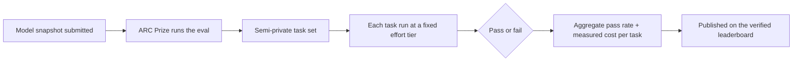

# DeepSeek V4 Flash: What the New Open Model Means for Developers

On July 31, 2026, DeepSeek released V4 Flash (checkpoint 0731), and within a week it was sitting on the ARC Prize verified leaderboard with numbers that would have been unthinkable for an open-weights model a year ago: **89.0% on ARC-AGI-1 Semi-Private and 61.4% on ARC-AGI-2 Semi-Private, at $0.02 and $0.04 per task respectively, at max reasoning effort.** My first reaction was the standard one — another model release, another headline. My second reaction, after actually reading the verification page, was that this one is different in a way that matters for how you pick models. Let me walk through what's actually being claimed, how the verification works, and what it does and doesn't tell you about your own code.

## The misconception: open models can't touch the frontier labs

For the last couple of years, the working assumption in most engineering orgs has been: if you need the best reasoning, you pay for a closed API. Claude, GPT, Gemini — those were the models that showed up at the top of hard reasoning benchmarks. Open weights were for fine-tuning experiments, privacy constraints, and cost-sensitive bulk work. Nobody put the open model in front of the hard problem.

DeepSeek V4 Flash is the strongest counterexample to that assumption yet, and it's not a lab cherry-picking its own tests. The ARC Prize organization runs the evaluation on its own semi-private task sets and publishes the results. An 89% on ARC-AGI-1 Semi-Private puts this checkpoint in the conversation with the best models anyone has submitted, open or closed. The 61.4% on ARC-AGI-2 matters more, because ARC-AGI-2 was designed to be harder and more resistant to memorization than its predecessor.

## A better mental model: reasoning effort is an exposure dial

Before we get to the numbers, you need the right mental model, because "89%" without context is just a number. Think of the model like a camera and reasoning effort like an exposure dial. Same sensor, same lens — the only difference is how long the shutter stays open and how much light you let in. Set it low and you get a fast, cheap shot that works in good conditions. Crank it to max and you get the best possible image, but the shot takes longer and costs more.

V4 Flash ships with three reasoning variants: **Low**, **High**, and **Max**. Same weights, same task, different compute budget. The ARC Prize verified all three, which is a nice touch — most submissions only verify their best configuration. The spread between the tiers tells you exactly what the extra compute buys:

| Reasoning effort | ARC-AGI-1 Semi-Private | ARC-AGI-2 Semi-Private |
| --- | ---: | ---: |
| Max | 89.0% | 61.4% |
| High | 87.0% | 56.0% |
| Low | 84.0% | 46.0% |

The most interesting row is Low. Even at the cheapest setting, the model clears 84% on ARC-AGI-1. The delta between Low and Max is only five points on ARC-AGI-1 — and fifteen points on ARC-AGI-2, which tells you the harder the task, the more the effort budget pays off. If your workload is mostly easy-to-medium reasoning, paying for Max is wasted money. If your workload is genuinely hard, Low will quietly embarrass you.

## What ARC-AGI actually measures (and what it doesn't)

ARC-AGI is a reasoning benchmark: abstract puzzles presented as a few input/output examples, where the model has to infer the rule and apply it to a novel test case. The tasks are designed so that memorizing training data doesn't help — you can't have seen the exact puzzle before, because the generator makes new ones. That's why the community trusts it more than benchmarks that leaked into training corpora years ago.

Here's what it is not: a coding benchmark. It doesn't measure your ability to review a pull request, fix a flaky test, or keep a refactor type-safe. It doesn't measure tool use, long-context recall, or instruction following. ARC-AGI-2 added harder tasks and better contamination resistance; the checkpoint hasn't been scored on ARC-AGI-3 yet. So when you see "89%," translate it as "this model is genuinely good at novel abstract reasoning at a specific effort setting" — nothing more, and nothing less.

## How a verified score gets made

The word "verified" does a lot of work here, so it's worth understanding the pipeline. ARC Prize doesn't take the submitter's word for anything:



Each task is a pass/fail — the model either produces the exact expected output or it doesn't. No partial credit, no LLM-as-judge, no vibes. The cost per task is measured from the actual run, which is why the leaderboard can print "$0.02 per task" as a verified number rather than a marketing estimate. The evaluation used 400 public tasks for ARC-AGI-1 and 120 for ARC-AGI-2, and the published page shows pass/fail per task, per effort tier. You can disagree with the methodology, but you can't accuse them of hiding the data.

## What the numbers say, read carefully

The headline number — 89% at $0.02 per task — breaks down into two separate claims, and you should keep them separate. The accuracy claim: at max effort, the model solves 89% of ARC-AGI-1 semi-private tasks. The cost claim: running those tasks through the API cost an average of two cents each. Both are verified, but the cost figure is an average over a specific task set at a specific effort tier. Your tasks are not ARC tasks, and your cost per task will be different.

The accuracy story is the more remarkable one. Two years ago, the top of ARC-AGI-1 sat in the high 50s. An open checkpoint clearing 89% at two cents a task is the kind of shift that makes you re-examine every model you're paying a premium for.

## Trying it yourself

DeepSeek's API is OpenAI-compatible, so trying the model is a couple of lines away. The exact model string and the name of the reasoning-effort parameter will vary by provider — read the model card — but the shape of the call is familiar:

```python
from openai import OpenAI

client = OpenAI(
    api_key=os.environ["DEEPSEEK_API_KEY"],
    base_url="https://api.deepseek.com",  # check current docs
)

resp = client.chat.completions.create(
    model="deepseek-v4-flash",            # exact ID from the model card
    messages=[{"role": "user", "content": "Your hardest prompt here"}],
    extra_body={"reasoning_effort": "high"},  # low | high | max
)

print(resp.choices[0].message.content)
```

If you're a self-hosting shop, the weights are out, which means the model is also an option for air-gapped or data-sensitive work — but check the model card for the actual hardware requirements before you plan a GPU purchase. I'm not going to quote VRAM numbers I haven't verified.

## The cost math that matters

Here's where the release gets interesting for teams running agents or batch jobs. Let's do the arithmetic on what a full evaluation run costs, using the verified per-task figures:

```python
# Verified per-task costs at max effort (ARC Prize, 2026-08)
COST_ARC1 = 0.02   # USD per task, ARC-AGI-1 Semi-Private
COST_ARC2 = 0.04   # USD per task, ARC-AGI-2 Semi-Private
TASKS_ARC1 = 400   # public eval size
TASKS_ARC2 = 120   # public eval size

for name, per_task, tasks in [
    ("ARC-AGI-1", COST_ARC1, TASKS_ARC1),
    ("ARC-AGI-2", COST_ARC2, TASKS_ARC2),
]:
    total = per_task * tasks
    print(f"{name}: ${per_task:.2f}/task -> ${total:.2f} for a full run")
```

A full public-eval run at max effort costs about eight dollars. That's the number to sit with: **a rigorous, third-party, contamination-resistant evaluation of a frontier-adjacent model costs less than a team lunch.** When evaluation is that cheap, the excuse "we can't afford to test models properly" stops holding water. The expensive part of adopting a model was never the API bill — it was the week of engineering to build a harness that tests *your* workloads. That's still the expensive part, and it's worth every hour.

## Where the model fits: caveats and edge cases

A few things I'd keep in mind before you rip out your current provider:

- **Verified ≠ coding.** The benchmark measures abstract reasoning, not pull request quality. Run the model on your own test suite before you trust it with production code — that's the only evaluation that actually counts.
- **Semi-private is not public.** The public eval tasks are visible; the semi-private set is held back. Scores on the public set can look different from the verified semi-private numbers, and both can differ from your workload.
- **Cost per task is an average.** Some ARC tasks are cheap, some are expensive. Your "average task" will not match theirs. Measure, don't extrapolate.
- **Checkpoints move fast.** "0731" is a release date, not a version. DeepSeek ships frequently; whatever you benchmark this week may be outdated next month. Pin the checkpoint you actually validated.
- **The leaderboard will churn.** Someone else will post a new number next week. Treat every score, including this one, as a data point, not a verdict.

## Why this matters for your day job

Three reasons, in increasing order of importance. First, if you run agent loops or bulk classification, the effort dial is a real cost lever — the difference between Low and Max on your workload is real money, and now you have a verified sense of what you're giving up at each setting. Second, open weights mean the model is a legitimate candidate for privacy-sensitive work, which used to force you onto a closed API or a much weaker local model. Third, and most importantly, the release normalizes something that's been true for a while: you can now afford to evaluate models properly, on your own tasks, and the gap between what a model claims and what it does for you is entirely your responsibility to measure. The models got cheaper; the diligence didn't.

## The practical takeaway

Read the ARC Prize verification page yourself — it's short, it's transparent, and it's the best antidote to both hype and dismissal. When you pick your next model, pick your effort tier like you're choosing a price tier, because that's exactly what it is. And build the eval harness for your own tasks before you commit to any vendor, because verified leaderboard scores are a floor, not a ceiling. The era of open models that can't reason is over; the era of teams that can't be bothered to measure is not.
