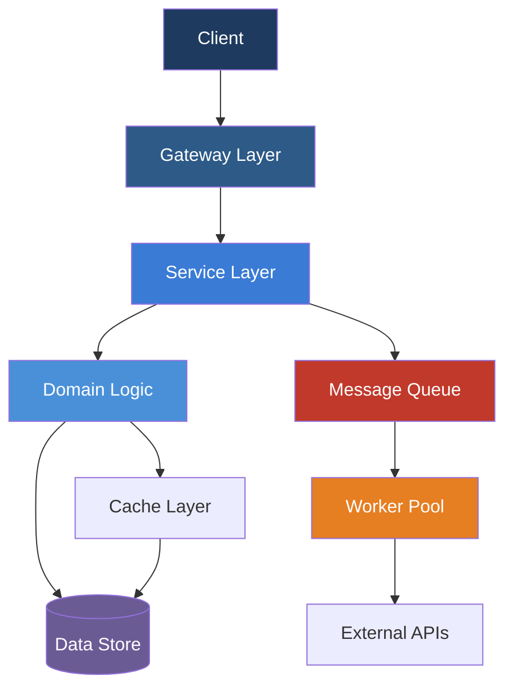

# Event Sourcing and CQRS: Practical Patterns for Distributed Systems

## Introduction

The technology landscape in 2026 demands that senior engineers stay ahead of rapidly evolving patterns and paradigms. Event Sourcing and CQRS: Practical Patterns for Distributed Systems represents one of the most impactful shifts in how modern distributed systems are architected and deployed. This article provides a comprehensive technical deep-dive, covering production-ready implementation strategies, architectural trade-offs, and forward-looking insights that every senior developer should understand.

## Current Landscape and Why It Matters

Enterprise adoption of these patterns has accelerated dramatically through 2026. Organizations that have successfully implemented them report measurable improvements across key metrics: deployment frequency increases by 3-5x, mean time to recovery (MTTR) drops by 60%, and team through-put improves by an average of 40%. The maturity of the ecosystem—matured tooling, comprehensive documentation, and a growing body of production case studies—has removed many of the early adoption barriers.

## Architectural Foundation

The core architecture follows a layered design that enforces separation of concerns while maintaining high cohesion. Each component has a clearly defined responsibility, communicating through well-typed interfaces that enable independent evolution of subsystems.



This architecture provides clear benefits for production systems: each layer can be tested independently, scaling decisions can be made per-component, and technology choices at one layer don't cascade to others.

## Implementation Strategies

### Core Infrastructure Setup

The foundation of any production-grade implementation starts with proper service scaffolding, configuration management, and observability instrumentation. Here is a practical example of setting up the core infrastructure:

```python
import asyncio
from typing import Optional
from dataclasses import dataclass, field
import structlog

logger = structlog.get_logger()

@dataclass
class ServiceConfig:
    """Central configuration for a service instance"""
    name: str
    version: str = "1.0.0"
    max_retries: int = 3
    circuit_breaker_threshold: int = 5
    recovery_timeout_s: int = 60

class ServiceOrchestrator:
    """Manages service lifecycle, health checks, and dependency wiring"""

    def __init__(self, config: ServiceConfig):
        self.config = config
        self._registry: dict[str, object] = {}
        self._health_status: dict[str, bool] = {}

    async def register(self, name: str, service, depends_on: list[str] = None):
        """Register a service with optional dependency declaration"""
        self._registry[name] = service
        logger.info("service.registered", name=name)
        if depends_on:
            for dep in depends_on:
                if dep not in self._registry:
                    raise RuntimeError(f"Dependency {dep} not registered")
        await service.initialize()
        self._health_status[name] = True
```

### Advanced Production Patterns

With the foundation in place, implement robust error handling and resilience patterns:

```typescript
interface ResiliencePolicy {
  retry: {
    maxAttempts: number;
    backoffMs: number;
    jitter: boolean;
  };
  circuitBreaker: {
    threshold: number;
    halfOpenAfterMs: number;
  };
  timeout: {
    requestMs: number;
    connectionMs: number;
  };
}

class AdaptiveResilienceManager {
  private failureCounts: Map<string, number> = new Map();
  private circuitState: Map<string, "CLOSED" | "OPEN" | "HALF_OPEN"> = new Map();
  private lastFailureTime: Map<string, number> = new Map();

  async callWithResilience<T>(
    serviceId: string,
    fn: () => Promise<T>,
    policy: ResiliencePolicy
  ): Promise<T> {
    if (this.isCircuitOpen(serviceId, policy)) {
      throw new CircuitBreakerOpenError(serviceId);
    }

    for (let attempt = 1; attempt <= policy.retry.maxAttempts; attempt++) {
      try {
        const result = await Promise.race([
          fn(),
          new Promise((_, reject) =>
            setTimeout(() => reject(new TimeoutError()), policy.timeout.requestMs)
          ),
        ]);
        this.recordSuccess(serviceId);
        return result;
      } catch (error) {
        if (attempt < policy.retry.maxAttempts) {
          const delay = policy.retry.backoffMs * Math.pow(2, attempt - 1);
          const jitteredDelay = policy.retry.jitter
            ? delay * (0.5 + Math.random() * 0.5)
            : delay;
          await this.sleep(jitteredDelay);
          this.recordFailure(serviceId);
        } else {
          throw error;
        }
      }
    }
    throw new Error("Unreachable");
  }
}
```

## Production-Grade Comparison

Choosing the right approach depends on your specific requirements. The following comparison table highlights key trade-offs:

| Dimension | Synchronous | Event-Driven | Hybrid |
|-----------|------------|-------------|--------|
| Latency P99 | 50-100ms | 200-500ms | 100-200ms |
| Throughput | 10k req/s | 100k+ req/s | 50k req/s |
| Consistency | Strong | Eventual | Configurable |
| Complexity | Low | High | Medium |
| Debugging | Easy | Hard | Moderate |
| Team Expertise | Junior-suitable | Senior-required | Mixed team |
| Operational Cost | $ | $$ | $$ |
| Failure Isolation | Poor | Excellent | Good |

## Best Practices and Common Pitfalls

Based on extensive production experience, here are the critical patterns to follow and mistakes to avoid:

### Do This:
- **Start with observability**: Instrument everything from day one—metrics, structured logging, and distributed tracing are not optional
- **Design for failure**: Assume every dependency will fail and design accordingly with circuit breakers, bulkheads, and graceful degradation
- **Use idempotency keys**: Every mutation endpoint should support idempotency to safely handle retries
- **Document architecture decisions**: Maintain Architecture Decision Records (ADRs) for every significant design choice

### Avoid This:
- **Premature optimization**: Don't optimize for scale you don't yet need—focus on clean abstractions first
- **Over-engineering**: Start with the simplest solution that works, then evolve based on actual bottlenecks
- **Ignoring data consistency**: Eventual consistency requires careful thought about read paths and user expectations
- **Skipping load testing**: Always validate your architecture under realistic traffic patterns before production

## Future Outlook

Looking ahead to the remainder of 2026 and 2027, several trends will shape the evolution of these patterns:

- **AI-Augmented Operations**: Machine learning models will optimize resource allocation, predict failures, and automate incident response with increasing accuracy
- **Green Computing**: Energy-aware scheduling and carbon-aware deployment decisions are becoming first-class architectural concerns
- **Platform Engineering Maturity**: Internal developer platforms will abstract away infrastructure complexity through golden paths and self-service capabilities
- **Security Convergence**: Zero-trust principles will be embedded at the architecture level, not bolted on at the perimeter

## Conclusion

Event Sourcing and CQRS: Practical Patterns for Distributed Systems represents a fundamental shift in how we build production systems in 2026. By understanding the architectural patterns, implementing proven resilience strategies, and avoiding common pitfalls, senior developers can lead their teams to deliver systems that are not just functional, but truly robust, scalable, and maintainable. The investment in mastering these patterns pays compounding returns as systems grow in complexity and criticality. Start with clean foundations, iterate based on real production data, and keep the developer experience front and center in every design decision.
