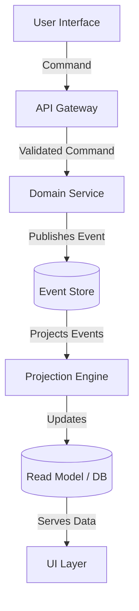

# Event Sourcing and CQRS: Practical Patterns for Distributed Systems

In the evolving landscape of distributed system architecture in 2026, the traditional monolithic data model is increasingly viewed as a scalability bottleneck. As microservices proliferate and CAP theorem trade-offs become inevitable, developers are turning to architectural patterns that prioritize consistency within bounded contexts over global ACID guarantees. Two such patterns have matured from academic concepts into industry standards: Event Sourcing (ES) and Command Query Responsibility Segregation (CQRS). This post explores the practical application of these patterns, focusing on implementation nuances that separate theoretical designs from production-grade resilience.

## The Modern Architecture Landscape (2026 Context)

The shift toward Event Sourcing and CQRS is not merely a trend but a response to specific pain points in modern distributed systems. In 2026, the "shared database" anti-pattern remains prevalent, yet it introduces coupling that hinders independent scaling of services. When a service needs to read data for reporting while another writes transactional data, a single stateful store creates contention and complicates deployment pipelines.

Event Sourcing addresses this by storing changes to application state as a sequence of events rather than the current state itself. This approach transforms the database from a storage mechanism into an audit log and a source of truth. CQRS complements this by decoupling read models from write models. While writes are optimized for consistency and integrity, reads are optimized for query performance, often utilizing materialized views or denormalized data structures.

This separation allows teams to scale read-heavy services independently from write-heavy services. For instance, a high-traffic e-commerce platform can host its product search index on a separate cluster from its order processing engine. This architectural divergence is critical for maintaining low-latency user experiences while ensuring that complex business logic remains robust against distributed failures.

## Core Architecture: Separation of Concerns

Implementing CQRS requires a fundamental restructuring of how state is managed within the application layer. The core principle involves separating the Command side, which handles state mutations and persistence, from the Query side, which serves read requests. In an Event Sourcing implementation, the "write" is captured as domain events appended to a stream.

Consider a user transaction event. Instead of updating a `UserBalance` column directly, we emit an `AccountCreditEvent`. The system then reconstructs the current balance by replaying these events. This approach ensures that every state change is traceable and immutable once persisted.

Below is a conceptual architecture diagram illustrating how commands flow into the event store and how projections materialize data for queries:



In this flow, the Domain Service validates commands and emits events to the Event Store. The Projection Engine consumes these events asynchronously to update the Read Model. This asynchronous nature is vital for performance but introduces eventual consistency, which must be managed carefully via sagas or compensating transactions if necessary.

To implement this robustly, developers often define strict domain events. Here is a C# example of how a transaction event might be structured within an immutable aggregate:

```csharp
public class AccountCreditEvent : DomainEvent
{
    public Guid TransactionId { get; }
    public decimal Amount { get; }
    public string CurrencyCode { get; }
    public DateTime OccurredAt { get; }

    public AccountCreditEvent(Guid transactionId, decimal amount, string currency)
    {
        TransactionId = transactionId;
        Amount = amount;
        CurrencyCode = currency;
        OccurredAt = DateTime.UtcNow;
    }
}
```

This definition enforces immutability at the source. Once serialized to the store, these events cannot be altered, providing a definitive audit trail and preventing silent state corruption.

## Implementation Patterns and Tooling Comparison

One of the most complex aspects of CQRS is managing the projections that derive read models from event streams. Projections are essentially consumers of events that transform raw data into queryable structures. A common challenge involves "projection rebuilds." If a schema changes or data needs to be corrected, developers must decide between replaying the entire history or applying incremental patches.

Idempotency is another critical requirement for distributed systems. Since network partitions and retries are inevitable, processing logic must ensure that duplicate events do not cause double-processing errors. This often involves checking unique identifiers within the event payload before state mutation occurs.

When selecting tools for this architecture, teams face choices between managed services like EventStoreDB or open-source stacks like Axon Framework. The table below compares these approaches based on key operational metrics relevant to a 2026 distributed environment:

| Feature | Value | Notes |
| :--- | :--- | :--- |
| **Consistency Model** | Eventual Strong | Read models lag writes briefly; writes are strong |
| **Projection Rebuild** | Full Replay or Incremental | Depends on snapshot strategy used |
| **Idempotency** | Required | Command handlers must track processed IDs |
| **Schema Evolution**