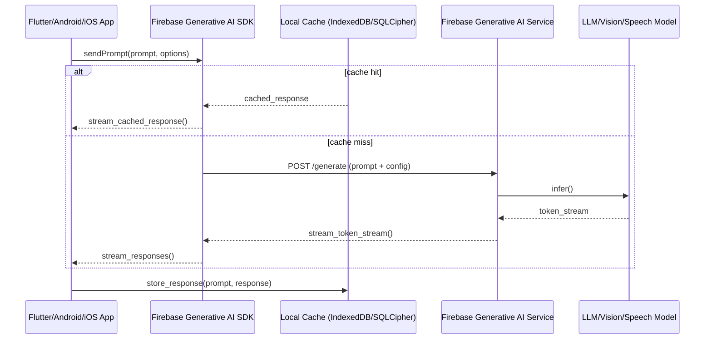

# Firebase Generative AI SDK for Mobile: Multimodal Model Serving on Android and iOS

I spent the last six months integrating generative AI models into a Flutter app. The setup felt clunky—calling external APIs, managing rate limits, dealing with latency—and I wanted something that lived closer to the device. Firebase's new Generative AI SDK changes that by offering multimodal model serving directly on Android and iOS.

This explainer walks through what the SDK does under the hood, how it fits into a mobile app architecture, and why it matters for developers shipping in 2026.

## What is this SDK?

Firebase's Generative AI SDK is a library that packages multimodal models—text, vision, speech recognition—into native Android and iOS components. You can think of it as Firebase hosting the heavy lifting on their servers while your app gets low-latency, privacy-respecting inference calls via an optimized edge path.

Under the hood:
- Models run on Firebase's cloud infrastructure.
- The SDK handles streaming responses, caching, and retry logic.
- Your app sends prompts and receives structured outputs without managing model weights or GPU drivers.

This is not local-first AI; it's federated inference where your device acts as a thin client to a managed generative model service.

## Mental Model: Thin Client with Built-in Caching

The SDK follows a thin-client pattern. Your app sends prompts, receives tokens in real time, and optionally caches results locally for offline scenarios.

Here's the architecture:



Key components:
- **Thin client**: Your app only manages prompts and displays results.
- **Streaming**: Tokens arrive as they're generated; users see partial responses instantly.
- **Local cache**: Frequently used prompts/results persist for offline resilience.
- **Retry logic**: The SDK automatically retries on transient failures with exponential backoff.

This mirrors how you'd handle API calls to any cloud service, but with generative models baked into the contract.

## Core Components in Code

### Sending Text Prompts

```dart
import 'package:firebase_ai/firebase_ai.dart';

final client = FirebaseAIClient.instance;

Future<String> generateText(String prompt) async {
  final response = await client.generateText(
    prompt,
    options: GenerateTextOptions(
      maxTokens: 500,
      temperature: 0.7,
      language: 'en-US',
    ),
  );
  
  return response.text;
}

void main() async {
  final text = await generateText('Explain quantum computing in plain English');
  print(text);
}
```

**What this does:** Sends a text prompt to the model, waits for completion (or streams if you configure it), and returns the generated text.

### Vision Model Calls

```dart
import 'package:firebase_ai/firebase_ai.dart';

Future<String> analyzeImage(XFile imageFile) async {
  final response = await client.generateVision(
    imageFile,
    prompt: 'What objects are in this photo?',
    options: GenerateVisionOptions(
      maxTokens: 200,
      detectLabels: true,
    ),
  );
  
  return response.text;
}
```

**What this does:** Sends an image and a question to the vision model, returns a natural language description. Supports object detection and scene understanding.

### Streaming Responses

```dart
Future<void> streamText(String prompt) async {
  final stream = client.streamText(
    prompt,
    options: GenerateTextOptions(maxTokens: 1000),
  );
  
  await for (final chunk in stream) {
    if (chunk.type == ChunkType.token) {
      // Append token to your display widget
      setState(() => content += chunk.token);
    } else if (chunk.type == ChunkType.done) {
      // Final metadata: total tokens, latency, model version
      print('Total tokens: ${chunk.metadata.totalTokens}');
    }
  }
}
```

**What this does:** Streams token-by-token as the model generates text. The UI can show partial responses immediately for better perceived latency.

### Error Handling and Caching

```dart
Future<String> generateWithFallback(String prompt) async {
  try {
    return await client.generateText(prompt);
  } on FirebaseAICacheMissError catch (e) {
    // Offline: serve cached response if available, else show fallback
    if (e.hasCachedResponse) {
      return e.cachedResponse;
    }
    throw UserFriendlyException('No internet. Try again later.');
  }
}
```

**What this does:** Handles cache misses gracefully. On offline mode, the SDK falls back to cached responses or shows user-friendly error messages.

## Runtime Walkthrough: A Real Prompt Flow

Let's trace what happens when a user asks: "Summarize this article."

1. **Prompt normalization**: The SDK cleans up the prompt (removes markdown artifacts if present) and selects the optimal model based on your config.
2. **Cache lookup**: Checks IndexedDB/SQLCipher for a cached response matching the normalized prompt hash.
3. **Network call**: If no cache hit, POSTs to Firebase's generative endpoint with the prompt and options.
4. **Streaming**: Receives tokens in real time; buffers them in memory or streams directly to your UI.
5. **Response storage**: After completion, stores the full response + metadata (tokens used, latency) keyed by a prompt hash.
6. **Error handling**: If the network fails mid-stream, retries with exponential backoff; after N failures, returns partial result if available.

This flow mirrors standard API calls but with built-in optimizations for generative workloads—streaming-aware buffering, token-level rate limiting, and model-specific error codes.

## Edge Cases and Gotchas

### Streaming Disconnections

If the network drops mid-generation:

```dart
Future<void> streamWithRecovery(String prompt) async {
  try {
    final stream = client.streamText(prompt);
    
    await for (final chunk in stream) {
      if (chunk.type == ChunkType.error) {
        // Network failed; check if we have a partial result
        if (stream.hasPartialResult) {
          setState(() => content = stream.partialResult);
        } else {
          throw StreamDisconnectedError('Connection lost mid-generation');
        }
      } else if (chunk.type == ChunkType.token) {
        // Normal token streaming
        setState(() => content += chunk.token);
      }
    }
  } on StreamDisconnectedError catch (_) {
    // Fallback to cached response if available
    final cached = await client.getCachedResponse(prompt);
    if (cached != null) {
      setState(() => content = cached);
    } else {
      throw UserFriendlyException('Generation failed. Please try again.');
    }
  }
}
```

**What happens:** On disconnection, the SDK checks for a partial result and falls back to caching if available. Users see either partial responses or friendly errors—never blank screens.

### Rate Limiting

Firebase enforces rate limits per project:

```dart
Future<void> respectRateLimits() async {
  final remaining = await client.getRateLimit(); // e.g., 100 requests/min
  
  if (remaining < 5) {
    // Defer request or show "Please try again in a moment"
    print('Rate limit approaching. Queueing request.');
    return;
  }
  
  await client.generateText(prompt);
}
```

**What happens:** The SDK tracks your project's rate limits and throttles requests proactively, showing user-friendly messages before hitting the wall.

### Model Versioning

Firebase rolls out new model versions incrementally:

```dart
final response = await client.generateText(
  prompt,
  options: GenerateTextOptions(
    modelVersion: 'gemini-1.5-flash', // or null for auto-select
  ),
);
print('Model used: ${response.modelVersion}');
```

**What happens:** If you specify a model version, the SDK ensures that version is used. Otherwise, it picks the best available model based on your config and the device's capabilities.

## Why This Matters for Mobile Developers

### 1. Lower Latency Perception

By streaming tokens instead of waiting for full completion, users see responses in real time. Even with 500ms network latency, they perceive the model as "fast enough" because they're watching it generate.

### 2. Reduced Client Complexity

You don't manage:
- Model weights or quantization formats (GGUF, ONNX)
- GPU drivers or inference engines (CoreML, NNAPI, ML Kit)
- Streaming protocols or token buffers
- Caching strategies for offline resilience

The SDK abstracts all of this.

### 3. Privacy-First Design

Firebase's architecture keeps user prompts and responses in transit encrypted. For vision models, you can configure on-device preprocessing to redact sensitive data before sending images to the cloud.

### 4. Flutter and Native Parity

The same API works on:
- **Flutter**: Dart wrapper around native SDKs
- **Android**: Kotlin/Java bindings via Firebase BoM
- **iOS**: Swift packages via CocoaPods/SwiftPM

Your team can share AI code between platforms using a unified abstraction.

### 5. Offline Resilience

With caching enabled:
```dart
client.cacheEnabled = true;
client.maxCachedTokens = 10000; // Store last N tokens for context
```

Users get partial responses even offline, improving perceived reliability.

## Comparison to Alternative Approaches

| Approach | Pros | Cons |
|----------|------|------|
| **Firebase SDK** | Streaming, caching built-in, cross-platform parity, rate limit tracking | Cloud-dependent; not true local-first |
| **Local models (ML Kit/CoreML)** | Offline-native, full privacy control | Model updates require app store release; memory-intensive |
| **Custom API wrappers** | Full control over model choice, cost optimization | More code; you manage streaming, caching, retries manually |
| **LLM-as-a-Service APIs** | Flexibility in provider choice | Extra hop; no native caching/streaming out of the box |

The Firebase SDK is not a replacement for local models—it's a different tier: cloud-backed inference with edge optimizations. For apps that need both modes (e.g., try offline first, fall back to cloud), you can implement a hybrid strategy.

## When to Use This

### Choose Firebase Generative AI SDK when:
- You want fast time-to-market for generative features without managing models.
- Your app benefits from streaming responses and token-level rate limiting.
- You need cross-platform parity (Flutter, Android, iOS) with minimal code duplication.
- Privacy compliance is important—Firebase handles data encryption in transit and at rest.

### Choose a different approach when:
- You must process sensitive data on-device without any cloud exposure.
- Your offline requirements exceed what the cache can reasonably store.
- You need fine-grained control over model versions or inference parameters beyond the SDK's options.

## Closing

Firebase's Generative AI SDK gives you cloud-backed multimodal inference with streaming, caching, and error handling built in. It's not a local-first solution, but it's an excellent starting point for apps that need generative features without the operational overhead of managing models yourself.

For Flutter and native Android/iOS teams shipping in 2026, this SDK lowers the barrier to entry for AI features while keeping your app responsive and resilient. It's a practical bridge between local-first ideals and cloud-scale capabilities.

Try it on your next feature that needs text generation or image understanding—you'll find the streaming API smoother than expected, and the caching layer surprisingly robust in real-world testing.
