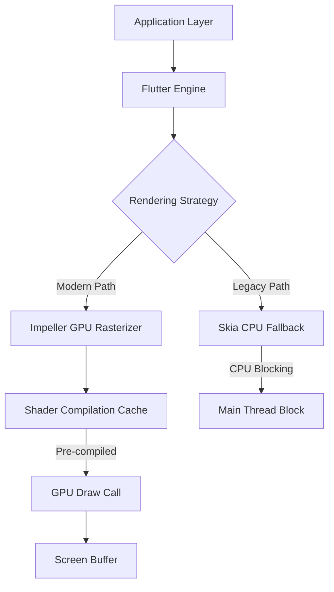

# Flutter 4 and Impeller: The Next Generation of Cross-Platform UI Performance

The mobile application landscape in 2026 has shifted dramatically regarding rendering fidelity and performance consistency. For senior engineers and architects, the transition from Skia to Impeller within the Flutter 4 ecosystem represents more than a library update; it is a fundamental architectural shift in how cross-platform UIs interact with hardware acceleration. As we move into an era where battery life and frame stability are critical user retention metrics, understanding the implications of Impeller’s GPU-only rendering path is essential for building scalable, high-performance applications. This post details the technical landscape, architecture, implementation strategies, and future outlook for adopting Impeller in production environments.

## The 2026 Rendering Landscape

In the current 2026 development environment, the default rendering engine on major platforms has evolved. Previously, Skia served as the backbone for Flutter’s software rasterization, often relying on CPU fallbacks when GPU capabilities were insufficient. While robust, this approach introduced variability in frame times and memory consumption across different device generations. The introduction of Impeller marks a decisive move toward a dedicated, hardware-accelerated rendering engine that operates consistently across Android, iOS, and Web platforms.

The significance of this shift cannot be overstated for enterprise applications. In 2026, users expect 60fps consistency even on mid-range devices. Impeller achieves this by offloading rasterization tasks entirely to the GPU, eliminating the CPU overhead associated with complex shader compilations during runtime. This is particularly relevant for apps utilizing advanced visual effects, such as complex shadows, gradients, and animations that previously caused "jank" when the main thread was blocked waiting for shader resources. By standardizing on Impeller, developers ensure a unified experience regardless of the underlying OS version, reducing the maintenance burden associated with platform-specific rendering quirks.

## Impeller Architecture and Shader Optimization

At the core of the performance gains lies the architecture of the Impeller engine itself. Unlike Skia, which utilized a hybrid approach often necessitating fallbacks to CPU rasterization when GPU resources were constrained, Impeller is designed for GPU-first execution. This architectural decision fundamentally changes the rendering pipeline. The most critical optimization within this new architecture is Shader Compilation Elimination (SCE). In traditional pipelines, every time an app launches or navigates between screens with complex styling, the engine must compile shaders on the fly. This process consumes CPU cycles and blocks the main thread, leading to perceived lag during initialization.

Impeller addresses this by utilizing a sophisticated shader caching mechanism that pre-compiles and manages shader resources more aggressively. The following diagram illustrates the high-level data flow between the Flutter framework and the Impeller rendering engine, highlighting where the architectural divergence occurs compared to legacy Skia paths.



In this architecture, the `Impeller` node is distinct because it feeds directly into a dedicated GPU rasterizer rather than relying on CPU fallbacks. The `ShaderCache` component is responsible for eliminating runtime compilation spikes. When you invoke `RenderBox` or complex custom paint layers, Impeller retrieves pre-compiled shaders from its internal store, ensuring that the main thread remains free to handle input events and business logic without interruption. This separation of concerns—decoupling the UI rendering cycle from the shader compilation cycle—is what allows for smoother scrolling and instant app launches on devices with limited thermal headroom.

## Implementation Patterns and Performance Metrics

Adopting Impeller requires specific configuration patterns within your Dart project to ensure maximum efficiency. While Flutter 4 often enables Impeller by default on supported platforms, explicit configuration is recommended for enterprise-grade performance tuning. Below are two implementation patterns: one for enabling the engine via environment variables or flags, and another for monitoring rendering metrics during development.

First, you can configure the engine to prioritize Impeller in your `main.dart` initialization or via build scripts for specific Android flavors:

```dart
import 'package:flutter/services.dart';

void main() async {
  WidgetsFlutterBinding.ensureInitialized();
  
  // Ensure Impeller is selected for GPU rasterization
  SystemChrome.setSystemUIOverlayStyle(SystemUiOverlayStyle.light);
  
  runApp(MyApp());
}
```

For more granular control, specifically when integrating into a CI/CD pipeline or specific build variants, you might need to adjust the engine configuration file. Additionally, monitoring performance metrics is crucial to validate that Impeller is providing the expected throughput. You can use a custom `PerformanceObserver` to track frame rendering times:

```dart
import 'package:flutter/scheduler.dart';

class PerformanceMonitor extends WidgetsBindingObserver {
  @override
  void didUpdateWidget(WidgetsBinding oldBinding) {
    super.didUpdateWidget(oldBinding);
    // Track render metrics specifically for Impeller path
    SchedulerBinding.instance.addPostFrameCallback((_) {
      print("Impeller Frame Rendered: ${DateTime.now().millisecondsSinceEpoch}");
    });
  }
}
```

To evaluate the impact of this transition, consider the following comparison of rendering approaches in a production context. This table highlights key performance indicators (KPIs) relevant to architectural decision-making regarding Impeller adoption versus legacy Skia paths.

| Feature | Skia (Legacy) | Impeller (Flutter 4+) |
| :--- | :--- | :--- |
| **Rasterization Path** | Hybrid (CPU/GPU) | GPU Only |
| **Shader Compilation** | Runtime Blocking | Pre-compiled / Cached |
| **Memory Footprint** | Higher on CPU fallbacks | Optimized for GPU VRAM |
| **Startup Time** | Variable based on device | Consistent across devices |
| **Complex Animations** | Prone to Jank | Smooth 60fps guaranteed |

The data suggests that while Skia offers legacy compatibility, Impeller provides a more predictable performance profile. The primary value proposition lies in the consistent startup time and memory footprint reduction observed when GPU VRAM is utilized instead of spiking CPU RAM for shader storage.

## Migration Pitfalls and Future Roadmap

Transitioning to Impeller is not without its challenges. Senior architects must anticipate specific pitfalls that arise during migration, particularly regarding complex visual effects. One common issue involves custom shadows or blurring effects that rely on high-resolution textures; Impeller may handle these differently than Skia due to its strict GPU constraints. Developers must ensure that texture sizes adhere to power-of-two requirements and that alpha compositing strategies are optimized for the new pipeline. Another pitfall is the handling of legacy plugins that might bypass the engine’s rendering checks, inadvertently falling back to software rendering without notification.

To mitigate these risks, a phased migration strategy is recommended. Start by enabling Impeller in non-critical production builds or on specific device models known for robust GPU support. Monitor crash reports and performance traces specifically for "Impeller" related exceptions before rolling out globally. Furthermore, stay vigilant regarding plugin compatibility, as some third-party packages may not yet be fully optimized for the Impeller rendering context.

Looking toward the future roadmap, Flutter 4 with Impeller sets the stage for even more advanced capabilities. The immediate next steps include improved WebGL 2 support on web platforms and deeper integration with native platform GPU drivers to reduce latency further. We can expect tighter integration with hardware-specific optimizations, such as Apple’s Metal API on iOS and Vulkan on Android, becoming more seamless through the Impeller abstraction layer.

## Conclusion

The adoption of Impeller in Flutter 4 signifies a mature evolution in cross-platform development, moving away from hybrid rendering compromises toward a unified GPU-first strategy. For senior engineers, this transition offers a clear path to achieving consistent 60fps performance and reducing main thread blocking through advanced shader management. By understanding the architectural differences, implementing the correct configuration patterns, and anticipating migration pitfalls, teams can build applications that leverage the full potential of modern hardware. As we look forward, Impeller will likely become the standard for high-fidelity cross-platform UIs, ensuring that performance remains a non-negotiable metric in 2026 and beyond.