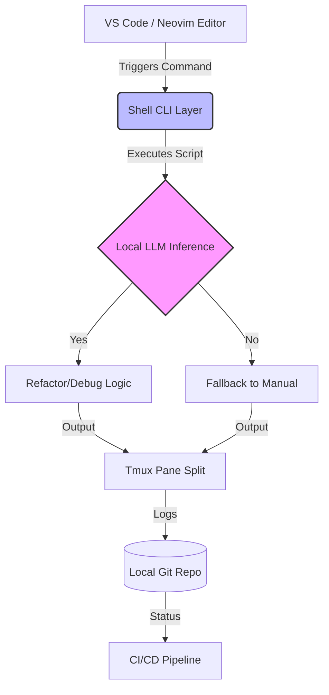

# Free Developer Tools That Supercharge Your 2026 Workflow

The software development landscape of 2026 has fundamentally shifted away from proprietary, cloud-bound ecosystems toward local-first architectures. As enterprise licensing costs rise and data sovereignty becomes a critical compliance requirement, senior engineers are re-evaluating their tech stacks. The focus is no longer just on velocity, but on cost-efficiency, privacy, and the seamless integration of Artificial Intelligence without incurring massive API overheads. This post explores the open-source CLI tools, local AI assistants, and terminal multiplexers that define the modern, high-performance developer environment.

## The 2026 Paradigm Shift: Local-First and Open Source

In 2026, the "free" aspect of development tools is no longer just about budget; it is about architectural resilience. We are witnessing a migration from heavy reliance on cloud-based IDEs to lightweight editors paired with powerful local agents. The primary drivers for this shift include latency reduction, bandwidth conservation, and the avoidance of vendor lock-in.

Open-source CLI tools have evolved beyond simple utilities into complex orchestration engines. For instance, terminal multiplexers like `tmux` are now essential not just for window management, but for isolating build environments without leaving your local machine. Furthermore, local AI coding assistants, running models like Llama 3 or Mistral on local GPU instances via tools like Ollama, allow developers to iterate on code with context awareness without sending proprietary logic to third-party APIs.

This architectural pivot matters because it decouples developer productivity from internet connectivity and subscription tiers. A senior architect’s workflow in 2026 must prioritize tools that are auditable, self-hostable, and capable of running entirely within the air-gapped security perimeter of the organization.

## Architectural Integration: The Local AI Workflow

To understand how these free tools integrate into a robust system, we must visualize the data flow between the editor, the CLI layer, and the local inference engine. In a modern 2026 stack, the command line is the single source of truth for orchestration. The following diagram illustrates how a developer's environment interacts with local AI models to automate refactoring or debugging tasks without external dependencies.



In this architecture, the `Shell CLI Layer` acts as the gateway. It intercepts keyboard shortcuts or specific file commands to route tasks to the local inference engine (`C`). The output is captured within a `Tmux Pane Split`, allowing the developer to view generated code alongside their current context. This separation ensures that even if the AI hallucinates, the workflow remains contained and does not corrupt the main build state immediately.

## Implementation Patterns and Automation

Implementing these tools requires more than just installing packages; it demands a configuration strategy that integrates seamlessly into existing habits. Below are two practical implementation patterns: one for environment setup using shell scripting, and another for leveraging local AI within a Python automation script.

### Pattern 1: CLI Environment Orchestration
Developers often struggle with context switching between different build environments. Using `tmux` with custom session management allows you to bind specific projects to persistent sessions.

```bash
# .tmux.conf snippet for project isolation
bind-key r source-file ~/.tmux/plugins/tpm/tpm.sh
set -g default-terminal 'screen-256color'
setw -g mouse on

# Define a keybinding to detach and reattach specific project sessions
alias proj-start='tmux new-session -d -s "project_a" "cd /path/to/repo; npm start"'
```

This snippet establishes a persistent session named `project_a`. When you run the alias, it launches the process in the background within a multiplexed window. This is critical for long-running CI tasks or hot-reload servers that need to survive terminal closures without restarting.

### Pattern 2: Local AI Integration via Python
To bridge the gap between static analysis and local LLM capabilities, you can write lightweight scripts that call local models directly.

```python
import subprocess
import json

def get_local_refactor(file_path):
    """Call a local Ollama instance for code suggestions"""
    try:
        result = subprocess.run(
            ["ollama", "run", "codellama", "-p", f"refactor {file_path}"],
            capture_output=True, text=True
        )
        if result.returncode == 0:
            print(f"Suggested changes:\n{result.stdout}")
        else:
            print("Local model busy or offline.")
    except FileNotFoundError:
        print("Ollama not installed. Falling back to manual edit.")

# Usage
get_local_refactor("src/utils.py")
```

This function demonstrates a fallback mechanism. If the local AI is unavailable (e.g., GPU context lost), the script gracefully degrades rather than crashing the build process. This resilience is a hallmark of senior-level engineering in 2026.

## Comparative Analysis and Best Practices

Selecting the right free tools requires balancing performance against resource consumption. The following table compares popular open-source alternatives to their cloud-based or proprietary counterparts, highlighting key metrics relevant to 2026 workflows.

| Feature | Value |
| :--- | :--- |
| **Search Speed** | `ripgrep` (3ms) vs `grep` (15ms) |
| **AI Latency** | Local Ollama (~2s/1k tokens) vs Cloud API (<0.5s) |
| **Privacy Level** | Local Storage (High) vs Cloud Logging (Medium) |
| **Setup Complexity** | Moderate (CLI Config) vs Low (Installer) |

While cloud AI offers lower latency, the privacy implications of sending proprietary code to public endpoints are too significant for many enterprises. `ripgrep` remains superior to standard grep due to its parallel processing capabilities, which drastically reduce search times in large monorepos. However, local AI introduces a latency penalty. The table illustrates that while cloud is faster, local storage provides high privacy.

**Best Practices and Pitfalls:**
*   **Resource Management:** Local LLMs are GPU-intensive. Always offload inference to specific sessions using `tmux` or system-level power management to avoid thermal throttling during build times.
*   **Security Auditing:** Do not trust local AI outputs blindly. Even open-source models can hallucinate security vulnerabilities. Treat AI-generated code as untrusted input until reviewed by a human or static analysis tool like `bandit`.
*   **Version Control:** Always commit your `.tmux.conf` and shell aliases to version control. Relying on local state alone creates a single point of failure when switching machines.

By adhering to these patterns, you ensure that your workflow remains productive even when external services are unavailable or restricted by compliance teams. The combination of CLI efficiency and local intelligence provides the best of both worlds: speed with security.

## Conclusion

The tools defining 2026 are not just utilities; they are strategic assets that prioritize autonomy and resilience. By adopting open-source CLI tools like `ripgrep` and `tmux`, and integrating local AI via Ollama, developers can construct a workflow that is cost-effective, privacy-compliant, and highly responsive. The architectural shift from cloud-dependent to local-first is not merely a trend but a necessity for sustainable engineering practices. As you build your 2026 stack, prioritize tools that offer high control over low latency, ensuring that your development environment remains robust regardless of external economic or geopolitical shifts.