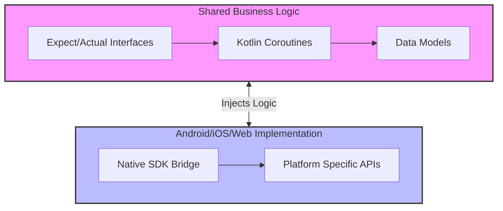

# Kotlin Multiplatform in Production: Sharing Business Logic Across Android, iOS, and Web in 2026

In the landscape of software development as it stands in 2026, Kotlin Multiplatform (KMP) has transitioned from a promising prototype to an industrial standard for enterprise-grade applications. The primary driver for this adoption is no longer merely code sharing; it is about strategic reduction of technical debt and unified state management across diverse operating systems. While early iterations of KMP struggled with performance overhead and the complexity of bridging native APIs, the 2026 ecosystem offers a mature path for sharing business logic between Android, iOS, and Web platforms without compromising user experience or build speed. For senior architects evaluating cross-platform strategies, understanding how to structure this shared layer is critical to maintaining long-term scalability.

## The 2026 Landscape and Strategic Value

The decision to adopt KMP in a production environment today hinges on three key factors: unified codebase reduction, consistent user experience, and accelerated feature deployment. In 2026, the Compose Multiplatform (CMP) ecosystem has stabilized significantly, allowing for more than just UI sharing; it supports complex state management that was previously difficult to maintain across platforms. The shift from "can we share this" to "how do we architect this" is the defining characteristic of modern KMP adoption.

Organizations are moving away from maintaining separate codebases for mobile and web, which often leads to feature divergence. With KMP, a single business logic layer—such as authentication flows, financial calculations, or inventory management algorithms—can be verified once against shared unit tests and deployed across all target platforms. This reduces the cognitive load on engineering teams and ensures that critical compliance requirements (like GDPR or PCI-DSS) are applied consistently regardless of the device used by the customer.

Furthermore, the 2026 toolchain supports incremental adoption. Teams do not need to rewrite their entire application; they can introduce KMP modules for specific domains like data access or networking while retaining native UI components where performance is paramount. This hybrid approach balances innovation with stability, allowing legacy systems to evolve without a risky full-stack rewrite.

## Architecture & Implementation Strategy

The cornerstone of any successful KMP project is the separation of concerns between shared business logic and platform-specific implementation details. The `expect`/`actual` pattern remains the gold standard for this separation in 2026. This mechanism allows you to define an interface or class structure in shared code that can be implemented differently on each platform (e.g., using `kotlinx.coroutines` dispatchers for Android vs. native threads for iOS).

Consider a critical service like Payment Processing. You want the logic to remain agnostic to the OS, but the underlying implementation must interact with specific hardware or SDKs. The architecture diagram below illustrates how the layers interact:



To implement this, you define an `expect` class in the shared module that declares the contract without implementation. The implementation is provided by the host platform's build configuration. This ensures type safety while allowing native interoperability where necessary.

```kotlin
// Shared Module (expect)
package com.example.shared.payment

import kotlinx.coroutines.flow.Flow

public expect interface PaymentService {
    public suspend fun processTransaction(
        amount: Double,
        currency: String
    ): Flow<TransactionResult>
}

public expect data class TransactionResult(
    val status: String,
    val transactionId: String
)
```

This structure enforces that the business logic (the `processTransaction` flow) is written once in Kotlin, but the actual execution context adapts to the environment. It prevents "platform pollution" where Android-specific APIs leak into shared code, a common pitfall that complicates CI/CD pipelines and testing strategies.

## Tooling & Approach Comparison

When selecting how to orchestrate your KMP project, you must weigh the tooling overhead against the benefits of platform sharing. In 2026, the ecosystem offers distinct approaches ranging from native-first with bridges to full multiplatform UI stacks. The following table outlines the key differences when evaluating these strategies for a production environment.

| Feature | Value |
| :--- | :--- |
| **Language** | Kotlin (Shared), Swift/Objective-C (iOS Native) |
| **UI Sharing** | Compose Multiplatform / Jetpack Compose Desktop |
| **Build Time** | Gradle Daemon optimized for KMP builds |
| **Testing Strategy** | Shared Unit Tests + Platform Specific Integration |
| **Dependency Size** | Reduced APK/IPA size via shared native libs |
| **Hiring Difficulty** | High demand for KMP specialists vs Native only |

While the "Native-first with Bridge" approach offers maximum performance, it introduces significant maintenance overhead. You end up maintaining two distinct codebases for business logic, negating the primary benefit of KMP. Conversely, full multiplatform UI adoption (CMP) requires a higher initial investment in learning new composition APIs but pays dividends through faster feature iteration. For 2026 production environments, a hybrid model—using CMP for the shell and KMP for the core logic—is often the most pragmatic choice. This allows teams to leverage existing native skill sets while gradually migrating towards a unified architecture.

## CI/CD, Testing, and Best Practices

Implementing KMP in production requires a robust Continuous Integration and Delivery pipeline that can handle platform-specific artifacts without duplicating work. The testing strategy must be tiered: shared logic is tested with unit tests compiled for JVM (or the target platform), while integration tests run on physical devices or emulators to verify native interoperability.

In your CI/CD configuration, you should avoid running all tests in every pipeline stage to reduce build times. Instead, use a strategy where shared modules are tested independently before assembling platform-specific artifacts. This ensures that if the shared logic breaks, it is caught immediately without waiting for a full device emulation cycle.

```kotlin
// Build Script Snippet: Shared Module Configuration
tasks.withType<org.jetbrains.kotlin.gradle.tasks.KotlinCompile> {
    kotlinOptions {
        jvmTarget = "17"
        freeCompilerArgs += "-Xexpect-actual-classes"
    }
}

val sharedTest by tasks.registering(Test::class) {
    group = "verification"
    description = "Run tests for shared KMP module"
    classpath = sourceSets["sharedMain"].output + configurations["sharedRuntimeClasspath"]
    testClassesDirs = fileTree(sourceSets["sharedTest"].output)
}
```

**Key Pitfalls to Avoid:**

*   **Platform Leaks:** Never import `android.os.Build` or `UIKit` classes into the shared module. Use a separate `actual` implementation for these dependencies.
*   **Resource Management:** Do not store platform-specific assets (images, fonts) in the shared module directory structure; this causes build errors and bloated binaries.
*   **Coroutines Dispatchers:** Be explicit about dispatchers. The default dispatcher on Android is different from `Dispatchers.Default` on iOS. Explicitly configure these to avoid subtle race conditions during execution.

## Conclusion

By 2026, Kotlin Multiplatform has matured into a viable strategy for sharing business logic across the major mobile and web ecosystems. The architecture relies heavily on the `expect`/`actual` pattern to maintain clean boundaries between shared logic and platform-specific implementation details. While the initial setup requires careful architectural planning—specifically regarding CI/CD pipelines and testing strategies—the long-term benefits of reduced maintenance costs and consistent user experiences are substantial.

As we look toward the future, the integration of AI-driven code generation tools within KMP projects will likely further accelerate development speeds. However, the fundamental principle remains unchanged: business logic must be decoupled from platform implementation to ensure true cross-platform scalability. For senior architects, the focus should shift from "can we build this?" to "how do we scale this maintainably?", ensuring that the shared codebase remains a source of stability rather than complexity in production environments.