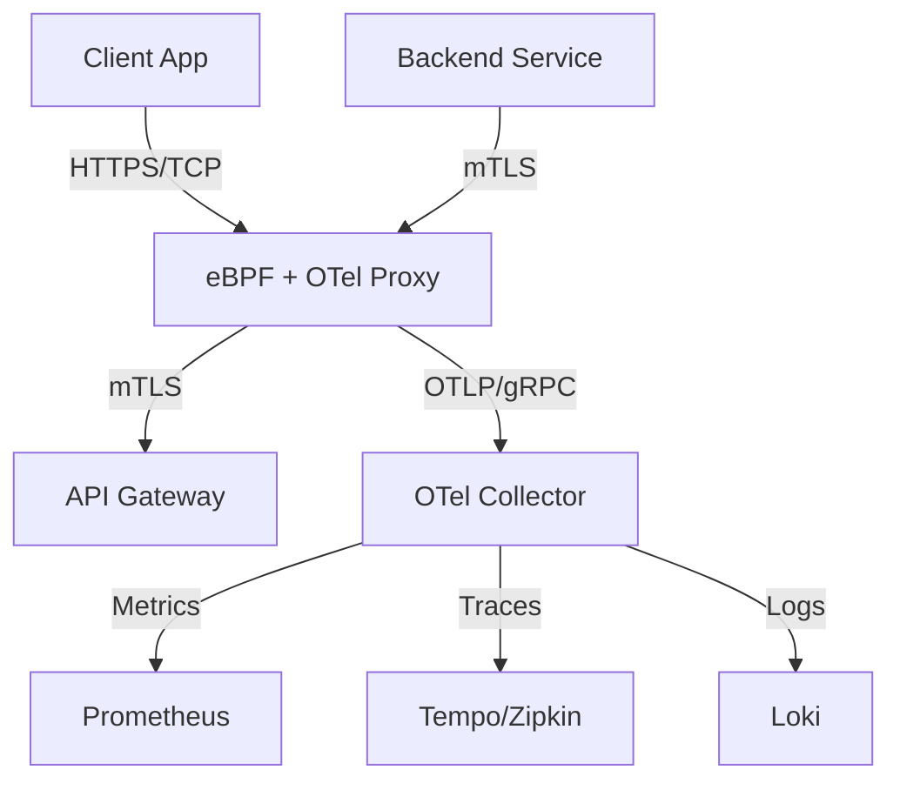

# Kubernetes Sidecar Patterns for Service Mesh Observability in 2026

The service mesh ecosystem has undergone a significant paradigm shift over the last two years, moving from heavy-weight sidecar proxies to lightweight kernel-level instrumentation. In 2026, the convergence of eBPF technology and OpenTelemetry (OTel) standards dictates how we approach observability within Kubernetes clusters. For senior architects, understanding these patterns is no longer optional; it is a requirement for maintaining high availability in multi-cloud environments where latency budgets are measured in milliseconds rather than seconds.

## The 2026 Observability Landscape

In previous years, the Envoy sidecar was the undisputed king of service mesh observability. However, by 2026, the industry has stabilized around a hybrid approach that balances application-level logic with kernel-level visibility. The primary driver for this shift is resource efficiency. Traditional sidecars introduce significant CPU overhead and memory consumption per pod, which directly impacts cluster density and cost.

The modern landscape prioritizes three core metrics:
*   **Latency Sensitivity:** With real-time AI inference running on the edge, observability cannot add jitter.
*   **Standardization:** OpenTelemetry has become the de-facto standard, replacing proprietary log formats and trace protocols.
*   **Kernel Bypass:** eBPF allows for packet capture and tracing without loading a full proxy binary into every container.

Why does this matter for architecture? It fundamentally changes how we design our service boundaries. In 2026, observability is not just an add-on; it is woven into the fabric of the network stack via the kernel. This means that when we deploy a microservice, we are simultaneously deploying an instrumentation layer. The challenge for architects is managing the complexity of this dual-layer approach: ensuring that eBPF data flows correctly alongside HTTP/2 telemetry without creating conflicting security policies or overwhelming the control plane.

## Architectural Patterns and Implementation Strategy

To implement robust observability in 2026, we must move beyond simple sidecar injection. The architecture requires a clear separation of concerns between traffic management (L4/L7) and data collection (Metrics/Traces). Below is a high-level view of the data flow within a modern service mesh implementation using an eBPF-aware sidecar pattern.



In this architecture, the sidecar acts as a transparent bridge. It terminates TLS traffic locally to avoid round-trip costs to a central gateway, but it forwards telemetry data asynchronously to a dedicated collector. This decoupling is critical for performance. The implementation strategy involves injecting the eBPF module alongside the proxy binary.

Below is an example of how to configure an OpenTelemetry Collector sidecar deployment in YAML to handle OTLP ingestion:

```yaml
apiVersion: apps/v1
kind: Deployment
metadata:
  name: otel-collector-sidecar
spec:
  template:
    spec:
      containers:
        - name: collector
          image: otel/opentelemetry-collector-contrib:latest
          ports:
            - containerPort: 4317
              protocol: TCP
          env:
            - name: OTEL_EXPORTER_OTLP_ENDPOINT
              value: "http://collector-service:4317"
            - name: OTEL_RESOURCE_ATTRIBUTES
              value: "service.name=payment-service"
```

This configuration ensures that the sidecar container listens on port 4317 for gRPC/HTTP endpoints, allowing the application to push telemetry data directly. The key here is the `OTEL_RESOURCE_ATTRIBUTES` environment variable, which tags telemetry with specific context necessary for downstream analysis.

## Comparative Analysis of Sidecar Approaches

Selecting the right observability stack requires a nuanced understanding of trade-offs between traditional proxies and kernel-level instrumentation. As architects evaluate tools for the 2026 environment, the following comparison table highlights the critical differences in latency, resource overhead, and operational complexity.

| Feature | Traditional Envoy Sidecar | Ambient eBPF (Cilium/Clairvoyant) | Proxyless (Service Mesh Lite) |
| :--- | :--- | :--- | :--- |
| **Latency** | ~5-10ms per hop | <1ms (Kernel bypass) | N/A (Direct connection) |
| **Resource Overhead** | High (~200MB RAM/pod) | Low (~100MB for kernel map) | Minimal |
| **Observability Coverage** | Full L7 + L4 telemetry | L4 focus, L7 via eBPF XDP | Limited to L4 metrics |
| **Configuration Complexity** | High (Filter chains) | Medium (eBPF maps/programs) | Low (Policy based) |
| **TLS Termination** | Sidecar handles | Host or Application layer | External Gateway |

The table illustrates that while traditional Envoy sidecars offer the most mature feature set for Layer 7 observability, they come with a heavy resource tax. Ambient eBPF solutions are gaining traction in 2026 because they allow for full visibility into network packets without the overhead of a full proxy binary. However, this comes at the cost of reduced Layer 7 context (e.g., HTTP headers) unless combined with specific eBPF programs that parse application protocols.

For most enterprise applications, the hybrid approach is recommended: use eBPF for packet-level metrics and Envoy-like logic for complex routing rules. This minimizes the attack surface while maximizing visibility.

## Operational Best Practices and Future Trajectories

Deploying these patterns requires strict adherence to operational best practices to prevent instability. The following guidelines should be enforced across all observability initiatives in 2026:

*   **Sampling Strategies:** Never run full telemetry at 100% throughput in production. Use probabilistic sampling (e.g., 50%) for traces and aggregate metrics to reduce storage costs.
*   **Resource Quotas:** Apply `limitRange` constraints on sidecar containers to prevent runaway memory usage, particularly with eBPF maps which can grow unbounded under high load.
*   **TLS Termination:** Avoid terminating TLS at the application layer unless necessary. Let the sidecar handle mTLS to offload CPU from the main application binary, but ensure certificate rotation is automated.

Pitfalls often arise during the migration path. A common mistake is assuming that eBPF replaces the need for a control plane entirely. While eBPF handles data collection, you still need a centralized management layer for policy enforcement and configuration distribution. Another pitfall is ignoring the memory footprint of the kernel maps; if not tuned, they can exhaust node RAM during traffic spikes.

Looking ahead to 2027, we anticipate deeper integration between observability and AI operations (AIOps). The sidecar will likely evolve into an "intelligence agent" that automatically adjusts sampling rates based on anomaly detection signals from the control plane. This proactive approach will shift observability from a reactive monitoring tool to a predictive system.

## Conclusion

The evolution of Kubernetes sidecar patterns in 2026 marks a definitive move toward efficiency and standardization. By leveraging eBPF for low-latency data collection and adhering to OpenTelemetry standards, architects can build service meshes that are both highly observable and cost-effective. The architectural decision between a traditional Envoy sidecar and an ambient eBPF approach depends heavily on the specific requirements of your application stack—specifically regarding the need for deep Layer 7 context versus raw network visibility.

Ultimately, the goal is not just to collect data, but to derive actionable intelligence without compromising performance. As we move forward, the convergence of kernel-level instrumentation with application-level telemetry will define the new standard for cloud-native observability.