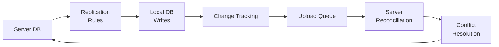

# Local-First Sync Engines: ElectricSQL, PowerSync, and the Offline-First Renaissance

I used to think syncing offline data was just a networking problem. Then I spent three months debugging a conflict where two users edited the same record while offline, and the server picked a winner based on a timestamp that was five minutes wrong. That's when I realized: sync engines don't just move data. They decide what data is allowed to exist.

## The Mental Model: Sync as a CRDT Compiler

Think of a sync engine less like Dropbox and more like a compiler for your database. You write SQL that says "this table should be shared." The engine compiles that intent into replication rules, conflict resolution logic, and queries that run continuously on the client. It's not copying files. It's compiling a distributed system.

The key insight: the client database is the source of truth while offline. The server is just a mailbox that eventually delivers messages to other clients. This flips the traditional client-server model on its head.

## Core Mechanics

A sync engine does three things:

1. **Replicates schema and writes** from server to local database
2. **Tracks local changes** in a way that survives app restarts
3. **Reconciles conflicts** when two clients change the same row



The local database isn't a cache—it's a full replica that accepts writes immediately. Changes are written to a local table that tracks what needs to be uploaded:

```sql
-- Simplified change tracking
CREATE TABLE _sync_outbox (
  table_name TEXT,
  row_pk TEXT,
  operation TEXT,  -- INSERT, UPDATE, DELETE
  payload JSONB,
  timestamp TIMESTAMPTZ
);
```

When connectivity returns, those changes are sent to the server, which applies them and runs conflict resolution.

## What Happens at Runtime

Let's say you're building a field service app. A technician opens a work order while offline, adds a note, and closes the app. Here's what happens:

1. The local database already has the work order (replicated when online)
2. The note is written to the local DB and the outbox table
3. App closes—no network needed
4. Later, the technician opens the app online
5. The sync client detects pending changes, uploads them
6. If another technician also edited the same work order, the server detects the conflict
7. The engine applies its resolution strategy (last-write-wins by default in most engines)

The technician sees their note immediately. Other users see it after sync completes. No loading spinners, no "save failed" errors.

## Edge Cases and Gotchas

**Partial replication is hard.** ElectricSQL lets you subscribe to a subset of rows using WHERE clauses. PowerSync uses queries. Both work, but the server has to evaluate those filters for every change—performance degrades nonlinearly as you add more clients with different filters.

**Conflict resolution is opinionated.** ElectricSQL defaults to last-write-wins using server timestamps. PowerSync lets you define custom resolvers. Neither handles complex merge logic automatically. If two users fill out different fields of the same form, you'll lose one set of changes unless you write custom merge logic.

**Schema migrations are a pain.** The client database needs to match the server schema. Running migrations offline-first means the migration has to be backward-compatible with old clients that might be days or weeks behind.

**You can't delete your way out of conflicts.** A delete followed by an edit while offline creates a tombstone that other clients may never see. Most engines handle this, but it adds complexity to the reconciliation logic.

I once spent a week chasing a bug where a user's offline edits disappeared after a server restart. The issue: the server's conflict resolution table wasn't persisted to disk. The engine assumed in-memory state would survive. It didn't.

## Why This Matters

Understanding that sync engines compile distributed state rather than just copying data changes how you design your app. You stop fighting offline behavior and start embracing it. Your database becomes a peer, not a servant. And when a sync conflict happens, you'll know it's not a bug—it's the engine asking you to decide what should actually exist.