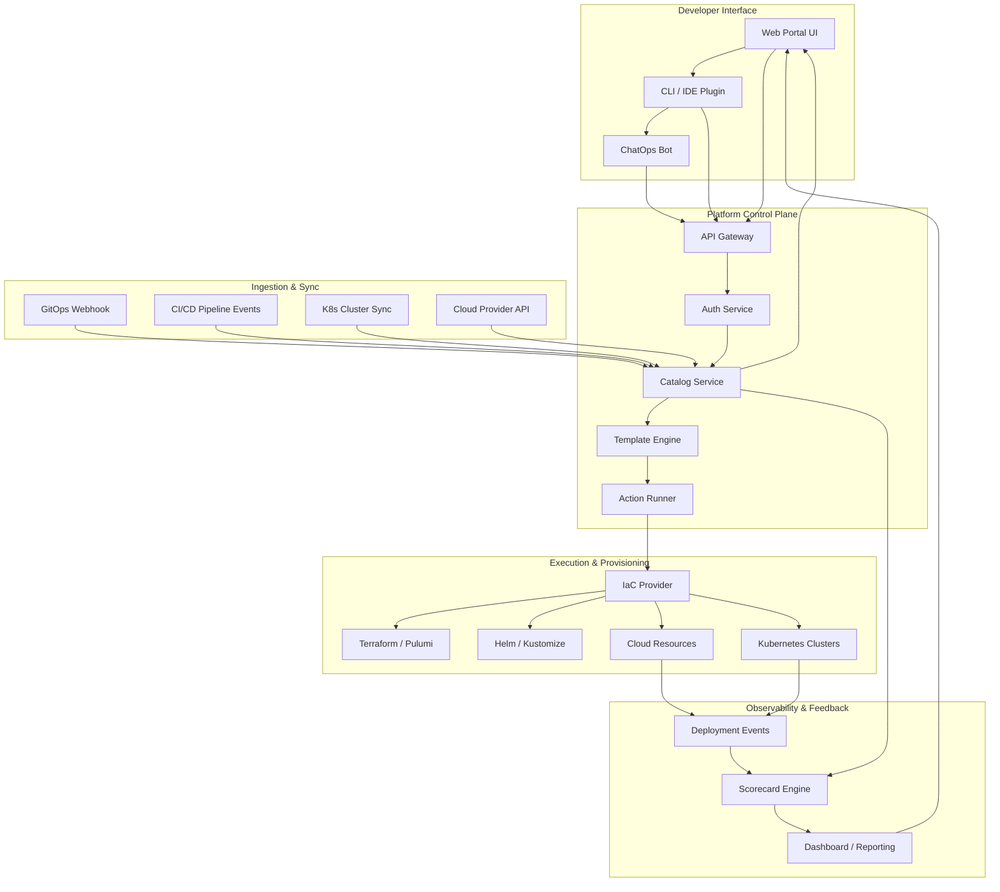
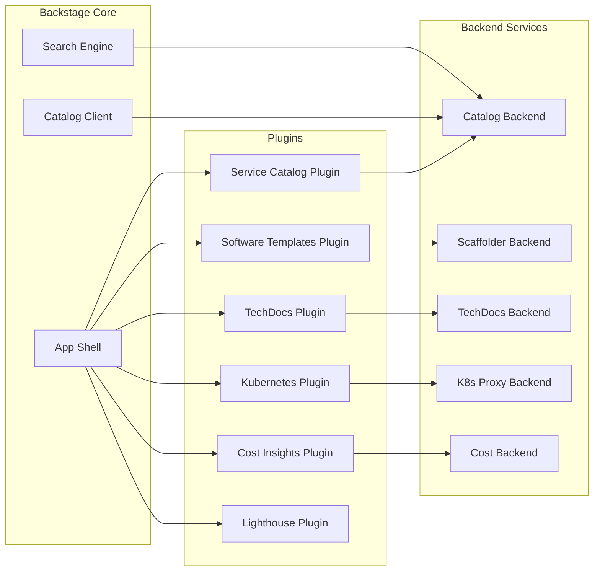
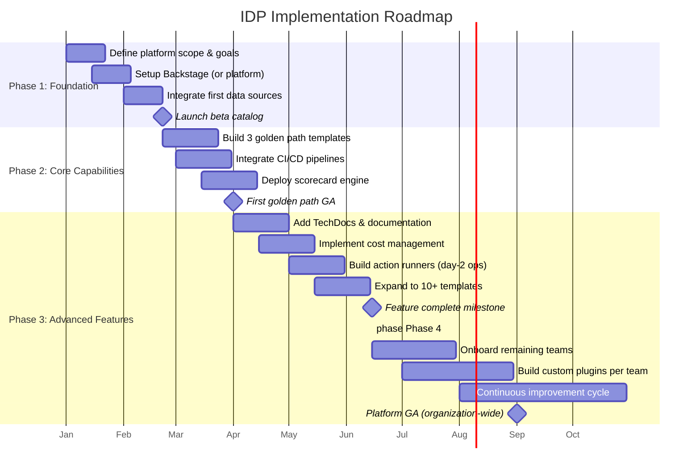

# Platform Engineering: Building Internal Developer Portals That Teams Love

In 2026, the definition of a successful software delivery organization has shifted dramatically from measuring velocity to measuring experience. The era of the "dashboard" is ending; the era of the **Internal Developer Portal (IDP)** is beginning. This isn't just about creating a UI for viewing logs or restarting pods. It is about codifying self-service capabilities, reducing cognitive load, and standardizing infrastructure consumption. For senior engineers and architects, the mandate has changed from "build faster" to "build better."

This comprehensive guide covers the full spectrum of platform engineering — from foundational principles and architecture through implementation, governance, and organizational change management. Whether you are evaluating Backstage, comparing commercial alternatives, or building a custom solution, the patterns and strategies here apply directly to your journey.

---

## What Is Platform Engineering? Definition & Core Principles

**Platform engineering** is the discipline of designing, building, and maintaining internal developer platforms — shared toolchains, environments, and workflows that enable development teams to deliver software with greater speed, safety, and autonomy. It is the operationalization of Developer Experience (DevEx) at scale.

### The Four Pillars of Platform Engineering

| Pillar | Description | Key Metric |
|--------|-------------|-----------|
| **Self-Service** | Developers provision resources, deploy services, and manage environments without tickets or manual approvals | Time-to-first-deployment (minutes) |
| **Abstraction** | Infrastructure complexity (Kubernetes, IAM, networking) is hidden behind simple interfaces | Cognitive load score |
| **Standardization** | Golden Paths enforce best practices via templates, policies, and automated checks | Golden Path adoption rate |
| **Observability** | Built-in logging, metrics, and tracing that surface in the developer's workflow | Mean Time to Recovery (MTTR) |

### Core Principles

1. **Reduce cognitive load, not add abstraction layers.** Every new capability added to the platform must make the developer's life simpler. If a feature requires reading a 10-page doc, it should be rethought or automated.

2. **Treat the platform as a product.** Platform teams must adopt product management practices: user research, roadmap prioritization, beta programs, and NPS tracking. Developers are your customers.

3. **Golden Paths, not golden cages.** Provide well-lit, opinionated pathways for common workflows. Allow teams to deviate when necessary — but make those deviations conscious, documented, and subject to additional validation.

4. **APIs before UIs.** Build the API layer first. Portals, CLIs, IDE plugins, and chatbots are all frontends to the same underlying platform API. A UI-first approach creates silos.

5. **Measure everything that matters.** Adoption rates, developer satisfaction, DORA metrics, and platform reliability must be tracked and visible to both platform teams and leadership.

---

## The Internal Developer Portal (IDP) Architecture

A well-architected IDP is not a monolithic dashboard. It is a composition of loosely coupled services that together provide a unified experience. The architecture decomposes into four layers.

### Core Architecture Layers

```
┌─────────────────────────────────────────────────────┐
│                    Developer Portal UI               │
│  (Backstage / Port / Custom React / CLI / IDE)       │
├─────────────────────────────────────────────────────┤
│                Platform API / Gateway                 │
│  (Authentication, Authorization, Rate Limiting)      │
├──────────┬──────────┬──────────┬─────────────────────┤
│ Catalog  │ Software │ Scorecard│   Cost & Resource   │
│ Service  │ Template │ Engine   │   Management        │
│          │ Engine   │          │                     │
├──────────┴──────────┴──────────┴─────────────────────┤
│              Integration & Ingress Layer              │
│  (Git Providers, CI/CD, Cloud APIs, Kubernetes, IaC)  │
└─────────────────────────────────────────────────────┘
```

### Architecture Data Flow (Mermaid)

The following diagram shows how a developer request flows through the platform — from portal interaction to infrastructure provisioning and back with status updates.



### The Catalog Service: Source of Truth

The **catalog service** is the beating heart of any IDP. It ingests metadata about every entity in your ecosystem — services, APIs, databases, libraries, deployments, teams, and domains — and resolves their relationships. Without a reliable catalog, the portal becomes a disconnected collection of links.

Entity resolution follows a three-stage pipeline:

1. **Ingestion** — Webhooks from Git, CI pipelines, and cloud APIs push entity data into the catalog.
2. **Processing** — Plugins and processors enrich entities with additional metadata, ownership information, and dependency links.
3. **Serving** — The processed data is exposed via a unified GraphQL or REST API for the UI and external consumers.

---

## Deep Dive into Backstage

Backstage is the most widely adopted open-source IDP framework, originally built by Spotify and now a CNCF Graduated project. It provides a plugin architecture, a software catalog, software templates, and TechDocs out of the box. As of 2026, the ecosystem includes over 300 community plugins and is deployed in production at thousands of organizations.

### Architecture & Plugin System

Backstage's architecture is built around a **core application** that loads **plugins** dynamically. Each plugin is an independently developed mini-application that extends the portal with new capabilities.



#### Plugin Development Pattern

Plugins in Backstage follow a consistent lifecycle: `createPlugin` → register routes → wire to backend. The frontend plugin communicates with backend plugins through a proxy layer, maintaining a clean separation of concerns.

```typescript
// Example: A simple Backstage plugin registration
import { createPlugin, createRoutableExtension } from '@backstage/core-plugin-api';
import { rootRouteRef } from './routes';

export const myPluginPlugin = createPlugin({
  id: 'my-plugin',
  routes: {
    root: rootRouteRef,
  },
});

export const MyPluginPage = myPluginPlugin.provide(
  createRoutableExtension({
    name: 'MyPluginPage',
    component: () => import('./components').then(m => m.MyComponent),
    mountPoint: rootRouteRef,
  }),
);
```

### Software Templates (Scaffolder)

Backstage's Software Templates allow platform teams to define Golden Paths as code. Each template is a YAML descriptor that specifies input parameters, steps, and actions. When a developer uses a template, Backstage executes the steps — creating repositories, generating code, provisioning infrastructure — in a secure, auditable manner.

```yaml
# Example: Backstage Software Template
apiVersion: scaffolder.backstage.io/v1beta3
kind: Template
metadata:
  name: spring-boot-service
  title: Spring Boot Microservice
  description: Create a new Spring Boot microservice with CI/CD and monitoring
spec:
  owner: platform-team
  type: service

  parameters:
    - title: Service Details
      required:
        - serviceName
        - owner
      properties:
        serviceName:
          title: Service Name
          type: string
          pattern: '^[a-z0-9-]+$'
        owner:
          title: Owner Team
          type: string
          enum:
            - team-alpha
            - team-beta
            - platform-team

  steps:
    - id: fetch-base
      name: Fetch Base Template
      action: fetch:template
      input:
        url: ./templates/spring-boot
        values:
          serviceName: ${{ parameters.serviceName }}

    - id: publish-repo
      name: Publish to GitHub
      action: publish:github
      input:
        repoUrl: github.com?owner=myorg&repo=${{ parameters.serviceName }}
        defaultBranch: main

    - id: register-catalog
      name: Register in Catalog
      action: catalog:register
      input:
        repoContentsUrl: ${{ steps['publish-repo'].output.repoContentsUrl }}
        catalogInfoPath: /catalog-info.yaml

  output:
    links:
      - title: Repository
        url: ${{ steps['publish-repo'].output.remoteUrl }}
      - title: Open in Catalog
        icon: catalog
        entityRef: ${{ steps['register-catalog'].output.entityRef }}
```

### TechDocs — Documentation as Code

TechDocs integrates documentation generation directly into the developer workflow. Documentation is written in Markdown alongside the code, stored in the same repository, and rendered in the portal with a consistent, searchable interface. The "docs like code" approach ensures that documentation stays current — a stale README becomes a lint warning.

### Search & Discovery

Backstage's search plugin indexes entities, documentation, and tech docs into a unified search backend (Elasticsearch, Lunr, or Postgres). Developers can search across every service, API, and document from a single search bar — dramatically reducing the time spent discovering internal systems.

---

## IDP Platform Alternatives Comparison

While Backstage is the dominant open-source choice, several commercial platforms offer differentiated capabilities. The right choice depends on organizational maturity, team size, and specific needs such as cost management depth or compliance automation.

### Platform Overview

### Port

Port is an IDP platform focused on developer self-service and service catalog capabilities with a strong visual builder. It provides a **low-code** approach to defining portal entities and actions, making it accessible to platform teams without deep frontend engineering resources.

**Strengths:** Rapid setup (days, not weeks), visual entity builder, built-in scorecards, strong API for custom actions.
**Trade-offs:** Less customizable than Backstage for unique UI needs; pricing scales with number of entities.

### Cortex

Cortex specializes in **service maturity scoring** and **developer scorecards**. Its core differentiator is the ability to define and track scorecards across services, with automated enforcement through CI/CD gates.

**Strengths:** Best-in-class scorecards and governance, deep CI/CD integration, SLA tracking.
**Trade-offs:** Less emphasis on software templates and scaffolding; more focused on existing service management.

### Humanitec

Humanitec takes a **Platform Orchestrator** approach. It focuses on managing the configuration and deployment of applications across environments using its Resource Definition Graph (RDG) model. It integrates tightly with Kubernetes.

**Strengths:** Strong environment management, advanced orchestration, gitops-native workflows.
**Trade-offs:** Steep learning curve for the RDG model; primarily focused on Kubernetes environments.

### OpsLevel

OpsLevel is built around **service maturity governance**. It extends the concept of scorecards with rubrics, service tiers, and automated checks that can block deployments or trigger notifications. It provides a polished catalog UI out of the box.

**Strengths:** Excellent maturity model and rubrics, automated checks, strong integrations with PagerDuty, Datadog, and Jira.
**Trade-offs:** Less flexible for custom portal UI requirements; template engine is less mature than Backstage.

### Custom-Built Solutions

Organizations with unique requirements — proprietary infrastructure, deep compliance needs, or specialized workflows — sometimes choose to build custom portals from scratch. Common stacks include React/Vue frontends with a GraphQL API layer and a Postgres/Neo4j catalog backend.

**Strengths:** Complete control over UX, no vendor lock-in, can integrate deeply with any system.
**Trade-offs:** High ongoing maintenance cost (est. 3-5 FTE for mature portals), slower to iterate, risk of "portal bloat" without product management discipline.

### Comprehensive IDP Platform Comparison

| Dimension | Backstage (Open Source) | Port | Cortex | Humanitec | OpsLevel | Custom |
|-----------|------------------------|------|--------|-----------|----------|--------|
| **License** | Apache 2.0 (free) | Proprietary (SaaS) | Proprietary (SaaS) | Proprietary (SaaS/Hybrid) | Proprietary (SaaS) | Your IP |
| **Setup Time** | 2-6 weeks | 1-2 weeks | 2-4 weeks | 3-6 weeks | 2-4 weeks | 3-12 months |
| **Catalog Depth** | Excellent (extensible) | Good | Good | Moderate | Very Good | Unlimited |
| **Software Templates** | Excellent (Scaffolder) | Good | Limited | Moderate | Moderate | Unlimited |
| **Scorecards / Governance** | Plugin-dependent | Good | Excellent | Moderate | Excellent | Custom |
| **Cost Management** | Plugin (Cost Insights) | Basic | Basic | Basic | None | Custom |
| **Plugin Ecosystem** | 300+ community | 40+ built-in | 50+ integrations | 30+ integrations | 60+ integrations | Custom |
| **Customization** | Very High (open source) | Moderate | Low-Moderate | Low-Moderate | Low-Moderate | Very High |
| **Kubernetes Native** | Good (K8s plugin) | Good | Moderate | Excellent | Moderate | Unlimited |
| **Estimated Annual Cost** | Infrastructure only | $30K-$150K | $20K-$100K | $50K-$200K | $15K-$80K | $200K-$1M+ (engineering) |
| **Best For** | Large orgs with eng resources | Mid-size, fast time-to-value | Scorecard-driven governance | K8s-focused deployments | Service maturity focus | Unique infra/regulatory needs |

---

## Developer Experience Metrics That Matter

Measuring developer experience is essential for justifying platform investment and guiding iterative improvement. A single metric is insufficient — a metrics portfolio provides a holistic view.

### DORA Metrics Deep Dive

The DORA (DevOps Research and Assessment) metrics remain the gold standard for software delivery performance. An effective IDP should demonstrably improve all four:

| Metric | Elite | High | Medium | Low | IDP Impact |
|--------|-------|------|--------|-----|------------|
| **Deployment Frequency** | Multiple deploys/day | Once/week | Once/month | Once/6 months | Templates + CI/CD integration accelerate releases |
| **Lead Time for Changes** | < 1 hour | < 1 day | < 1 week | > 1 month | Scaffolding reduces setup from days to minutes |
| **Change Failure Rate** | < 5% | < 10% | < 15% | > 30% | Golden Paths enforce tested patterns and reduce errors |
| **MTTR (Time to Restore)** | < 1 hour | < 1 day | < 1 week | > 1 month | Catalog + runbooks accelerate incident response |

### The SPACE Framework

SPACE (Satisfaction, Performance, Activity, Communication, Efficiency) complements DORA by measuring the human side of developer productivity:

- **Satisfaction & Well-being:** Survey-based (SUS, DX Survey). Target: > 75/100 SUS score.
- **Performance:** Outcomes per developer per sprint. Target: measurable improvement quarter-over-quarter.
- **Activity:** Number of code reviews, PRs merged, deployments. Track trends, not absolute values.
- **Communication & Collaboration:** Time spent in sync vs. async; number of cross-team dependencies surfaced by the catalog.
- **Efficiency & Flow:** Time spent on "core work" vs. "overhead" (context switching, environment setup). Target: > 60% core work.

### Developer Satisfaction Surveys

Administer the **System Usability Scale (SUS)** quarterly. It is a standardized 10-item questionnaire that yields a score from 0 to 100. Benchmark:

- **< 50:** Unacceptable — platform redesign or major UX work needed
- **50-70:** Marginal — incremental improvements
- **70-80:** Acceptable — maintain and refine
- **> 80:** Excellent — continue measuring to detect regressions

The **DX (Developer Experience) Survey** provides a more granular view, measuring satisfaction across five dimensions: documentation quality, tooling reliability, environment setup time, feedback loops, and cognitive load.

---

## Self-Service Actions & Software Templates

The primary value proposition of an IDP is enabling developers to accomplish tasks independently. Self-service actions fall into two categories: **scaffolding** (creating new resources) and **Day-2 operations** (managing existing resources).

### Scaffolding New Services

A modern scaffolding workflow automates the entire lifecycle from idea to production:

1. **Developer selects a template** from the portal (e.g., "Spring Boot Service," "Python Data Pipeline").
2. **Template prompts for inputs** — service name, owner team, database type, deployment region.
3. **Scaffolder executes steps:** creates Git repository, generates code from template, provisions cloud resources via IaC, registers the service in the catalog, configures CI/CD pipelines, and deploys to a sandbox environment.
4. **Developer receives** a production-ready repository with CI/CD passing, monitoring configured, and documentation generated.

This process reduces the time to deploy a new service from **days or weeks to under 30 minutes**.

### Day-2 Operations

Beyond scaffolding, the portal should support common operational actions:

- **Environment Management:** Create, refresh, or delete staging/QA environments
- **Secret Rotation:** Trigger automated secret rotation with approval workflows
- **Rollback Initiation:** One-click rollback to a known-good deployment
- **Scaling Actions:** Adjust replica counts or resource limits within approved boundaries
- **Database Operations:** Run migrations, create read replicas, or trigger backups
- **Access Requests:** Self-service IAM role grants with time-bound expiration

Each self-service action should be **audited, logged, and reversible** where possible. The platform team should monitor action usage to identify which capabilities are most valuable and which are never used.

---

## Scorecards, Governance & Cost Management

### Scorecard-Driven Governance

Developer Scorecards provide automated, transparent quality gates that give teams continuous feedback without manual review. They gamify best practices and enable self-correction.

A scorecard defines a set of **checks** — automated evaluations against service metadata, code, infrastructure, or runtime behavior. Checks can be:

- **Catalog checks:** Does the service have an owner? Is documentation linked? Are dependencies declared?
- **Code quality checks:** Is test coverage > 80%? Are security scanners passing?
- **Deployment checks:** Is the deployment using approved base images? Are resource limits set?
- **Runtime checks:** Is error rate below threshold? Is CPU utilization within range?

```yaml
# Example scorecard definition (using Backstage-like schema)
apiVersion: backstage.io/v1alpha1
kind: Scorecard
metadata:
  name: production-readiness
  title: Production Readiness Scorecard
spec:
  levels:
    - level: Gold
      checks:
        - all-of: ["has-owner", "has-documentation", "has-oncall", "has-slo"]
    - level: Silver
      checks:
        - all-of: ["has-owner", "has-documentation"]
    - level: Bronze
      checks:
        - all-of: ["has-owner"]

  checks:
    - id: has-owner
      name: Has Owner
      description: Service must have a defined owner team
      evaluation: catalog-entity-matches-spec
      spec:
        path: ["spec", "owner"]

    - id: has-documentation
      name: Has Documentation
      description: Service must have TechDocs linked
      evaluation: catalog-has-annotation
      spec:
        annotation: backstage.io/techdocs-ref

    - id: has-oncall
      name: Has On-Call
      description: Service must have an on-call rotation defined
      evaluation: catalog-has-annotation
      spec:
        annotation: pagerduty.com/service-id
```

### Cost Management

Platform teams are increasingly responsible for cloud cost governance. Integrating cost data into the IDP gives developers visibility into the financial impact of their decisions and enables cost-aware engineering.

**Key capabilities for cost management in an IDP:**

- **Cost per service:** Break down cloud spend to individual services, environments, and teams
- **Cost anomaly detection:** Alert when a service's cost deviates significantly from baseline
- **Resource optimization recommendations:** Suggest right-sizing, reserved instances, or storage tier changes
- **Budget tracking:** Show remaining budget for each team/project and flag overspend
- **Cost-aware scaffolding:** When provisioning a new service, show estimated monthly cost based on selected configurations

Backstage's **Cost Insights** plugin (maintained internally by Spotify) provides a reference implementation. For deeper cost management, integrate with **CloudHealth, Vantage, or custom cloud billing data pipelines**.

---

## Integration Catalog & Plugin Ecosystem

The **Integration Catalog** is the discovery layer of your IDP — it answers the question "what exists in my organization and how do I use it?" without requiring tribal knowledge.

### Service Catalog

Every service, API, library, and infrastructure resource is registered in the catalog with:

- **Metadata:** Name, description, owner team, lifecycle stage (experimental, production, deprecated)
- **Relationships:** Upstream dependencies, downstream consumers, API documentation links
- **Health:** Current deployment status, error budgets, SLO attainment, last deploy timestamp
- **Documentation:** Linked TechDocs, architecture decision records (ADRs), runbooks
- **Contacts:** On-call rotation, Slack channel, owner team members

### API Documentation

Integrating API documentation (OpenAPI/Swagger, GraphQL schemas, gRPC protos) into the catalog enables:

- **Discoverability:** Developers can find APIs without asking around
- **Trying APIs:** In-portal API explorers that let developers send test requests
- **Version tracking:** See which version of an API is deployed in each environment
- **Deprecation notifications:** Automated alerts when a consumed API is scheduled for deprecation

### Infrastructure Visibility

The catalog should also represent infrastructure resources — databases, message queues, storage buckets, CDN endpoints — and link them to the services that use them. This creates a complete map of your production environment.

### Plugin Ecosystem Growth

The Backstage plugin ecosystem has grown to over 300 plugins as of 2026. Notable categories:

| Category | Example Plugins |
|----------|----------------|
| **CI/CD** | GitHub Actions, GitLab CI, Jenkins, CircleCI, ArgoCD, Tekton |
| **Cloud Providers** | AWS, GCP, Azure, PagerDuty, Datadog, New Relic, Grafana |
| **Security** | Snyk, SonarQube, Trivy, Dependabot, OWASP Dependency Check |
| **Communication** | Slack, Microsoft Teams, Jira, ServiceNow, PagerDuty |
| **Infrastructure** | Kubernetes, Terraform, Crossplane, Helm, Istio, Consul |
| **Cost** | Cost Insights, AWS Cost Explorer, Vantage, CloudHealth |
| **Testing** | Cypress, Playwright, Jest, Testkube, Robot Framework |
| **Developer Tools** | Visual Studio Code, JetBrains, GitHub Copilot, Gitpod |

Building a plugin involves creating a frontend component and, optionally, a backend service. The Backstage Plugin SDK provides TypeScript APIs for authentication, catalog queries, and UI components.

---

## Real-World Case Studies

### Spotify — The Origin of Backstage

Spotify began building Backstage in 2017 to address the fragmentation caused by its microservices architecture. With thousands of services and hundreds of squads, developers spent an estimated **20% of their time** just finding documentation and understanding dependencies.

**The Solution:** Backstage unified service discovery, documentation, and deployment workflows into a single portal.

**Measurable Results:**
- Reduced service discovery time from **~2 hours to < 2 minutes**
- Increased engineering onboarding speed by **40%** (new hires deploying code on day 2)
- Centralized **500+ plugins** contributed by internal squads
- Scaled to **2,000+ services** cataloged across 300+ teams

**Key Insight:** Spotify credits Backstage's success to treating it as a product — with a dedicated product manager, user research, and a "you build it, you run it" philosophy for plugins.

### Adobe — Platform Transformation at Scale

Adobe's platform engineering team faced a challenge common to large enterprises: **200+ microservices**, **multiple cloud providers** (AWS, Azure, GCP), and **fragmented tooling** that caused developer productivity to plateau.

**The Solution:** Adobe adopted Backstage as the foundation for its internal developer portal, extending it with custom plugins for compliance, cost tracking, and cloud resource management.

**Measurable Results:**
- **60% reduction** in time spent on infrastructure configuration tasks
- **50% decrease** in new service onboarding time (from 2 weeks to < 3 days)
- **35% improvement** in developer satisfaction scores (measured via SUS)
- **Unified catalog** covering AWS, Azure, and GCP resources across all business units

**Key Insight:** Adobe's platform team invested heavily in **automated compliance checks** integrated directly into the scaffolding workflow — every new service is automatically compliant with security and regulatory standards from day one.

### Uber — Developer Experience at Hyperscale

Uber operates one of the largest microservice ecosystems on the planet, with **4,000+ microservices** and **40,000+ container deployments per week**. Their platform team (DevExp) faced the challenge of maintaining developer productivity while the system complexity grew exponentially.

**The Solution:** Uber built a custom IDP called **Up** (Uber Platform) — an internal developer portal that provides self-service capabilities, observability integration, and a unified service catalog.

**Measurable Results:**
- **90%+ adoption rate** among engineering teams (4,000+ engineers using the platform daily)
- **3x increase** in deployment frequency after standardizing golden paths
- **75% reduction** in environment setup time (from 2 hours to 30 minutes)
- **Centralized infrastructure management** across 30+ data centers and multiple cloud regions

**Key Insight:** Uber emphasizes **developer feedback loops** — every sprint, the platform team reviews usage analytics, surveys, and support tickets to identify the top friction points. They treat infrastructure provisioning as an API product with documented SLAs.

---

## Implementation Roadmap

Building a successful IDP is not a "big bang" project. The most effective approach is an incremental, product-driven rollout over 6-12 months.



### Phase 1: Foundation (Weeks 1-4)

- **Define scope:** Catalog only. Do not try to build self-service actions yet.
- **Select platform:** Evaluate Backstage vs. alternatives using the comparison table above.
- **Deploy catalog:** Ingest service metadata from source code repositories (GitHub/GitLab), CI systems, and Kubernetes.
- **Launch beta:** Recruit 3-5 early adopter teams. Get qualitative feedback weekly.

**Key deliverable:** A functioning service catalog where developers can search and discover any service in the organization.

### Phase 2: Core Capabilities (Weeks 5-12)

- **Build Golden Paths:** Create 2-3 software templates for the most common service types in your organization.
- **Integrate CI/CD:** Surface pipeline status and test results directly in the portal.
- **Scorecards:** Implement basic governance checks (owner, documentation, on-call).
- **First Golden Path GA:** Launch to 10-20 teams.

**Key deliverable:** Developers can scaffold a new service and see it in production within 30 minutes.

### Phase 3: Advanced Features (Weeks 13-24)

- **TechDocs:** Roll out documentation-as-code. Require all new services to include TechDocs.
- **Cost management:** Connect cloud billing data and show cost-per-service.
- **Day-2 operations:** Build self-service actions for common operational tasks.
- **Expand templates:** Cover 80% of common service types.

**Key deliverable:** Feature-complete portal with catalog, templates, docs, scorecards, and cost visibility.

### Phase 4: Scale & Optimize (Weeks 25-52)

- **Organization-wide rollout:** Onboard remaining teams. Provide migration guides and office hours.
- **Custom plugins:** Enable teams to contribute their own plugins.
- **Continuous improvement:** Establish a regular cadence of user research, NPS surveys, and feature prioritization.
- **Platform team scaling:** Hire dedicated platform engineers, product manager, and developer advocates.

**Key deliverable:** A mature, organization-wide platform that teams rely on daily.

---

## A CIO's Guide to Building Buy-In

Platform engineering requires organizational change. Without executive sponsorship and a clear business case, even the best-engineered portal will fail to achieve adoption. Here is how to build the case and sustain momentum.

### The Business Case

Frame the platform investment in terms executives understand:

| Pain Point | Cost to Organization | Platform Solution |
|------------|---------------------|-------------------|
| Slow onboarding | 2-4 weeks before a new hire ships code | Templates reduce this to < 2 days |
| Environment setup friction | 20-30% of engineering time lost to context switching | Self-service actions reclaim this time |
| Compliance failures | Delayed releases, audit findings, compliance penalties | Automated checks prevent violations before commit |
| Tool sprawl | Each team maintaining separate CI/CD, monitoring, and infra tooling | Unified catalog reduces duplication |
| Cloud cost overruns | Unattributed spend, wasted resources | Cost visibility and budgets per service |

**Sample ROI calculation for an organization with 200 engineers:**

- **Current state:** 25% of engineering time lost to overhead = 50 FTE years lost annually
- **Target state:** 10% overhead after IDP = 20 FTE years lost annually
- **Productivity gain:** 30 FTE years reclaimed = estimated $4.5M - $6M annual savings at fully loaded cost
- **Platform team cost:** 5-8 FTE + infrastructure = $800K - $1.2M annually
- **Net ROI:** **3.75x - 7.5x annual return**

### Communicating Value

1. **Start with a pilot.** Choose 2-3 teams with high visibility and strong engineering culture. Measure their pre- and post-adoption metrics. Nothing sells a platform like peer testimonials with hard numbers.

2. **Visualize the developer journey.** Map the current state (how long does it take to deploy a new service? how many steps? how many approvals?) against the target state. Show this as a before/after comparison.

3. **Use the right language for each audience:**
   - **CIO/CTO:** "Reduce time-to-market for new initiatives by X%"
   - **VP of Engineering:** "Standardize best practices across 50 teams without slowing them down"
   - **Engineering Managers:** "Your team will ship faster with less friction"
   - **Developers:** "You can provision a database in one click instead of filing a ticket"

### Avoiding Common Pitfalls

1. **Do not build in isolation.** The biggest mistake platform teams make is building what they think engineers need without validating. Ship an MVP early, get feedback, iterate.

2. **Resist portal bloat.** Every new widget or tab is a decision your users must make. If you are not subtracting features, you are not prioritizing. Apply the **"one-tab rule"** — if you need more than one navigation tab for a category, rethink the organization.

3. **Do not forget the CLI.** Some developers prefer the terminal. Ensure that every portal action is also available via a CLI or API. This ensures that power users and automated workflows are not left behind.

4. **Plan for ongoing investment.** A platform is never "done." Budget for a permanent platform team with product management, engineering, and developer advocacy. Treat it as a product with continuous investment, not a project with a fixed end date.

5. **Watch for the "Trough of Sorrow."** After the initial excitement (MVP launch), adoption may plateau or dip as the novelty wears off and integration challenges emerge. This is normal. Maintain momentum through regular communication, office hours, and visible quick wins.

---

## Conclusion

Platform Engineering in 2026 is about reducing cognitive load, not adding abstractions. The successful Internal Developer Portal is invisible when things are working and instantly helpful when they are not. By implementing Golden Paths, measuring adoption through DORA metrics and developer scorecards, and avoiding portal bloat, you create an environment where developers can focus on what matters most: delivering value to users.

The journey from a collection of dashboards to a cohesive developer platform requires discipline, empathy, and continuous iteration. Start small with a single golden path for the most common service type in your organization, measure its impact rigorously, and expand only when you have proven the model. Your developers — and your business — will thank you.

### Key Takeaways

- **Platform engineering is a product discipline.** Treat your internal developers as customers. Use product management practices, user research, and metrics-driven iteration.
- **Backstage is the leading open-source framework**, but commercial alternatives (Port, Cortex, Humanitec, OpsLevel) offer stronger out-of-the-box capabilities in specific areas like scorecards or cost management.
- **The catalog is the foundation.** Without a reliable source of truth for services, APIs, and infrastructure, your portal is just another dashboard.
- **Golden Paths are the killer feature.** Automating the entire "idea to production" workflow for common service types delivers the highest ROI.
- **Measure what matters.** Combine DORA metrics, developer satisfaction surveys, and scorecards to get a complete picture of platform health.
- **Start small, iterate fast.** A 6-12 month phased rollout with early adopter feedback beats a year-long build effort with no user validation.
- **Build the business case.** Quantify the productivity gains in terms executives understand. A well-built IDP delivers 3-7x ROI on the platform investment.

The organizations that master platform engineering will be the ones that win in the next decade of software delivery. The tools are ready. The patterns are proven. The question is not whether to build an internal developer portal — it is how well you will build yours.
