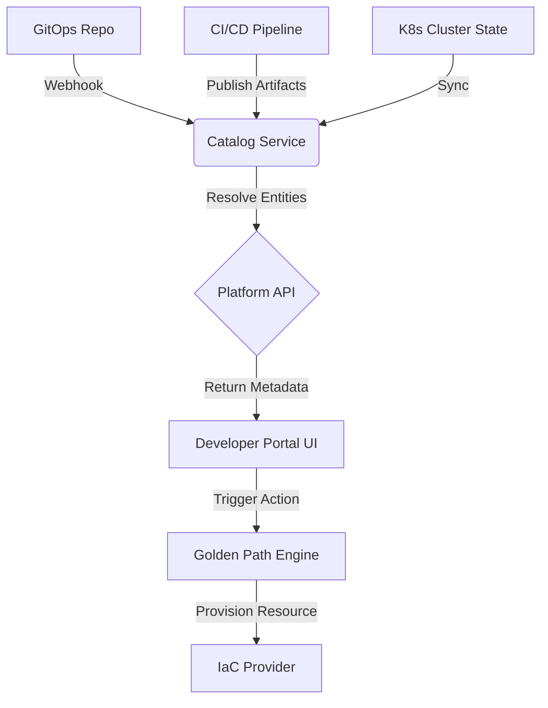

# Platform Engineering: Building Internal Developer Portals That Teams Love

In 2026, the definition of a successful software delivery organization has shifted dramatically from measuring velocity to measuring experience. The era of the "dashboard" is ending; the era of the **Internal Developer Portal (IDP)** is beginning. This isn't just about creating a UI for viewing logs or restarting pods. It is about codifying self-service capabilities, reducing cognitive load, and standardizing infrastructure consumption. For senior engineers and architects, the mandate has changed from "build faster" to "build better."

## The 2026 Landscape & The DevEx Imperative

The current landscape of cloud-native development is fragmented. Developers are expected to be experts in Kubernetes networking, IAM policies, and CI/CD pipelines simultaneously. In 2026, the pressure on Platform Engineering teams has intensified. We are no longer just providing infrastructure; we are curating an environment where developers can focus solely on business logic. This shift is critical for **Developer Experience (DevEx)**.

Why does this matter now? Because the cost of context switching is too high. When a developer spends 30 minutes figuring out how to provision a database or configure a secret, that is time not spent shipping code. A well-built IDP acts as a single pane of glass that abstracts complexity. It enforces **Golden Paths**—the ideal ways to build and deploy—while hiding the underlying chaos of the cloud provider’s API.

However, building these portals requires more than just copying the Backstage template. The 2026 standard demands observability integration directly into the workflow, automated compliance checks before code is committed, and a unified catalog that resolves dependencies across microservices. If your portal doesn't reduce friction, it adds overhead. The goal is to make the platform invisible until help is needed, then instantly available when complexity arises.

## Architectural Patterns & Implementation Guidance

Building an IDP requires a robust architectural foundation centered around a **Source of Truth**. This is typically a Kubernetes Catalog or a custom API layer that ingests metadata from Git repositories, CI systems, and infrastructure controllers. The implementation strategy revolves around three core components: the Catalog Service, the Plugin Ecosystem, and the UI Layer.

To visualize the data flow in a modern platform, consider how an entity request propagates through the system. The architecture must support decoupling so that catalog updates do not require UI rebuilds.



In the diagram above, notice how the Catalog Service acts as the central hub. It ingests data from GitOps repos and CI/CD pipelines before resolving entities for the UI. This separation ensures that metadata is always consistent regardless of infrastructure state changes.

For implementation guidance, you must write plugins that adhere to strict contracts. Below is a Python example demonstrating how to handle an entity discovery hook within a plugin architecture. This pattern ensures that your catalog logic remains modular and testable.

```python
from backstage_plugin import Plugin
from backstage_plugin.models import EntityRef

class ResourceDiscoveryPlugin(Plugin):
    def discover(self, context: Context, ref: EntityRef) -> dict:
        # Logic to query the database for resource metadata
        metadata = self._query_resource(ref)
        
        if metadata and metadata.status == 'active':
            return {
                "kind": "Resource",
                "metadata": {
                    "name": ref.name,
                    "namespace": ref.namespace
                },
                "spec": {
                    "owner": metadata.owner_group,
                    "labels": metadata.labels
                }
            }
        return {}
```

The key takeaway here is immutability of the discovery logic. Your plugin should not mutate state directly but rather query the immutable source of truth. This prevents race conditions during high-traffic portal usage.

## Tooling Strategy & Comparison Matrix

When selecting or building your stack, you must evaluate existing tools against custom development needs. While Backstage is the de-facto standard for UIs, it is not a silver bullet. Some organizations prefer API-first approaches using Kubernetes CRDs (Custom Resource Definitions) alongside minimal UI wrappers like React or Vue.

| Feature | Value |
|---------|-------|
| **Core Philosophy** | Platform-as-a-Service vs. Custom Dashboard |
| **Catalog Source** | GitOps/SCM Integration |
| **Golden Path Enforcement** | Automated Validation Rules |
| **Developer Scorecard** | Built-in Metrics & Health Checks |
| **Implementation Time** | 6-12 Weeks (Backstage) vs. 3+ Months (Custom) |

The table above highlights that while Backstage offers a faster start, custom solutions offer deeper integration with specific legacy systems or proprietary data lakes. However, the most common pitfall in this space is **"Portal Bloat."** Teams often add too many widgets and dashboards, turning a simple portal into a complex enterprise reporting tool. This defeats the purpose of self-service.

To avoid this, implement **Developer Scorecards**. These are automated metrics displayed to