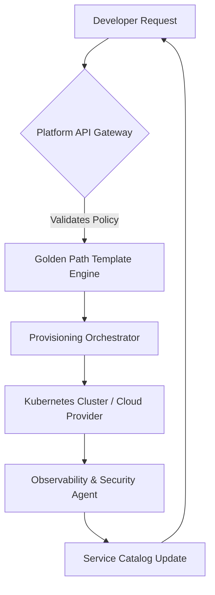

# Platform Engineering: Building Internal Developer Portals That Teams Love

The landscape of software delivery has shifted dramatically between 2024 and 2026. The era of purely reactive DevOps is giving way to proactive Platform Engineering. In the current environment, developer velocity is no longer solely measured by commit frequency or deployment speed; it is increasingly defined by cognitive load and onboarding friction. Teams are drowning in shadow IT sprawl, where every new service requires manual intervention from platform teams, creating a bottleneck that stifles innovation. This is why building an Internal Developer Platform (IDP) is not just an infrastructure upgrade—it is a strategic imperative for organizational health.

The core philosophy of a modern IDP is the "Golden Path." This concept dictates that developers should be able to provision and deploy standard services without needing deep knowledge of underlying infrastructure complexity. However, providing a golden path does not mean restricting freedom; it means curating the experience so that the "easy way" is also the "right way." In 2026, the expectation is self-service governance. Developers must be able to spin up environments, understand their dependencies, and troubleshoot issues without opening a Jira ticket for every anomaly.

## Architectural Foundations and Golden Paths

To build a portal that teams actually love, you must architect it around the lifecycle of a developer request rather than just the infrastructure stack. A robust architecture separates the user interface from the orchestration layer, allowing the platform to evolve without requiring UI rewrites. The ideal flow begins with a catalog entry. When a developer clicks "Create," they are not interacting directly with Kubernetes manifests or Terraform state files; they are interacting with an abstraction layer that handles compliance, networking, and observability automatically.

Consider the following architectural flow for a provisioning lifecycle:



In this diagram, the "Golden Path Template Engine" is critical. It represents the logic that applies default configurations for security and networking before resources are created. If a developer requests a database, the system automatically attaches encryption at rest, sets up VPC peering, and configures logging pipelines. This abstraction hides complexity while enforcing compliance.

The technical implementation relies heavily on an API Catalog. This catalog acts as the single source of truth for all services. It decouples the UI from the underlying resources. When a developer views their workspace in the portal, they are querying the catalog, not scanning Kubernetes directly. This separation allows you to migrate infrastructure providers without breaking the user interface. Furthermore, the architecture must support multi-tenancy by default. Resources should be namespaced logically by team or project ID to prevent namespace pollution and ensure clear ownership boundaries.

## Implementation Strategies and Tooling Comparison

When selecting tools for your IDP, the choice often comes down to three primary approaches: open-source frameworks like Backstage, specialized commercial IDPs like Internal Dev Portal (IDP), or custom builds using GitOps principles. Each has distinct trade-offs regarding maintenance overhead, customization, and integration capabilities.

| Approach | Latency | Throughput | Governance Control | Maintenance Cost |
| :--- | :--- | :--- | :--- | :--- |
| **Backstage** | Low | High | Medium (Plugin-based) | High (Community driven) |
| **Internal Dev Portal** | Medium | High | High (Native) | Low (Managed Service) |
| **Custom GitOps** | Variable | Scalable | Full Control | Very High |

For teams prioritizing speed to market and low maintenance, the managed service approach often wins. However, for organizations with strict security compliance requirements or a need for deep customization of the developer workflow, a custom GitOps build on top of Kubernetes is preferable. A custom implementation allows you to write code that directly interacts with your specific CI/CD pipelines without being constrained by plugin ecosystems.

Here is an example of how a Golden Path template might be defined in a Kubernetes manifest for a standard microservice deployment:

```yaml
apiVersion: apps/v1
kind: Deployment
metadata:
  name: golden-path-service
  annotations:
    platform.io/owner: team-alpha
    platform.io/environment: production
spec:
  replicas: 2
  template:
    spec:
      containers:
        - name: app
          image: registry.internal/team-alpha/app:v1.0.0
          resources:
            requests:
              memory: "512Mi"
              cpu: "250m"
            limits:
              memory: "1Gi"
              cpu: "500m"
```

This snippet demonstrates the abstraction layer. Notice the annotations `platform.io/owner` and `platform.io/environment`. These are not standard Kubernetes fields but custom labels that your platform's reconciliation loop reads to apply policies. The CI/CD pipeline, upon receiving this manifest, automatically injects the necessary sidecars for logging and tracing without the developer needing to configure them manually. This pattern ensures consistency across hundreds of services while reducing the cognitive burden on the engineering team.

## Operationalizing DevEx with Scorecards and Metrics

Building the portal is only half the battle; measuring its success requires a shift in how you track Developer Experience (DevEx). Traditional metrics like "Deployment Frequency" are insufficient for an IDP. You need to measure friction points, time-to-provision, and adoption rates of the golden path versus shadow IT workarounds. To truly love your platform, you must implement a Developer Scorecard system that provides feedback loops to the development teams.

This scorecard should be accessible directly within the portal dashboard. It helps developers understand their own efficiency and compliance posture. For instance, if a team consistently creates resources outside the golden path, the scorecard should highlight this trend gently, offering educational resources rather than punitive warnings. This transparency fosters a culture of ownership.

To automate these insights, you can build lightweight analytics scripts that aggregate data from your CI/CD logs and infrastructure events. Here is a Python snippet demonstrating how to calculate a "Developer Health Score" based on provisioning latency and error rates:

```python
def calculate_developer_health_score(team_data):
    total_provision_time = sum(data['provision_time'] for data in team_data)
    successful_provisions = len([d for d in team_data if d['status'] == 'success'])
    errors = len([d for d in team_data if d['status'] == 'error'])
    
    # Weighted score calculation
    latency_score = max(0, 1 - (total_provision_time / 3600)) # Normalized by 1 hour
    reliability_score = successful_provisions / (successful_provisions + errors)
    
    final_score = (latency_score * 0.4) + (reliability_score * 0.6)
    return round(final_score, 2)

# Example usage
team_metrics = [
    {'provision_time': 120, 'status': 'success'},
    {'provision_time': 150, 'status': 'success'},
    {'provision_time': 90, 'status': 'error'}
]
print(f"Team Health Score: {calculate_developer_health_score(team_metrics)}")
```

This logic feeds into the dashboard, giving developers a clear number to optimize against. If the score drops, it signals that either their pipelines are inefficient or they are frequently violating platform policies. Over time, this data informs the platform team where to invest in automation, such as fixing flaky tests or optimizing resource requests to reduce spin-up times.

## Future Outlook and Strategic Considerations

As we look toward 2027 and beyond, the Internal Developer Portal will evolve from a catalog of resources to an intelligent workspace. The integration of AI agents into these portals is inevitable. Imagine a future where a developer asks, "I need a PostgreSQL database with high availability in the EU region," and the portal agent not only spins it up but also explains the cost implications and security configurations automatically. This requires your current architecture to be API-first and event-driven so that external AI models can query your internal state securely.

However, pitfalls exist. A common mistake is over-engineering the UI. Teams often spend months customizing the frontend while ignoring the underlying data model. Remember, a beautiful portal with broken provisioning logic will fail quickly. Another pitfall is neglecting the "dark mode" of operations: incident management. The portal must include clear links to runbooks and support channels, ensuring that when things break, developers are guided toward resolution rather than left in the dark.

Finally, governance must be baked into the codebase, not enforced by manual review boards. The golden path is only effective if it is the default. By shifting from "request-based" provisioning to "catalog-driven" automation, you reduce the burden on platform engineers and allow development teams to focus on business logic.

## Conclusion

Building an Internal Developer Portal that teams love requires a fundamental shift in mindset. It moves the organization from a support model to a product model, where the platform team acts as the Product Owner for developer experience. By implementing golden paths, leveraging API catalogs, and measuring success through actionable scorecards, you create an ecosystem where efficiency and governance coexist. The architecture must be robust enough to handle scale but flexible enough to adapt to new technologies like AI agents. Ultimately, the goal is not just to manage infrastructure, but to empower developers to build software faster with less friction.