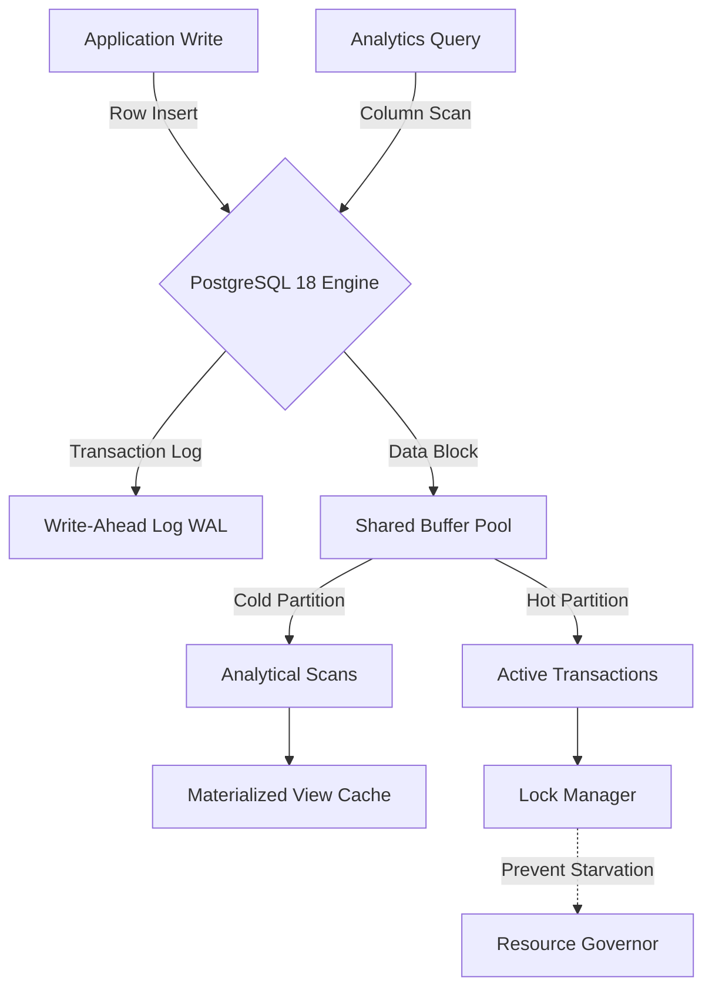

# PostgreSQL 18 and the Rise of Hybrid Transactional-Analytical Processing

In the evolving landscape of enterprise data architecture, the dichotomy between transactional processing (OLTP) and analytical processing (OLAP) has historically dictated database strategy. By 2026, the industry is witnessing a decisive shift away from polyglot persistence—maintaining separate systems for operational writes and analytical reads—toward unified Hybrid Transactional-Analytical Processing (HTAP). PostgreSQL 18 stands at the forefront of this transition, introducing significant enhancements to columnar storage capabilities, parallel query execution engines, and real-time analytics support. For senior architects, understanding these capabilities is no longer optional; it is a critical requirement for building scalable, cost-efficient data platforms that eliminate data silos.

## The 2026 HTAP Landscape: Beyond Polyglot Persistence

The traditional architecture of the past decade relied on Lambda or Kappa architectures, necessitating separate ingestion pipelines and distinct database instances. This approach introduced significant latency in data availability and operational overhead in managing multiple clusters. In 2026, the cost of infrastructure and the complexity of ETL synchronization make this model unsustainable for many mid-to-large-scale enterprises.

PostgreSQL 18 addresses these friction points by refining how storage engines handle mixed workloads. Previously, PostgreSQL was optimized strictly for row-oriented access patterns typical of OLTP. The new iteration introduces more robust columnar index structures and improved bitmap handling that allow analytical scans to occur without disrupting transactional integrity. This means that a single instance can now serve both high-frequency user transactions and complex aggregations on the same data store.

The implications for system design are profound. Architects no longer need to justify the expense of a separate ClickHouse or Snowflake instance solely for reporting. Instead, they can leverage PostgreSQL’s mature ecosystem of extensions, connection pooling, and security protocols within a unified architecture. This consolidation reduces operational risk and simplifies the deployment pipeline while maintaining high availability standards.

## Technical Deep Dive: Enabling Hybrid Workloads

Implementing HTAP in PostgreSQL 18 requires specific configuration adjustments to ensure that analytical queries do not starve transactional workloads of resources. The core mechanism relies on intelligent resource management and storage partitioning. You must configure the parallel query execution settings carefully to prevent "query bloat" from impacting write latency.

Consider a scenario where you are managing a high-volume e-commerce ledger. In PostgreSQL 18, you can utilize declarative partitioning to separate hot transactional data from cold analytical data while keeping them within the same schema. The following SQL snippet demonstrates how to structure a partitioned table optimized for both workloads:

```sql
CREATE TABLE orders (
    order_id BIGINT PRIMARY KEY,
    customer_id INT NOT NULL,
    amount DECIMAL(10, 2),
    status VARCHAR(20),
    created_at TIMESTAMP DEFAULT NOW()
) PARTITION BY RANGE (created_at);

-- Create a partition for the last 30 days (Hot Data)
CREATE TABLE orders_2026_q4 PARTITION OF orders
    FOR VALUES FROM ('2026-10-01') TO ('2026-12-31');

-- Create a partition for historical data (Cold Data)
CREATE TABLE orders_history PARTITION OF orders
    FOR VALUES FROM ('2026-01-01') TO ('2026-10-01');

-- Configure parallel query settings for analytical access
ALTER SYSTEM SET max_parallel_workers_per_gather = 4;
ALTER SYSTEM SET random_page_cost = 1.5;
```

To support real-time analytics, you must also tune the `work_mem` and `effective_cache_size`. Increasing `max_parallel_workers` allows analytical queries to utilize more CPU cores without locking out transactional rows for extended periods. However, this comes at a cost: increased memory pressure. You must monitor `pg_stat_activity` closely to ensure that heavy aggregations do not hold locks on shared buffers for too long.

## Architectural Patterns and Performance Trade-offs

A critical step in adopting HTAP is visualizing the data flow within your PostgreSQL 18 instance. The architecture requires a clear separation of concerns between write-heavy paths and read-heavy analytical paths, even if they reside in the same binary. The following diagram illustrates how workloads are routed through the engine, highlighting the role of columnar storage layers in optimizing scan performance.



When evaluating your options for HTAP, it is essential to compare the performance characteristics of traditional approaches against the unified PG 18 model. The table below outlines the key differentiators regarding latency, throughput, and operational complexity.

| Approach | Latency | Throughput | Operational Complexity | Use Case |
|----------|---------|------------|------------------------|-----------|
| **Traditional OLTP** | < 10ms | High Write | Low | User Transactions |
| **Separate OLAP** | < 5ms (Read) | High Read | Very High (ETL) | Reporting / BI |
| **PostgreSQL 18 HTAP** | 10-50ms | Balanced | Medium | Unified Real-Time Analytics |

The table highlights that while PostgreSQL 18 introduces a slight latency trade-off compared to a dedicated OLTP engine, it offers a balanced throughput profile. This balance is often the deciding factor for enterprises looking to reduce infrastructure sprawl. The architecture diagram above shows how the Write-Ahead Log (WAL) and Shared Buffer Pool are shared resources that must be managed carefully to prevent contention between transactional locks and analytical scans.

## Operational Best Practices and Future Outlook

Adopting HTAP is not merely a matter of installing software; it requires a shift in operational discipline. One of the most common pitfalls in this architecture is ignoring index fragmentation on columnar data structures. Because analytical queries often scan large subsets of rows, standard B-tree indexes can become inefficient for wide-range scans. You should prioritize partial indexes or GiST/SP-GiST structures designed for range queries over simple primary keys for analytical joins.

Another critical area is the management of materialized views. In a pure OLTP system, views are virtual and computed on demand. In an HT