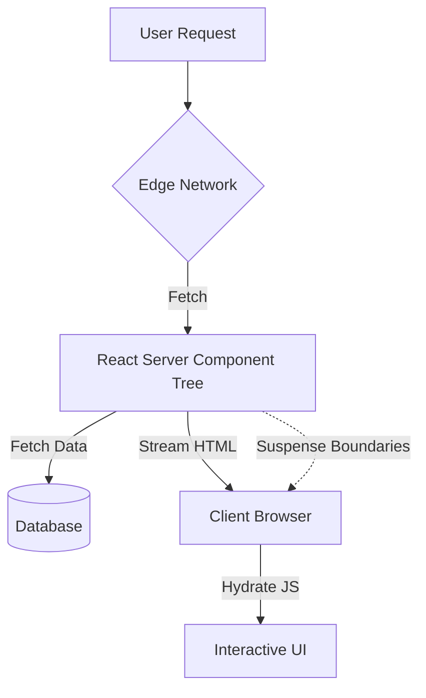

# React Server Components: Production Patterns for High-Performance Web Apps

The landscape of web development in 2026 has fundamentally shifted away from the traditional Client-Side Rendering (CSR) model and even standard Server-Side Rendering (SSR). The introduction and maturation of React Server Components (RSC) represent a paradigm shift that addresses long-standing performance bottlenecks, specifically Time to First Byte (TTFB) and bundle bloat. For senior architects, the decision is no longer just about "how to render," but about defining where logic lives and how data flows across the server-client boundary. This post outlines the production-grade patterns required to leverage RSC effectively in a high-traffic environment.

## The 2026 Landscape: Beyond Traditional SSR

In the modern web ecosystem, performance is no longer solely measured by Core Web Vitals but by the efficiency of resource delivery and the reduction of client-side JavaScript execution time. Traditional SSR often involves serializing data to JSON for the client, followed by a hydration phase where React reconciles the DOM. This introduces a "hydration tax" that can delay interactivity.

React Server Components solve this by allowing components to render entirely on the server without sending down unnecessary JavaScript. In 2026, RSC is not merely an alternative framework feature; it is becoming the standard for building scalable applications because it enables streaming responses. When a user visits a dashboard, they can see the layout immediately while data in the middle of the page streams in progressively. This reduces perceived latency significantly compared to waiting for a full HTML document to render before interaction begins.

However, this architectural change introduces complexity regarding state management and side effects. The "Server Boundary" must be strictly enforced to prevent server logic from leaking into the browser. If you attempt to use `useEffect` or `useState` directly in an RSC without proper boundaries, you will encounter hydration mismatches that break the application. Understanding this distinction is the first step toward a robust production implementation.

## Architectural Boundaries and Streaming Strategies

The core value proposition of RSC lies in its ability to stream rendering results from the server to the client. This architecture relies on a strict separation between components that can be rendered on the server (Server Components) and those that require browser APIs (Client Components). The data flow is asynchronous and incremental, allowing the server to send HTML chunks as they become ready.

The following diagram illustrates the request lifecycle in an RSC-enabled production environment. It highlights how the server processes dependencies and streams them before the client fully hydrates.



In this architecture, the server handles all data fetching logic, including direct API calls to databases or third-party services. This eliminates the need for a complex proxy layer in many cases. The client receives an HTML document that includes only the minimal JavaScript required to make interactive components functional. Suspense boundaries are critical here; they allow specific parts of the UI to load independently, preventing the entire page from blocking on slow resources.

When designing this architecture, you must consider the "island" model for Client Components. Only components with hooks like `useState`, `useEffect`, or those using DOM APIs can be islands. Everything else should remain server-side to maximize performance and security. This separation ensures that sensitive logic, such as authentication checks or payment processing, never executes in the browser context.

## Production Implementation Patterns & Trade-offs

To implement RSC at scale, you must establish clear patterns for component composition and data fetching. Below is a practical example of defining the server-client boundary using the `use client` directive, which is essential for managing state that persists across hydration boundaries.

```jsx
// app/dashboard/page.jsx (Server Component)
import { fetchUserStats } from '@/lib/data-layer';

export default async function DashboardPage({ userId }) {
  const stats = await fetchUserStats(userId);

  return (
    <main className="dashboard-container">
      <h1>User Analytics</h1>
      <Suspense fallback={<LoadingSkeleton />}>
        {/* Client Component Boundary */}
        <ClientChart data={stats.chartData} /> 
        <ServerStatCard title="Active Users" value={stats.activeUsers} />
      </Suspense>
    </main>
  );
}
```

When comparing different implementation strategies for handling server-side logic, the trade-offs between standard SSR and RSC become apparent. The table below breaks down key metrics relevant to production decision-making.

| Feature | Value (RSC) | Value (Traditional SSR) |
| :--- | :--- | :--- |
| **Bundle Size** | Reduced (JS sent only for Client Components) | Higher (Full React tree sent) |
| **Hydration Time** | Near Instant (HTML streamed first) | Delayed (Wait for full HTML) |
| **Data Fetching** | Direct Server-Side Calls | JSON API to Client |
| **State Management** | Limited (Server State only) | Full Context/Hooks Available |
| **Edge Deployment** | Native Streaming Support | Requires Specific SSR Config |

The code above demonstrates a `DashboardPage` server component that directly calls an async function. Notice the `<Suspense>` wrapper; this is mandatory when using streaming. If the client chart loads slowly, only that section renders while the rest of the dashboard is visible immediately. This pattern prevents the "blank screen" issue often associated with heavy initial data payloads.

For further optimization, consider utilizing `useCache` or specific RSC caching strategies within your edge runtime to minimize repeated database hits for identical user segments. The implementation should prioritize keeping logic on the server unless browser-specific APIs are strictly required.

## Best Practices, Pitfalls, and Future Outlook

Adopting React Server Components in production requires strict adherence to best practices to avoid common pitfalls that plague early adopters. One of the most frequent errors is attempting to use `useState` or `useEffect` in a file without the `use client` directive at the top. This results in runtime errors during hydration because the browser cannot reconcile server-rendered values with empty initial state.

Key best practices include:
*   **Strict Boundary Enforcement:** Never import Client Components into Server Components directly unless necessary. Use lazy loading