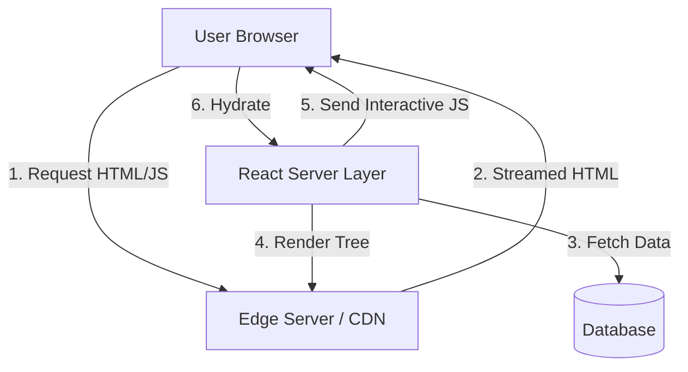

# React Server Components: Production Patterns for High-Performance Web Apps

The landscape of web development in 2026 has shifted decisively toward server-centric rendering paradigms. While traditional Client-Side Rendering (CSR) dominated the early React ecosystem, the performance bottlenecks of large JavaScript bundles have forced a re-evaluation of architecture. React Server Components (RSC) offer a paradigm shift that moves logic and data fetching directly to the server, significantly reducing client-side payload size. For senior engineers architecting high-traffic applications, understanding RSC is no longer optional; it is a critical component of modern performance engineering. This post explores production-grade patterns, architectural boundaries, and implementation strategies necessary to leverage RSC effectively in 2026.

## The 2026 Landscape and Performance Imperatives

In the current ecosystem, Core Web Vitals remain the primary metric for search engine ranking and user retention. Traditional SSR (Server-Side Rendering) frameworks like Next.js have evolved to support RSC natively, but the distinction between server and client code remains a source of complexity. The 2026 landscape emphasizes Edge Computing integration with RSC, where components are rendered closer to the user to minimize latency.

Why does this matter now?
*   **Bundle Size Reduction:** By moving heavy logic (like data fetching or third-party SDKs) to the server, we prevent unnecessary JavaScript from hitting the client’s main thread.
*   **Streaming Responses:** RSC enables partial hydration. The HTML can stream to the browser immediately while components render in parallel on the server.
*   **Security Surface:** Sensitive data (API keys, database credentials) remains entirely within the server environment, inaccessible to the client bundle.

However, this shift introduces new constraints. State management becomes more complex because `useEffect` and hooks like `useState` are restricted in Server Components. Engineers must learn to compose components strictly based on where execution occurs.

## Architectural Boundaries and Streaming SSR

The core of RSC architecture lies in the definition of boundaries. A boundary exists between a component that runs on the server (Server Component) and one that runs in the browser (Client Component). Crossing this boundary requires explicit markers, such as the `'use client'` directive.

Streaming SSR is the mechanism that makes RSC performant. When a request hits the server, React renders the tree but sends the HTML for static parts immediately. It then streams the remaining interactive components as they are rendered. This reduces Time to Interactive (TTI) significantly compared to waiting for the full bundle to download and parse.

The following diagram illustrates the data flow from the client request through the streaming server response back to the browser hydration.



In this architecture, the server handles all data fetching logic (Step 3). The edge layer (Step 1 & 2) delivers the initial markup immediately. Only after the static HTML is received does the client execute JavaScript to handle mutations and interactivity (Step 5). This separation ensures that the initial page load is fast even if the database query takes time, as long as the HTML is streamed correctly.

## Implementation Patterns and Tool Comparison

To implement RSC effectively, developers must adhere to specific fetching patterns. Server components should own their data. They cannot rely on client-side state for initial population; they must fetch it during render. This often involves `async/await` inside server components.

### Pattern 1: Server-Side Data Fetching
In a Server Component, you can call API endpoints directly. This eliminates the need for a separate network request from the client.

```typescript
// app/dashboard/page.tsx (Server Component)
import { fetchUserStats } from '@/lib/api';
import DashboardChart from './chart'; // Renders on server or client depending on directive

export default async function DashboardPage() {
  const user = await fetchUserStats();
  
  return (
    <main>
      <h1>Welcome back, {user.name}</h1>
      <DashboardChart data={user.stats} />
    </main>
  );
}
```

### Pattern 2: Client Interaction Boundaries
When state needs to be mutated or events handled, you must cross the boundary. This requires careful handling of props and context to avoid hydration mismatches.

```typescript
// app/dashboard/chart.tsx (Client Component)
'use client';

import { useState } from 'react';

interface ChartProps {
  data: number[];
}

export default function DashboardChart({ data }: ChartProps) {
  const [hoverIndex, setHoverIndex] = useState<number | null>(null);

  return (
    <div onMouseMove={(e) => setHoverIndex(e.offsetY)}>
      {/* Interactive chart logic here */}
      Hover index: {hoverIndex}
    </div>
  );
}
```

### Tool Comparison for RSC Implementation

Choosing the right framework or runtime environment is critical. The table below compares common approaches regarding execution model and streaming support in 2026.

| Feature | Value |
| :--- | :--- |
| **Hydration Strategy** | Streaming vs. Full Bundle |
| **Bundle Size Impact** | Reduces Client JS by ~40-60% |
| **State Management** | Server State (Signals) vs. Client Context |
| **Edge Runtime Support** | Vercel Edge Functions / Cloudflare Workers |
| **Streaming Capability** | Native Streaming in Next.js 15+ |

Using the table above, we can see that streaming capability is a defining factor for performance. If your toolchain supports native streaming, you gain significant latency benefits over full-bundle hydration approaches.

## Production Pitfalls and Future Outlook

Despite the advantages, RSC introduces specific pitfalls that often cause production incidents. The most common issue is **Hydration Mismatch**. This occurs when the server renders HTML differently than the client re-renders it in JavaScript. For example, if a Server Component fetches data on mount but the Client Component expects different props immediately upon hydration, React will throw a warning and potentially break interactivity.

**Common Pitfalls:**
*   **Improper `useEffect` Usage:** Never use `useEffect` to trigger data fetching in Server Components; they do not run client-side.
*   **Prop Drifting:** Passing mutable state from Client to Server