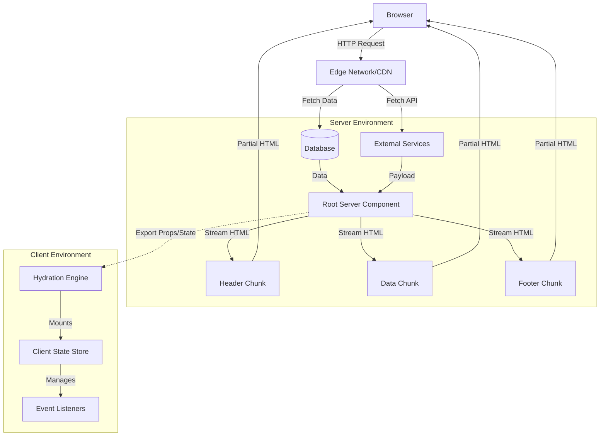

# React Server Components: Production Patterns for High-Performance Web Apps

The evolution of React rendering models has fundamentally altered how we approach web performance in 2026. While traditional Client-Side Rendering (CSR) dominated for years, and Server-Side Rendering (SSR) provided the SEO and initial load benefits, the industry is now pivoting toward React Server Components (RSC). This shift is not merely a syntactic change; it represents a paradigm shift in how state, data, and interactivity are managed across the network boundary. For senior engineers building production-grade applications, understanding the nuances of RSC architecture is no longer optional—it is a strategic imperative for achieving high-throughput, low-latency web experiences.

## The 2026 Landscape & Strategic Imperative

In the current development landscape of 2026, the limitations of traditional SSR models are becoming increasingly apparent. Conventional SSR often requires full page hydration before interactivity begins, leading to "waterfall" rendering issues where critical content is blocked by non-critical scripts. React Server Components solve this by allowing components rendered on the server to remain purely server-side, reducing the JavaScript bundle sent to the client.

The strategic value of RSC lies in its ability to decouple data fetching from UI hydration. In a typical Next.js or Remix environment utilizing RSCs, heavy data operations like database queries and API calls happen exclusively on the server. This means sensitive logic, such as authentication checks or internal analytics, never leaks into the client bundle. For high-scale applications, this reduces the attack surface significantly while improving Core Web Vitals metrics like Largest Contentful Paint (LCP).

Furthermore, RSC enables true streaming SSR. Unlike traditional SSR which waits for all data to load before sending the HTML response, RSC can stream chunks of content as they become available. This is critical for e-commerce dashboards or real-time analytics platforms where time-to-first-byte (TTFB) and time-to-interactive (TTI) are the primary KPIs. The 2026 landscape demands that we stop treating the server as a static page generator and start treating it as a dynamic, streaming data source.

## Architectural Boundaries & Streaming Mechanics

To leverage RSC effectively, one must understand the strict boundary between the server environment and the client environment. This boundary is not just about where code runs; it defines what can be shared. The architecture relies on a specific flow: Server Components render HTML streams directly to the response object, while Client Components receive this stream via hydration logic to manage state and events.

The following diagram illustrates the data flow and component boundaries in a streaming RSC architecture:



In this architecture, the Server Component (`App`) is responsible for generating the initial markup. It can access `fetch` and database drivers directly. The critical distinction is that any component marked as a Client Component (via `'use client'`) cannot be included in the server bundle. This forces developers to explicitly define boundaries. If you attempt to pass a React Context or a ref from a Client Component into a Server Component, it will fail at build time because the context does not exist on the server.

The streaming aspect is managed by the renderer (e.g., Next.js). When the server renders a component tree, if a child component is an RSC, it streams its HTML immediately. If it is a Client Component, it waits for hydration signals. This separation allows the browser to render visible content before the interactive shell is fully ready, drastically reducing perceived load time.

## Implementation Patterns & Code Examples

Implementing these patterns requires strict adherence to the rendering context. Below are two critical patterns: one demonstrating data fetching within a Server Component and another showing the boundary enforcement for Client-side logic.

**Pattern 1: Asynchronous Data Fetching in Server Components**
In production, we avoid `useEffect` on the server. Instead, we use standard `async/await` functions or `fetch` directly inside Server Components to load data. This keeps the dependency graph clean and ensures data is available before rendering.

```tsx
// app/dashboard.tsx (Server Component)
import { fetchUserStats } from '@/lib/data-layer';

export default async function DashboardLayout({ userId }: { userId: string }) {
  // Direct database access without hydration concerns
  const stats = await fetchUserStats(userId);
  
  return (
    <div className="dashboard-container">
      <h1>User Analytics</h1>
      {/* This data is static on the server */}
      <p>Total Views: {stats.views}</p> 
      
      {/* Client Component injected via streaming */}
      <StatsWidget userId