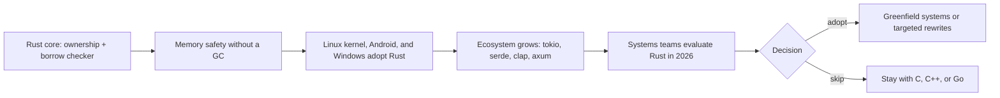

# Rust for Systems Programming in 2026: Memory Safety, Concurrency, and Ecosystem Growth

I came to Rust as a skeptic. Twenty years of C and then C++ had convinced me that memory safety was a discipline problem, not a language problem, and I had the scar tissue to prove it. When the security world started treating memory errors as the root cause of a large share of serious vulnerabilities, I expected another fad with a blog post and a conference talk. Rust turned out not to be a fad. What I found, working with it for real, is a language that moves the discipline into the compiler — and charges tuition for it. This is my honest field report: what ownership actually buys you, why the borrow checker makes people angry, what concurrency looks like when the compiler checks your work, and where Rust still is not the answer in 2026.

## Why the industry came around

The adoption story is concrete, not vibes. The Linux kernel accepted Rust for kernel modules, and the security arguments are why: whole classes of memory bugs become compile errors instead of CVEs. Android has been moving memory-unsafe components to safer languages and publishing the results, and the pattern holds — the share of memory safety vulnerabilities in the migrated components drops hard. Microsoft, for its part, has said plainly that most of the serious vulnerabilities it tracks trace back to memory safety. None of that is a marketing claim; it is boring, public, and repeated.

The ecosystem followed the adopters. By 2026 you can build a real network service with tokio and axum, serialize anything with serde, and not fight the toolchain while you do it. The crate ecosystem is deep in the places systems programmers actually live: networking, parsing, crypto, embedded. That was not true when I first looked at Rust, and it matters more than any language feature.

The tooling deserves credit here. cargo handles builds, tests, and dependencies without a separate ecosystem of scripts; rustfmt and clippy are part of the default workflow rather than an afterthought; docs.rs puts rendered documentation one keystroke away. That sounds mundane until you have maintained a C project where the build system is a religion and the linter is a memory.

## What ownership actually buys you

Ownership is the thing that makes the safety claims true. Every value in Rust has exactly one owner, and when that owner goes out of scope, the value is dropped. No garbage collector, no refcounting, no mystery. Here is the shape of it:

```rust
struct Buffer {
    data: Vec<u8>,
}

fn main() {
    let buf = Buffer { data: vec![0u8; 1024] };
    let first = &buf.data[0];    // shared borrow, read-only
    let _len = buf.data.len();   // fine: more shared borrows
    // buf.data.push(1);         // error: cannot borrow as mutable
    println!("first byte: {first}");
}
```

The compiler tracks who can read and who can write, and it refuses to let a mutable borrow exist while anyone else holds a reference. That rule, applied everywhere, is what kills use-after-free, double-free, and data races at compile time. It is a real guarantee, and it is the reason the security people keep pointing at Rust. I have shipped C code that I was not sure about; I have never shipped Rust code that compiled and then surprised me with a use-after-free. The Drop trait is the quiet half of this. When a value goes out of scope, Rust runs its cleanup deterministically — no finalizers, no GC pauses, no waiting for the runtime to feel like it. You know exactly when a file handle closes or a lock releases, which matters more than it sounds when you are debugging resource exhaustion.

## The borrow checker tax

Now the honest part: the borrow checker costs you real time. The first weeks are fighting the compiler over things that feel obviously correct. Lifetimes — the annotations that tell the compiler how long references live — are the worst of it. You will write a struct holding a reference, get a wall of error text, and spend an afternoon restructuring code that was perfectly clear in your head.

Two things make it survivable. First, the errors are usually right: the fights are mostly the compiler catching a real aliasing problem you had not thought through. Second, you learn to write code that the checker likes — build once, pass references down, clone at the edges. After a month the friction drops to background noise. I tell teams to budget two to three weeks of low productivity per engineer, and to pair the first Rust work with someone who has already paid the tax. The tax is real. The payoff is that the class of bugs you used to debug in production simply stops showing up.

A concrete example, because vague advice is useless. I once wrote a parser struct that held a slice into the input buffer, then tried to return a second struct that also borrowed from it. The compiler refused, and rightly so — the two borrows could outlive each other in a way I had not considered. I spent an evening splitting the code so each struct owned what it needed. The resulting design was simpler than my original idea, and it passed first review without a single "why does this hold a reference?" question. That is the pattern: the borrow checker does not just reject bad code, it nudges you toward code that is easier to explain.

## Concurrency without the footguns

Concurrency is where the same rules do their best work. The ownership model extends to threads: a value you move into a thread cannot be touched by the thread that moved it, and shared state has to go through types that enforce safe access. The compiler catches data races that used to cost me weeks of heisenbug debugging:

```rust
use std::thread;

fn main() {
    let mut handles = vec![];
    for i in 0..4 {
        handles.push(thread::spawn(move || {
            let result = i * i;
            println!("worker {i} finished: {result}");
        }));
    }
    for h in handles {
        h.join().unwrap();
    }
}
```

For passing work between threads, channels are the boring, correct default. mpsc gives you a sender and a receiver, the compiler checks the types, and the design stays simple. The result is that parallel code in Rust reads like sequential code with spawn calls, and the race conditions you would normally hunt at 2 a.m. are compile errors by 5 p.m. I will take that trade every time. When you do need shared mutable state, the standard answer is Arc with a Mutex or RwLock inside, and the compiler insists you spell out the sharing — which means the lock scope is visible in the type. It is heavier than the channel pattern, and I reach for channels first, but both are boring, documented, and reliable.

## Error handling that doesn't lie

Rust's error handling is my favorite quiet feature. Functions say what they can fail with, and the ? operator propagates errors up the call stack without exceptions flying sideways through your control flow:

```rust
use std::fs::File;
use std::io::Read;

fn read_config(path: &str) -> Result<String, std::io::Error> {
    let mut file = File::open(path)?;
    let mut contents = String::new();
    file.read_to_string(&mut contents)?;
    Ok(contents)
}
```

No null, no unchecked casts, no silent fallbacks. If a function can fail, the type system says so, and the caller has to decide what to do. That sounds like a small thing until you maintain a codebase where every failure path is visible in the signature.

## The ecosystem picture

The adoption flow looks like this in one picture:



The cycle is self-reinforcing. Adoptions pull in tooling and crates; the crates make adoption cheaper; the security argument keeps the funding coming. That is how an ecosystem becomes boring enough to bet a career on. One caution from the trenches: not every crate is maintained. I check docs.rs, the last release date, and the issue tracker before adding a dependency, the same way I used to vet a library's mailing list. The ecosystem is healthy, but "it is on crates.io" is not the same as "someone will fix this when I file a bug."

## Where Rust still isn't the answer

Skepticism has to go both ways. Rust is still a poor fit for quick scripts — the ceremony outweighs the payoff. GUI development remains an afterthought compared to the web or C++ ecosystems. Compile times on large projects are still long enough to shape your workflow. Async Rust has a real learning cliff past the basics. And some interop with existing C codebases is painful, though the bindgen tooling keeps improving. If your team is small, your deadline is short, and your codebase is C that mostly works, the honest advice may be to stay put.

## The bottom line

Rust in 2026 is the strongest memory-safe option for systems programming that I have seen in my career, and the ecosystem has grown to match. The borrow checker tax is real, the compile times are real, and the learning curve is real. So is the payoff: the memory safety and data race bugs that used to consume my debugging time simply do not happen anymore. I recommend Rust for new systems work with a straight face, and I recommend it with the warning that it will cost you a month. It is not the answer to everything. It is the answer to the question of how to write systems code that does not shoot you in the foot.
