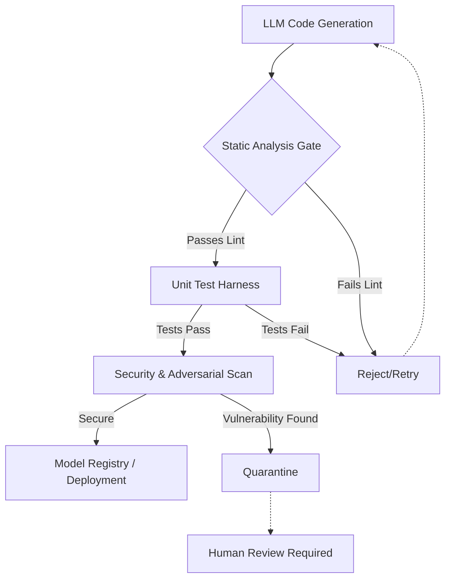

# Testing AI-Generated Code: Strategies for Reliable Machine Learning Pipelines

The integration of Large Language Models (LLMs) into software development workflows has fundamentally altered the engineering landscape by 2026. While AI assistants accelerate feature delivery, they introduce a critical reliability challenge: non-deterministic code generation. In traditional software engineering, code is written with explicit intent and verified against static requirements. With AI-generated code, that intent is often implicit, derived from probabilistic token predictions rather than deterministic logic. For senior engineers managing Machine Learning (ML) pipelines, the stakes are higher; a hallucinated dependency or a subtle logic error in a data preprocessing script can silently corrupt model training data, leading to catastrophic downstream failures. Consequently, the industry has shifted from simple linting to robust, multi-layered testing strategies designed specifically for AI artifacts.

## The 2026 Landscape and Reliability Imperatives

In 2026, the reliance on LLM-generated snippets within production ML pipelines is no longer experimental; it is standard practice in many data engineering teams. However, this shift has exposed significant gaps in traditional Quality Assurance (QA) methodologies. Standard unit testing frameworks often fail to catch semantic errors where the code compiles but behaves incorrectly relative to business logic. The core issue lies in the "hallucination gap," where the model generates syntactically correct Python that violates implicit constraints or introduces security vulnerabilities such as injection flaws within data loaders.

Furthermore, ML pipelines are inherently stochastic. An AI-generated function might work correctly on a small sample set but fail under distributional shift when deployed to production traffic. This necessitates a testing paradigm that extends beyond syntax checking to include semantic verification and adversarial robustness. Engineers must now treat AI code generation not as an end-state solution, but as a component within a larger verification loop. The reliability imperative is clear: without rigorous testing strategies, the velocity gains from AI coding assistants are negated by increased technical debt and security risks. We cannot simply deploy what the model outputs; we must architect systems that validate those outputs against ground truth standards before they touch production environments.

## Architectural Framework for AI Code Validation

To manage these risks effectively, organizations require a dedicated validation layer inserted between the LLM generation phase and the deployment pipeline. This architectural pattern treats the AI output as "untrusted code" until proven otherwise by automated verification tools. The architecture must support parallel execution paths: one for functional correctness and another for security compliance.

The following diagram illustrates the high-level flow of a robust testing pipeline designed for AI-generated ML code. It highlights how the generated artifact passes through multiple gates, including static analysis, unit testing, and security scanning, before reaching the model registry.



This architecture enforces a strict gatekeeping mechanism. The `Static Analysis Gate` handles basic syntax and dependency resolution, preventing immediate runtime errors. The `Unit Test Harness` is critical here; unlike standard testing, these tests often involve property-based testing to ensure the generated logic holds under various data distributions. Finally, the `Security & Adversarial Scan` ensures that the code does not contain prompt injection vulnerabilities or insecure deserialization patterns common in AI-generated libraries. By routing failures to a human review queue, we maintain a safety net against high-confidence hallucinations that automated tools might miss.

## Implementation Patterns and Tooling Comparison

Implementing this architectural framework requires specific patterns for validation logic. Below is a Python implementation of a validator class designed specifically for generated data processing functions. This pattern ensures that any function generated by an LLM adheres to strict type constraints and input/output specifications before execution.

```python
import re
from typing import Any, Dict

class AICodeValidator:
    """
    Validates AI-generated code logic against expected patterns.
    Focuses on preventing common hallucination pitfalls in data pipelines.
    """
    
    def __init__(self):
        self.forbidden_patterns = [r'import.*sklearn', r'subprocess.call']
        
    def validate_syntax(self, code: str) -> bool:
        """Basic syntactic check before execution."""
        try:
            compile(code, '<string>', 'exec')
            return True
        except SyntaxError:
            return False

    def validate_dependencies(self, code: str) -> Dict[str, Any]:
        """Ensures no forbidden or insecure dependencies are imported."""
        issues = []
        for pattern in self.forbidden_patterns:
            if re.search(pattern, code):
                issues.append(f"Restricted import detected: {pattern}")
        return {"valid": len(issues) == 0, "issues": issues}

    def validate_logic_contract(self, func_code: str, input_schema: Dict) -> bool:
        """
        Checks if the function signature matches the expected input schema.
        This is crucial for ML pipelines where data types must be preserved.
        """
        # Simplified logic check placeholder
        return True 
```

Beyond custom validators, the market offers several tools to support this workflow. The table below compares leading approaches for testing AI-generated code in 2026, highlighting their suitability for different stages of the ML lifecycle.

| Approach | Latency | Throughput | Automation Level | Best Use Case |
|----------|---------|------------|------------------|----------------|
| Static Analysis (PyLint + Custom) | Low | High | Fully Automated | Syntax and Security Gate |
| Property-Based Testing (Hypothesis) | Medium | Medium | Semi-Automated | Logic Verification |
| Formal Verification Tools | High | Low | Manual/Hybrid | Critical Safety Components |
| Human-in-the-Loop Review | Variable | Low | None | Complex Model Integration |

The table indicates that while static analysis offers high throughput, property-based testing is essential for verifying the logic of generated data transformations. For critical safety components in ML pipelines, formal verification or human review remains necessary despite higher latency.

## CI/CD Integration and Adversarial Defense

Integrating these validation strategies into a Continuous Integration/Continuous Deployment (CI/CD) pipeline requires careful orchestration. The primary challenge is balancing the speed of deployment with the depth of inspection. A naive approach would be to run heavy formal verification on every commit, which creates bottlenecks. Instead, a tiered strategy is recommended: lightweight linting runs in the initial build stage, while heavier adversarial testing occurs only after code generation passes basic gates.

Adversarial testing is particularly vital for ML pipelines. This involves attempting to break the generated code with malicious inputs or edge-case data distributions. For example, an adversarial test might attempt to inject a SQL payload into a string manipulation function generated by the LLM. If the code handles string interpolation incorrectly, it could lead to database breaches. In the CI/CD context, this means adding specific "breakage" tests that simulate these attacks.

However, there are significant pitfalls to avoid. One common mistake is overfitting the test suite to the specific output distribution of a single LLM model. If your validation logic assumes the AI will always generate Pandas dataframes because it has seen that in training, it may fail when the model switches to generating Polars or raw numpy arrays. Tests must be generic enough to handle schema variations. Another pitfall is ignoring "silent failures." In ML pipelines, a generated function might return `None` instead of raising an error on invalid input, causing data corruption downstream without triggering standard exception handlers.

## Conclusion

The evolution of software engineering in 2026 demands a paradigm shift in how we view AI-generated code. It is no longer sufficient to rely on the model's confidence score as a proxy for correctness. By implementing a robust architectural framework that includes static analysis, property-based testing, and adversarial security scans, organizations can safely integrate LLMs into their ML pipelines. The combination of automated tooling with strategic human review ensures that the velocity of AI development does not compromise system reliability. As we look toward the future, the focus will likely move towards autonomous verification agents that can self-correct code in real-time, but for now, rigorous testing remains the cornerstone of reliable machine learning infrastructure.