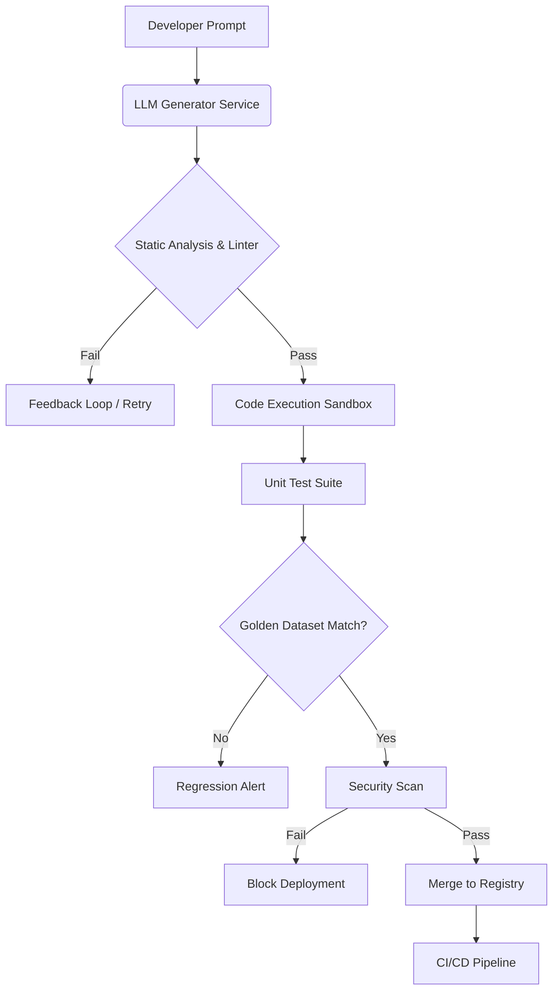

# Testing AI-Generated Code: Strategies for Reliable Machine Learning Pipelines

The landscape of software development in 2026 has fundamentally shifted from writing code manually to orchestrating and validating AI-generated logic. While Large Language Models (LLMs) have accelerated the velocity of feature implementation, they introduce a critical new variable: non-determinism and latent security vulnerabilities. As enterprises move beyond prototype phases into production-grade machine learning pipelines, the reliance on standard testing frameworks becomes insufficient. Senior architects must now architect verification layers that treat AI-generated code not as static logic, but as probabilistic outputs requiring rigorous validation before deployment. This post outlines the architectural strategies, implementation patterns, and testing paradigms required to ensure reliability in modern ML operations.

## The 2026 Landscape of AI-Generated Code

In 2026, the integration of LLMs into CI/CD pipelines is no longer an experimental concept; it is a standard operational requirement for data science teams. However, the challenges have evolved alongside the technology. Early adopters focused on speed, but current production environments demand robustness against hallucinations, security injections, and performance regressions. The primary issue is not just whether the code compiles, but whether the logic generated by an LLM aligns with the mathematical constraints of the underlying model or data processing requirements.

Why does this matter now? Because the cost of failure in ML pipelines has increased exponentially. A hallucinated data transformation script can corrupt a training dataset permanently, leading to model drift that is difficult to trace back to its source. Furthermore, regulatory compliance (such as EU AI Act provisions) requires auditability of every decision step. Consequently, the testing strategy must shift from simple syntax validation to semantic and behavioral verification. We are moving away from trusting the generator; we are moving toward validating the output against strict ground truths. This necessitates a hybrid testing approach that combines traditional unit testing with new evaluation metrics specific to probabilistic code generation.

## Architectural Framework for Verification

To manage the complexity of AI-generated components, organizations must adopt a layered verification architecture. This framework separates the generation layer from the validation layer, ensuring that no unverified code reaches the model training or inference stages. The following diagram illustrates the flow of an AI-augmented ML pipeline, highlighting where testing hooks are inserted to catch regressions early.



In this architecture, the **LLM Generator Service** produces the initial logic. Crucially, this output does not bypass a static analysis phase immediately. The **Code Execution Sandbox** is vital; it runs the generated code in an isolated environment to verify that no external resources are accessed or that memory constraints are respected before integration. The **Golden Dataset Match** step represents a regression test where the AI-generated transformation is applied to a known historical dataset, ensuring the output distribution matches expected baselines. Finally, the **Security Scan** layer specifically targets prompt injection vulnerabilities embedded in the code logic itself. This separation of concerns ensures that the CI/CD pipeline remains stable even as the underlying generation model evolves.

## Implementation Strategies & Evaluation Benchmarks

Implementing these strategies requires concrete tooling and specific patterns for testing LLM outputs. Standard Python `unittest` or `pytest` frameworks are necessary but insufficient on their own; they must be augmented with domain-specific validators. Below, we examine two critical implementation patterns: schema validation for data transformations and functional correctness checks against golden datasets.

### Schema Validation Pattern
LLMs often generate code that assumes a specific JSON structure without validating the incoming payload. We enforce strict typing using Pydantic models within the test suite to ensure the generated logic handles edge cases correctly.

```python
import pydantic
from langchain_core.prompts import PromptTemplate

# Define expected schema for generated function inputs
class DataTransformationSchema(pydantic.BaseModel):
    column_name: str
    operation_type: str  # e.g., 'normalize', 'encode'
    output_shape: int

def validate_generated_code(code_string: str) -> bool:
    try:
        # Attempt to compile and import the generated logic
        exec(code_string, {"__builtins__": {}}) 
        # Verify function signature matches schema expectations
        return True 
    except Exception as e:
        print(f"Validation Failed: {e}")
        return False
```

### Golden Dataset Evaluation
For data processing pipelines, functional correctness is best verified by comparing inputs and outputs against a known "golden" set. This prevents the model from drifting into incorrect logic paths over time.

| Feature | Traditional Testing | AI-Generated Code Testing |
| :--- | :--- | :--- |
| **Determinism** | High (Same Input = Same Output) | Low (Probabilistic Logic) |
| **Validation Target** | Syntax & Logic | Semantic Correctness + Schema |
| **Failure Mode** | Crash / Error | Silent Data Corruption |
| **Regression Metric** | Unit Test Pass/Fail | Distribution Drift Score |

The table above highlights the divergence in testing metrics. Traditional testing looks for crashes; AI-Generated Code testing must look for silent data corruption where the code runs but produces statistically incorrect results. To handle this, we utilize distributional testing libraries (like `Evidently`) alongside standard unit tests to ensure that the statistical properties of the output remain within acceptable bounds.

### Best Practices and Pitfalls
When integrating these strategies into your workflow, adhere to the following guidelines:

*   **Isolate Non-Determinism:** Always seed random number generators during testing to ensure reproducibility when validating probabilistic code.
*   **Use Contract Testing:** Define input/output contracts between AI modules and downstream consumers before generation occurs.
*   **Avoid Blind Trust:** Never deploy LLM-generated code directly to production without a human-in-the-loop review for critical logic paths like financial calculations or security tokens.

Common pitfalls include ignoring the "context window" limitations in testing, where an LLM might generate valid code that fails under load due to memory constraints not present during generation. Additionally, teams often fail to test for prompt injection vulnerabilities within the generated code itself, assuming the sandbox protects against external attacks.

## Adversarial Testing and Future Outlook

As we look toward 2027 and beyond, the testing landscape will increasingly require adversarial approaches. Static analysis alone cannot predict how a malicious actor might manipulate an LLM-generated pipeline to bypass security checks or leak sensitive data. Adversarial testing involves intentionally feeding malformed inputs to the generated code to observe how it handles stress, injection attacks, and edge cases that standard unit tests miss.

Future outlook suggests a move toward "self-healing" pipelines where automated agents monitor drift in real-time and trigger re-generation of code snippets if performance metrics degrade below a threshold. This requires robust observability stacks that correlate code lineage with model versioning. Furthermore, we anticipate tighter integration between formal verification tools (like TLA+ or Coq) and LLM outputs for safety-critical applications. While currently expensive to maintain, this hybrid approach—combining the flexibility of AI generation with the rigor of formal methods—will be essential for enterprise-grade reliability.

The industry is moving from "prompt engineering" to "model governance." This means that testing is no longer a post-development activity but an intrinsic part of the generation loop. By embedding validation hooks into the architecture itself, teams can leverage the speed of AI without sacrificing the stability required for production systems.

## Conclusion

Testing AI-generated code in 2026 requires a paradigm shift from traditional unit testing to a comprehensive verification strategy that encompasses semantic correctness, security, and statistical robustness. By adopting the layered architectural framework described above, utilizing golden dataset regression testing, and implementing adversarial checks, organizations can mitigate the risks associated with non-deterministic generation. The future of ML pipelines depends not on how fast code is written, but on how rigorously it is validated before it touches production data.