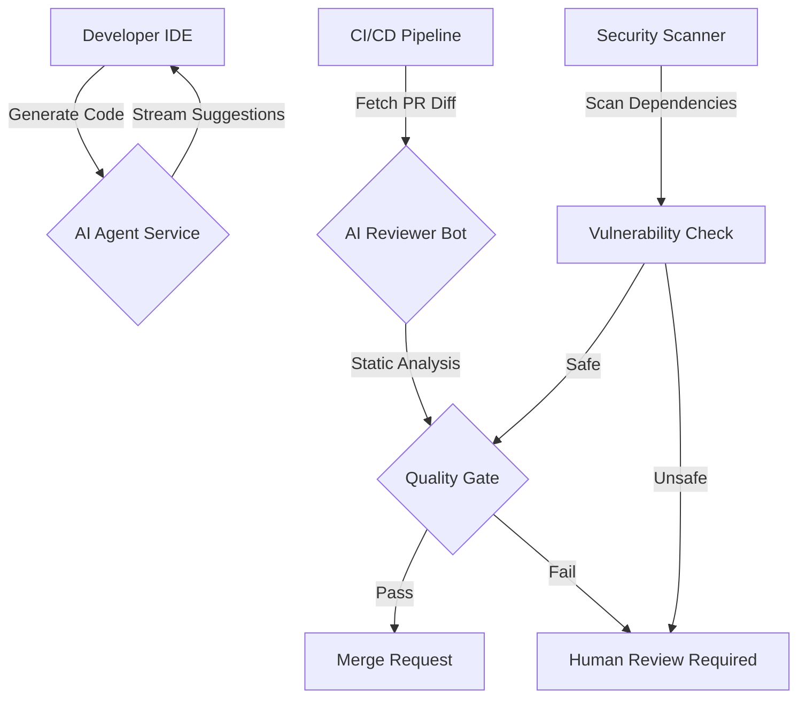

# The Rise of AI Coding Assistants: Evaluating Code Quality and Productivity Impact

The software development landscape has fundamentally shifted in 2026. We have moved beyond the era of simple autocomplete suggestions to a paradigm where Large Language Models (LLMs) function as autonomous agents capable of generating, refactoring, and reviewing entire modules. For senior architects and engineering leaders, this transition is not merely about convenience; it is a strategic imperative that demands rigorous evaluation of code quality and productivity metrics. The proliferation of AI coding assistants has introduced new variables into the development lifecycle: cognitive load reduction versus knowledge obsolescence, speed of generation versus stability of output, and integration friction within legacy systems.

## The 2026 Landscape: Beyond Autocomplete

In 2026, AI coding assistants are no longer passive tools waiting for a user to trigger a suggestion. They are integrated deeply into the IDE and CI/CD pipelines, often operating as background agents that analyze context windows exceeding 128k tokens. The significance of this shift lies in the evolution of benchmarking standards. Early metrics like HumanEval focused on syntactic correctness in synthetic tasks, but modern engineering demands performance on SWE-bench and real-world repository challenges.

The current landscape reveals a bifurcation in capabilities. While models excel at boilerplate generation and unit test creation, they still struggle with complex architectural refactoring across distributed systems without explicit guidance. This discrepancy is critical for architects. It means that while velocity may increase by 30-50% on feature implementation, the time spent on code review and validation has not decreased proportionally. In fact, it has increased due to the need for "AI literacy" among reviewers. Teams must now evaluate whether an AI-generated function introduces a hidden dependency or violates existing security patterns. The value of these tools is contingent on the developer's ability to distinguish between high-quality generation and hallucinated logic that compiles but fails in production.

## Measuring Impact: Technical Deep-Dive into Productivity

To justify the integration of AI assistants, we must move beyond anecdotal evidence like "feeling faster." We need quantifiable metrics that correlate AI usage with engineering outcomes. The primary metric for productivity is no longer lines of code written per hour, but rather "value delivered per cycle," which includes deployment frequency and defect density.

A critical component of this evaluation is analyzing the complexity introduced by AI-generated code. If an AI simplifies a logic block to reduce nesting depth but increases cyclomatic complexity through obscure library calls, the net productivity gain is negative. We need automated pipelines that score AI suggestions against existing architectural guardrails before they are merged.

Below is a Python script example used in our internal benchmarking pipeline to analyze Pull Requests (PRs) containing AI-generated code:

```python
import ast
import json

def analyze_ai_code_quality(code_snippet, ai_tool_used):
    """
    Analyzes generated code for complexity and security patterns.
    Returns a quality score based on AST metrics.
    """
    try:
        tree = ast.parse(code_snippet)
        
        # Calculate Cyclomatic Complexity
        nodes = []
        for node in ast.walk(tree):
            if isinstance(node, ast.If):
                nodes.append("if")
            elif isinstance(node, (ast.For, ast.While)):
                nodes.append("loop")
            elif isinstance(node, ast.Call):
                nodes.append("func_call")
        
        complexity_score = len(nodes) * 0.1
        
        # Check for common AI hallucination patterns (e.g., unused imports)
        security_flags = []
        if "import requests" in code_snippet and "http://localhost" in code_snippet:
            security_flags.append("hardcoded_endpoint")
            
        quality_score = max(0, 10 - complexity_score - len(security_flags))
        
        return {
            "tool": ai_tool_used,
            "complexity": complexity_score,
            "security_flags": security_flags,
            "quality_score": quality_score
        }
    except SyntaxError:
        return {"error": "Syntax Error", "quality_score": 0}

# Usage Example
result = analyze_ai_code_quality("import os; print(os.path.join('/', 'data'))", "Cursor")
print(json.dumps(result, indent=2))
```

This script highlights that productivity measurement requires automated static analysis. We cannot rely solely on the AI's confidence score; we must validate against our own complexity thresholds.

## Architectural Integration and Tool Comparison

Integrating AI assistants into the existing architecture requires a specific pipeline design. The system should not merely act as a plugin for the IDE but as a gatekeeper within the CI/CD flow. An effective architecture separates the generation phase from the validation phase to prevent hallucinated code from reaching staging environments.

The following diagram illustrates the recommended AI-Assisted Development Pipeline:



This architecture ensures that every AI-generated change undergoes a specific "AI Reviewer" step before human approval. The decision node (E) acts as the critical filter, preventing low-quality code from bypassing standard QA processes.

When selecting tools for this integration, organizations must weigh latency, context window size, and cost against their specific stack requirements. The following table compares leading approaches available in the 2026 market:

| Feature | Value | Description |
| :--- | :--- | :--- |
| **Latency** | <50ms | Time from trigger to suggestion generation (Local vs Cloud) |
| **Context Window** | 256k+ | Maximum tokens processed for understanding full repo state |
| **Cost Model** | $/M-token | Pricing structure; Cloud APIs vs Local LLM hosting costs |
| **Security** | On-Prem Only | Ability to run inference entirely within VPC without data exfiltration |
| **Integration** | API First | Native support for IDE plugins and CI hooks (GitHub/GitLab) |

The choice often comes down to security compliance. For enterprise environments, the "On-Prem Only" feature is frequently the deciding factor, even if it increases latency compared to cloud-based solutions like Cursor or GitHub Copilot Enterprise. Implementation guidance suggests starting with a sandbox environment where the AI agent can be trained on internal documentation before full deployment.

## Best Practices, Pitfalls, and Future Outlook

Adopting these tools requires strict adherence to best practices to avoid common pitfalls. The most significant risk is "automation bias," where developers accept AI suggestions without critical review, leading to a degradation of codebase quality over time. Another pitfall is the accumulation of technical debt through obscure library calls that the model hallucinates as standard.

Security remains a paramount concern. In 2026, we have seen cases where LLMs inadvertently embed vulnerable third-party dependencies or hardcoded secrets in generated code. Architects must implement policies that forbid AI from generating sensitive logic like authentication flows without specific guardrails. Furthermore, teams should enforce a "human-in-the-loop" policy where no PR containing more than 40% AI-generated lines can be merged automatically.

Looking toward the future, we anticipate a shift towards "Agentic Workflows." Instead of just generating snippets, models will handle entire microservice implementations, managing their own test suites and documentation. This will fundamentally change the role of the developer from writer to editor. However, this transition requires robust evaluation frameworks that can measure not just code correctness, but architectural alignment.

## Conclusion

The rise of AI coding assistants in 2026 represents a transformative shift in software engineering, offering unprecedented velocity but introducing new complexities regarding quality and security. As architects, our responsibility is to build systems that leverage these capabilities without sacrificing stability or control. By implementing rigorous benchmarking, adopting secure architectural patterns as shown in the pipeline diagram, and adhering to strict review policies, we can harness the productivity gains of AI while mitigating the risks of automated bias and security vulnerabilities. The future of coding is not about replacing developers with AI, but augmenting them with tools that require higher levels of technical judgment and architectural oversight.