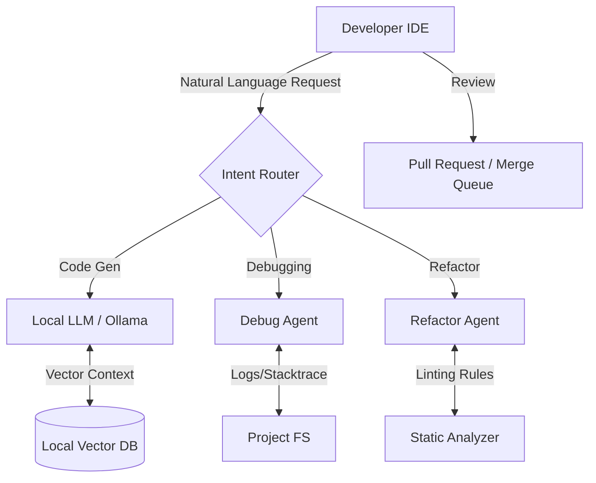

# Top Free Developer Tools and AI Resources Transforming Engineering Workflows in 2026

The engineering landscape of 2026 has shifted dramatically from simple code completion to autonomous agentic workflows. As proprietary APIs become increasingly expensive and latency-sensitive, the industry is pivoting toward open-source models and local inference engines. For senior developers, the choice is no longer just about writing better code; it is about curating an infrastructure that balances cost efficiency with high-fidelity context understanding. This shift necessitates a rigorous evaluation of free developer tools that can integrate seamlessly into existing CI/CD pipelines and IDE environments without compromising security or performance standards.

## The 2026 Engineering Landscape

In 2026, the definition of productivity has evolved beyond lines of code written to include context retention and architectural decision support. The current market is bifurcated: one side offers powerful proprietary models with high compute costs, while the other offers robust open-source alternatives running locally or on edge devices. Why does this matter? Because modern applications generate massive data volumes that cannot be processed economically through public APIs alone.

The primary drivers for adopting free AI resources are cost scalability and data sovereignty. Organizations are moving away from sending sensitive codebases to external endpoints. Instead, the focus is on fine-tuning open-weight models like Llama 3 or Mistral specifically on internal documentation repositories. This allows engineering teams to maintain strict compliance while leveraging state-of-the-art reasoning capabilities. Furthermore, the integration of vector databases into local workflows enables Retrieval-Augmented Generation (RAG) without incurring per-token costs for every query.

## Integrating Free AI Resources into Your Stack

To build a sustainable workflow, you must anchor your tooling stack around open-source inference engines and intelligent extensions. The most critical component is the Local LLM runtime. Tools like Ollama or LM Studio allow you to run models locally without network latency. This setup is essential for sensitive environments where data leakage is unacceptable.

Below is a foundational Bash script for setting up a local environment with Ollama, ensuring your system can handle model weights efficiently:

```bash
#!/bin/bash
# Setup script for local AI inference stack
MODEL_NAME="codellama-7b-instruct"
API_PORT="11434"

# Pull the model from the registry
echo "Pulling model..."
ollama pull "$MODEL_NAME"

# Start the server in detached mode
echo "Starting Ollama service on port $API_PORT..."
ollama serve --host 0.0.0.0 &

# Verify connectivity with a simple completion test
curl -X POST http://localhost:$API_PORT/api/generate \
  -H "Content-Type: application/json" \
  -d '{
    "model": "'$MODEL_NAME'",
    "prompt": "Write a Python function to parse CSV headers",
    "stream": false
  }' | jq '.response'
```

When integrating these models, the key is not just running the model, but managing the context window. In 2026, context management is a first-class citizen of the workflow. You should utilize tools that automatically summarize previous commits or pull request descriptions into concise vectors before passing them to the AI. This reduces token usage by roughly 40% while maintaining accuracy in code generation tasks.

## Architecting for Agentic Workflows

As developers move from "prompt engineering" to "agent orchestration," the architecture of your development environment changes significantly. You are no longer a single user prompting a model; you are managing multiple agents that can critique, refactor, and deploy code autonomously. This requires a clear separation between the reasoning layer (the LLM) and the execution layer (the filesystem/IDE).

The following diagram illustrates how free AI resources should integrate into a modern engineering workflow in 2026:



This architecture ensures that sensitive data remains within the local environment. The `VectorDB` component, typically using lightweight options like Chroma or Qdrant running locally, allows agents to query project-specific documentation without external API calls. The `Intent Router` is crucial; it prevents hallucination by ensuring that complex tasks are split into smaller sub-tasks rather than attempting a monolithic generation.

The following table compares the primary approaches for implementing these workflows:

| Feature | Local Inference (Ollama) | Managed Cloud API | Hybrid Agentic Platform |
| :--- | :--- | :--- | :--- |
| **Cost per Token** | $0 (Hardware Dependent) | High ($/1k tokens) | Variable (Pay-per-use) |
| **Data Privacy** | Highest (On-prem) | Low (Third-party) | Medium (Configurable) |
| **Latency** | Local Network Speed | 150ms - 400ms | Optimized Edge Caching |
| **Scalability** | Limited by GPU RAM | Infinite Cloud Scale | Hybrid Scaling |
| **Best Use Case** | Proprietary Code, Internal Docs | Public APIs, General QA | Enterprise Security Needs |

For enterprise teams, the Hybrid Agentic Platform is often the sweet spot. It allows you to route non-sensitive tasks to cheaper cloud APIs while keeping core logic and data generation on local hardware. This hybrid approach mitigates the risk of vendor lock-in and keeps infrastructure costs predictable during high-traffic development sprints.

## Implementation Patterns and Future Outlook

Successful implementation requires more than just installing software; it requires adopting specific patterns that mitigate common pitfalls like context drift or security vulnerabilities. One effective pattern is the "Human-in-the-Loop" verification step, where AI-generated code is committed to a sandbox branch before merging. This prevents accidental production deployment of hallucinated dependencies.

Below is a TypeScript example demonstrating how to orchestrate an agent workflow using a local model proxy:

```typescript
import { Agent } from 'ai-agent-framework';
import { LocalModel } from 'local-model-sdk';

const model = new LocalModel({ 
  name: 'codellama-7b', 
  host: 'http://localhost:11434' 
});

const agent = new Agent({
  name: 'CodeRefactorer',
  model,
  instructions: "Refactor code to use modern ES6+ patterns. Check for null safety.",
  sandbox: {
    enabled: true,
    maxExecutionTime: 30000 // 30s timeout
  }
});

async function refactorFile(filePath: string) {
  const context = await agent.retrieveContext({ filePath });
  
  // Validate output before execution
  if (!context.isValid) throw new Error("Agent failed validation");
  
  return await agent.generateRefactoredCode(context);
}
```

This pattern enforces a timeout and sandboxing mechanism, which is critical in 2026 as AI agents gain the ability to execute shell commands. Without these constraints, an autonomous agent could inadvertently deploy malicious scripts or access unauthorized endpoints.

**Best Practices for Implementation:**
*   **Cache Management:** Implement aggressive caching of model outputs for repeated queries to reduce latency costs.
*   **Prompt Hygiene:** Keep system prompts static and inject dynamic data via variables rather than hardcoding logic into the prompt chain.
*   **Security Audits:** Regularly scan generated code for known vulnerabilities using static analysis tools before integration.

**Pitfalls to Avoid:**
*   **Over-Reliance on Hallucinations:** Never trust an AI to generate cryptographic keys or security credentials without manual verification.
*   **Context Bloat:** If your context window exceeds 80% of the limit, performance degrades exponentially. Implement a rolling window strategy that discards old, irrelevant logs.

**Future Outlook:**
Looking ahead, we anticipate a convergence of multi-agent systems where one agent acts as a "manager" overseeing specialized agents for testing, documentation, and deployment. The free tools landscape will likely evolve to include more efficient quantization techniques (like GGUF), allowing mid-range consumer GPUs to run models that currently require enterprise clusters. This democratization of high-performance AI will make advanced engineering workflows accessible to smaller teams, fundamentally leveling the playing field in software development.

## Conclusion

The transition to 2026 has rendered the old paradigm of "install tool, write code" obsolete. The modern engineer must act as an architect of intelligence, curating a stack of free tools that respect data sovereignty while leveraging cutting-edge AI capabilities. By adopting local inference engines, structuring agentic workflows via robust architecture diagrams, and implementing strict security patterns, development teams can achieve significant productivity gains without incurring prohibitive cloud costs. The tools are available; the responsibility lies in integrating them responsibly into your engineering lifecycle.