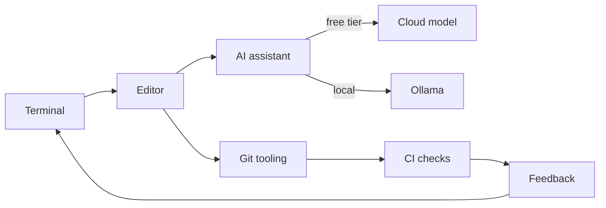

  I keep a short list of free developer tools that survived my skepticism. Most are wrappers around the same three ideas; a few are worth your time.
---

# Top Free Developer Tools and AI Resources Transforming Engineering Workflows in 2026

Every quarter someone forwards me a list of "essential" developer tools and asks what we should adopt. I have learned to read those lists the way I read diet books: the author is usually selling something. So I started testing the free stuff myself, the way I would evaluate any dependency. Does it remove real friction, or does it just make the terminal prettier?

This is the list that survived. It is short on purpose, it is biased toward boring, and every item on it has been running in my daily workflow for months, not days. I am a staff engineer, which means my default answer to "should we adopt this" is no, and my second answer is "show me the manual step it removes."

## The pitch wore off

Every new tool follows the same arc. Week one: novelty, screenshots, a config file that does nothing yet. Week two: the real question, which is not "is this good" but "does this change how I spend my day." For most tools the honest answer is no. Free tools fail the same way paid ones do — they add a layer instead of removing a step. The tools I kept all took steps away. That is the whole selection criterion, and I have stopped apologizing for how unglamorous it sounds.

The same arc applies to AI resources, with extra force. In 2026 the market is crowded with wrappers, and the wrappers are crowded with marketing. The way I cut through it: I ask what the tool does when I am not looking at it. If the answer is "sits there looking nice," it goes.

## What I actually evaluate

Four questions, in order. Does it replace a manual step I do more than once a week? Does it work offline, or at least degrade gracefully when the network does not cooperate? Can I script it, or is it trapped in a GUI? And what happens when the vendor changes the terms? That last one matters more in 2026 than it did five years ago, because the free tier is a marketing instrument with a meter on it. I test everything with that in mind, and I keep a mental note of which tool is one pricing change away from being deleted.

The other thing I evaluate is the review cost. A tool that generates output I have to verify line by line is not free; it is a tax. I count the review time in the real cost, and a lot of shiny things fail on that question alone.

## Editors and terminals first

The boring foundation: an editor, a terminal, and search. Everything else sits on top of it, and everything else is replaceable. Get the foundation right and the rest stops mattering so much.

VS Code remains the default for good reasons — the extension ecosystem, the remote workflows, the fact that it is open source and free — and I am not going to argue anyone off it. But the tools that changed my workflow are the three search utilities everyone already has installed and nobody configures: ripgrep for content, fd for filenames, and fzf for fuzzy history. Together they replaced the slowest part of my day, which was looking for things. I timed it once. The difference was not minutes; it was the difference between searching and browsing.

Zed is the one editor I would mention as an alternative: it is fast, open source, and telemetry is off by default. I use it when I want a quiet afternoon with a big codebase. Verdict: depends. It is not better at anything you can measure easily, but it is faster at everything you can feel, and some people never go back.

For git, lazygit. I was skeptical of a terminal UI for git for years. Then I watched it render a rebase conflict list, and I stopped pretending. It does not do anything git cannot do; it just makes the hard parts visible. Verdict: worth it, and it costs nothing.

```bash
alias g='git'   # the entire setup, and it costs nothing
alias gs='git status -sb'
alias lg='lazygit'
alias r='rg --hidden -g "!.git"'
```

## AI help that does not cost anything

Here is the skeptical take I keep repeating: the AI coding tools of 2026 are mostly the same three models wrapped in different keybindings. The free tiers — Copilot Free, the Gemini CLI, Claude Code's free tier, Cursor's free plan — are all real and all useful, and they are all the same product with a different logo on the tab. Pick one, learn its limits, and stop evaluating the category.

The honest verdict is that a free AI assistant helps most when it lives in the terminal and helps least when it is a chat window. I use one for mechanical work: writing the boring parts of tests, renaming symbols across a repo, explaining a regex I wrote at 11pm. I review everything it produces, because it will confidently generate plausible nonsense, and the nonsense is worse than the silence because it looks right. That is the review cost I mentioned earlier, and it is the reason I do not let it write anything with a production blast radius without a human diff in between.

The free tiers have limits — monthly message caps, slower models, no guarantee your prompts stay out of training data — and I treat those limits as features. They force me to use the tool for the mechanical stuff instead of outsourcing thinking to it. If a tool is free and unlimited and asks for nothing, read the terms twice. That sentence has saved me more than once.

## Local models when you need privacy

The other direction is running a model on your own machine. Ollama is the tool that made this boring enough to use: one command to install, one command to pull a model, no account, no network, no terms of service to re-read.

```bash
ollama pull qwen3:8b
ollama run qwen3:8b
```

I use a local model for the work that should not leave the laptop: reviewing a diff before it goes to a public repo, asking questions about proprietary code, summarizing a log file that contains customer data. The privacy argument is the whole argument, and it is a good one.

Verdict: worth it if you have the RAM and the discipline to know what a small model is good for. A 7B or 8B model is not a frontier model. It is a fast autocomplete with opinions, and it will confidently tell you that a bug lives in a file that does not exist. That is fine, as long as you treat it as an intern, not an oracle. Verdict for people without the RAM: skip, and do not feel bad about it. The cloud free tiers cover most of the same ground.

## How the pieces fit together

None of these tools matters in isolation. The workflow is the product:


```mermaid
flowchart LR
    A[Terminal] --> B[Editor]
    B --> C[AI assistant]
    C -->|free tier| D[Cloud model]
    C -->|local| E[Ollama]
    B --> F[Git tooling]
    F --> G[CI checks]
    G --> H[Feedback]
    H --> A
```

Read it the boring way. The editor is the hub, the terminal is the glue, the AI assistant is an input method with a review step, and the CI feedback loop is what keeps the whole thing honest. Every piece is replaceable. That is the design goal: no tool in this stack is allowed to become a platform you cannot leave. The moment a free tool becomes the thing your workflow is built around, it stops being free, because the switching cost is now your salary.

## The boring setup that works

The whole setup, in three commands and two files. First, the shell aliases above. Second, a local model for private questions:

```bash
ollama pull qwen3:8b
ollama run qwen3:8b "explain this diff in two sentences"
```

Third, the search that replaced three browser tabs:

```bash
rg --hidden -g '!.git' "TODO|FIXME" src/ | fzf
```

That is it. No dashboards, no plugins, no account ladder. The tools that survived are the ones whose removal would make my day measurably worse, and I can say that with confidence because I have actually removed each of them once to test. If I did not notice within a week, it did not come back.

## What I skipped and why

The list of things I deliberately skipped is longer than the list of things I kept, and I think that is the more useful half. AI note-taking apps that summarize my own notes back to me — skip, they add a layer between me and the thing I wrote. Code search SaaS with a free tier that counts your repo against you — skip, ripgrep is faster, local, and private. IDE forks that ship AI as the product — the free plans are fine, but I do not want my editor's roadmap decided by a model card. Dashboards that summarize my GitHub activity — skip, that is a report card, not a tool.

The one thing I will not do is paste proprietary code into a random web form because a tool told me it was private. Read the terms. This advice is free and it has never once been wrong.

## The short version

Free tools are worth your time when they remove steps, and the AI ones are worth your time when you treat them as a very fast intern who needs review, not as an authority. Keep the stack boring: a terminal, an editor, search, one local model, one cloud free tier. Reassess quarterly, delete anything that stops earning its place, and do not let the novelty of a free tier talk you into a dependency you would not pay for. The tools that transformed my workflow in 2026 were the ones that made the ordinary parts of the day faster, and none of them needed a login page to do it.
