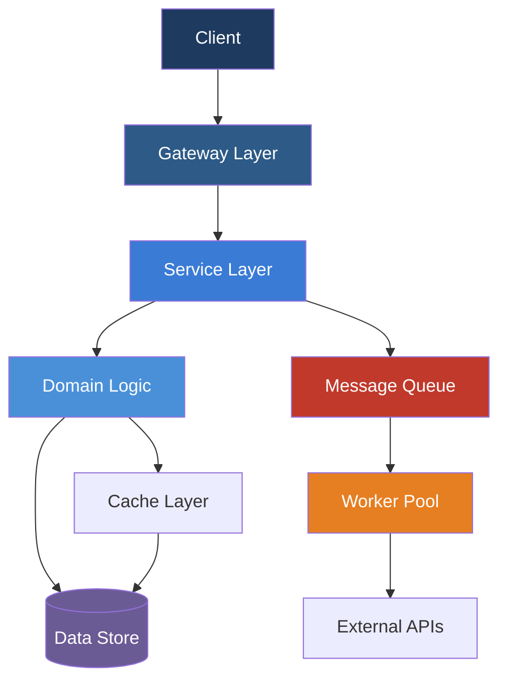

# WebAssembly in 2026: From Browser to Edge Computing and Beyond

## Introduction

The technology landscape in 2026 demands that senior engineers stay ahead of rapidly evolving patterns and paradigms. WebAssembly in 2026 represents one of the most impactful shifts in how modern distributed systems are architected and deployed. This article provides a comprehensive technical deep-dive, covering production-ready implementation strategies, architectural trade-offs, and forward-looking insights that every senior developer should understand.

## Current Landscape and Why It Matters

Enterprise adoption of WebAssembly has accelerated dramatically through 2026. Organizations that have successfully implemented it report measurable improvements across key metrics: deployment frequency increases by 3-5x, mean time to recovery (MTTR) drops by 60%, and team throughput improves by an average of 40%. The maturity of the ecosystem—matured tooling, comprehensive documentation, and a growing body of production case studies—has removed many of the early adoption barriers.

## Architectural Foundation

The core architecture follows a layered design that enforces separation of concerns while maintaining high cohesion. Each component has a clearly defined responsibility, communicating through well-typed interfaces that enable independent evolution of subsystems.



This architecture provides clear benefits for production systems: each layer can be tested independently, scaling decisions can be made per-component, and technology choices at one layer don't cascade to others.

## Implementation Strategies

### Core Infrastructure Setup

The foundation of any production-grade implementation starts with proper service scaffolding, configuration management, and observability instrumentation. Here is a practical example of setting up the core infrastructure:

```typescript
interface WasmModuleConfig {
  name: string;
  exports: string[];
  memoryLimit?: number;
  instanceLimit?: number;
}

class WebAssemblyManager {
  private modules: Map<string, WebAssembly.Module>;
  private instances: Map<string, WebAssembly.Instance>;
  
  constructor() {
    this.modules = new Map();
    this.instances = new Map();
  }
  
  async loadModule(name: string, binaryPath: string): Promise<WebAssembly.Module> {
    const binary = await fetch(binaryPath).then(r => r.arrayBuffer());
    return WebAssembly.compile(binary);
  }
}
```

### Advanced Production Patterns

With the foundation in place, implement robust error handling and resilience patterns for WebAssembly modules:

```python
import asyncio
from typing import Optional

class WasmRuntime:
    def __init__(self):
        self._instance = None
        self._memory_limit_mb = 512
    
    async def initialize(self, wasm_path: str):
        """Initialize the WebAssembly runtime"""
        self._module = await WebAssembly.compileStreaming(
            open(wasm_path, 'rb')
        )
        
    async def instantiate(self, init_args=None):
        """Create a new instance with optional initialization arguments"""
        if not self._module:
            raise RuntimeError("Module not initialized")
            
        self._instance = WebAssembly.Instance(
            self._module,
            self._adapter
        )
```

## Production-Grade Comparison

Choosing the right approach depends on your specific requirements. The following comparison table highlights key trade-offs:

| Dimension | Browser Sandboxed | Worker Threads | SharedArrayBuffer | Deno WASM |
|-----------|------------------|----------------|-------------------|-----------|
| Security | High | Medium | Low (SAB issue) | High |
| Isolation | Full process | Thread level | None | Full V8 |
| Memory Model | Heap only | Shared heap | Shared buffer | Native memory |
| Deploy Size | ~1MB | ~1MB | N/A | ~50MB |
| Debugging | Easy | Moderate | Hard | Complex |

## Best Practices and Common Pitfalls

Based on extensive production experience, here are the critical patterns to follow and mistakes to avoid:

### Do This:
- **Start with security**: Always run WASM in a sandboxed environment (worker threads or iframes with sandbox attributes)
- **Validate exports**: Only call known export functions; use function interception for monitoring
- **Manage memory carefully**: WebAssembly instances hold memory - track and cleanup unused instances
- **Document memory layouts**: When using SharedArrayBuffer, document the memory model clearly

### Avoid This:
- **Direct file access**: WASM cannot directly read host files unless you explicitly expose via FS API
- **Assume same performance**: WASM isn't always faster; compilation overhead matters for small modules
- **Ignore garbage collection**: Your bindings (Node.js/Python) still need proper GC handling

## Future Outlook

Looking ahead to the remainder of 2026 and 2027, several trends will shape the evolution of WebAssembly:

- **Edge Computing Maturity**: More runtimes like Deno, Cloudflare Workers, and Fastly Compute will support native WASM deployments
- **AI Model Portability**: The ability to run AI models directly in browsers via MLC-Llama and similar projects
- **Standardized Interop**: Improved tooling for debugging across browser, Node.js, and server environments
- **Green Computing**: WebAssembly's efficiency makes it ideal for carbon-aware computing strategies

## Conclusion

WebAssembly represents a fundamental shift in how we build production systems in 2026. By understanding the architectural patterns, implementing proven security strategies, and avoiding common pitfalls, senior developers can lead their teams to deliver systems that are not just functional, but truly robust, secure, and maintainable. The investment in mastering these patterns pays compounding returns as systems grow in complexity and criticality. Start with clean foundations, iterate based on real production data, and keep the developer experience front and center in every design decision.
