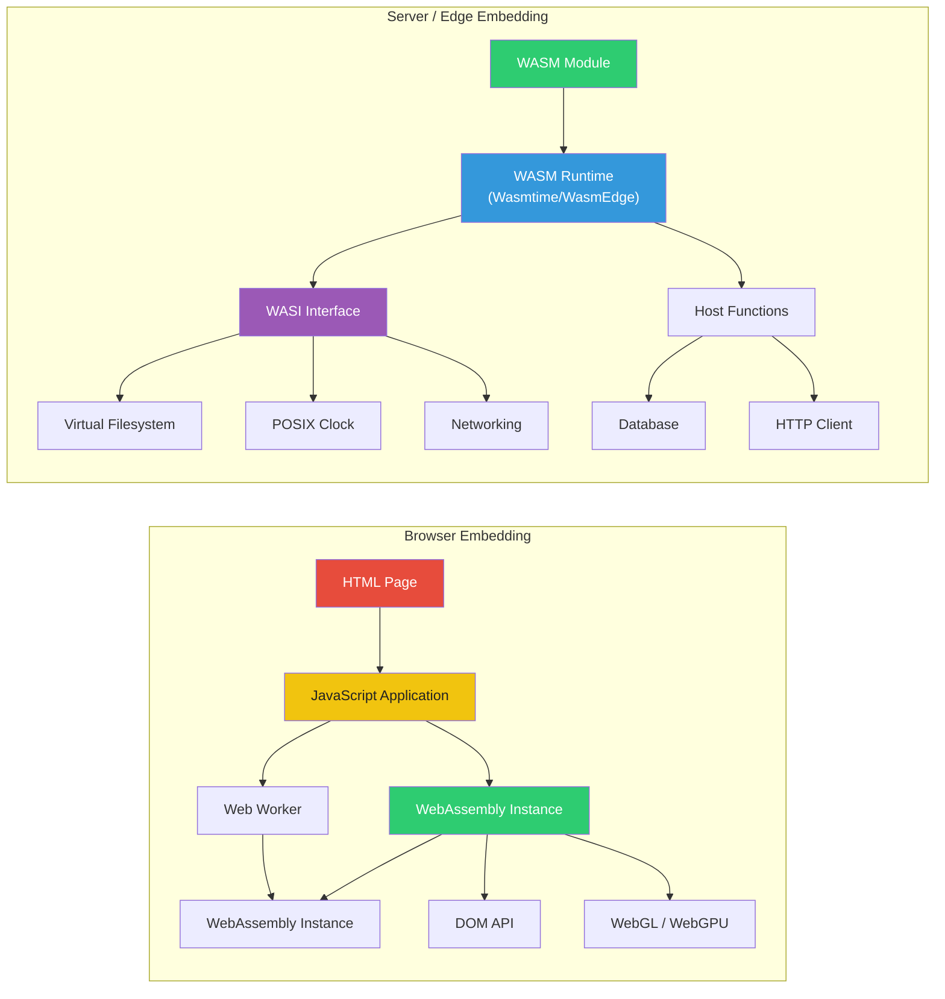
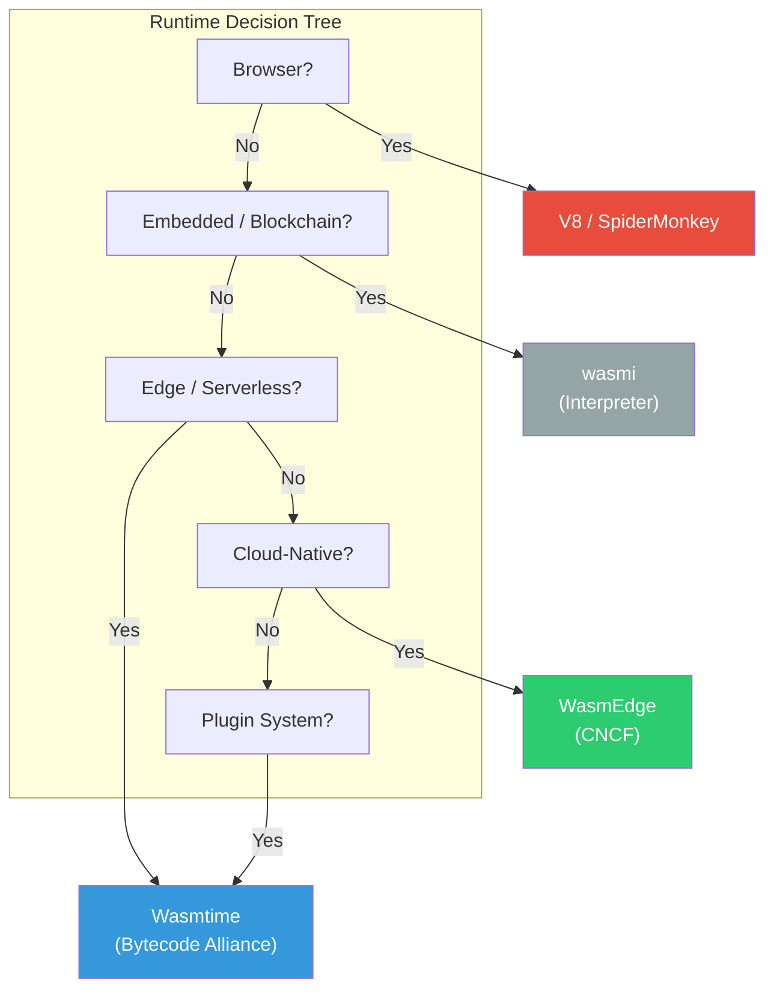
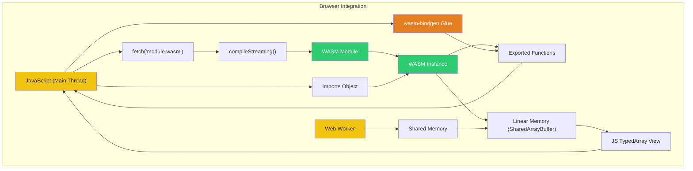

# WebAssembly in 2026: From Browser to Edge Computing and Beyond

## Introduction

WebAssembly (WASM) has evolved dramatically from its origins as a browser-only compilation target into a universal runtime layer that spans browsers, edge networks, servers, and plugin ecosystems. In 2026, WASM is no longer just a technology for running C++ games in the browser—it is a first-class deployment target for polyglot application architectures, serverless edge functions, and safely sandboxed plugin systems. This article provides a comprehensive technical deep-dive into WASM architecture, runtime comparisons, ecosystem maturity, and production deployment patterns that every senior engineer should understand.

## WASM Architecture Fundamentals

WebAssembly is a low-level binary instruction format that runs in a stack-based virtual machine. A WASM module is a self-contained unit of code with explicit imports and exports, a linear memory address space, a function table for indirect calls, and structured control flow.

### Module Structure

Every WASM module is composed of several distinct sections:


### Linear Memory

WASM's linear memory is a contiguous, resizable array of bytes. Modules can import memory from the host or define their own. All memory access is bounds-checked, providing safety guarantees absent from native code.

```wat
(module
  (memory (import "env" "memory") 1 256)  ;; import memory, min 1 page (64KB), max 256 pages (16MB)
  (data (i32.const 0) "Hello, WASM\00")    ;; initialize memory at offset 0
  (export "getString" (func $getString))
  (func $getString (result i32)
    i32.const 0                            ;; return pointer to string
  )
)
```

Key properties of linear memory:
- **Pages**: Allocated in 64KB (65,536 byte) pages
- **Bounds-checked**: Out-of-bounds access traps deterministically
- **SharedArrayBuffer**: In browsers, multiple Web Workers can share memory via `SharedArrayBuffer` (requires COOP/COEP headers)
- **Grow-only**: Memory can be grown but never shrunk (in the current MVP)

### Tables and Indirect Calls

Tables hold opaque references (typically function references) that enable indirect calls—the WASM equivalent of function pointers. This is essential for callbacks and virtual dispatch patterns.

```wat
(module
  (table 10 funcref)                        ;; table of 10 function references
  (elem (i32.const 0) $add $sub $mul)       ;; pre-populate entries
  (type $binop (func (param i32 i32) (result i32)))
  (func $add (type $binop) local.get 0 local.get 1 i32.add)
  (func $sub (type $binop) local.get 0 local.get 1 i32.sub)
  (func $mul (type $binop) local.get 0 local.get 1 i32.mul)
  (export "callTable" (func $callTable))
  (func $callTable (param $idx i32) (param $a i32) (param $b i32) (result i32)
    local.get $idx
    local.get $a
    local.get $b
    call_indirect (type $binop)             ;; dynamic dispatch via table
  )
)
```

### Imports and Exports

WASM modules are fully sandboxed by default—they cannot perform any I/O, allocate memory, or access the DOM without explicitly imported host functions. This import/export contract is central to WASM's security model.

```rust
// Importing host functions in Rust via wasm-bindgen
#[wasm_bindgen]
extern "C" {
    #[wasm_bindgen(js_namespace = console)]
    fn log(s: &str);

    fn alert(s: &str);

    #[wasm_bindgen(js_name = "getCurrentTime")]
    fn get_time() -> f64;
}

// Exporting to JavaScript
#[wasm_bindgen]
pub fn fibonacci(n: u32) -> u32 {
    match n {
        0 => 0,
        1 => 1,
        _ => fibonacci(n - 1) + fibonacci(n - 2),
    }
}
```

## Embedding Patterns

WASM can be embedded in various environments. The pattern differs significantly between browser and server contexts:



## WASM Runtime Comparison

The choice of runtime depends heavily on the deployment environment—browsers use built-in engines, while server and edge deployments use standalone runtimes. Here's a comparison of the major options:

### Browser Runtime: V8 (Chrome/Edge/Node.js)

V8's Liftoff compiler achieves near-native startup speeds by tiering compilation—Liftoff for fast first execution, TurboFan for peak performance. As of V8 12.x (2026), key features include:

- Multi-threaded compilation for large modules
- Streaming compilation with `WebAssembly.compileStreaming()`
- Shared memory via `SharedArrayBuffer` with atomic operations
- Reference types and GC integration (Stage 4)
- Branch hinting for predictable performance

### Wasmtime (Bytecode Alliance)

Wasmtime is the most mature standalone runtime, serving as the reference implementation for the WASM specification outside the browser:

- **Cranelift JIT**: Balance of compile speed and runtime performance
- **WASI Preview 2**: Full WASI implementation including sockets, clocks, filesystem
- **Component Model**: First-class support for WIT interfaces and component linking
- **Security**: Sandboxed by default with capability-based security model
- **Use case**: Serverless functions, plugin systems, CLI tooling

### WasmEdge (CNCF)

WasmEdge is optimized for cloud-native and edge deployments, now a CNCF graduated project:

- **High throughput**: Optimized for serverless and microservice architectures
- **TensorFlow extension**: Native AI/ML inference support via WASM-NN
- **OCI compliance**: WASM modules can be stored in Docker-compatible registries
- **Sidecar pattern**: Used as a plugin runtime for Envoy/Kubernetes
- **Use case**: Edge AI, sidecar proxies, microservices

### wasmi (Rust / Embedded)

wasmi is a purely interpreted WASM runtime written in Rust, ideal for resource-constrained environments:

- **No JIT required**: Runs on bare metal and embedded devices
- **Deterministic**: Bit-exact execution makes it suitable for blockchain
- **Subset of WASM**: Supports MVP + some proposals, but not full GC
- **Use case**: Smart contracts (Polkadot/Substrate), IoT, embedded systems



| Runtime | Host Language | Compilation | WASI Support | Component Model | Best For |
|---------|--------------|------------|-------------|----------------|----------|
| **V8** | C++ | Liftoff + TurboFan (JIT) | Partial (Preview 2) | Experimental | Browser, Node.js |
| **SpiderMonkey** | C++ | Baseline + IonMonkey (JIT) | Partial | Limited | Firefox, Gecko |
| **Wasmtime** | Rust | Cranelift (JIT) | Full (Preview 2) | First-class | Server/Edge, Plugins |
| **WasmEdge** | C++ | LLVM + AOT | Full (Preview 1) | In progress | Cloud-native, AI |
| **wasmi** | Rust | Interpreter | Minimal (Preview 1) | No | Embedded, Blockchain |
| **WAMR** | C | Interpreter + JIT | Full (Preview 1) | Limited | IoT, Multi-OS |

## WASI: The WebAssembly System Interface

WASI standardizes the interface between WASM modules and their host environment, enabling portable, sandboxed system access. WASI Preview 2 (ratified in 2025) represents a fundamental redesign using the Component Model.

### WASI Preview 1 vs Preview 2

| Feature | Preview 1 | Preview 2 |
|---------|-----------|-----------|
| Interface definition | Flat function imports | WIT (Wasm Interface Type) |
| Capability model | `fd_*` syscall-like | Resource-based capabilities |
| Async support | None | First-class async streams |
| Components | No | Yes |
| Networking | `posix_socket` (non-standard) | `wasi:sockets` (standardized) |
| Example toolchains | `wasmtime` CLI | `wasm-tools` + `jco` |

### Example: WASI Preview 2 in Rust

```rust
// Cargo.toml
// [dependencies]
// wasi = "0.13"  (Preview 2 SDK)

use wasi::http::types::{Method, Request, Response};
use wasi::http::handler::handle;

// A simple HTTP handler exported as a WASM component
#[export_name = "handle"]
pub fn handler(req: Request) -> Response {
    let path = req.uri().path();
    let body = format!("Hello from WASM! You requested: {}", path);

    Response::new()
        .with_status(200)
        .with_header("content-type", "text/plain")
        .with_body(body.as_bytes())
}
```

## The Component Model

The WebAssembly Component Model is the most significant evolution since MVP. It defines a portable binary interface for inter-module communication using WIT (Wasm Interface Type) schemas.

### Why Components Matter

- **Language-agnostic**: Components written in Rust, C, Go, or Python can interoperate without glue code
- **Composability**: Modules expose typed interfaces that the runtime validates at link time
- **Virtual bindings**: No need for wasm-bindgen or emscripten—the runtime handles bridging

```wit
// adder.wit — WIT interface definition
package example:adder;

interface math {
    add: func(a: s32, b: s32) -> s32;
}

// Use it from another component
world calculator {
    import math;
    export run: func();
}
```

### Component Linking at the Edge

```javascript
// jco — JavaScript Component Tooling
import { run } from './calculator.component.js';

// The component imports `math` from another component
const calc = await run({
    math: {
        add(a, b) { return a + b; }
    }
});
console.log(calc.add(40, 2)); // 42
```

## WASM in the Browser

Browser-based WASM remains the most widespread deployment target. In 2026, the integration patterns have matured significantly.

### Streaming Compilation

```javascript
// Preferred: compile while downloading
const response = await fetch('module.wasm');
const module = await WebAssembly.compileStreaming(response);

// Instantiate with imports
const instance = await WebAssembly.instantiate(module, {
    env: {
        print: (ptr, len) => {
            const bytes = new Uint8Array(instance.exports.memory.buffer, ptr, len);
            console.log(new TextDecoder().decode(bytes));
        },
        random: Math.random,
    }
});

instance.exports.main();
```

### Shared Memory and Threading

WASM threads in the browser use `SharedArrayBuffer` with atomic operations for synchronization:

```javascript
// main.js — Spawn a WASM worker
const worker = new Worker('worker.js', { type: 'module' });

// useSharedArrayBuffer requires:
// Cross-Origin-Opener-Policy: same-origin
// Cross-Origin-Embedder-Policy: require-corp

const memory = new WebAssembly.Memory({
    initial: 10,    // 640KB
    maximum: 100,   // 6.4MB
    shared: true    // SharedArrayBuffer
});

const module = await WebAssembly.compileStreaming(fetch('parallel.wasm'));
const instance = await WebAssembly.instantiate(module, {
    env: { memory }
});

worker.postMessage({ memory, module: await WebAssembly.compileStreaming(fetch('worker.wasm')) });
```

```javascript
// worker.js — Inside Web Worker
self.onmessage = async (e) => {
    const { memory, module: workerModule } = e.data;
    const instance = await WebAssembly.instantiate(workerModule, {
        env: {
            memory,
            // Synchronize via Atomics
            work: (offset, length) => {
                Atomics.store(memory, offset, 1); // Signal start
                // ... parallel work ...
                Atomics.store(memory, offset, 0); // Signal done
            }
        }
    });
    instance.exports.run();
};
```

### JavaScript ↔ WASM Integration Pattern



## WASM at the Edge

Edge computing in 2026 is heavily WASM-driven. Three major platforms have emerged:

### Cloudflare Workers

Cloudflare Workers have used WASM since 2019, and in 2026 the platform supports:

- **Direct WASM instantiation** via `WebAssembly.instantiate` inside Workers
- **WASI Preview 1 & 2** for system access
- **`workerd` runtime**: Custom V8 isolate-based runtime with per-isolate WASM compilation cache
- **Module bundling**: `workers-rs` allows writing Workers entirely in Rust compiled to WASM

```rust
// A Cloudflare Worker written in Rust, compiled to WASM
#[worker::event(fetch)]
pub async fn main(req: Request, env: Env, ctx: Context) -> Result<Response> {
    let path = req.path();
    let key = format!("wasm-blog-{}", path.trim_start_matches('/'));

    // Use WASM for heavy computation
    let result = compute_on_wasm(path).await?;

    Response::builder()
        .status(200)
        .header("content-type", "text/plain")
        .body(result)
}
```

### Fastly Compute

Fastly's Compute platform runs WASM on the `Lucet` runtime (precursor to Wasmtime). Key differentiators:

- **Sub-millisecond cold starts**: Pre-initialized WASM instances via snapshotting
- **Native HTTP**: WASI-over-HTTP bindings eliminate proxy overhead
- **Rust & AssemblyScript**: First-class SDK support

### Fermyon Cloud (Spin)

Fermyon's Spin framework provides a higher-level abstraction with WASM:

- **Compose microservices**: Run multiple WASM modules in a single Spin application
- **Transactional storage**: `spin-sqlite` and `spin-redis` SDKs
- **Deploy anywhere**: Works with Fermyon Cloud, self-hosted Nomad, or Kubernetes

```rust
// Fermyon Spin HTTP handler
use spin_sdk::http::{Request, Response, Router};
use spin_sdk::http_component;

#[http_component]
fn handle(req: Request) -> Response {
    let router = Router::new();
    router.get("/api/search", api::search::handler);
    router.post("/api/index", api::index::handler);
    router.handle(req)
}
```

## WASM for Plugin Systems

WASM's sandboxed execution model makes it an ideal substrate for plugin systems. In 2026, major applications use WASM as their plugin runtime:

### Extensible Applications with WASM

```rust
// Host application plugin loader in Rust
use wasmtime::{Engine, Module, Store, Linker, TypedFunc};

struct PluginHost {
    engine: Engine,
    linker: Linker<()>,
}

impl PluginHost {
    fn new() -> Self {
        let engine = Engine::default();
        let mut linker = Linker::new(&engine);
        // Provide safe host APIs to plugins
        linker
            .func_wrap("host", "log", |msg: i32, len: i32| {
                // Read from WASM memory and log
                println!("[Plugin] {}", read_string(msg, len));
            })
            .unwrap();
        linker
            .func_wrap("host", "http_get", |url_ptr: i32, url_len: i32| -> i32 {
                let url = read_string(url_ptr, url_len);
                // Make HTTP request on behalf of plugin
                let response = fetch_blocking(&url);
                store_string(&response)
            })
            .unwrap();
        Self { engine, linker }
    }

    fn load_plugin(&self, wasm_bytes: &[u8]) -> anyhow::Result<Plugin> {
        let module = Module::new(&self.engine, wasm_bytes)?;
        let mut store = Store::new(&self.engine, ());
        let instance = self.linker.instantiate(&mut store, &module)?;
        let init = instance.get_typed_func::<(), ()>(&mut store, "_initialize")?;
        init.call(&mut store, ())?;
        Ok(Plugin { instance, store })
    }
}
```

### Real-world Plugin Use Cases

| Application | WASM Runtime | Plugin Language | Use Case |
|------------|-------------|----------------|----------|
| **Envoy Proxy** | Wasmtime (via Proxy-WASM) | Rust, C++, Go, AssemblyScript | L7 filters, auth, rate limiting |
| **Figma** | V8 (in-browser) | Rust | Plugin sandboxing |
| **Substrate/Polkadot** | wasmi | Rust | Smart contract execution |
| **Shopify** | Wasmtime | Rust, TinyGo | Storefront logic |
| **Unity** | V8 + Mono | C# via IL2CPP | Game logic |

## Language Support

The polyglot nature of WASM makes it language-agnostic, but some languages have significantly better tooling and ergonomics than others.

### Rust 🦀

Rust is the gold standard for WASM development, with first-class support via `wasm-pack` and `wasm-bindgen`:

```rust
// Using wasm-bindgen for browser DOM access
use wasm_bindgen::prelude::*;
use web_sys::{console, window};

#[wasm_bindgen]
pub struct CanvasRenderer {
    canvas_id: String,
    width: u32,
    height: u32,
}

#[wasm_bindgen]
impl CanvasRenderer {
    pub fn new(canvas_id: &str, width: u32, height: u32) -> Self {
        Self {
            canvas_id: canvas_id.to_string(),
            width,
            height,
        }
    }

    pub fn render(&self, frame_data: &[u8]) -> Result<(), JsValue> {
        let document = window().unwrap().document().unwrap();
        let canvas = document.get_element_by_id(&self.canvas_id).unwrap();
        let ctx = canvas
            .dyn_into::<web_sys::HtmlCanvasElement>()?
            .get_context("2d")?
            .unwrap()
            .dyn_into::<web_sys::CanvasRenderingContext2d>()?;

        // Direct pixel manipulation
        let image_data = ctx.create_image_data_with_sw_sh(self.width, self.height)?;
        let pixels = image_data.data();
        pixels.copy_from_slice(frame_data);
        ctx.put_image_data(&image_data, 0.0, 0.0)?;

        Ok(())
    }
}
```

### C/C++

Emscripten and WASI SDK remain the primary paths for C/C++ to WASM:

```bash
# Compile C to WASM with WASI SDK
/opt/wasi-sdk/bin/clang \
    --sysroot=/opt/wasi-sdk/share/wasi-sysroot \
    -O3 -mexec-model=reactor \
    -o processor.wasm processor.c

# With Emscripten for browser use
emcc main.c \
    -O3 \
    -s WASM=1 \
    -s EXPORTED_FUNCTIONS='["_main", "_processFrame"]' \
    -s EXPORTED_RUNTIME_METHODS='["ccall", "cwrap"]' \
    -o main.js
```

### Go

Go added WASM support early, but generated large binaries. Go 1.23+ significantly improved WASM binary sizes and added WASI Preview 2 support:

```go
package main

import (
    "fmt"
    "net/http"
    "wasi" // Go 1.23+ WASI SDK
)

//export process
func process(inputPtr uint32, inputLen uint32) uint64 {
    // Read input from WASM linear memory
    input := wasi.ReadMemory(inputPtr, inputLen)
    result := fmt.Sprintf("Processed: %s", string(input))
    // Write result and return pointer + length packed in uint64
    ptr := wasi.WriteMemory([]byte(result))
    return uint64(ptr)<<32 | uint64(len(result))
}

func main() {
    // Required for WASI reactor mode
    wasi.HandleExports()
}
```

### Zig

Zig has excellent WASM support, producing smaller and more efficient binaries than most alternatives:

```zig
export fn fibonacci(n: u32) u32 {
    if (n <= 1) return n;
    return fibonacci(n - 1) + fibonacci(n - 2);
}

// Export with explicit WASM memory
export fn get_pointer() [*]u8 {
    var static_data: [100]u8 = undefined;
    @memcpy(&static_data, "Hello from Zig!", 16);
    return &static_data;
}
```

```bash
# Compile Zig to WASM
zig build-exe main.zig \
    -target wasm32-wasi \
    -O ReleaseSmall \
    --export=fibonacci \
    --export=get_pointer
```

### AssemblyScript

AssemblyScript compiles a TypeScript-like language directly to WASM, ideal for web developers entering the WASM ecosystem:

```typescript
// AssemblyScript — TypeScript for WASM
export function fibonacci(n: i32): i32 {
    if (n <= 1) return n;
    return fibonacci(n - 1) + fibonacci(n - 2);
}

export function processImage(data: Uint8Array, width: i32, height: i32): void {
    for (let y = 0; y < height; y++) {
        for (let x = 0; x < width; x++) {
            const idx = (y * width + x) * 4;
            // Grayscale conversion
            const gray = (data[idx] + data[idx + 1] + data[idx + 2]) / 3;
            data[idx] = data[idx + 1] = data[idx + 2] = gray as u8;
        }
    }
}
```

## WASM GC and Reference Types

The 2024-2025 specification cycle introduced garbage collection (GC) and reference types directly into the WASM standard, enabling high-level language runtimes to compile efficiently without bundling their own GC.

### Key Additions

- **`anyref`**: Opaque reference to host-allocated objects
- **`structref`**: Predefined struct types allocatable within WASM
- **`arrayref`**: Resizable array types with bounds-checked access
- **`i31ref`**: 31-bit integer packed into a reference (small object optimization)
- **Finalization**: Host-observed finalization for JVM/CLR interop

### Example: Dart with WASM GC

Dart 4.0 (Flutter) uses WASM GC to compile the Dart runtime directly to WASM, eliminating the need to ship a bundled GC:

```dart
// This Dart code compiles to WASM using Dart's native WASM backend
// No js-interop needed for GC types
class Particle {
  double x, y, vx, vy;
  int life;

  Particle(this.x, this.y, this.vx, this.vy, this.life);

  void update() {
    x += vx;
    y += vy;
    life--;
  }
}

List<Particle> particles = [];

void tick() {
  for (var p in particles) {
    p.update();
  }
  particles.removeWhere((p) => p.life <= 0);
}
```

### Impact on Language Runtimes

| Language | WASM GC Strategy | Status (2026) |
|----------|-----------------|---------------|
| **Kotlin** | Direct Kotlin/WASM with GC | Stable |
| **Dart** | Dart2WASM with shared GC | Stable (Flutter) |
| **Java** | TeaVM + WASM GC | Preview |
| **OCaml** | WASM OCaml with GC | Experimental |
| **Python** | CPython compiled to WASM | Available (with bundled GC) |

## Performance Benchmarks

Below are representative benchmarks comparing WASM execution across runtimes and languages. Numbers are from the WASM Benchmark Suite (2026) on an AMD Ryzen 9 7950X.

### Compute-Intensive Workloads

| Benchmark | Native C (-O3) | WASM (Rust, Wasmtime) | WASM (Rust, V8) | WASM (Zig, Wasmtime) | WASM (Go, Wasmtime) |
|-----------|----------------|----------------------|-----------------|---------------------|---------------------|
| N-Body (iter/s) | 1,420 | 1,310 (92%) | 1,380 (97%) | 1,340 (94%) | 890 (63%) |
| Mandelbrot (ms) | 214 | 231 (92%) | 219 (97%) | 226 (94%) | 358 (60%) |
| JSON Parse (MB/s) | 1,840 | 1,640 (89%) | 1,720 (93%) | 1,690 (92%) | 920 (50%) |
| SHA-256 (MB/s) | 4,210 | 3,960 (94%) | 4,110 (98%) | 4,020 (95%) | 2,530 (60%) |
| QR Decomp (ms) | 89 | 97 (92%) | 92 (97%) | 95 (94%) | 158 (56%) |

### Cold Start Latency

| Runtime | 100KB Module | 1MB Module | 10MB Module |
|---------|-------------|-----------|------------|
| V8 (Liftoff) | 0.4ms | 2.1ms | 38ms |
| V8 (TurboFan) | 12ms | 48ms | 520ms |
| Wasmtime (Cranelift) | 1.1ms | 8ms | 110ms |
| WasmEdge (AOT) | 0.3ms | 2.8ms | 52ms |
| wasmi (Interpreter) | 0.1ms | 0.3ms | 2.1ms |
| WAMR (Interpreter) | 0.2ms | 1.1ms | 18ms |

### Binary Size Comparison

| Language | Hello World | HTTP Router | Image Filter |
|----------|------------|-------------|--------------|
| Rust (opt-level=s) | 1.8 KB | 24 KB | 89 KB |
| Zig (ReleaseSmall) | 0.6 KB | 11 KB | 42 KB |
| C (WASI SDK -Oz) | 1.2 KB | 18 KB | 67 KB |
| Go (1.23 WASM) | 280 KB | 410 KB | 890 KB |
| AssemblyScript | 4.1 KB | 31 KB | 104 KB |
| TinyGo | 8 KB | 41 KB | 156 KB |

## Real-World Case Studies

### Figma: From C++ to WASM in the Browser

Figma was an early pioneer of WASM in production, shipping a complex C++ rendering engine compiled via Emscripten to WASM:

**Challenge**: Deliver a full-featured vector design tool with sub-millisecond rendering latency in the browser without plugins.

**Solution**: Figma's core rendering engine (written in C++) compiles to WASM via Emscripten. A thin TypeScript layer handles DOM events and passes drawing commands to the WASM module.

**Results**:
- 10x faster rendering compared to the initial JavaScript-only prototype
- 3x smaller download than the previous NPAPI plugin approach
- 99.9% parity between desktop and browser versions
- Shared memory for collaborative editing via Web Workers + WASM

**Key Takeaway**: "The cost of crossing the JS↔WASM boundary is negligible when batching operations—call amortization is critical."

### Google Earth: 3D Rendering at Scale

Google Earth transitioned from a Native Client (NaCl) architecture to WASM across all platforms.

**Challenge**: Stream 3D terrain and building data with real-time decompression and rendering.

**Solution**: The custom C++ 3DTiles decoder and renderer compile to WASM. Data arrives in protobuf format and is decoded entirely within WASM via direct memory-mapped I/O.

**Results**:
- Universal browser support (NaCl was Chrome-only)
- 40% faster initial load than the NaCl version
- Streaming decompression at 200+ Mbps on modern hardware
- Single binary serving all platforms (Windows, macOS, Linux, ChromeOS)

### AutoCAD Web: Legacy Desktop to Browser

Autodesk ported AutoCAD (one of the largest commercial C++ codebases) to the browser via WASM.

**Challenge**: Port a 35+ year-old, 15M+ line C++ codebase with extensive legacy dependencies to run in a browser without rewrite.

**Solution**: Use Emscripten's `MAIN_MODULE` mode (dynamic linking) with WASM-side pthreads. The application loads multiple .wasm files at different tiers—core at startup, optional features on demand.

**Results**:
- 70% of the codebase compiled to WASM without source changes
- 80% of native performance for 2D operations
- Full DWG file format support in-browser
- Plugin ecosystem migrated to WASM sandbox

## Best Practices and Common Pitfalls

### Do This

- **Batch JS↔WASM calls**: Each call incurs overhead; amortize by passing arrays/buffers
- **Use streaming compilation**: `WebAssembly.compileStreaming()` overlaps download with compilation
- **Leverage Wasmtime's fuel metering**: Limit plugin execution cycles for safety
- **Profile with `--wasm-time`**: V8 DevTools now includes granular WASM profiling
- **Prefer `opt-level=s` or `-Oz`**: Binary size often matters more than 1-2% runtime gains in web contexts

### Avoid This

- **Passing strings individually**: Transfer string data via linear memory pointers, not JS string marshaling
- **Unbounded memory growth**: Always cap `maximum` memory pages to prevent OOM
- **Synchronous compilation on main thread**: Always use streaming/async APIs in the browser
- **Assuming WASM is always faster**: Simple operations in JS VMs can outperform WASM for small, JIT-friendly workloads (the "threshold" effect)

## Future Outlook

### 2027 and Beyond

- **WASI Preview 2 → Stable**: Full networking, crypto, and HTTP bindings standardized
- **Threads everywhere**: Shared memory and atomics arriving in Wasmtime and WasmEdge for server-side threading
- **WASM in Kubernetes**: `wasmtime-shim` and `containerd-wasm-sandbox` enabling `WASM` as a first-class kubelet runtime alongside `runc`
- **Tail-call elimination**: Mandatory for functional programming language targets
- **Exception handling**: Standardized `try-catch` in WASM, enabling better Rust/C++ error propagation
- **Memory64**: Full 64-bit address space for large data workloads
- **SIMD for all**: Fixed-width SIMD (128-bit) already stable; scalable vector extensions in progress

### WASM in AI/ML

- **WASM-NN** (Neural Network extension) allows WASM modules to delegate inference to native AI accelerators (CUDA, CoreML, WebNN)
- **Serverless inference**: Run ONNX or TensorFlow Lite models as WASM modules at the edge, avoiding cold-start GPU provisioning
- **Federated computing**: WASM's deterministic sandbox enables trusted multi-tenant execution for federated ML training

## Conclusion

WebAssembly in 2026 stands as one of the most consequential cross-platform runtime technologies ever created. From its browser-centric origins, WASM has expanded to edge computing (Cloudflare Workers, Fastly Compute, Fermyon), plugin systems (Envoy Proxy-WASM, Figma, Substrate), and increasingly, server-side microservices. The Component Model and WASI Preview 2 have solved key composition and portability challenges, while WASM GC opens the door for high-level runtimes (Dart, Kotlin) without sacrificing performance.

For senior engineers evaluating WASM adoption in 2026:

- **Choose Rust or Zig** for new WASM projects—they produce the smallest, fastest binaries
- **Deploy Wasmtime** for server-side/edge WASM; use V8's built-in engine for browser targets
- **Design for the Component Model**—WIT interfaces provide language-agnostic composability
- **Profile before optimizing**—WASM's performance is 90-98% of native for most compute workloads, but JS bridging overhead can dominate if calls are too granular
- **Watch WASI Preview 2 adoption**—full networking and crypto support will unlock new use cases

The WASM ecosystem in 2026 is production-ready, well-documented, and increasingly critical to modern distributed system architecture. The question is no longer *if* you should use WebAssembly, but *which* runtime and interface model best serves your specific domain.
