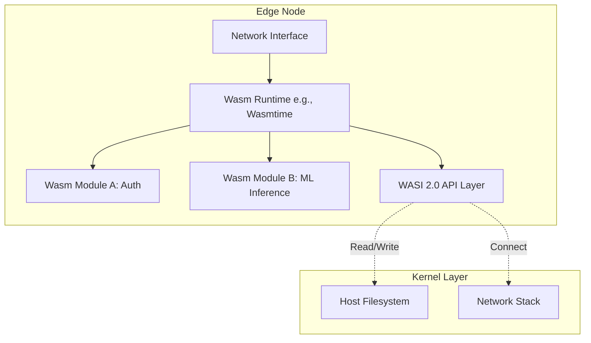

# WebAssembly in 2026: From Browser to Edge Computing and Beyond

By 2026, WebAssembly (Wasm) has transcended its origins as a browser sandbox escape hatch to become a foundational substrate for universal compute. The narrative has shifted from "what can Wasm do" to "where should Wasm run." We are witnessing a maturation of the ecosystem where Wasm is no longer merely an alternative to JavaScript in the frontend, but a primary execution model for serverless functions, edge computing layers, and secure microservices. For senior architects, the decision matrix now involves runtime overhead, memory isolation guarantees, and integration with containerized ecosystems like Kubernetes and Dapr.

## The 2026 Landscape: Beyond the Browser Sandbox

In 2026, the WebAssembly landscape is defined by stability in the Interface (WASI) standard and a significant divergence between lightweight runtimes and heavy infrastructure layers. The browser remains a primary use case for interactive media processing, but the server-side story has changed dramatically. Cloud providers are increasingly offering Wasm-based serverless functions as a cost-efficient alternative to traditional containers or V8-heavy environments.

Why does this matter? The primary driver is performance portability. Legacy containerization (Docker) often incurs cold-start penalties due to image layering and kernel syscalls. Wasm modules, being binary artifacts compiled from languages like Rust or C++, offer near-instant startup times compared to container spins. Furthermore, the security model has hardened. WASI 2.0 provides a strict sandbox boundary that allows applications to interact with the host filesystem and network without compromising the underlying kernel.

The landscape is currently bifurcated:
*   **Browser-side:** Focuses on compatibility and JIT optimization for legacy JS interop.
*   **Server-side:** Focuses on WASI compliance, SIMD instruction sets (AVX-512), and memory-mapped file access.

Architects must now consider that Wasm is not just a language alternative; it is a deployment unit. A single `.wasm` binary can encapsulate business logic, cryptographic keys, and stateful processing pipelines, making it ideal for distributed edge networks where latency sensitivity is paramount.

## Runtime Implementation and Memory Management

Implementing Wasm in a production environment requires a deliberate choice of runtime. In 2026, the market has consolidated around a few dominant runtimes: Wasmtime, Wasmer, and Bun's native engine. The implementation guidance for senior developers focuses on memory management strategies and linking protocols. Unlike containers which share kernel resources, Wasm runtimes manage memory spaces strictly per module instance.

When integrating Wasm into a host application, you must decide between static linking and dynamic loading. Static linking compiles the runtime directly into your binary, reducing dependency overhead but increasing binary size. Dynamic loading allows for hot-swapping modules without restarting the host process. For high-throughput edge functions, dynamic instantiation is preferred to handle scaling events gracefully.

Below is a pattern for instantiating a Rust-compiled Wasm module in a Go-based host environment using Wasmtime:

```rust
use wasmtime::{Engine, Store, Module, Config};

fn initialize_wasm_module() -> Result<Module, Box<dyn std::error::Error>> {
    let engine = Engine::default();
    let store = Store::new(&engine);
    
    // Load the compiled wasm binary from a local path or memory buffer
    let module_bytes = include_bytes!("../module.wasm");
    let module = Module::from_file(&engine, "module.wasm")?;
    
    Ok(module)
}
```

Memory management remains a critical pitfall. Wasm modules have linear memories that are isolated from the host heap. Passing large binary blobs or streaming data requires careful handling of memory buffers. In 2026, the standard approach involves mapping host file descriptors directly into the Wasm module's memory space using the `WASI` API. This allows the Wasm application to read/write files without copying data through a socket buffer, significantly reducing CPU overhead during I/O operations.

## Architectural Patterns and Ecosystem Comparison

The architectural integration of Wasm varies significantly depending on whether you are targeting an edge network or a monolithic serverless instance. The diagram below illustrates the standard architecture for a Wasm-based edge compute layer, highlighting the separation between the Host Kernel, the Runtime, and the Isolated Modules.



This architecture demonstrates that the runtime acts as a secure shim, mediating all host interactions. This is critical for security audits. When comparing approaches to Wasm execution, developers must weigh the trade-offs between lightweight runtimes and full container environments. The table below outlines key metrics relevant to 2026 deployment decisions.

| Feature | Value / Metric |
|---------|----------------|
| Runtime Type | Static Binary (Wasmtime) vs Dynamic Loadable Library |
| Cold Start Latency | < 10ms for WASM vs >500ms for Docker Containers |
| Memory Model | Linear Memory with Heap Allocation vs Shared Kernel VFS |
| Security Boundaries | Strict WASI Sandbox vs Kernel Namespaces/Cgroups |
| Scaling Unit | Module Instance vs Container Pod |

The choice between Wasm and containers is not binary. In 2026, many systems adopt a hybrid approach where containers handle heavy lifting (stateful storage, orchestration) while Wasm modules handle specific compute tasks (filtering, encryption, transformation). This "containerized Wasm" pattern allows for the benefits of both worlds: the flexibility of containers with the performance of Wasm.

## Operational Best Practices and Future Trajectories

Deploying WebAssembly at scale requires strict adherence to operational best practices to avoid subtle bugs that container environments do not exhibit. One of the most common pitfalls in 2026 is memory exhaustion caused by unbounded linear memory growth. Unlike standard heap allocations, Wasm memory cannot be easily resized without triggering a host call.

To mitigate this, architects should enforce strict limits on heap size per module instance and utilize `WASI` file descriptors for I/O rather than relying on internal buffers. Additionally, error handling in Wasm modules is distinct; unhandled exceptions in the guest code often crash the entire host process if not caught by a try-catch block around the instantiation call.

Looking toward the future, we anticipate deeper integration with AI/ML models. Wasm 2026 standards will likely support GPU memory mapping directly, allowing Wasm modules to perform inference without copying tensors between device and host memory. This will unlock new use cases for edge AI where privacy is paramount (processing data locally without leaving the edge).

For configuration management in these environments, a declarative manifest is essential. Below is an example of a deployment configuration using a standard YAML format for defining Wasm module parameters:

```yaml
spec:
  runtime: wasmtime-2.0
  memoryLimit: 256MB
  cpuQuota: 1.0
  modules:
    - name: auth-service
      path: ./modules/auth.wasm
      env:
        - name: JWT_SECRET
          valueFrom: secretKeyRef:
            secretName: auth-secret
    - name: ml-pipeline
      path: ./models/inference.wasm
      resources:
       