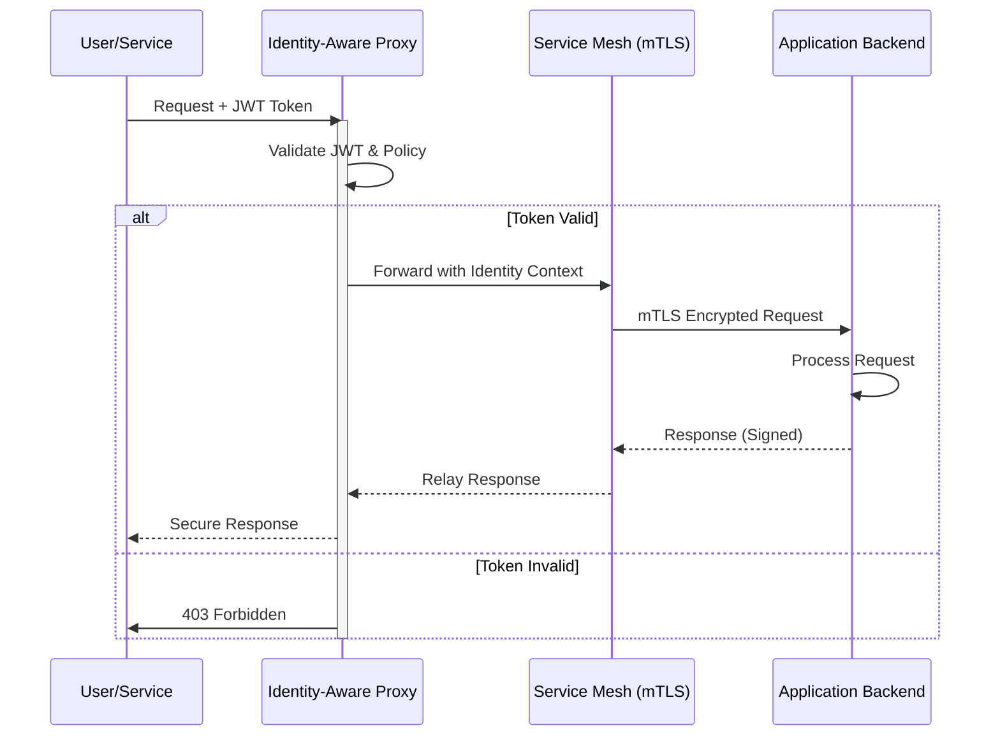

# Zero-Trust Architecture: Implementing Security in Distributed Cloud Systems

The traditional perimeter-based security model has effectively collapsed under the weight of distributed cloud infrastructure, serverless computing, and mobile-first workforces. By 2026, the industry consensus is clear: you are no longer defending a castle wall; you are securing a dynamic mesh of identities and assets. Zero-Trust Architecture (ZTA) is no longer optional for enterprise-grade systems; it is the baseline requirement for maintaining integrity in an environment where network latency and microservice complexity have rendered static IP whitelisting obsolete. This post details the architectural shift required to move from perimeter defense to identity-aware security, focusing on mTLS, continuous verification, and implementation strategies for modern distributed systems.

## The Erosion of the Network Perimeter in 2026

In the early days of cloud adoption, security teams focused heavily on DMZs and firewall rulesets. However, as applications migrated to containers and microservices, the attack surface expanded exponentially. By 2026, the average enterprise runs thousands of ephemeral services across hybrid clouds. A breach in a single sidecar proxy or a compromised service account can lead to lateral movement that bypasses traditional perimeter controls entirely.

The current landscape demands a paradigm shift from "trust but verify" to "verify first." This is critical because modern supply chain attacks often target the build pipeline rather than the network boundary. Furthermore, the rise of generative AI in threat detection has highlighted that human-centric security boundaries are insufficient. In this environment, trust must be zero by default. Every request, whether originating from a browser, an internal service, or an external API gateway, must authenticate and authorize itself against a central policy engine before accessing any resource. This requires a fundamental re-architecture of how we handle service-to-service communication, moving away from implicit trust based on network location to explicit verification based on identity and context.

## Architectural Pillars: Identity and Continuous Verification

Implementing Zero Trust requires specific technical pillars that replace legacy perimeter tools. The three core components are Identity-Aware Proxies (IAP), mutual TLS (mTLS) for service mesh security, and continuous verification engines that monitor session health in real-time.

The architecture relies on an identity-aware proxy layer sitting between the client and the application backend. Unlike a standard reverse proxy that routes traffic based on hostname, an IAP validates the user's identity token (such as OIDC or SAML) before forwarding the request. For internal services, mTLS becomes the standard transport security mechanism. This ensures that even if traffic is intercepted within the data center, the payload remains encrypted and authenticated.

The following diagram illustrates the flow of a secure request in a Zero-Trust environment, highlighting the verification steps at each hop.



In this model, the backend never sees the public identity of the client; it only receives a validated context from the proxy. The Service Mesh layer handles encryption between services, reducing the attack surface for network sniffing. This separation of concerns ensures that policy enforcement logic is decoupled from business logic, allowing security updates without touching application code.

## Implementation Patterns and Tooling

Translating these architectural concepts into production requires careful selection of tooling and adherence to specific implementation patterns. The following comparison table outlines the primary approaches available for enforcing Zero Trust policies across different infrastructure layers.

| Approach | Latency Impact | Throughput | Complexity | Best Use Case |
|----------|----------------|------------|------------|---------------|
| API Gateway with mTLS | Low | High | Medium | External API protection |
| Service Mesh (Sidecar) | Medium | High | High | Internal microservices mesh |
| Infrastructure as Code (OPA/Rego) | Negligible | N/A | High | Policy definition and enforcement |

For external-facing APIs, an API Gateway with mTLS support is the preferred entry point. It offloads TLS termination and handles identity validation centrally. For internal traffic, a Service Mesh like Istio or Linkerd provides granular control over service-to-service communication without modifying application code. However, managing certificates at scale remains a significant operational hurdle.

Below is an example of how to configure a client-side SDK to enforce mTLS during the connection initialization phase in Go. This ensures that even if the network stack is compromised, the application refuses to communicate with unauthenticated peers.

```go
package main

import (
	"crypto/tls"
	"context"
	"log"
)

func initSecureConnection() {
	// Configure TLS config for mTLS verification
	tlsConfig := &tls.Config{
		InsecureSkipVerify: false, // Must be false for Zero Trust
		RootCAs:             loadCA(), // Load trusted CA bundle
		Certificates:        clientCerts, // Client cert/key for mutual auth
	}

	conn, err := tls.Dial("tcp", "backend-service.internal:443", tlsConfig)
	if err != nil {
		log.Fatalf("Failed to establish secure connection: %v", err)
	}
	defer conn.Close()

	// Proceed with HTTP request over verified TLS
	_ = conn
}
```

## Operationalizing Zero Trust: Pitfalls and Future Outlook

Deploying Zero Trust is not merely a configuration task; it is an operational shift that introduces new complexities. One of the most common pitfalls developers encounter is latency introduced by certificate handshake overhead, especially in high-frequency microservice calls. To mitigate this, organizations must implement certificate pinning strategies and utilize short-lived certificates (e.g., 1-hour validity) managed automatically via automation tools like HashiCorp Vault or cert-manager.

Another significant challenge is the management of identity tokens. If an application relies on long-lived JWTs for service-to-service communication, a compromised token grants persistent access. The industry standard in 2026 is short-lived tokens with strict refresh policies. Developers must also beware of "trust transitivity" errors where a trusted internal service inadvertently proxies a request to an untrusted external resource without re-verifying the policy.

Looking toward the future, Zero Trust architecture will increasingly integrate AI-driven threat detection. Instead of static rules, systems will utilize behavioral analysis to detect anomalies in real-time. For instance, if a service account typically accesses database A at 9 AM but attempts to access database B at 3 AM, the system should automatically revoke trust and trigger an alert without waiting for a policy update.

Furthermore, the boundary between infrastructure and identity will blur further. Infrastructure itself will become an identity object, requiring every container, pod, and server to possess a unique cryptographic identity that cannot be spoofed. This evolution moves us toward a state where security is intrinsic to the compute fabric rather than a layer applied on top.

## Conclusion

Zero-Trust Architecture represents the necessary evolution of security in a distributed cloud ecosystem. By abandoning the illusion of a secure perimeter and embracing continuous verification, organizations can significantly reduce their attack surface. Implementing this requires a commitment to mTLS for service communication, the use of Identity-Aware Proxies for boundary control, and rigorous management of cryptographic identities. While challenges regarding latency and operational complexity exist, they are manageable through automation and robust tooling. As we move forward in 2026 and beyond, the integration of AI-driven policy enforcement will further solidify Zero Trust as the standard for resilient, secure cloud infrastructure.